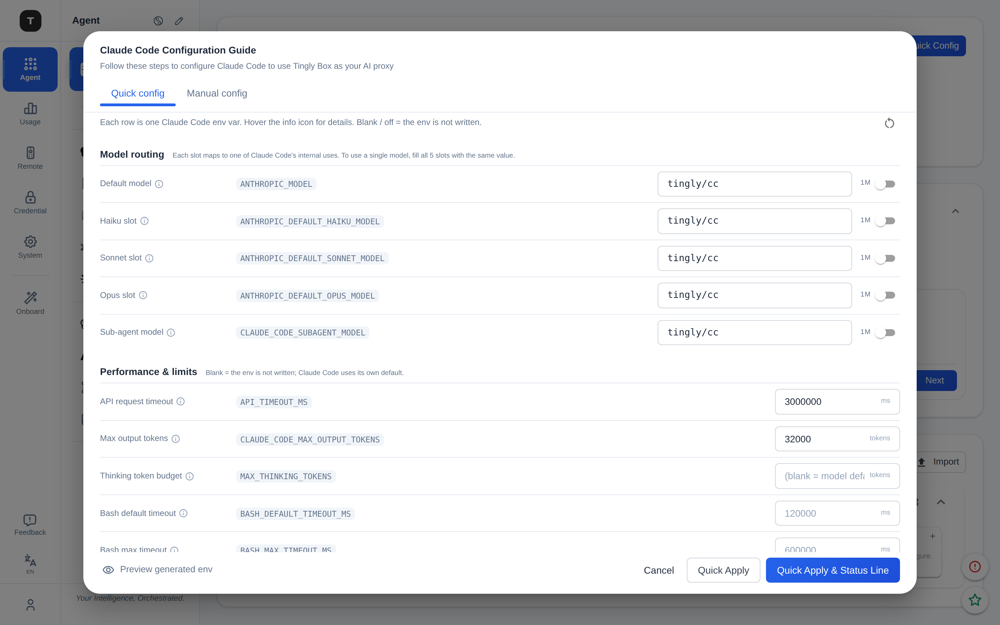
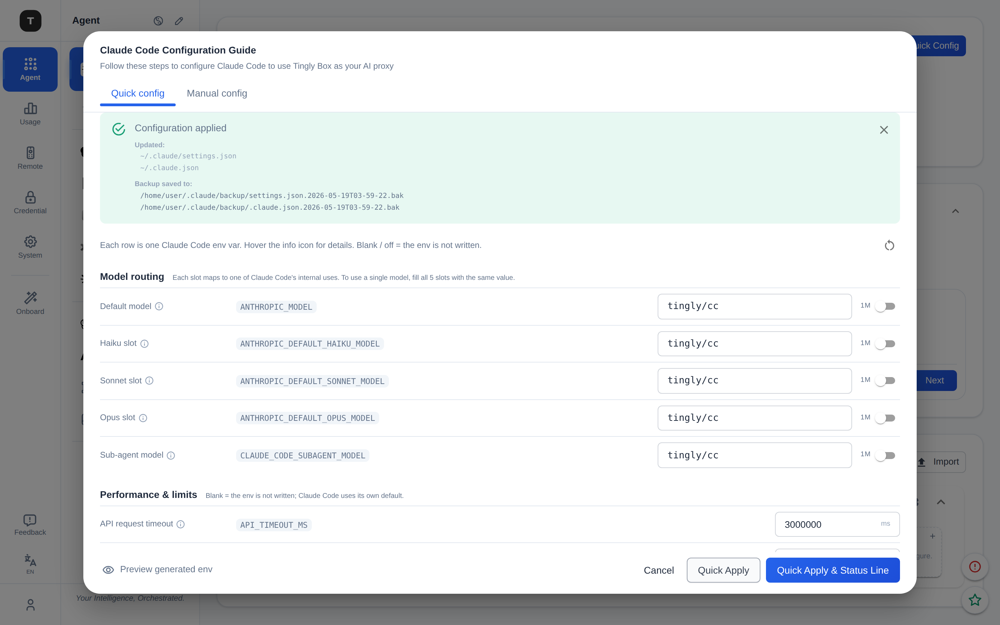
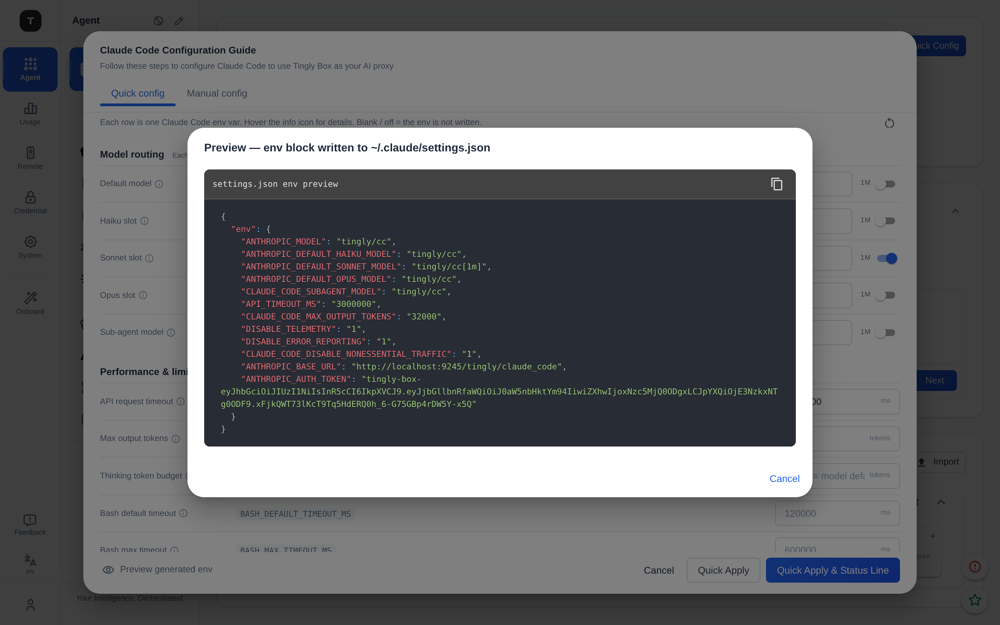

# Claude Code Quick Config: Design and Decisions

> Audience: tingly-box frontend/backend contributors touching Claude Code
> setup, or anyone adding a new tunable Claude Code env var.
> This document records why we replaced the raw-JSON modal with a typed
> prefs form, and the wire-shape trick that keeps the form, the API, and
> `~/.claude/settings.json` aligned.

---

## 1. Background

The old "Claude Code Configuration Guide" modal showed users:

- a raw JSON snippet for `~/.claude/settings.json`,
- a raw JSON snippet for `~/.claude.json`,
- platform-specific Node.js scripts to merge those into the user's files,
- an "Apply" button that ran the same logic server-side.

The Apply button worked, but the modal was a wall of JSON — every env var
unlabeled, the unified-vs-separate model routing implicit in which strings
appeared on which lines, and no way to tweak any of it short of editing
the generated JSON by hand. The 1M context window (a `[1m]` suffix on the
model ID) wasn't supported anywhere. New users had no idea what
`CLAUDE_CODE_DISABLE_NONESSENTIAL_TRAFFIC` did or why it was `"1"`.

The redesign turns that modal into a typed form: every env var becomes a
labeled row with a tooltip; the same form drives both the on-disk JSON
preview and the Apply request; and the prefs object the form edits is
byte-for-byte the `env` map written to `settings.json`.

---

## 2. Goals

1. **Discoverable.** Every tunable env shows up as a labeled row with a
   one-line purpose and a hover tooltip that documents the unit, the
   Anthropic default, and tb's recommendation.
2. **Explicit 1M.** The 1M context suffix is a per-slot toggle, not a
   string the user has to remember to type.
3. **One source of truth.** The prefs the form edits, the JSON the user
   previews, and the request body sent to `/config/apply/claude` are the
   same shape. No translation layer.
4. **Reusable.** The prefs struct + ToEnv method works for any Claude Code
   surface — CLI harness, GUI one-click, GUI form — not just one endpoint.

---

## 3. The wire-shape trick

The core idea: **make the JSON tag on each Go field the literal Claude
Code env var name it controls**. Marshaling the struct then produces
exactly the `env` block written into `settings.json`, with no mapping code:

```go
// internal/agent/prefs.go
type ClaudeCodePrefs struct {
    AnthropicModel              string `json:"ANTHROPIC_MODEL,omitempty"`
    AnthropicDefaultHaikuModel  string `json:"ANTHROPIC_DEFAULT_HAIKU_MODEL,omitempty"`
    AnthropicDefaultSonnetModel string `json:"ANTHROPIC_DEFAULT_SONNET_MODEL,omitempty"`
    AnthropicDefaultOpusModel   string `json:"ANTHROPIC_DEFAULT_OPUS_MODEL,omitempty"`
    ClaudeCodeSubagentModel     string `json:"CLAUDE_CODE_SUBAGENT_MODEL,omitempty"`

    APITimeoutMs              string `json:"API_TIMEOUT_MS,omitempty"`
    ClaudeCodeMaxOutputTokens string `json:"CLAUDE_CODE_MAX_OUTPUT_TOKENS,omitempty"`
    // ... etc

    DisableTelemetry                     string `json:"DISABLE_TELEMETRY,omitempty"`
    // ...

    Extra map[string]string `json:"-"` // escape hatch
}

func (p ClaudeCodePrefs) ToEnv(baseURL, apiKey string) (map[string]string, error) {
    b, _ := json.Marshal(p)
    env := map[string]string{}
    _ = json.Unmarshal(b, &env)
    for k, v := range p.Extra { env[k] = v }
    env["ANTHROPIC_BASE_URL"]   = strings.TrimRight(baseURL, "/") + "/tingly/claude_code"
    env["ANTHROPIC_AUTH_TOKEN"] = apiKey
    return env, nil
}
```

Consequences:

| Property | How it works |
|---|---|
| **All fields use `omitempty`** | A reflection test (`TestClaudeCodePrefs_AllTypedFieldsUseOmitempty`) keeps this honest — without it the marshal would emit `"FOO": ""` and ToEnv would write a blank env into settings.json. |
| **Server-injected keys win** | `ANTHROPIC_BASE_URL` and `ANTHROPIC_AUTH_TOKEN` come from the server context, applied **after** `Extra` is merged. A malicious or sloppy prefs payload cannot redirect the proxy URL or swap the auth token. |
| **Frontend speaks the same JSON** | The TS interface uses env names as keys (`prefs.ANTHROPIC_DEFAULT_SONNET_MODEL`). What the form edits is exactly what gets POST'd is exactly what lands in settings.json. |
| **1M suffix is just text** | `[1m]` is a substring of the model ID. The UI toggles append/strip; the backend never special-cases it. The gateway handles the suffix at routing time. |

---

## 4. UI structure



The modal is two tabs and a sticky action bar:

- **Quick config** (default) — the form. Three sections: **Model routing**
  (5 slots, each with a 1M toggle), **Performance & limits**, **Privacy &
  behavior** (Android-style switches).
- **Manual config** — the legacy JSON + platform scripts view, kept for
  users who want to copy/paste into machines without network access to
  the tb server. Renders from the same prefs as the Quick tab.
- **Dialog footer** — Preview button (left), Cancel + two Apply buttons
  (right). Apply always uses the current Quick form's prefs regardless of
  which tab is active.

### 4.1 Three-column rows

Each row is a single line:

```
| Label + (i)            | ENV_NAME_BADGE         | input / switch (right) |
```

`(i)` is a hover tooltip carrying purpose + tooltip + Anthropic default.
The env name renders as a low-contrast monospace badge so developers can
correlate the form to Claude Code docs without enlarging it visually.

### 4.2 1M suffix toggle

Every model row has a `1M ⚪` switch on the trailing right. The model
string in state is what carries the `[1m]` suffix; the input shows the
stripped base, the switch tracks the suffix presence:

```ts
const has1M = (v?: string) => !!v && v.endsWith('[1m]');
const with1M = (v?: string, on: boolean) =>
    (v || '').replace(/\[1m\]$/, '') + (on ? '[1m]' : '');
```

Whether the routed target model actually supports a 1M context is a
gateway concern, not a UI concern — so we show the switch on every slot
and let the network layer reject the call if the target can't do it.

### 4.3 Post-Apply notification



The Apply button writes the response into a state slot the modal renders
as an MUI Alert:

- **Success** (green) — title + `Created:` list + `Updated:` list +
  `Backup saved to:` list. All paths in monospace so the user can copy
  them to inspect or roll back.
- **Failure** (red) — title + raw backend error. Common case during first
  setup is `No services configured in Claude Code rule`, which surfaces
  directly so the user knows to wire up a provider.
- **Dismissable** via X icon; **auto-clears** when the user edits any
  field (so old success doesn't shadow a pending change).

### 4.4 Preview dialog



A "Preview generated env" button opens a secondary dialog showing
`JSON.stringify({env: prefsToEnv(...)}, null, 2)`. This is the literal
content that will land under the `env` key in `settings.json` — including
the 1M suffix on the model string, the server-injected base URL, and the
real auth token. Reused by the Manual tab.

---

## 5. Rule ↔ model slot mapping

The form has 5 model slots; the backend has 6 well-known built-in rules.
The mapping between them is a **UUID convention** baked into both sides,
not runtime discovery.

### 5.1 The well-known UUIDs

`internal/server/config/init.go` seeds these rules on first boot.
`migration.go` keeps them as exported constants (`RuleUUIDCC*`):

| Rule UUID | Initial `request_model` | Maps to env slot |
|---|---|---|
| `builtin:claude_code:cc` | `tingly/cc` | (unified mode — all 5 slots) |
| `builtin:claude_code:default` | `tingly/cc-default` | `ANTHROPIC_MODEL` |
| `builtin:claude_code:haiku` | `tingly/cc-haiku` | `ANTHROPIC_DEFAULT_HAIKU_MODEL` |
| `builtin:claude_code:sonnet` | `tingly/cc-sonnet` | `ANTHROPIC_DEFAULT_SONNET_MODEL` |
| `builtin:claude_code:opus` | `tingly/cc-opus` | `ANTHROPIC_DEFAULT_OPUS_MODEL` |
| `builtin:claude_code:subagent` | `tingly/cc-subagent` | `CLAUDE_CODE_SUBAGENT_MODEL` |

Users can edit each rule's `request_model` from the rules table on the
page. The Quick Config seeds its form values from whatever is currently
in those rules, not from a hardcoded list — so the form always reflects
the actual route topology.

### 5.2 Mode-aware rule loading (page side)

`UseClaudeCodePage.tsx` fetches a different slice of rules depending on
`configMode`:

```ts
if (configMode === 'unified') {
    // Just the one rule
    const result = await api.getRule("builtin:claude_code:cc");
    setRules([result.data]);
} else {
    // All Claude Code rules except the unified-only one
    const result = await api.getRules(SCENARIO);
    setRules(result.data.filter(r => r.uuid !== 'builtin:claude_code:cc'));
}
```

The `rules` array handed to the modal is therefore pre-filtered. The
modal does not re-filter by mode — it just sees "the rules for this
mode".

### 5.3 UUID-suffix lookup (modal side)

`derivePrefsFromRules` in `ClaudeCodeQuickConfig.tsx` uses the UUIDs as
keys:

```ts
const modelForVariant = (variant, fallback) => {
    if (mode === 'unified') return rules[0]?.request_model || fallback;
    const rule = rules.find(r => r.uuid === `builtin:claude_code:${variant}`);
    return rule?.request_model || fallback;
};
```

- **unified**: `rules[0]` is the single `builtin:claude_code:cc` rule; its
  `request_model` populates all 5 slots.
- **separate**: each of the 5 variants (`default` / `haiku` / `sonnet` /
  `opus` / `subagent`) does a UUID-exact `find` against
  `builtin:claude_code:<variant>`.

If a rule is missing (e.g. user deleted it manually), the slot falls back
to the tb-canonical default string. Form remains usable.

### 5.4 The closing loop: `request_model` is the routing key

The same string that lives on the rule **is also the value Claude Code
sends in API requests**:

```
backend rule:                          frontend env:
  builtin:claude_code:haiku                     ANTHROPIC_DEFAULT_HAIKU_MODEL=tingly/cc-haiku
    request_model = "tingly/cc-haiku"  →
    services      = [haiku-3-5]
                                       Claude Code sends:
                                         { model: "tingly/cc-haiku", ... }

                                       tb receives, looks up by
                                       (scenario, request_model) →
                                       finds builtin:claude_code:haiku →
                                       routes to its services
```

The env string is the rule's primary key for routing. That's why the
form's "model slot" input is, semantically, the routing key — not a
display label.

### 5.5 Intentional decoupling: Quick Config edits env, not rules

Typing a different model in a Quick Config slot only changes the env
written to `settings.json`. It does **not** mutate the corresponding
rule. The consequence:

- If the user types `claude-3-5-sonnet-20241022` into the Sonnet slot,
  Claude Code will send that string as the model. tb has no rule with
  `request_model = "claude-3-5-sonnet-20241022"` under the `claude_code`
  scenario, so the request 404s (or falls through to a configured
  default, depending on the routing logic).
- To make it actually route, the user must also edit the rule's
  `request_model` from the rules table on the page.

We kept this decoupling on purpose. It lets advanced users bypass tb's
own routing layer entirely — for example, configuring Claude Code to
target a model name routed by a different gateway on the same proxy
URL — without forcing the form to surface concepts ("rule", "service",
"provider") that are normally hidden one level below.

### 5.6 Profile settings are derived artifacts

The profile system at `/agent/claude_code/profile/:profileId` uses the
scenario string `claude_code:<profileId>` and its **own** set of rules
(short names like `default`/`haiku` instead of `tingly/cc-*`). The Quick
Config modal remains scoped to the default page; profile env is generated
by `GenerateCCEnv` and materialized by `BuildCCProfileSettings`.

There is deliberately no second profile manifest under the Claude
directory. The sources of truth are:

- global config for profile ID, name, mode, rules, and routing flags;
- `~/.claude/settings.json` for the user's current local Claude settings.

Everything under `~/.tingly-box/claude/` is a deterministic runtime
artifact that can be rebuilt from those sources. Code must only derive a
path from config; it must never scan or parse directory names to reconstruct
profile metadata.

The materialized layout keeps the stable ID and human name visible without
symlinks or another `profiles/` nesting layer:

```text
~/.tingly-box/claude/
├── default/
│   ├── settings.json
│   └── statusline.sh
├── p1--work/
│   ├── settings.json
│   └── statusline.sh
└── p2--deepseek/
    ├── settings.json
    └── statusline.sh
```

`default/` is a synthetic local profile. It maps the current
`~/.claude/settings.json` into a Tingly-specific launch artifact; it is not a
link to, and never modifies, the user's original file. A named profile uses
`<profileID>--<profileName>/`. Legacy names that are not filesystem-safe fall
back to the stable ID-only directory until renamed.

On every materialization, `settings.json` is rebuilt from the current local
settings (or `{}` if the local file no longer exists), then receives the
generated env and profile-local `statusline.sh` command. This reset is
important: a previously generated artifact must never become an accidental
second source of truth.

Profile CRUD follows the same derived-artifact rule:

- **Create/run:** materialize the current config into its computed directory.
- **Rename:** materialize the new directory first; only after success remove
  the old generated files. A case-only rename is guarded with `os.SameFile`
  for case-insensitive filesystems.
- **Delete:** remove only the known generated files (`settings.json` and
  `statusline.sh`), then remove the directory if empty. User-added files are
  preserved; cleanup never uses recursive deletion.
- **Migration:** after a successful build, remove the old flat
  `<profileID>.json`, `statusline-<profileID>.sh`, and an owned legacy name
  symlink. No new links are created, so the layout works consistently across
  macOS, Linux, and Windows.

Artifact directories themselves must be real directories, not symlinks. Both
write and cleanup paths reject a symlink at the computed profile directory so
profile operations cannot escape `~/.tingly-box/claude/`.

---

## 6. i18n strategy

Field labels, purposes, tooltips, section headers, and modal copy are
**dense developer-facing text that will keep churning** as we tune the
wording. Putting them in the shared `i18n/locales/*.ts` would turn that
file into a junk drawer.

Instead, each component file defines paired `*_ZH` / `*_EN` maps keyed by
env name (for field text) or section name (for headers), picked at render
time via `i18n.language === 'zh' ? 'zh' : 'en'`. TypeScript's
`Record<PrefsKey, FieldText>` constraint guarantees that adding a new env
without translating it is a compile error, not a runtime fallback.

The existing `claudeCode.*` keys in `i18n/locales/*.ts` are reserved for
strings that are also used outside this modal (page titles, status-line
explanations, etc.).

---

## 7. Adding a new tunable env — recipe

1. **Backend** — add a field to `ClaudeCodePrefs` (`internal/agent/prefs.go`)
   with a JSON tag set to the exact env var name, plus `,omitempty`. If
   it's a numeric env, the field is still `string` (so empty = "don't
   write this env").

2. **Frontend structure** — add an entry to `FIELD_STRUCT` in
   `frontend/src/components/ClaudeCodeQuickConfig.tsx` with the env name,
   group (`model` / `limits` / `switches`), kind (`model` / `int` / `bool`),
   and optional `unit`.

3. **Frontend text** — add a row to both `FIELDS_TEXT_ZH` and
   `FIELDS_TEXT_EN` keyed by the env name, with `label`, `purpose`,
   `tooltip`, optional `placeholder`. TypeScript will flag a missing
   translation as a compile error.

4. (Optional) **Default value** — if tb has an opinion, add it to
   `DefaultClaudeCodePrefs` (`prefs.go`) and `derivePrefsFromRules`
   (`ClaudeCodeQuickConfig.tsx`).

No swagger / OpenAPI regen step is required for the env itself — the
field flows through the existing `Preferences` body. The only thing that
changes shape across versions is the prefs struct, which is internal to
tb.

---

## 8. What got dropped

The original API supported two request shapes:

```json
// Legacy
{"mode": "unified", "installStatusLine": false}

// New
{"preferences": {...}, "installStatusLine": false}
```

Since tb's frontend and backend ship together, the dual code path was
carrying its own weight for nobody. The handler now requires
`preferences` and returns 400 if it's missing. `BuildClaudeCodeEnv` (the
old mode-based env factory) has been deleted; the CLI harness uses
`DefaultClaudeCodePrefs(true).ToEnv(...)` for the same canonical
defaults.

---

## 9. Test coverage

| File | Covers |
|---|---|
| `internal/agent/prefs_test.go` | ToEnv edge cases (empty / full / extra / server-key override / 1m passthrough); JSON shape uses env names; round-trip preserves every field; reflection check that every field has `omitempty`; `DefaultClaudeCodePrefs` exact values. |
| `internal/server/module/configapply/handler_test.go` | Request body wire shape; missing preferences → 400; malformed JSON → 400; populated preferences reaches the rule-lookup stage. |

A real-stack interactive verification (Playwright + Chrome-for-Testing
hitting a live `tingly-box start --port 12580` backend through the vite
dev proxy on `:9245`) confirms: form renders with rule-derived defaults,
tab switching works, 1M toggle appends `[1m]` to the model string in the
preview JSON, Apply surfaces success and failure alerts with file lists
and backup paths.
