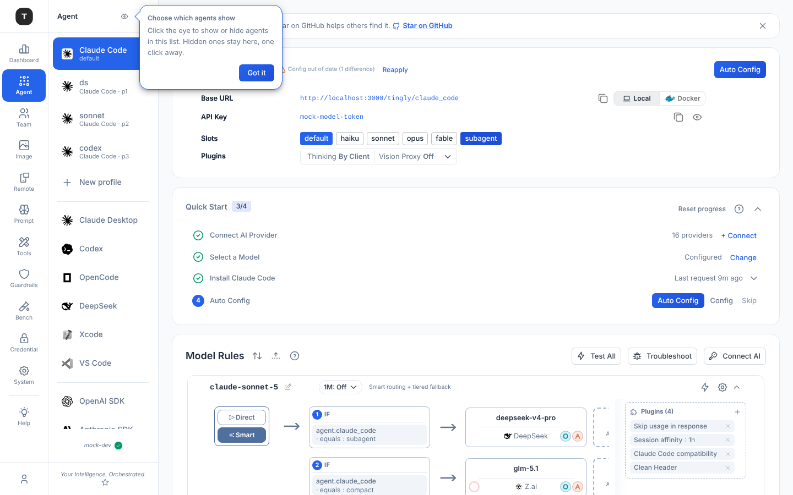

# Claude Code：槽位（Slots）

> 状态：**已实施**。背景：`claude-code-config.md`（env 线形、规则 ↔ slot 映射）。

## 问题

原来只有两种模式：Unified（所有槽位走 `cc`）和 Separate（每个槽位走自己的规则）。最常见的需求却是"统一，只把 subagent 分出去"，只能切 Separate 再把 5 条规则配成一样。

## 设计

没有模式，只有槽位：

- 6 个槽位：`default` `haiku` `sonnet` `opus` `fable` `subagent`，对应 6 个 Claude Code env。
- **`default` 就是主规则，始终存在、不可关闭**：通常是 `cc`；以 separate 创建的 profile（或旧的 separate 配置，`cc` 已停用）里是 `default` 规则。
- **其他槽位有自己的规则（`builtin:<scenario>:<slot>` 且启用）就用它的 `request_model`，没有就跟随 default。**
- 其他 5 个全部点亮 = 原来的 Separate；全部熄灭 = 原来的 Unified。
- 路由不变：rule 就是 request，`request_model` 仍是路由键。

界面：在 Base URL / API Key 下面加一行 **Slots**。`default` 常亮、不可点；其余每个槽位一个 chip，点亮表示有自己的规则。点一下加规则（第一次创建时复制主规则的路由，所以行为不变），再点一下去掉（只停用，不删除，再点亮时恢复原配置）。Model Rules 只显示启用的规则，主规则在最前。原来的 Unified / Separate 开关和确认弹窗删除。

改了槽位后 env 会变，主场景由现有的 Client Config 状态芯片提示 Reapply；profile 的 settings 在启动时重建。

## 实现

- `config.SetClaudeCodeSlot(scenario, slot, enabled)`（`internal/config/cc_slots.go`）：只接受 default 以外的 5 个槽位。启用时缺规则就从主规则复制一条；停用时确保主规则是启用的（都不存在时用被停用的规则复制出 `cc`）。旧的 `unified/separate` 标志、`ProfileMeta.Unified` 改为由槽位推算（全部点亮 = separate）。
- 旧的模式写入（`SetScenarioFlag`、TUI quickstart）行为不变：separate 点亮全部槽位规则并停用 `cc`（default 槽位落到 `default` 规则），unified 反之。
- `agent.ClaudeCodeSlotModels`：settings 文件（`GenerateCCEnv`）和 tbclient env 共用的槽位解析。default 槽位取主规则（`cc`，停用时取 `default` 规则）。
- API：`PUT /api/v1/scenario/:scenario/claude-code/slots/:slot {enabled}`。
- 前端：`useSlotRouting` 提供 Slots 行和启用的规则；`derivePrefsFromRules({ rules })` 按同样规则推导 env。
- 未覆盖：`tingly-box agent apply claude-code --unified` 仍按显式参数写 env。
