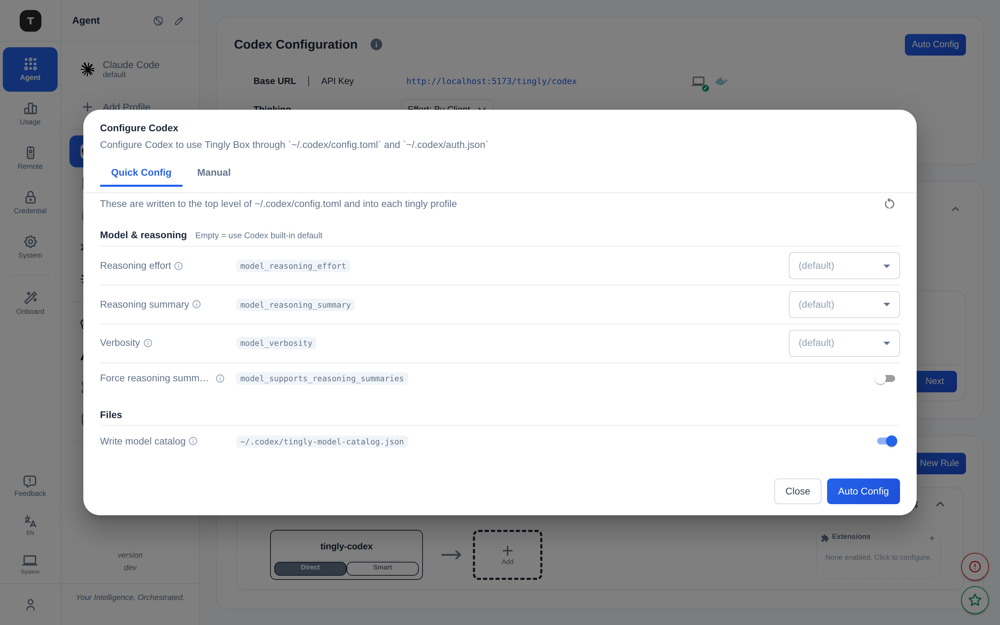
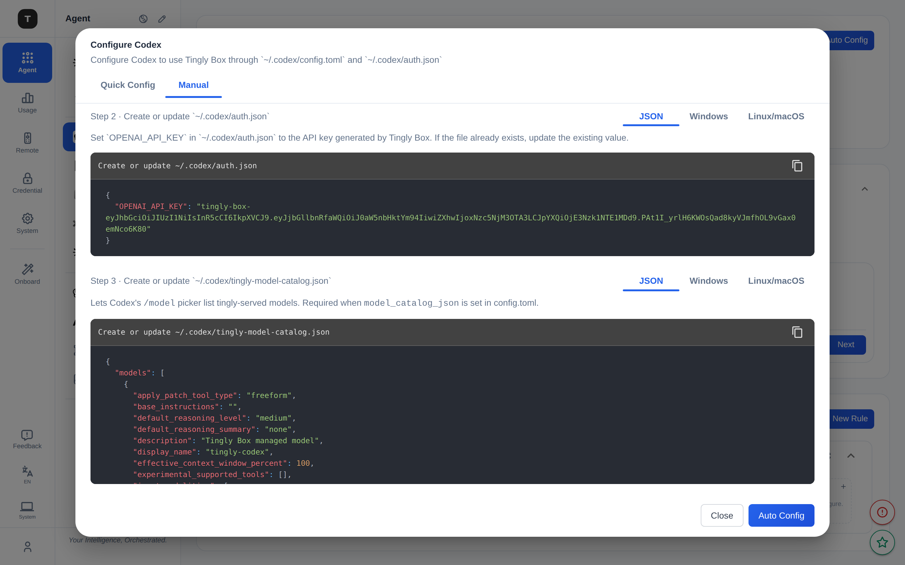
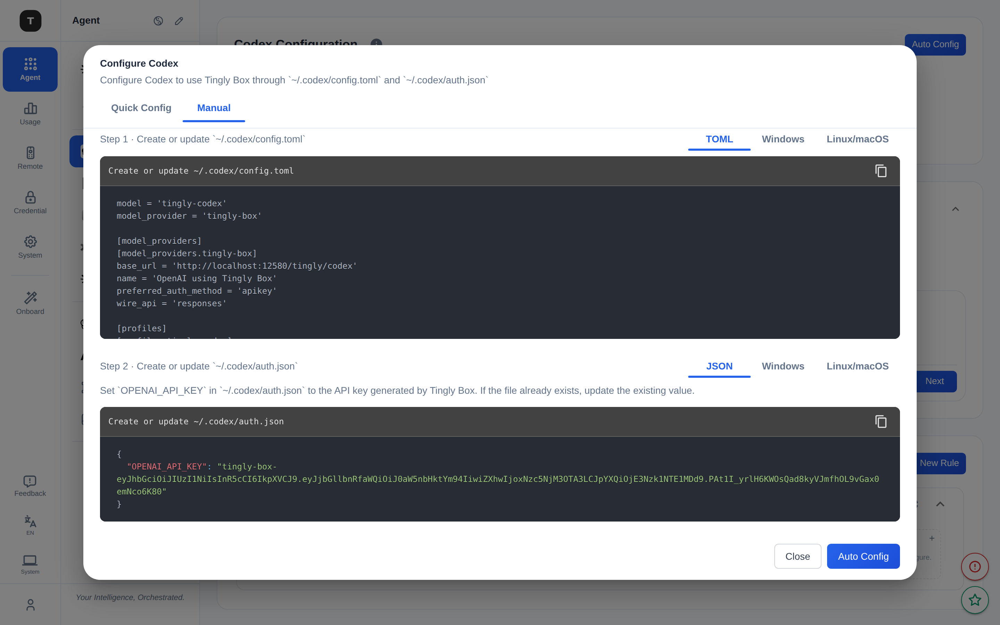

# Codex Quick Config: Design and Decisions

> Audience: tingly-box frontend/backend contributors touching Codex CLI
> setup, or anyone adding a new tunable Codex `config.toml` key.
> This document records why Codex went from a static one-click apply to a
> typed, editable model/reasoning form, how the model catalog became an
> explicit toggle, and why the defaults are deliberately conservative for
> third-party providers.

---

## 1. Background

Codex originally had a *static* config flow: the backend
`ApplyCodexConfig(baseURL, models)` wrote every managed field with
hardcoded values (`model_provider`, `wire_api="responses"`,
`model_reasoning_summary="auto"`, `model_supports_reasoning_summaries=true`,
the `[profiles.*]` blocks), and the `CodexConfigModal` only showed a
read-only preview plus an "Auto Config" button. Users couldn't tune any
Codex option.

This redesign brings Codex up to parity with the Claude Code Quick Config
(see `claude-code-config.md`): the modal now has **Quick** and **Manual**
tabs, the Quick tab is a typed form of model/reasoning knobs, and the
Manual tab previews the real, server-rendered files. Scope is deliberately
limited to **model / reasoning / profile** keys — no `approval_policy` /
`sandbox_mode` safety toggles, no network-retry tuning.

---

## 2. Goals

1. **Editable, discoverable.** Each tunable Codex key is a labeled row with
   a one-line purpose, a hover tooltip (valid values + Codex default + tb
   recommendation), and the literal `config.toml` key shown as a code badge.
2. **Server-rendered preview.** The Manual tab's TOML/JSON comes from the
   backend (`POST /config/preview/codex`), so what the user previews is
   byte-for-byte what Apply writes — including prefs stamped into each
   profile.
3. **Safe for third-party providers.** tingly-box mostly proxies *non-OpenAI*
   models. Defaults must not assert OpenAI-only capabilities the upstream
   model doesn't have.
4. **Catalog is opt-out, and visible.** The model catalog (which makes
   tingly models show up in Codex's `/model` picker) is an explicit toggle,
   and its contents are shown in the Manual tab so copy-paste users aren't
   left with a dangling file reference.

---

## 3. Typed prefs, whitelist by construction

Unlike Claude Code (whose JSON tags are env-var names), Codex prefs map 1:1
to `config.toml` keys. The struct *is* the whitelist — only these four keys
can ever be set from a request, so prefs can never clobber tingly-managed
fields (`model`, `model_provider`, `model_catalog_json`,
`model_providers.*`) or inject arbitrary TOML:

```go
// internal/server/config/apply_config.go
type CodexPrefs struct {
    ModelReasoningEffort            string `json:"model_reasoning_effort,omitempty"`
    ModelReasoningSummary           string `json:"model_reasoning_summary,omitempty"`
    ModelVerbosity                  string `json:"model_verbosity,omitempty"`
    ModelSupportsReasoningSummaries string `json:"model_supports_reasoning_summaries,omitempty"`
}
```

All values are strings; `""` means *omit this key, let Codex use its own
default*. This avoids the "0/false means unset" ambiguity. `toConfig()`
converts to native TOML types with enum-membership validation (invalid →
dropped) and `"true"` → `true` (anything else dropped).

Prefs are written **both** at the top level (global default) and into each
generated `[profiles.<model>]` block, so every tingly profile is
self-contained.



---

## 4. Conservative defaults (the third-party decision)

The original code hardcoded `model_supports_reasoning_summaries = true` and
`model_reasoning_summary = "auto"`. That is correct for OpenAI o-series
models, which natively return reasoning summaries via the Responses API's
`reasoning.summary` field. It is **wrong by default for third-party models**
proxied through tingly-box:

- Most third-party providers don't implement `reasoning.summary`.
- tingly-box doesn't synthesize that field.
- With `model_supports_reasoning_summaries = true`, Codex requests a summary
  the upstream never returns → broken/odd behavior (this is the class of
  issue users hit in the field).

So `DefaultCodexPrefs()` now returns an **empty** struct — every knob unset,
deferring to Codex's own defaults. The frontend `defaultCodexPrefs()`
matches (`{}`), so the Quick form opens with all selects on `(default)` and
the "Force reasoning summaries" switch **off**. Users with a
reasoning-capable upstream can flip it on explicitly.

The same reasoning applies to the model catalog payload
(`RenderCodexModelCatalog`): per-entry `supports_reasoning_summaries` is
`false` and `default_reasoning_summary` is `"none"`, rather than the old
`true`/`"auto"`.

---

## 5. The model catalog toggle (issue #1027)

`~/.codex/tingly-model-catalog.json` is a tingly-managed file that Codex
reads on startup to populate the `/model` picker with tingly-served models.
`config.toml`'s `model_catalog_json` points at it.

**The bug (#1027):** users who took the Manual path — copying the
`config.toml` snippet or running the platform scripts — got a config that
referenced `model_catalog_json = '…/tingly-model-catalog.json'`, but the
catalog file itself was only written by the full "Auto Config" apply. The
reference dangled.

**The fix — an explicit `writeCatalog` flag, wired end to end:**

- Request: `ApplyCodexConfigRequest.WriteCatalog *bool` (nil → true, the
  backward-compatible default).
- `ApplyCodexConfig(baseURL, models, prefs, writeCatalog)` and
  `RenderCodexConfigTOML(..., writeCatalog)` both take the flag. When false,
  the catalog file is not written **and** `model_catalog_json` is omitted
  from the TOML — no dangling reference is ever produced.
- Preview response carries `catalogJson` (the rendered catalog) so the
  Manual tab can show it as **Step 3**, with TOML/Windows/Unix variants just
  like config.toml and auth.json. Copy-paste users now have the file's
  contents in front of them.

In the Quick tab this is a **switch** ("Write model catalog") under a
**Files** section, with a one-line explanation of what the file is for.

> **Why a toggle and not a separate "write catalog" button?** We considered
> a standalone weak button that writes only the catalog (for re-writing a
> deleted file without a full apply). It was cut as YAGNI: "Auto Config"
> already rewrites the catalog via merge-safe semantics, and the Manual
> Step 3 covers the copy-paste path. The toggle + Step 3 solve #1027 without
> a new endpoint.

Catalog **on** (default) — Manual shows Step 3 with the catalog JSON:



Catalog **off** — switch greyed, no Step 3, and the TOML drops
`model_catalog_json`:




---

## 6. Managed-field protection

`mergeCodexConfig` applies user prefs **first**, then writes the managed
fields, so managed fields always win even if a pref key somehow collided:

```
coerced := prefs.toConfig()      // whitelisted, validated
for k,v := range coerced { cfg[k] = v }

cfg["model"]            = models[0]          // managed, written after
cfg["model_provider"]   = "tingly-box"       // managed
cfg["model_catalog_json"] = catalogPath      // managed (only if writeCatalog)
cfg["model_providers"]["tingly-box"] = {…}    // managed: base_url, wire_api…
```

Everything else the user put in `config.toml` — unrelated top-level keys,
other `[model_providers.*]`, unrelated `[profiles.*]` — is preserved
(MERGE, not overwrite). The previous file is backed up before rewrite;
`agent restore codex` rolls back.

---

## 7. Apply notification completeness

The Apply success alert lists every file touched so the user knows exactly
what changed:

- `✓ Created/Updated ~/.codex/config.toml`
- `✓ Created/Updated ~/.codex/auth.json`
- `✓ Written ~/.codex/tingly-model-catalog.json` (only when the catalog was
  actually written — `ApplyCodexConfigResponse.CatalogWritten`, set to
  `writeCatalog && len(models) > 0`)
- the config backup path, when one was created

---

## 8. Wire shape

```jsonc
// POST /config/apply/codex  and  POST /config/preview/codex
{
  "preferences": {              // null → DefaultCodexPrefs() (all empty)
    "model_reasoning_effort": "high",
    "model_reasoning_summary": "",
    "model_verbosity": "",
    "model_supports_reasoning_summaries": ""
  },
  "writeCatalog": true          // null → true
}
```

Preview response adds `catalogJson` (present only when `writeCatalog` and
models exist); apply response adds `catalogWritten`.

> Per `CLAUDE.md`, the typed client SDK is codegen'd from swagger. The Codex
> calls in `frontend/src/services/api.ts` are hand-written `uiAPI(...)`
> wrappers (consistent with the existing Codex functions) until the next
> regen picks up the new request/response fields.

---

## 9. Key files

| Layer | File | Role |
|---|---|---|
| Backend | `internal/server/config/apply_config.go` | `CodexPrefs`, `DefaultCodexPrefs`, `toConfig`, `ApplyCodexConfig`, `RenderCodexConfigTOML`, `RenderCodexModelCatalog`, `mergeCodexConfig` |
| Backend | `internal/server/module/configapply/{types,handler,routes}.go` | request/response shapes, apply + preview handlers, routes |
| Backend | `ai/agent/codex.go` | `CodexParams.{Prefs,WriteCatalog}`, `Apply()` |
| Backend | `internal/agent/rule_bridge.go` | CLI path (defaults + `WriteCatalog: true`) |
| Frontend | `frontend/src/components/CodexQuickConfig.tsx` | field catalog + bilingual text + `writeCatalog` Files section |
| Frontend | `frontend/src/components/CodexConfigModal.tsx` | Quick/Manual tabs, debounced preview, Step 3 catalog, apply alerts |
| Frontend | `frontend/src/pages/scenario/UseCodexPage.tsx` | page-level apply wiring |
| Frontend | `frontend/src/services/api.ts` | `applyCodexConfig`, `getCodexConfigPreview` |

---

## 10. Test coverage

| File | Covers |
|---|---|
| `internal/server/config/apply_config_test.go` | merge preserves user top-level keys / providers / profiles; managed fields overwritten; idempotent apply; colliding profile overwrite; catalog written + `model_catalog_json` set; reasoning presets are objects; no-models skips catalog; **`writeCatalog=false` skips catalog and drops `model_catalog_json`**; prefs applied top-level + per-profile; invalid enum / non-`true` bool dropped; prefs cannot clobber managed fields. |

Real-stack verification: Playwright + Chrome-for-Testing against a live
`tingly-box start --port 12580` backend through the vite dev proxy
confirms — Quick form opens at safe defaults (all `(default)`, force-summary
off, catalog on); changing reasoning effort reflects in the Manual TOML at
both top level and in every `[profiles.*]`; toggling the catalog switch
adds/removes Step 3 and the `model_catalog_json` line.
