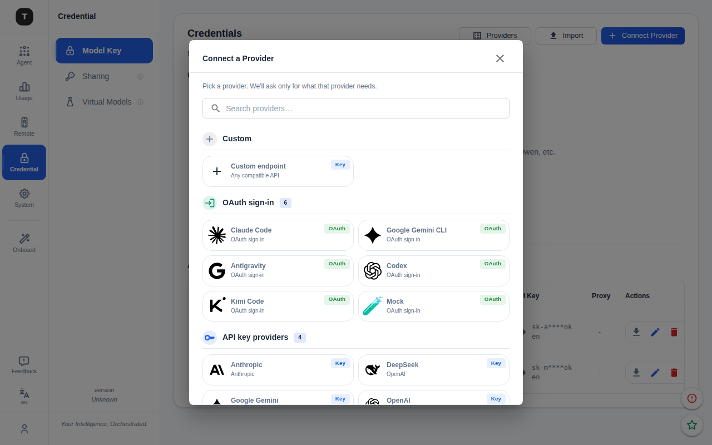
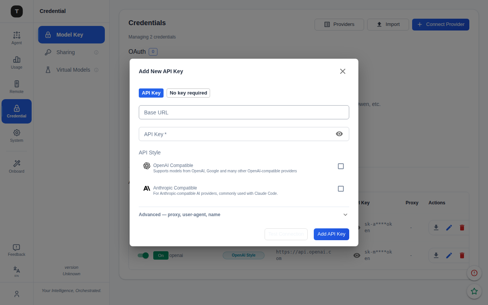
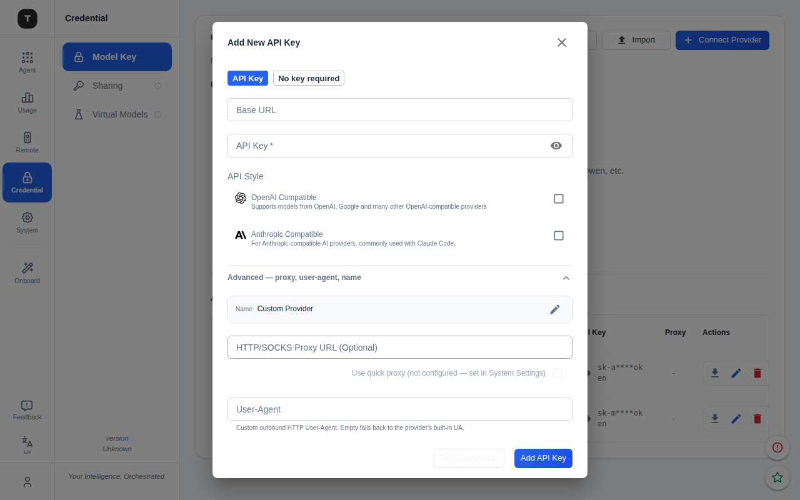
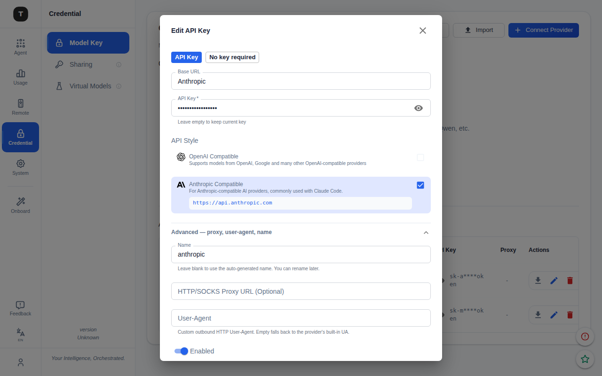

# Connect Provider Flow

Refactored the credential add flow into a two-step picker → form design.
Replaces separate "Add OAuth" + "Add API Key" buttons with a single unified entry point.

## Screen 1 — Provider Picker

Single dialog lists all connectable providers in one place, grouped by type.

**Order:** Custom → OAuth sign-in → API key providers  
**Each card:** icon · name · meta · badge (Key / OAuth)  
**Search:** pinned at top, filters all sections live  

Routing on card click:
- **Custom / Key** → opens ProviderFormDialog (pre-filled with template if known)
- **OAuth** → opens OAuthDialog in direct mode (skips the provider grid, goes straight to auth flow)

## Screen 2b — API Key Form

Redesigned layout for Custom / API-key providers.

**Layout (top → bottom):**
1. **Method chips** — "API Key" | "No key required" — replaces the buried checkbox; API Key field is hidden when "No key required" is active
2. **Base URL** — provider autocomplete (renamed from "Provider" to match what it actually is)
3. **API Key** — password field with show/hide toggle
4. **Protocol topology** — OpenAI / Anthropic checkboxes; hint text appears when both are checked on a dual-URL template, showing whether the result will be 1 merged entry or 2 separate entries
5. **Advanced accordion** — proxy URL, user-agent, display name; collapsed by default in add mode

Edit mode auto-expands the Advanced section so existing settings are visible.

## Key Design Decisions

| Decision | Rationale |
|---|---|
| Checkboxes for protocol, not radios | Radios imply one choice; both protocols can legitimately be enabled simultaneously |
| Hint text for topology outcome | "Will create 2 separate base URLs" makes the silent split visible without adding a radio |
| Method chips instead of checkbox | Top-of-form placement signals intent before filling in fields |
| Advanced accordion | Proxy / UA / name are rarely touched; hiding them reduces visual noise for the common path |
| OAuth direct mode | Avoids double provider-pick; ConnectProviderDialog already handled the choice |

## Files

| File | Role |
|---|---|
| `frontend/src/components/ConnectProviderDialog.tsx` | Unified picker (Screen 1) |
| `frontend/src/components/ProviderFormDialog.tsx` | Key/custom form (Screen 2b) |
| `frontend/src/components/OAuthDialog.tsx` | OAuth flow — added `autoStartProviderId` for direct mode |
| `frontend/src/pages/CredentialPage.tsx` | Wires picker → form routing |
| `frontend/src/components/providerFormDialog/ApiKeyField.tsx` | Key field — `hideCheckbox` prop |
