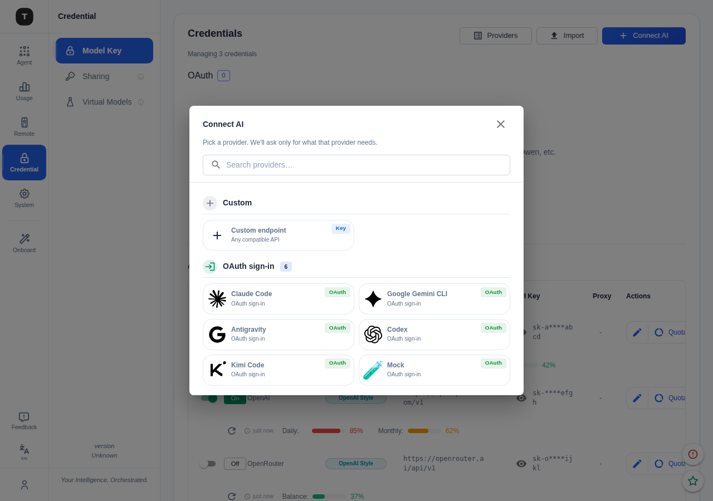

# Connect AI Flow

Unified two-step flow for adding any AI credential — API key or OAuth sign-in —
replacing the old separate "Add OAuth" + "Add API Key" buttons with a single entry point.

## Entry point

Button label: **Connect AI** (previously "Connect Provider").  
Lives in the Credential → Model Key page header.

---

## Step 1 — Picker ("Connect AI" dialog)

A scrollable picker grouped into three sections.  
Title, description, and search bar are **locked** (don't scroll with the card list).  
Scrollbar is always visible on the card area.

**Section order:** Custom → OAuth sign-in → API key providers

| Section | Grid | Notes |
|---|---|---|
| Custom | 1-column | Single "Custom endpoint" card |
| OAuth sign-in | 2-column | Short names fit side-by-side |
| API key providers | 1-column | Long localized names need full width |

**Routing on card click:**
- **Custom / Key provider** → opens the form dialog (pre-filled with template if known)
- **OAuth** → opens OAuthDialog in direct mode (skips the provider grid, straight to auth)

---

## Step 2 — API key form

Layout top → bottom:

1. **Base URL \*** — required; inline error if submitted empty
2. **API Key \*** — password field with show/hide toggle
3. **No API Key Required** — right-aligned checkbox; disables the key field
4. **API Style** — OpenAI / Anthropic checkboxes; topology hint appears when both are checked on a dual-URL template
5. **Advanced accordion** — collapsed by default in add mode, auto-expanded in edit mode

The dialog is capped at `88vh`. The content area scrolls independently; action buttons ("Test Connection" + "Add API Key") are always pinned at the bottom.

---

## Design decisions

| Decision | Rationale |
|---|---|
| "Connect AI" not "Connect Provider" | Friendlier; covers both OAuth sign-in and API-key paths under one verb |
| Header locked in picker | Description + search don't scroll away when the list is long |
| Single-column for API key providers | Localized CN names (e.g. "百度千帆 Coding Plan") overflow a 2-column grid |
| "No API Key Required" as right-aligned checkbox | Checkbox placement matches the key field it modifies; chips felt too prominent for a rare toggle |
| Advanced accordion | Proxy, user-agent, name are rarely needed; hiding them shortens the common add-key path |
| Base URL required validation | Blocks submit and shows an inline field error; clears on first keystroke |
| Empty `!` fix in test panel | Splitting an empty `details` string produced a dangling warning icon with no text |
| OAuth direct mode | Picker already chose the provider; OAuthDialog skips its own grid via `autoStartProviderId` |

---

## Key files

| File | Role |
|---|---|
| `frontend/src/components/ConnectProviderDialog.tsx` | Step 1 — unified picker |
| `frontend/src/components/ProviderFormDialog.tsx` | Step 2 — API key / custom form |
| `frontend/src/components/OAuthDialog.tsx` | Step 2 — OAuth flow; `autoStartProviderId` for direct mode |
| `frontend/src/pages/CredentialPage.tsx` | Wires picker → form routing |
| `frontend/src/components/providerFormDialog/ApiKeyField.tsx` | Key field with `hideCheckbox` prop |
| `frontend/src/components/providerFormDialog/ProviderAutocomplete.tsx` | Base URL field; `required`/`error`/`helperText` props |
| `frontend/src/components/providerFormDialog/VerificationResultPanel.tsx` | Test result panel; filters empty detail rows |
