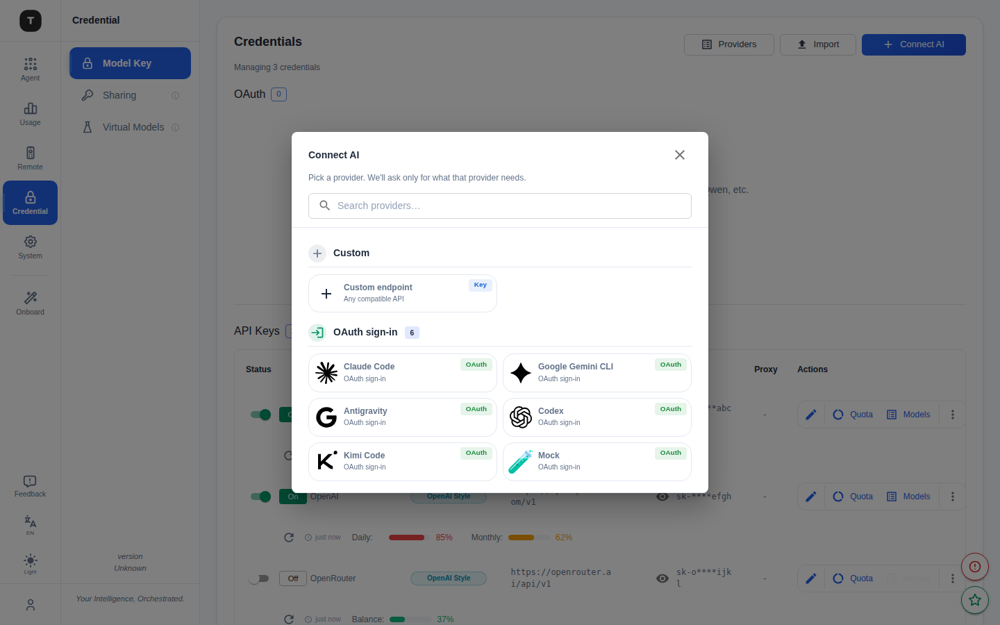
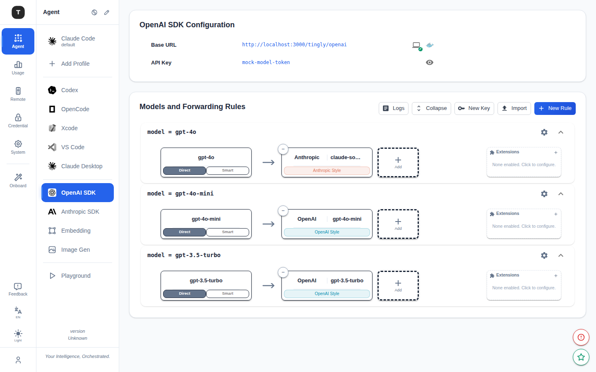

# Tingly Box 亮点能力物料表

> 整理日期：2026-05-21
> 定位：面向团队内部 / 产品介绍 / 市场传播的能力全景速查表
> 配图来源：`docs/images/`（产品实拍截图，可直接用于宣传物料）
> 本版排序：以 **远程控制 / Agent 适配 / AgentBoot SDK** 为优先主推能力

---

## 一览表

| 类目 | 亮点功能 | 核心价值 |
|------|---------|---------|
| 远程控制 | 多平台 IM Bot | 随时随地用聊天软件掌控 AI Agent |
| Agent 适配 | 一键多工具配置 | Claude Code / OpenCode / Codex 等开箱即用 |
| AgentBoot SDK | 统一 Agent 编程接口 | 用 Go 代码驱动 Claude Code 等 Agent，完整透传 MCP / API / Skill 能力 + 权限回调 + 会话管理 |
| LLM 网关 | 多协议统一接入 | 一个端口接管所有 AI 工具 |
| 智能路由 | 上下文感知调度 | 自动为每次请求选最优模型 |
| 护栏 & 安全 | 三级决策 + 凭证保护 | 让 AI 不越界、不泄密 |
| 使用分析 | 精细化用量追踪 | Token 消耗、费用、延迟全掌握 |
| MCP 网关 | 统一聚合 MCP 工具 | 多个 MCP Server 收口到一个网关，统一发现 / 执行 / 管控 |
| 上下文优化 | 智能压缩 & 去重 | 降低 Token 成本、保持对话准确性 |
| 多租户 & 鉴权 | 双 Token 体系 | UI 管理与 API 调用权限严格分离 |
| OAuth 托管 | 浏览器一键授权 | 无需手动填 API Key，安全存储刷新 |

---

## 详细物料

### 1. 远程控制（IM Bot）

| 项目 | 内容 |
|------|------|
| **类目** | 远程控制 |
| **解读** | 通过主流 IM 平台的 Bot 对 AI Agent 进行远程启停、配置和状态查询，让团队成员无需登录后台即可操作 |
| **亮点功能** | · **支持平台**：Telegram、飞书、Lark、钉钉、微信、企业微信（6 个平台） · **TOFU 配对安全**：一次性时效配对码，防止未授权接入 · **内联按钮 / 富键盘**：交互式操作菜单，无需记命令 · **白名单管理**：限制哪些 Chat ID 可操作 · **审计日志**：所有远程操作可追溯 |
| **使用场景示例** | **场景：周末凌晨，用手机批准了一次线上修复** 某 SRE 周六深夜收到告警：一个长跑的 AI Agent 正在生产机上排查问题，跑到一半要执行一条改数据库的命令，触发了护栏的 **Review** 审批。 **因为提前在飞书群绑定了 Tingly Box Bot**：审批请求直接弹到 SRE 手机的飞书里，附带工具名、完整命令和上下文，下面就是「批准 / 拒绝」两个按钮。SRE 在被窝里看了一眼命令没问题，点「批准」，Agent 继续跑完修复——全程没开电脑、没连 VPN、没登后台。 团队还给不同人配了不同平台：国内同事用飞书/钉钉/企业微信，海外同事用 Telegram；每个 Bot 通过一次性配对码（TOFU）绑定，只有白名单里的 Chat 能下指令，所有远程操作都记审计日志。 |

---

### 2. Agent 适配（多工具配置）

| 项目 | 内容 |
|------|------|
| **类目** | Agent 适配 |
| **解读** | 为主流 AI Coding 工具提供一键式配置向导，自动完成 API 地址替换、模型映射、Token 注入 |
| **亮点功能** | · **支持工具**：Claude Code、OpenCode、Codex、Xcode、VSCode、Claude Desktop · **一键 Apply / Restore**：应用/还原配置不需要手动编辑配置文件 · **统一模式 vs 分离模式**：Claude Code 可选单端点或主/子 Agent 分端点 · **Per-Profile 隔离**：每个工具可独立配置模型、路由、护栏 · **Status Line 安装**：为 Shell 添加 Claude Code 状态行 |
| **使用场景示例** | **场景：新员工 10 分钟拉齐全套 AI 工具** 过去新人入职配 AI 工具是个噩梦：要手动编辑 Claude Code 的 settings.json、改 Codex 的配置、给 VS Code 插件填 Key，每个工具的配置格式都不一样，一上午就没了，还经常配错导致连不上。 **用 Agent 配置页后**：新人打开 Tingly Box，左侧列出 Claude Code / Codex / OpenCode / Xcode / VS Code / Claude Desktop 等全部工具，点进 Claude Code 选「Quick Config」——Base URL、API Key 自动填好；高级用户还能选「Unified Model（主子 Agent 同端点）」还是「Separate Model（主/子分流到不同模型）」，顺手把 Thinking 力度、Smart Compact、隐藏 Header、请求录制等开关一并配好。一键 **Apply** 写入，配错了点 **Restore** 立刻还原。整个过程 10 分钟，且全员统一走企业内网代理，不再人手一份散落的 API Key。 |

---

### 3. AgentBoot SDK

| 项目 | 内容 |
|------|------|
| **类目** | Agent SDK |
| **解读** | 面向开发者的 Go SDK，提供统一的编程接口来启动、驱动和管理 Claude Code 等 AI Coding Agent 进程。**关键点：完整透传底层 Agent 的全部原生能力**——不是裁剪过的子集，而是把 MCP、模型 API、Skill 等完整能力暴露给调用方 |
| **底层完整能力（重点）** | · **MCP 完整支持**：通过 `--mcp-config` 透传任意 MCP Server 配置（config 与 per-execution 自动合并），支持 `--strict-mcp-config` 严格模式，Agent 可调用全部 MCP 工具 · **模型 API 完整支持**：Model / FallbackModel 选择、System Prompt（覆盖 `--system-prompt` 与追加 `--append-system-prompt`）、MaxTurns、AllowedTools / DisallowedTools 工具白/黑名单——Anthropic Messages API 的能力面无损传递 · **Skill 完整支持**：通过 `--settings` 注入 settings.json 并结合 ProjectPath，Agent 自动发现并加载项目内的 Skill，与原生 Claude Code 行为一致 |
| **亮点功能** | · **统一 `Execute` 入口**：一行代码启动任意 Agent，返回完全有序的事件流（Stream JSON） · **内联权限回调**：Agent 请求工具权限（文件读写、命令执行等）时，SDK 直接回调给调用方，支持 Auto / Manual / Skip 三种模式 · **交互式 Ask 处理**：拦截 Agent 的 `AskUserQuestion`，由外部系统（IM Bot、Web UI）代替人工响应选项 · **会话管理**：列出 / 恢复 `~/.claude/projects` 下的历史会话，无缝续接上次对话 · **费用追踪**：从事件流中提取 `total_cost_usd`，对接计费系统 · **可扩展架构**：Driver + Transport + Runner 三层分离，新增 Agent 只需实现两个接口；内置 FakeProcess 工厂，测试无需真实 CLI · **计划支持**：Codex、Gemini CLI、Cursor |
| **使用场景示例** | **场景一：把 Claude Code 变成"工单自动修复机器人"** 一个平台团队想做到：用户在工单系统提一个 Bug，系统自动派 Claude Code 去对应仓库修，修完提 PR。他们用 AgentBoot SDK 写了个常驻服务：监听工单 → 调 `agent.Execute(ctx, 工单描述, opts)`，opts 里**注入企业私有知识库 MCP Server**（让 Agent 能查内部接口文档）+ **专用 Skill**（公司代码规范、提交格式）+ 限定 `AllowedTools`。Agent 执行中每遇到危险操作（删文件、改配置）就触发 SDK 的**权限回调**，服务把请求转成飞书审批卡片推给值班人；遇到 `AskUserQuestion` 则把选项推给工单提交者本人选。Agent 跑完，服务从事件流里读出 `total_cost_usd` 记进成本看板、把结果写回工单并自动建 PR。全程没有任何人开终端。  **场景二：CI 里的 AI Code Review，可断点续跑** 在 CI 流水线里用 SDK 以 `PermissionModeSkip` 跑 Claude Code 做自动代码审查；因为 SDK 能**列出并恢复 `~/.claude/projects` 会话**，如果审查任务超时被打断，下次触发用 `ResumeSession(sessionID)` 从上次断点续跑，而不是从头再来。整条流水线无交互终端、无人值守，且 MCP / Skill / 模型 API 能力与本地手跑 Claude Code **完全一致**。 |

---

### 4. LLM 网关

| 项目 | 内容 |
|------|------|
| **类目** | LLM 网关 |
| **解读** | 统一代理 OpenAI、Anthropic、Google Gemini 及任意兼容格式的模型服务，对外暴露单一端点，对内透明转换协议 |
| **亮点功能** | · 同时支持 OpenAI Chat Completions、Anthropic Messages、Responses API、Embeddings、Images 全协议 · 请求 / 响应双向自动转换，OpenAI 客户端可无缝调用 Claude 模型 · 流式（SSE）与非流式统一支持 · Extended Thinking 模式（可配置 Budget Token） · 支持 Function / Tool Calling、Vision 输入 · Prompt Caching 透传，自动节省费用 |
| **使用场景示例** | **场景：跨国团队的模型混用与平滑迁移** 某 AI 创业公司有 30 名工程师，分别在用 Cursor、Claude Code、自研 Python Agent，背后接了 OpenAI、Claude、通义千问（国内 Coding Plan）等多家模型。过去每换一家 Provider，所有人都要改各自的 Base URL 和 API Key，迁移一次要折腾一整天。 **接入 Tingly Box 后**：管理员在「Add New API Key」里把各家 Provider 一次性录入（同一 Provider 可同时勾选 OpenAI / Anthropic 两种协议，分别填对应 Base URL），全员客户端只填 `http://tingly-box:12580` 一个地址。某天决定把默认模型从 GPT-4 切到 Claude——管理员后台改一个映射，30 个人**零改动**完成迁移；某个写 OpenAI 格式的老脚本，也能透明地跑在 Claude 模型上（网关自动做协议双向转换），连 Prompt Caching 都自动透传，账单当月直接降了约 30%。 |

---

### 5. 智能路由

| 项目 | 内容 |
|------|------|
| **类目** | 智能路由 |
| **解读** | 基于规则引擎，对每一条请求进行上下文感知调度——自动识别请求类型、按成本 / 延迟 / 健康状态选择最优 Provider |
| **亮点功能** | · 规则条件支持：请求类型（main / subagent / compact）、模型名称、Agent 场景、Token 数等 · 负载均衡策略：轮询、健康感知（熔断）、延迟优先、成本优先 · Smart Affinity：相关请求保持同一 Provider，保证上下文一致性 · 可视化 DAG 图查看规则执行链路 · 规则日志：每次路由决策可追溯 |
| **使用场景示例** | **场景：用一条规则同时省钱、提速、保高可用** 一家做 AI 编程助手的团队发现：Claude Code 跑起来时，主 Agent（写代码）需要强模型，但它派生的 subagent（搜索、读文件、总结）其实用便宜模型就够了，而这部分调用占了总量的 60%。 **用 Smart Rule 配置后**：在 `model = tingly-glm` 这条转发链上加一条智能规则——命中 `[latest_user] contains` 特定特征的请求走 Deepseek（OpenAI 风格、便宜），其余主请求走 GLM-4.7；并把 GLM 设为 Fallback，主 Provider 一旦熔断自动兜底。结果：subagent 成本下降约 70%，主链路因为加了健康感知熔断，某次上游 Provider 抽风时业务**完全无感知**自动切到备用。所有路由决策都能在可视化 DAG 图和规则日志里逐条回放，排查"为什么这次走了这个模型"只要几秒。 |

---

### 6. 护栏 & 安全

| 项目 | 内容 |
|------|------|
| **类目** | 护栏 & 安全 |
| **解读** | 在 AI 请求到达模型之前/之后进行拦截与审查，防止越权操作、敏感信息泄露及危险命令执行 |
| **亮点功能** | · **三级决策**：Allow / Review（人工审批）/ Block · **策略类型**：资源访问（文件/目录/URL）、命令执行过滤、内容过滤 · **凭证保护**：请求发出前自动替换真实密钥为占位符，模型永远看不到明文密钥，工具执行时本地还原 · **策略分组**：批量启用/禁用一组策略 · **内置策略库**：开箱可用的 filesystem、command 拦截模板 · **远程策略注册表**：从外部源安装策略 · **完整变更历史**：所有策略修改均留审计日志 |
| **使用场景示例** | **场景：让 AI Agent 在生产仓库里"放心地干活"** 一家金融科技公司想用 AI Agent 自动修 Bug、补测试，但安全团队卡住了：仓库里有数据库连接串、内部 API 密钥，Agent 一旦把这些读进上下文发给云端模型就是合规事故；而且谁也不敢让 AI 随便执行 `rm`、`curl` 外部地址。 **用护栏后**： ① 配置 `resource_access` 策略——`~/.ssh`、`.env`、`config/secrets/*` 一律 **Block**； ② 配置 `command_execution` 策略——`rm -rf`、`curl`/`wget` 外网域名标记为 **Review**，触发时通过 IM Bot 推给值班工程师人工点"批准/拒绝"； ③ 开启**凭证保护**——代码里真实的数据库密码在发往模型前自动替换成 `{{DB_PASSWORD}}` 占位符，模型全程看不到明文，工具真正执行时本地再还原。 结果：Agent 正常完成了 80% 的日常修复工作，敏感信息零泄露，每一次 Block / Review 决策都留在审计日志里，月度合规审查直接拿这份记录交差。 |

---

### 7. 使用分析

| 项目 | 内容 |
|------|------|
| **类目** | 使用分析 |
| **解读** | 对每一次 LLM 请求进行精细化记录，支持按日/月聚合，帮助团队掌握 AI 使用成本与效率 |
| **亮点功能** | · 请求级记录：Token 消耗、延迟、费用估算、模型选择 · 日 / 月聚合报表 · 时序数据接口（可对接 Grafana 等可视化工具） · 多租户隔离：每个 API Token 独立统计 · 完整请求 / 响应日志可回溯 · 导出能力 |
| **使用场景示例** | **场景：月底对账，一眼看清钱花在哪** 财务每月底都来要"这个月 AI 到底花了多少、各组怎么分摊"，技术负责人以前只能去各家 Provider 后台一个个导账单，再手工拼 Excel。 **用 Dashboard 后**：首页直接显示昨日/今日/近 7/30/90 天的总请求数、总 Token、缓存命中率（97.3% 意味着大量重复 Prompt 被缓存省了钱）、错误率、流式占比，还有「Token 用量时序图」和「Top Models by Token」排行。因为每个团队/Agent 用独立 API Token，用量天然隔离，导出明细按 Token 一拆就是分摊表。 另一次某 Agent 半夜 Token 异常飙高，负责人点进请求日志按时间排序，几分钟就定位到是一个死循环重试的脚本——换以前根本无从查起。 |

---

### 8. MCP 网关

| 项目 | 内容 |
|------|------|
| **类目** | MCP 网关 |
| **解读** | 把多个上游 MCP Server（内置 + 自建 + 第三方）统一聚合到一个网关后面，对 Agent 暴露一套统一的工具发现 / 执行 / 流式接口，并集中做可见性与权限管控——而不只是"接入某个 MCP" |
| **亮点功能** | · **多 Server 聚合**：同时挂载内置工具（web_search / web_fetch）与任意数量的外部 MCP Server，工具统一编目 · **统一执行入口**：一个网关地址转发工具调用到对应上游 Server，支持流式执行 · **工具可见性控制**：服务端 / 客户端双层过滤，按场景/Agent 决定暴露哪些工具 · **工具目录安装**：从目录一键安装并接入新的 MCP 工具 · **连接管理**：上游 Server 可重连、健康管理，对 Agent 透明 |
| **使用场景示例** | **场景：给全公司的 Agent 一套"工具中枢"** 一家公司有多个团队各自维护了 MCP Server（知识库、工单、监控、内部 API），还想用社区的 web 搜索工具。如果每个 Agent 都去单独配一堆 MCP 连接，配置散乱、权限失控、谁能用哪个工具说不清。 **用 MCP 网关后**：所有上游 MCP Server 统一挂到网关后面，工具被集中编目；Agent 只连网关一个地址就能发现并调用全部工具，调用请求由网关转发到对应上游 Server（支持流式）。再通过**工具可见性控制**分场景授权——对外部协作者只放出 web 搜索、隐藏内部知识库与工单工具；新工具上线时在目录里一键安装即全员可用。这套网关能力不仅在代理侧生效，也能通过 AgentBoot SDK 完整透传给程序化驱动的 Claude Code（见 #3）。 |

---

### 9. 上下文优化（Smart Compact）

| 项目 | 内容 |
|------|------|
| **类目** | 上下文优化 |
| **解读** | 在多轮对话中自动压缩、去重上下文，降低 Token 成本，同时避免"遗忘"关键信息 |
| **亮点功能** | · **Thinking Block 压缩**：移除冗长的思考过程，保留结论 · **对话去重**：识别并合并重复的历史交换 · **文档引用优化**：消除重复文件内容 · **错误日志精简**：清理上下文中的无效错误信息 · **XML 结构化压缩**：针对 Claude 工具调用的特殊优化 |
| **使用场景示例** | **场景：一个跑了 3 小时的重构任务没有中途崩** 工程师让 Claude Code 做一个跨 40 个文件的大重构，几个小时下来对话历史里塞满了重复读取的同一份文件、几千行编译错误日志、还有模型自己冗长的 thinking 过程。临近上下文窗口上限时，传统做法要么报错中断、要么粗暴截断丢失关键信息。 **开启 Smart Compact 后**：网关自动压缩——移除已经过时的 thinking block、合并重复的文件引用、精简掉早就修好的错误日志、对 Claude 工具调用的 XML 结构做专门压缩。窗口腾出空间，Agent **不中断**地继续把重构干完，且因为保留了结论性信息，没有出现"忘了前面改过什么"的低级错误。在 Claude Code 配置页一个开关即可启用（见 #2 截图中的 Smart Compact 开关）。 |

---

### 10. 多租户 & 鉴权

| 项目 | 内容 |
|------|------|
| **类目** | 多租户 & 鉴权 |
| **解读** | 双 Token 体系将管理权限与 API 调用权限严格分离，支持多 Token 独立配额与用量追踪 |
| **亮点功能** | · **双 Token 隔离**：User Token（UI/管理）与 Model Token（API 代理）分开 · **密码学随机生成**：无默认密码，首次启动自动生成 · **JWT 签名 + 过期**：标准安全机制 · **Token 轮转**：应用内一键重置，不影响其他配置 · **多 API Token**：可创建多个 Token 分配给不同 Agent / 团队成员，独立追踪用量 |
| **使用场景示例** | **场景：实习生误把 Key 提交到了公开仓库** 团队给 QA 组发了一个专用 API Token（后台限制它只能调便宜模型、且用量单独计费）。某天一个实习生不小心把含 Token 的配置文件 push 到了公开 GitHub 仓库。 **因为是双 Token 隔离体系**：泄露的只是 Model Token（仅能代理模型请求），管理后台用的 User Token 完全没受影响，攻击者拿到也进不了管理界面、改不了任何配置。处理只要一步——在后台对这个 Model Token 点「轮转」，旧 Token 立刻失效、生成新 Token 发给 QA 组，其他团队的 Token 和全部配置纹丝不动。整个事故从发现到处置完不到 5 分钟，且事后能从用量记录里确认泄露窗口内有没有被盗刷。 |

---

### 11. OAuth 托管

| 项目 | 内容 |
|------|------|
| **类目** | OAuth 托管 |
| **解读** | 托管 Claude Code、Gemini CLI 等工具的 OAuth 授权流程，安全存储 Access Token 并自动刷新，用户无需手动管理 |
| **亮点功能** | · **一键授权**：浏览器跳转完成 OAuth 流程 · **Token 自动刷新**：到期前静默续期 · **状态可视化**：随时查看授权状态与权限范围 · **一键撤销**：断开 OAuth 连接 · **多 Provider 支持**：Claude Code（已支持），Gemini CLI / Qwen Code（规划中）|
| **使用场景示例** | **场景：用订阅额度而不是 API 计费跑 Agent** 很多团队手里有 Claude / Codex / Kimi 的订阅套餐（Coding Plan），但这些套餐是绑在 OAuth 登录态上的，没法像 API Key 那样直接填进网关；过去只能在每个人的机器上各自 `claude login`，登录态散落、过期了还得手动重登。 **用 OAuth 托管后**：在「Add OAuth Provider」里点一下 Anthropic Claude Code / OpenAI Codex / Kimi CLI 的「Authorize」，浏览器跳转完成授权，Token 就被安全存进 Tingly Box 并**自动续期**——团队所有 Agent 共享这一份订阅授权，省下纯 API 调用的费用。需要时还能配代理（截图里的 SOCKS Proxy）走特定出口，过期前静默刷新，长跑的 Agent 不会因为 Token 到期半路断掉。 |

---

## 能力矩阵速查

| 能力 | 开源可替代方案 | Tingly Box 差异化 |
|------|-------------|-----------------|
| IM Bot 远程控制 | 手写 Bot | 统一框架支持 6 个平台，开箱即用 |
| Agent 工具一键配置 | 手动编辑配置文件 | 向导式 UI + Apply/Restore 一键操作 |
| AgentBoot SDK | claude-sdk-go 等（原生绑定，无进程控制） | 进程级驱动 + 权限拦截 + 会话续接，可嵌入任意 Go 服务 |
| LLM 多 Provider 代理 | LiteLLM | 更深的 Agent 感知路由 + 护栏一体化 |
| 护栏 / 安全策略 | 无成熟开源方案 | 凭证保护 + 三级决策 + 变更审计 |
| 上下文优化 | 无 | 内置 Smart Compact，对 Claude 深度优化 |
| OAuth 托管 | 无 | 托管 Claude Code OAuth，统一续期 |

---

*本文档由代码库自动扫描生成，如有新功能请同步更新此表。*
