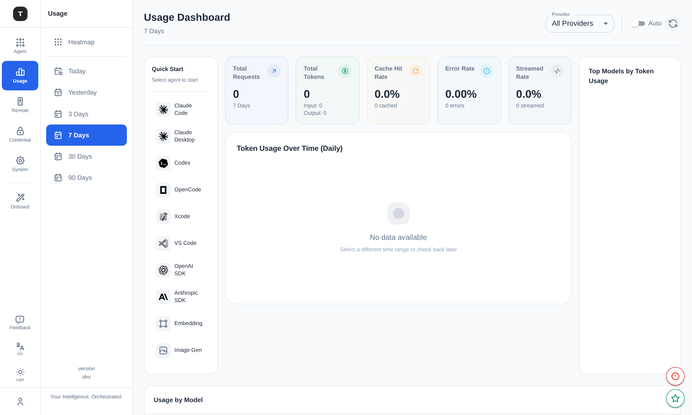
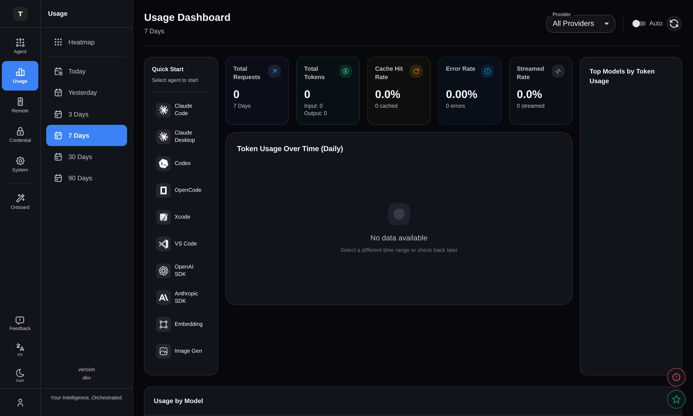
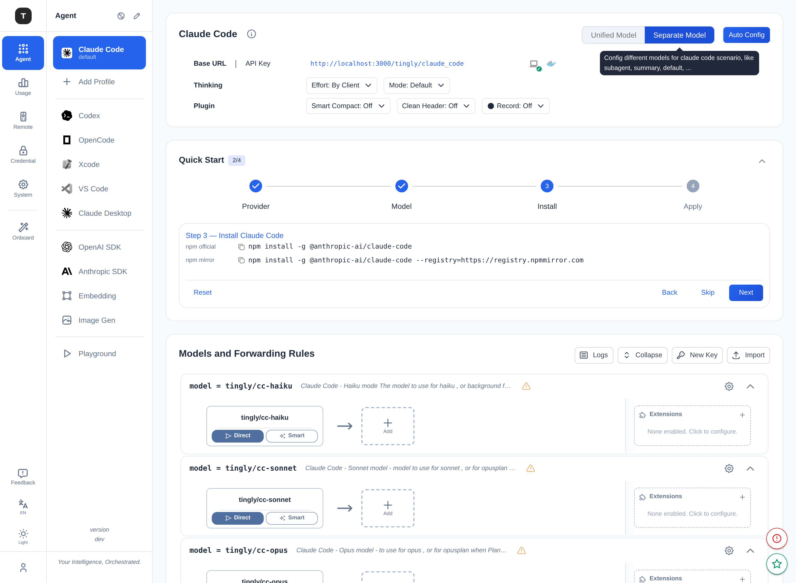
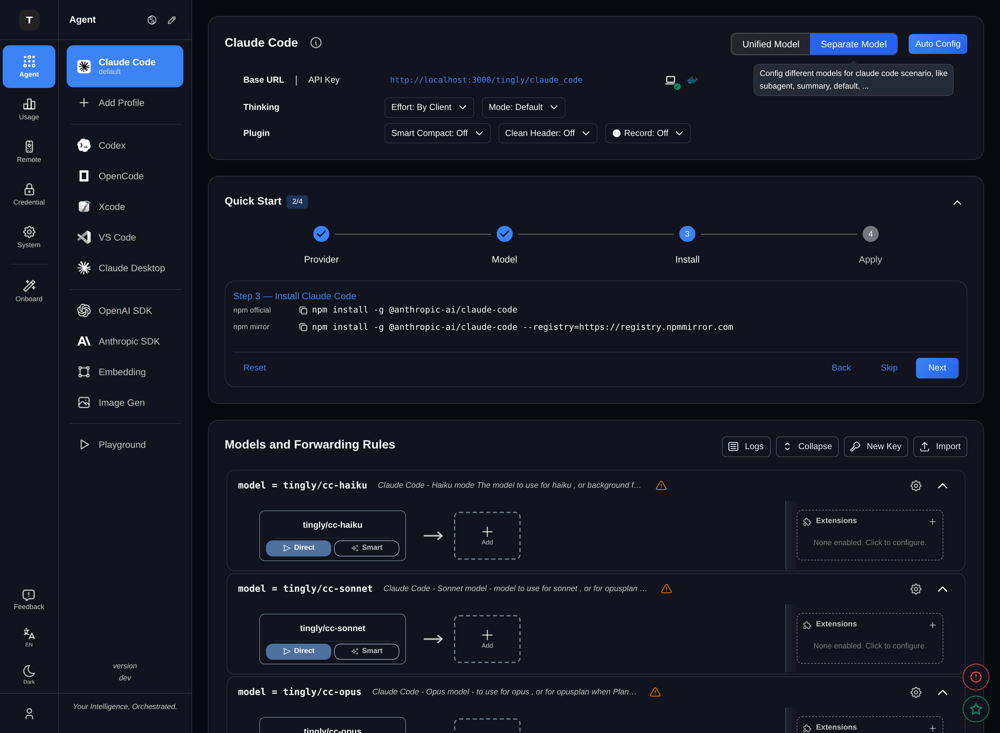
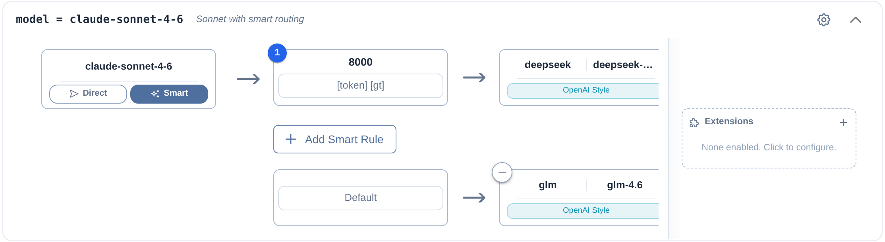
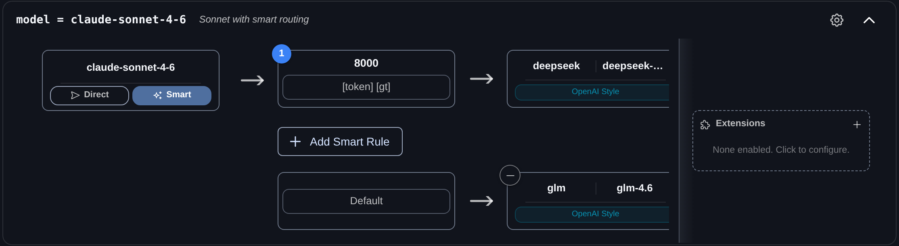
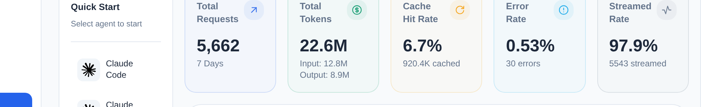
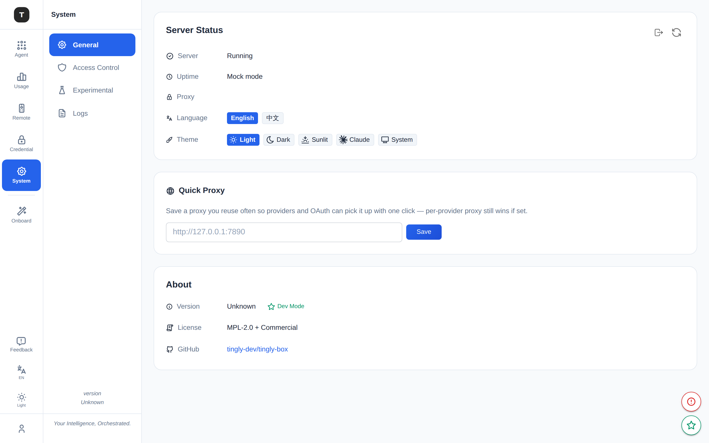
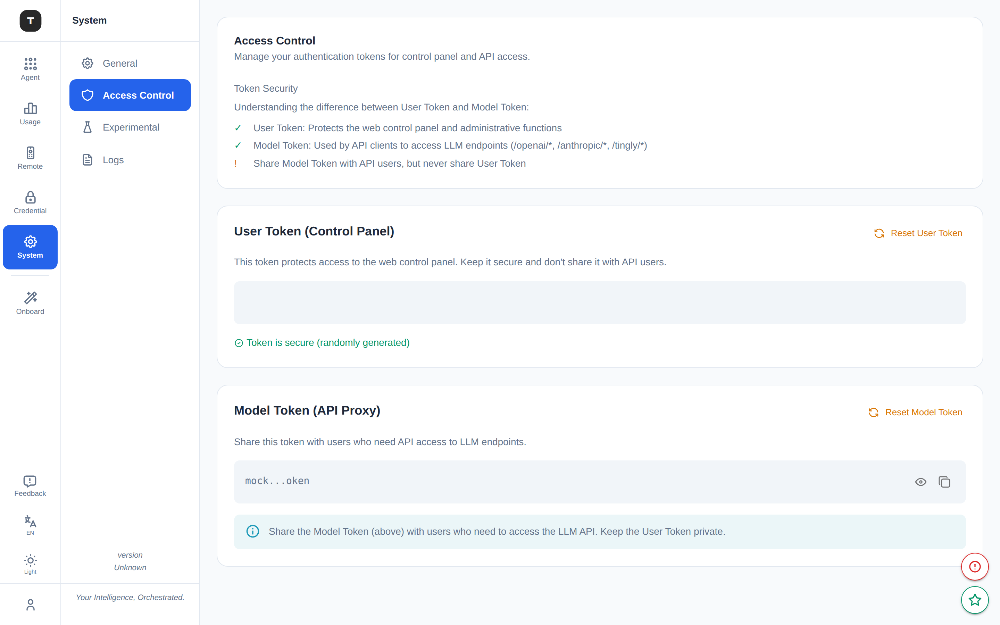

# Icon Hierarchy

UI 中使用了多个层面的 icon，承担不同的职责。
通用 UI icon 现在统一来自 **Tabler**，但通过一层适配器自然套用 MUI 的尺寸与配色约定。

---

## Icon 来源（库）

| 库 | 用途 | 为什么 |
|---|---|---|
| `@/components/icons`（Tabler ⨉ MUI 适配） | **所有通用 UI icon** | Tabler 线条风格细腻、覆盖面广（4000+），经适配器后又能无缝继承 MUI theme 的 `fontSize` / `color` 语义 |
| `@lobehub/icons-static-svg` | AI 提供商品牌 logo | 专门维护 50+ LLM 提供商的官方 SVG，避免手工维护 |
| 自定义 SVG (`src/assets/icons/`) | 企业通讯工具 logo | Lobehub 未覆盖的 IM 平台（钉钉、飞书、微信等）单独维护 |

> 历史上通用 UI icon 来自 `@mui/icons-material`，Tabler 仅用于导航。
> 现已统一：业务代码**不再直接 import `@mui/icons-material`**，全部走 `@/components/icons`。
> MUI 图标的优势是与组件系统联动好，劣势是图形单调；Tabler 反之。适配器同时拿到两者的优势。

---

## 适配器：Tabler ⨉ MUI

核心矛盾——两套体系不兼容：

| | 尺寸 | 颜色 | 风格 |
|---|---|---|---|
| `@mui/icons-material` | `fontSize`（small/medium/large） | `color`（theme 语义色），`fill: currentColor` | 实心 filled |
| `@tabler/icons-react` | `size`（px 数字） | `stroke: currentColor`，`fill="none"` | 描边 outline |

`tablerMui()`（`src/components/icons/tablerMui.tsx`）把一个 Tabler 图标包进 MUI 的 `SvgIcon`：

- `component={Icon} inheritViewBox` → 复用 Tabler 的 24×24 viewBox，但套上 MUI 的 `width/height: 1em` + `fontSize` 体系；
- 强制 `sx={{ fill: 'none' }}` → 覆盖 `SvgIcon` 默认的 `fill: currentColor`，否则描边图标会被填成实心块；
- `stroke={1.75}` → 比 Tabler 默认 2 更精致，配小尺寸更协调；
- 返回类型标注为 MUI 的 `SvgIconComponent` → 在任何期望 MUI 图标的地方都**类型兼容**（drop-in）。

```tsx
// tablerMui.tsx（节选）
export function tablerMui(Icon: TablerIcon, defaultStrokeWidth = 1.75) {
  const Wrapped = forwardRef<SVGSVGElement, SvgIconProps>((props, ref) => (
    <SvgIcon ref={ref} component={Icon} inheritViewBox
             stroke={defaultStrokeWidth} sx={[{ fill: 'none' }, ...]} {...rest} />
  ));
  return Wrapped as unknown as SvgIconComponent;
}
```

### 两种用法

1. **预定义同名图标**（`@mui/icons-material` 的机械替换，改导入源即可）：

```tsx
import { Delete, ContentCopy, CheckCircle } from '@/components/icons';

<Delete fontSize="small" color="error" />     // fontSize + 语义色照常生效
<Button startIcon={<ContentCopy fontSize="small" />}>Copy</Button>
```

`src/components/icons/index.tsx` 预定义了约 110 个 **MUI 同名** 图标
（`Close` `Add` `Search` `Settings` `Refresh` `Edit` `Info` …），映射到合适的 Tabler 图标。

2. **泛用工厂**（任意未预定义的 Tabler 图标）：

```tsx
import { tablerMui } from '@/components/icons';
import { IconRocket } from '@tabler/icons-react';

const Rocket = tablerMui(IconRocket);
<Rocket color="primary" fontSize="small" />
```

### 截图

统一后的效果（图标全部为 Tabler，尺寸/语义色由 MUI 体系驱动）：

Usage Dashboard（light / dark） —— 统计卡片图标继承语义色，侧边栏导航图标统一线条风格：

| Light | Dark |
|---|---|
|  |  |

Scenario Routing Graph —— 路由图节点（Model Node / Provider Node）中的 Direct/Smart 切换、齿轮图标均来自 Tabler，描边风格与 UI 整体协调：

| Light | Dark |
|---|---|
|  |  |

Smart Routing Rule card（放大图）—— 路由条件节点 "token [gt]"、Add Smart Rule 按钮（`+` icon）、Extensions 齿轮图标一致使用 Tabler 描边风格：

| Light | Dark |
|---|---|
|  |  |

Dashboard 统计卡片（早期截图）—— 语义色（primary / success / warning / info / secondary）自动套用：



System 页 —— 导航 / 区块标题 / 主题切换 / 链接图标全部统一为 Tabler：



Access Control 页 —— 操作（sync）、状态（check）、可见性（eye）、复制、提示（info）各层语义色正确：



---

## Icon 层面（Hierarchy）

层面（视觉权重分级）依旧成立，只是「库」一栏统一为 `@/components/icons`。
尺寸、语义色的约定保持不变——因为适配器让 Tabler 完全遵守 MUI 的 `fontSize` / `color`。

### Layer 1 — Navigation（导航层）

- **位置**：Activity Bar、Sidebar
- **来源**：Brand Icons + `@/components/icons`（或直接 `@tabler/icons-react`）
- **尺寸**：20px
- **文件**：`src/layout/Layout.tsx`, `src/layout/Sidebar.tsx`
- **为什么**：导航 icon 代表功能入口，需要高辨识度；Tabler 的线条风格在小尺寸下仍清晰。

### Layer 2 — Page / Dialog Header（页面/对话框标题层）

- **位置**：Dialog 标题区、页面区块标题
- **尺寸**：默认 24px，有时加 `sx={{ fontSize: 20 }}`
- **语义色**：`color="warning"` / `color="info"`
- **为什么**：标题层 icon 传达操作的严重性（警告/信息），必须使用语义色以符合可访问性要求。

```tsx
import { WarningAmber, Info } from '@/components/icons';
<WarningAmber color="warning" />
<Info color="info" />
```

### Layer 3 — Component Control（组件控制层）

- **位置**：表格展开/收起、折叠面板
- **尺寸**：默认 24px
- **为什么**：交互控件的视觉提示，需与组件尺寸系统对齐。

```tsx
import { KeyboardArrowDown, ExpandMore } from '@/components/icons';
```

### Layer 4 — Action Button（操作按钮层）

- **位置**：Button 的 `startIcon` / `endIcon`
- **尺寸**：`fontSize="small"`（20px）
- **为什么**：按钮 icon 辅助文字标签，`small` 尺寸避免喧宾夺主。

```tsx
import { ContentCopy, Delete } from '@/components/icons';
<Button startIcon={<ContentCopy fontSize="small" />}>Copy</Button>
<Button startIcon={<Delete fontSize="small" />} color="error">Delete</Button>
```

### Layer 5 — Form Field Adornment（表单字段装饰层）

- **位置**：TextField `InputAdornment`
- **尺寸**：`fontSize="small"`
- **为什么**：提示输入类型（搜索、密钥可见性），保持低视觉权重。

```tsx
import { Search } from '@/components/icons';
<InputAdornment position="start"><Search fontSize="small" /></InputAdornment>
```

### Layer 6 — Status Indicator（状态指示层）

- **位置**：健康检查、探针结果、连接状态
- **尺寸**：`fontSize="small"` 或固定 24px
- **语义色**：`color="success"` / `color="error"`
- **为什么**：状态 icon 是系统反馈的第一视觉信号，颜色语义必须清晰一致。

```tsx
import { CheckCircle, Error } from '@/components/icons';
<CheckCircle color="success" fontSize="small" />
<Error color="error" fontSize="small" />
```

### Layer 7 — Alert / Message（提示消息层）

- **位置**：Alert 组件内的自定义 icon
- **尺寸**：`fontSize="small"`

```tsx
import { Launch, Info } from '@/components/icons';
<Alert severity="success" icon={<Launch fontSize="small" />}>
<Alert severity="info" icon={<Info fontSize="small" />}>
```

### Layer 8 — Table Row Action（表格行操作层）

- **位置**：表格行内的 `IconButton`
- **尺寸**：默认 24px
- **语义色**：删除用 `color="error"`，其他默认

```tsx
import { Edit, Delete, MoreVert } from '@/components/icons';
<IconButton onClick={handleEdit}><Edit /></IconButton>
<IconButton onClick={handleDelete} color="error"><Delete /></IconButton>
<IconButton><MoreVert /></IconButton>
```

### Layer 9 — Brand / Provider（品牌提供商层）

- **位置**：提供商列表、模型选择器、连接对话框
- **来源**：Lobehub SVG + 自定义 SVG（通过 `BrandIcons.tsx` 统一封装）
- **尺寸**：20–32px
- **主题适配**：灰度/反色 filter 根据 `theme.palette.mode` 切换
- **文件**：`src/components/BrandIcons.tsx`, `src/components/ProviderIcon.tsx`
- **为什么**：提供商 logo 是品牌识别核心，与普通 UI icon 分开管理。

### Layer 10 — Empty State / Placeholder（空状态占位层）

- **位置**：空列表、引导用户添加第一项内容
- **尺寸**：28–60px（刻意放大）
- **颜色**：`color: 'text.secondary'`（低调）

```tsx
import { Add } from '@/components/icons';
<Add sx={{ fontSize: 40, color: 'text.secondary' }} />
```

---

## 尺寸与颜色规范速查

| 场景 | 尺寸 | 颜色 |
|---|---|---|
| 导航、品牌 | 20px | 由 theme primary / 品牌色决定 |
| 标题、组件控制 | 24px（默认） | 语义色或继承 |
| 按钮、表单、状态、提示 | `small`（20px） | 语义色（success/error/warning/info） |
| 行操作 | 24px（默认） | 默认或 error |
| 空状态 | 28–60px | `text.secondary` |

---

## 设计原则

1. **单一来源，统一风格**：通用 UI icon 全部走 `@/components/icons`，描边风格一致；不再混用 MUI 实心 + Tabler 描边两种视觉语言。

2. **适配而非替换**：通过 `tablerMui()` 适配器拿到 Tabler 的图形丰富度 + MUI 的 theme 联动，而不是二选一。

3. **视觉权重分级**：Layer 1–10 的尺寸差异让用户视线自然分层（大 icon 引导 → 中 icon 导航/标题 → 小 icon 操作/状态）。

4. **语义与交互分离**：品牌 icon 纯展示，操作 icon 触发行为，状态 icon 反馈结果——三类职责不混用。

5. **可调可控**：换图标只需改 `index.tsx` 一行（全局生效）；调整描边粗细只需改 `tablerMui.tsx` 一处。
