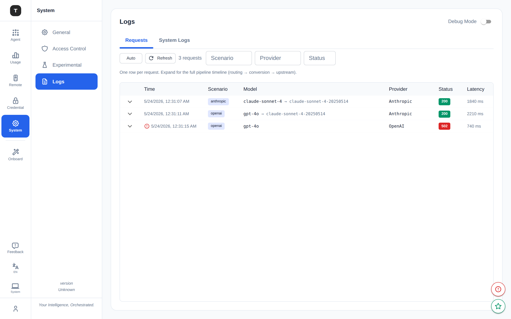
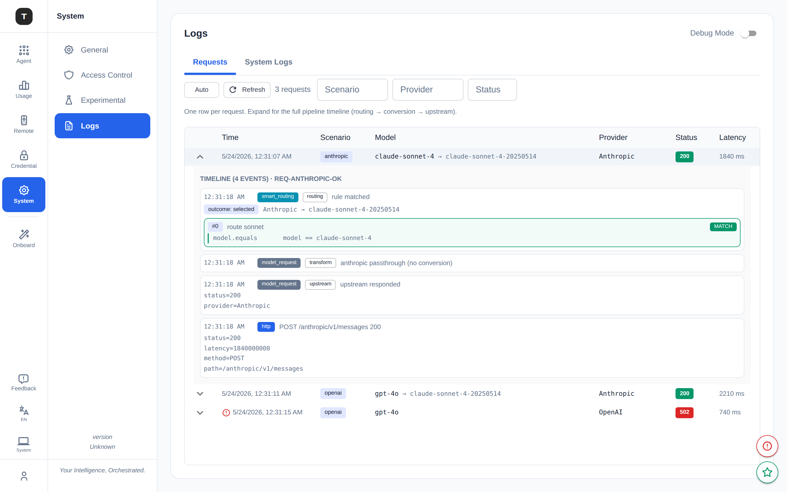
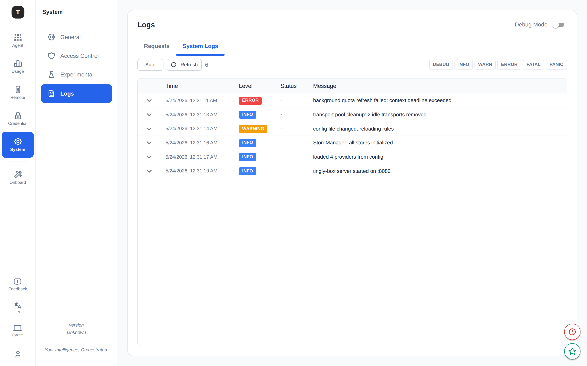

# Logging Redesign: Correlated Model-Request Traces

**Status: shipped** on `base/logging-system`.

Route chosen: **lightweight logrus correlation** — attach a `request_id` to
the request context, route entries to a dedicated `model_request` sink via
the existing `MultiLogger.WriteEntry` hook, no new logging API.  
Frontend target: **two views (Requests / System)** with smart-routing folded
into the per-request drill-down.

## UI

**Requests** — one row per request (scenario, routed model, provider, status,
latency). Scenario / provider / status filter bar. Auto-refresh, pinned
auto-scroll.

**Expanded timeline** — full pipeline for one request: `smart_routing`
(rule evaluation + match) → `model_request` (conversion stages) →
`upstream` (provider call) → `http` (access log), correlated by `request_id`:

**System Logs** — genuine system entries only (startup, config, jobs), with
level-filter chips:

## Why

The previous Logs page split logs into three tabs — **Model / System / Smart**
— and the split backfired:

- **"Model Requests" wasn't model-centric.** It and "System Logs" called the
  same endpoint `/api/v1/system/logs`; the only difference was a client-side
  `pathPrefix="/tingly/"` filter. What it showed was the HTTP access log
  (status / latency / path), not model semantics.
- **Protocol and client logs leaked into "System".** Both packages called
  global `logrus.*` with no context, so `WriteEntry` defaulted them to
  `LogSourceSystem`. Conversion warnings, client errors, retries — all in the
  wrong tab, disconnected from the request.
- **No correlation id.** A single request scattered across four places with
  nothing tying them together. The recording pipeline's `RequestID` was freshly
  generated at emit time, not threaded through.

## How

### Core idea

A "model request" is a **correlated trace**: one `request_id` threads through
the whole pipeline; logs are categorized by **scope + stage** rather than
transport path.

- scope `model_request` → everything tied to a `request_id`
- scope `system` → genuine non-request logs (startup, config, jobs)
- stage ∈ `inbound | routing | transform | upstream`

### Key implementation decisions

**`logrus.WithContext(ctx)` over `obs.LogFromContext(ctx)`.**  
An `obs.LogFromContext` helper was considered but rejected as too disruptive —
it changes every call site's import and signature. The standard logrus API is
preserved: downstream code switches from `logrus.Info(...)` to
`logrus.WithContext(ctx).Info(...)`. Central routing in `WriteEntry` reads
`entry.Context`, extracts the `request_id`, and routes the entry to the
`model_request` sink. Zero new logging concepts for call sites.

**Uniform `loggingRoundTripper`.**  
One wrapper around every provider transport emits a single Info line per
upstream call — provider / proxy / status / latency — rather than each client
open-coding its own. Correlates via request context so the upstream outcome
lands in the same timeline. Proxy credentials are never logged; masking is
`scheme://***@host` (not stripped to `scheme://host`, which would hide that
auth is in use). Env `HTTP_PROXY`/`HTTPS_PROXY` is resolved at request time
so `direct` is only logged when it really is direct.

**Source-honest System tab.**  
`ReadJSONLogsBySource` filters the System view to `system / action / unknown`
sources only, replacing fragile path-prefix matching.

**Shared component, two entry points.**  
`LogExplorer` (Requests + System tabs) is used by both the main Logs page and
the per-scenario quick-open dialog; the dialog passes `lockedScenario` for a
preset filter — no special-case UI.

### What diverged from the original design

| Design | Actual |
|---|---|
| `obs.LogFromContext(ctx)` helper | `logrus.WithContext(ctx)` + central routing in `WriteEntry` |
| Per-client ad-hoc Debug→Info promotion | Single `loggingRoundTripper` wrapping all provider transports |
| `X-Request-Id` header as primary ID source | UUID generated fresh in middleware, stored in both gin context and `request.Context()` |

### Relation to other observability systems

| System | Location | Captures | Surfaced in |
|---|---|---|---|
| A. logrus logging (`pkg/obs.MultiLogger`) | `pkg/obs/multi_logger.go` | text/json/memory, bucketed by source | **Logs page** ← this redesign |
| B. request recording (`ProtocolRecorder`) | `internal/server/protocol_recording.go` | original→transformed request/response, stream chunks | Prompt recording page; opt-in per scenario |
| C. usage tracking (`UsageTracker`) | `internal/server/tracking.go` | tokens, provider, model, latency | Dashboard / DB |

This redesign fixes (A). The `request_id` from (A) is now aligned with (B)'s
`RequestID` so a later convergence onto a single source of truth stays open.

## Open

- `GetSystemLogStats` still reads unfiltered (`ReadJSONLogs`); align its source
  filter with `GetSystemLogs`.
- `openapi.json` not regenerated for `GET /api/v1/requests` and
  `GET /api/v1/requests/:id`; frontend uses placeholder client.
