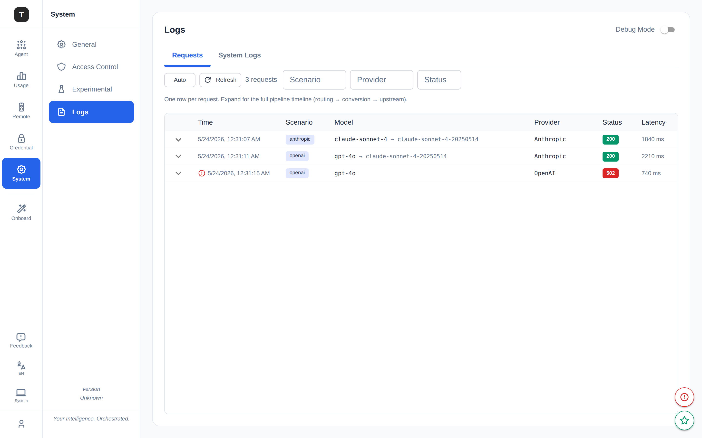
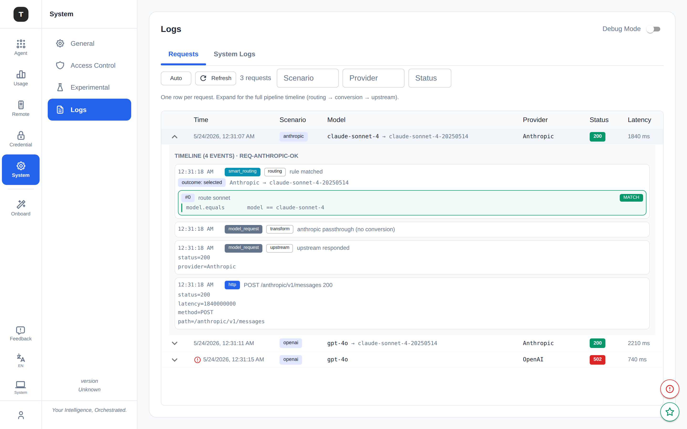
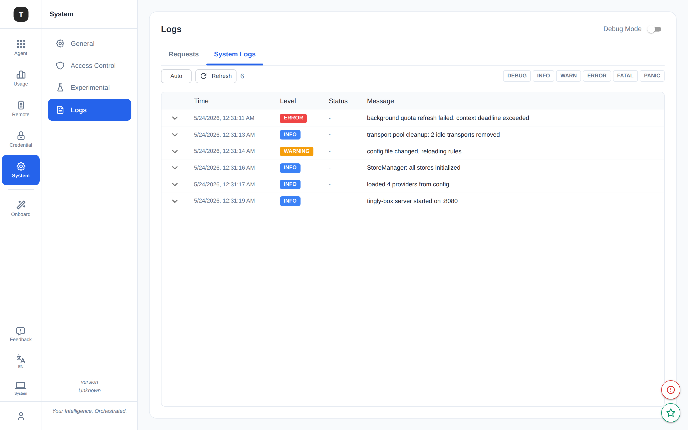

# 日志系统：架构与上游错误分类

> 适用对象：tingly-box 后端贡献者。
> 本文档分两部分:**架构**(第 1 节——日志怎么分源、怎么按 `request_id` 关联、
> 前端怎么展示)和**内容**(第 2 节起——一条日志/一条报错该带什么级别、什么
> 字段、给下游看什么样的消息)。两部分原本是两篇文档,内容部分是在排查一条
> 难读的日志时顺带做的,合并到一起以后不用来回跳。

---

# 第一部分:架构——关联的 Model-Request 追踪

**Status: shipped** on `base/logging-system`.

Route 选择:**轻量 logrus 关联**——给请求 context 挂一个 `request_id`,通过既有
的 `MultiLogger.WriteEntry` hook 把条目路由到专门的 `model_request` sink,不引入
新的 logging API。
前端目标:**两个视图(Requests / System)**,smart-routing 折叠进单条请求的
展开详情里。

## UI

**Requests** ——一行一个请求(scenario、路由到的 model、provider、状态、延迟)。
Scenario / provider / status 过滤条。自动刷新,固定住的自动滚动。



**展开时间线**——一个请求的完整 pipeline:`smartrouting`(rule 匹配)→
`model_request`(转换阶段)→ `upstream`(provider 调用)→ `http`(access log),
用 `request_id` 关联:



**System Logs** ——只有真正的系统级条目(启动、配置、job),带级别过滤 chip:



## 为什么要重做

之前的 Logs 页面把日志拆成三个 tab——**Model / System / Smart**——这个拆分
适得其反:

- **"Model Requests" 其实不是以 model 为中心的。** 它和 "System Logs" 调用
  的是同一个 endpoint `/api/v1/system/logs`,唯一区别只是前端一个
  `pathPrefix="/tingly/"` 的过滤。展示的其实是 HTTP access log(状态/延迟/
  路径),不是 model 语义。
- **Protocol 和 client 的日志都漏进了 "System"。** 两个包都直接调用全局
  `logrus.*`,不带 context,`WriteEntry` 默认把它们归到 `LogSourceSystem`。
  转换警告、client 错误、重试——全都进错了 tab,和请求本身脱节。
- **没有关联 id。** 一个请求散落在四个地方,彼此没有任何关联。recording
  pipeline 的 `RequestID` 是在 emit 时才现生成的,没有真正串联起来。

## 怎么做的

### 核心思路

一个 "model request" 是一条**关联 trace**:一个 `request_id` 贯穿整条 pipeline;
日志按 **scope + stage** 分类,而不是按传输路径分类。

- scope `model_request` → 所有挂了 `request_id` 的
- scope `system` → 真正的非请求日志(启动、配置、job)
- stage ∈ `inbound | routing | transform | upstream`

### 关键实现决策

**`logrus.WithContext(ctx)`,而不是 `obs.LogFromContext(ctx)`。**
曾经考虑过做一个 `obs.LogFromContext` helper,但因为太具侵入性被否决了——它会
改变每个调用点的 import 和签名。标准 logrus API 被保留下来:下游代码只是从
`logrus.Info(...)` 换成 `logrus.WithContext(ctx).Info(...)`。集中的路由逻辑在
`WriteEntry` 里读 `entry.Context`,取出 `request_id`,把条目路由到
`model_request` sink。调用点侧零新概念。

**统一的 `loggingRoundTripper`。**
一个包住每个 provider transport 的 wrapper,每次 upstream 调用打一行 Info——
provider / proxy / status / latency——而不是每个 client 各写各的。通过请求
context 关联,让 upstream 结果落进同一条时间线。代理凭证永远不打日志;脱敏
成 `scheme://***@host`(不是直接砍成 `scheme://host`,那样会让人看不出其实
配了认证)。`HTTP_PROXY`/`HTTPS_PROXY` 在请求时才 resolve,所以 `direct` 只在
真的是直连时才会被打出来。

**System 页只展示真正的系统条目。**
`ReadJSONLogsBySource` 把 System 视图过滤到只剩 `system / action / unknown`
来源,替换掉之前脆弱的路径前缀匹配。

**共享组件,两个入口。**
`LogExplorer`(Requests + System 两个 tab)同时被主 Logs 页面和按 scenario 快开
的对话框复用;对话框传 `lockedScenario` 做预设过滤——不需要特殊 UI。

### 和最初设计的出入

| 设计 | 实际 |
|---|---|
| `obs.LogFromContext(ctx)` helper | `logrus.WithContext(ctx)` + `WriteEntry` 里集中路由 |
| 每个 client 各自 ad-hoc 地把 Debug 提到 Info | 单一的 `loggingRoundTripper` 包住所有 provider transport |
| `X-Request-Id` 头作为主 ID 来源 | UUID 在中间件里现生成,同时存进 gin context 和 `request.Context()` |

### 和其他可观测性系统的关系

| 系统 | 位置 | 记录什么 | 展示在哪 |
|---|---|---|---|
| A. logrus 日志(`pkg/obs.MultiLogger`) | `internal/obs/multi_logger.go` | text/json/memory,按来源分桶 | **Logs 页面** ← 本次重做 |
| B. 请求录制(`ProtocolRecorder`) | `internal/server/protocol_recording.go` | 原始→转换后的请求/响应、流式 chunk | Prompt recording 页面;按 scenario opt-in |
| C. 用量统计(`UsageTracker`) | `internal/server/tracking.go` | tokens、provider、model、延迟 | Dashboard / DB |

本次重做修的是 (A)。(A) 的 `request_id` 现在和 (B) 的 `RequestID` 对齐了,为以后
收敛到单一数据源留了余地。

### 架构层面尚未做的事

- `GetSystemLogStats` 还在读未过滤的数据(`ReadJSONLogs`);应该和
  `GetSystemLogs` 的来源过滤对齐。
- `GET /api/v1/requests` 和 `GET /api/v1/requests/:id` 的 `openapi.json` 还没
  重新生成;前端用的是占位 client。

---

# 第二部分:内容——上游错误分类与消息

## 0. 一句话模型

一次上游调用失败,有**三个读者**,他们该看到的内容完全不同:

- **服务端日志**：看什么都不藏——原始 Go error、provider、host、base_url、
  分类原因,全量结构化字段,供排障用。
- **下游调用方**(调用 tingly-box 网关 API 的 client)：看状态码 + 一条干净、
  可读、不泄漏内部实现细节的消息。
- **主动调试的下游调用方**(带 `X-Tingly-Debug-Routing` 头的探针请求)：额外
  看到真实的 upstream URL、匹配的 rule、应用的 flags——这是**唯一**应该暴露
  内部路由细节的地方(`internal/protocolserver/protocol_dispatch.go:179-209`
  `setProbeUpstreamHeaders`)。

**核心原则：这三者永远不共享同一个字符串。** 把"内部实现细节"和"给用户看的
错误说明"混在一起,是这部分要修的问题的根源。

## 1. 背景：从一条难读的日志开始

`upstream call failed via direct` ——这条日志本身没写错什么,它只是把 Go
`http.RoundTripper` 返回的原始 `error` 原样打了出来。问题出在**这个原始错误
从头到尾都没被分类/翻译过**,一路裸奔到了两个地方:

1. **日志**：`err` 通常是 `*url.Error` 包着 `*net.OpError`(DNS 失败、连接
   拒绝)、`context.DeadlineExceeded`(超时)、TLS 证书错误或 `io.EOF`。典型
   样子是 `Post "https://api.openai.com/...": dial tcp: lookup api.openai.com:
   no such host`。这些错误没有归类,排障时只能肉眼 grep 关键词猜。
2. **下游响应体**：更严重的是,`openai.Error` / `anthropic.Error`(vendor SDK
   在收到 HTTP 响应后构造的类型化错误)的 `Error()` 方法会把**完整的出站请求
   行**(method + 实际调用的 upstream URL,包括自定义/内部 API base)和 provider
   原始错误体拼在一起。这段文本被原样塞进了返回给下游调用方的 JSON `message`
   字段——相当于把网关的内部路由细节,在**每一次报错**时无差别地泄漏出去。

修复思路分两条线,对应下面两节。

## 2. 分类：`ClassifyTransportError`

**位置**：`internal/protocol/transport_error.go`

区分"**传输层失败**"(provider 根本没返回 HTTP 响应——DNS、TCP connect、TLS
握手、超时、请求被取消)——这类错误连状态码都没有,过去一律被拍扁成 500,和真正
的网关内部 bug 长得一模一样。

```go
func ClassifyTransportError(err error) (reason TransportFailureReason, ok bool)
```

`reason` 取值(`internal/protocol/transport_error.go:19-26`):

| reason | 触发条件 |
|---|---|
| `dns_error` | `*net.DNSError` |
| `connection_refused` | `errors.Is(err, syscall.ECONNREFUSED)` |
| `tls_error` | 错误文本包含 `x509:` 或 `tls:`（Go 的 TLS/x509 错误没有统一类型可 `errors.As`，只能按标准库固定的文本子串匹配） |
| `timeout` | `context.DeadlineExceeded`，或匹配到的 `net.Error.Timeout() == true` |
| `canceled` | `context.Canceled` |
| `network_error` | 其余任何 `net.Error`（兜底） |
| `ok == false` | 都不匹配——包括 `err == nil`，以及已经是 SDK 类型化错误的情况 |

只返回 `reason`,不返回人类可读消息——消息是 `reason → sentence` 的纯派生
(`transportFailureMessages` 表,同文件),只有 `ClassifyUpstreamFailure` 一处
真正需要那句话,`logging_roundtripper` 只要 `reason`/`ok`,让它也去拼消息只会
白算一遍还被丢掉。

## 3. 状态码与消息：`ClassifyUpstreamFailure` / `UpstreamStatus` / `UpstreamMessage`

**位置**：`internal/protocol/upstream_error.go`

### `ClassifyUpstreamFailure(err, fallbackStatus) UpstreamFailure`

对同一个 `err` **只分类一次**,同时得到状态码和消息:

```go
type UpstreamFailure struct {
	Status  int
	Message string
}
func ClassifyUpstreamFailure(err error, fallbackStatus int) UpstreamFailure
```

这是主实现——状态码和消息本质上是同一次 `errors.As` 链判断出来的两个投影
(命中的是 `openai.Error` 还是 `anthropic.Error` 还是传输层失败,决定了这两个
值该是什么),分两个函数分别判断一遍纯属重复劳动。**任何同时需要状态码和消息
的调用点,都应该调这个,而不是分别调 `UpstreamStatus` 和 `UpstreamMessage`。**
现在网关里所有真正走到 upstream 调用、且要回状态码的地方,都已经改成这样(见
第 6 节的清单)。

状态码优先级(先到先得):

1. SDK 类型化错误自带的真实状态码——`openai.Error.StatusCode` /
   `anthropic.Error.StatusCode` / `genai.APIError.Code`。
2. `ClassifyTransportError` 命中 → **502 Bad Gateway**(比笼统的 500 准确:
   请求根本没到达 provider,不是网关自己的 bug)。
3. 都不命中 → `fallbackStatus`(调用点几乎总传 `http.StatusInternalServerError`)。

502 同时也在 `internal/protocolserver/failover_dispatch.go:90-98` 的
`retryableUpstreamStatuses` 里,所以传输层失败依然会触发 priority failover
换下一个 provider,行为不变。

消息规则:

- **传输层失败** → `"<reason>: <人类可读句子>"`,例如
  `dns_error: could not resolve the upstream provider's hostname`。不回显
  原始 Go dial/DNS 字符串——那是服务端日志该看的细节,不是 API 调用方需要的。
- **SDK 类型化错误**(`openai.Error` / `anthropic.Error`)→ **委托给 SDK 自己
  的 `Error()`**,只是先把 `Request` 换成一个 URL 被替换成固定占位符
  `"REDACTED"` 的副本(`redactedRequest`,同文件)。**不是**手动挑字段重新拼——
  最初的实现挑了 `StatusCode` + `RawJSON()` + `RequestID`,上线当天就已经漏了
  `anthropic.Error` 还会打印的 `WorkspaceID`。委托给真实 `Error()` 意味着
  vendor SDK 以后再加字段,这里自动跟上,不会重新腐化。
- **`genai.APIError`** → 原样透传,它的 `Error()` 本来就不含 URL。
- 都不是 → 原样透传 `err.Error()`(未识别的普通 Go error,没有已知的泄漏源)。

**为什么要在返回给下游前"洗"这个字符串**:`openai.Error`/`anthropic.Error`
的 `Error()` 会把**出站请求的完整 URL**打印出来——如果 provider 配置的是自定义
/内部 API base,这就是一次不必要的内部实现细节泄漏,而且每次报错都会发生,不是
边缘情况。真正需要看这个 URL 的场景(排查路由是否配对)已经有专门通道,见
下面第 7 节。

### `UpstreamStatus(err, fallback) int` / `UpstreamMessage(err) string`

`ClassifyUpstreamFailure` 的两个薄封装,分别只取 `.Status` / `.Message`。给只
需要其中一个的调用点用:

- **只要消息、状态码是硬编码或没有状态码可言**——`respondMCPError`(硬编码
  500,MCP 循环失败是网关内部问题,没有 upstream 状态可传播)、
  `FailAttemptSetup`(同样硬编码 500)、mid-stream SSE error 帧(流已经在吐
  数据了,没有 HTTP status 可改)。这些调 `UpstreamMessage(err)` 即可。
- 没有调用点是"只要状态码、不要消息"——如果以后出现这种调用点,直接用
  `UpstreamStatus`,不必强行凑一个 `ClassifyUpstreamFailure` 调用。

新增失败出口时的判断顺序:两个都要 → `ClassifyUpstreamFailure`;只要一个 →
对应的薄封装;都不需要(纯本地校验错误,从不经过任何 SDK 调用)→ 都不用,见
第 6 节第 3 条。

## 4. 日志严重度：`obs.LevelForStatus`

**位置**：`internal/obs/level.go`

```go
func LevelForStatus(statusCode int) logrus.Level  // >=500 Error, >=400 Warn, 其余 Info
```

这条规则原本在两处重复定义:HTTP access log 中间件
(`internal/middleware/memory_log.go`)和 upstream 调用日志
(`internal/client/logging_roundtripper.go`,后者本次新加了按状态码分级的逻辑,
之前只有 Info 一档)。提出来共享一份,两处都改成调用它。

**`internal/client/logging_roundtripper.go`** 里两条分支现在是:

- **传输层失败**(`RoundTrip` 直接返回 `err != nil`,provider 连响应都没
  返回)→ `Error` 级别,并带 `fail_reason` 字段(来自 `ClassifyTransportError`),
  完整 `err` 走 `WithError`。
- **provider 真的返回了响应**(`err == nil`,但 `resp.StatusCode` 可能是
  4xx/5xx)→ 用 `entry.WithField("status", ...).Logf(obs.LevelForStatus(...), ...)`
  按状态码分级。**这条分支在改动前一律打 Info**,一个 500/429 的 provider
  响应和 200 在日志严重度上没有任何区别——过滤日志时容易漏看。

用 `Entry.Logf`(而不是先 `fmt.Sprintf` 出字符串再选级别调用)是因为 logrus
的 `Logf` 内部会先查 `IsLevelEnabled` 再格式化——这样级别被过滤掉时,连
`Sprintf` 都不会执行,和上面 `Errorf` 分支的惰性求值行为一致。

**这条日志只按状态码分类,不读响应体**——响应体的解析/转成类型化错误
(`openai.Error` 等)仍然是 SDK 客户端那一层的职责,`logging_roundtripper`
在那之前就已经把日志打完了。

## 5. SSE mid-stream 错误帧：`BuildErrorEvent`

**位置**：`internal/protocol/stream/anthropic_helper.go`

`BuildErrorEvent(err error, code string) map[string]interface{}` 直接接收
`err`,内部调 `protocol.UpstreamMessage(err)` 把它变成干净的消息,构造出
Anthropic 的标准 SSE 错误帧形状 `{"type":"error","error":{"message","type",
"code"}}`。**`"type"` 字段固定是 `"stream_error"`,不是参数**——全代码库里
每一个调用点传的都是这个字面量,曾经的签名 `(message, errorType, code)`
和更早一版的 `BuildErrorEventFromErr(err, errorType, code)` 都在 `errorType`
上传了个从没变过的常量;折叠掉以后调用点直接是 `BuildErrorEvent(err,
"stream_failed")`,不用先跨包调 `protocol.UpstreamMessage(err)` 再传进来,
也不用记一个额外的 `FromErr` 变体名字。`code` 是唯一真正会变的部分
(`"stream_failed"` / `"incomplete_stream"`)。

**这个 builder 特意留在 `stream` 包,没有挪进 `protocol`**:`{"type":"error",
"error":{...}}` 是 Anthropic 自己的 wire 格式,不是协议无关的通用概念——
`protocol` 负责对任意 vendor 分类"发生了什么",`stream` 负责决定每个 vendor
的 wire 格式怎么把它渲染出来。反例就在旁边:`openai_passthrough.go` 里两处
OpenAI 原生 chat/responses 的错误 chunk 根本没有外层 `"type":"error"` 包装,
`BuildErrorEvent` 的形状对它们不适用——如果把它挪进 `protocol` 当成"通用错误
方法",要么被迫塞进一个 OpenAI 用不上的形状,要么 `protocol` 里就得同时长出
两套形状的 builder,而 `protocol` 本该是 wire-format-agnostic 的。真正需要
"更多 error 方法"时,加在 `stream` 包(离具体 wire 格式近)比加在 `protocol`
包更合适。

## 6. 把分类结果接到下游响应的每个出口

`err.Error()` 直接进 client-facing JSON/SSE 是这部分要根治的模式。凡是"报告
一次失败的上游调用"的出口,现在都用分类结果的 `.Message`(或薄封装
`UpstreamMessage`),而不是原样 `err.Error()`:

| 出口 | 位置 | 状态码来源 | 场景 |
|---|---|---|---|
| `SendErrorResponse` | `internal/protocolserver/error_response.go:76` | `ClassifyUpstreamFailure` | 非流式转发失败的统一出口 |
| `respondMCPError` | `internal/protocolserver/error_response.go:61` | 硬编码 500 | MCP 工具调用失败 |
| `FailAttemptSetup` | `internal/protocolserver/failover_dispatch.go:64` | 硬编码 500 | attempt 建立阶段失败（failover 会重试下一档） |
| `SendStreamingError` / `SendForwardingError` | `internal/protocol/stream/anthropic_helper.go:84,97` | `ClassifyUpstreamFailure` | 流式请求建立/转发失败（尚未开始吐 SSE 帧） |
| 三处 "Failed to forward request" | `openai_embeddings.go` / `openai_image.go` / `openai_image_edit.go` | `ClassifyUpstreamFailure` | embeddings / 图片生成 / 图片编辑的直接转发失败 |
| `failEmptyAssembly` | `internal/protocol/stream/openai_responses_to_anthropic_assembly.go` | `ClassifyUpstreamFailure` | 上游流没有产出任何内容块 |
| ~9 处 mid-stream SSE error 帧 | `google_to_any.go` / `openai_to_anthropic{,_beta}.go` / `anthropic_passthrough.go` / `openai_chat_to_responses.go` / `openai_passthrough.go`（2 处，OpenAI 原生 error chunk 形状，不套 `BuildErrorEvent`） | 无状态码（流已开始） | SSE 已经开始吐帧之后，upstream 流中途失败 |

其中 Anthropic 形状(`{"type":"error","error":{...}}`)的站点统一通过
`BuildErrorEvent(err, code)` / `MarshalAndSendErrorEvent(c, err, code)`
构造 payload(第 5 节),而不是各自手写一份相同的 map 字面量。**注意**：
`openai_passthrough.go` 里两处走的是 OpenAI 原生 chat/responses 的裸
`{"error": {...}}` 形状(没有外层 `"type":"error"` 包裹),这两处保留手写
字面量,只是把 message 换成 `protocol.UpstreamMessage(err)`——**给这类
error 帧加字段前,先确认它是 Anthropic 形状还是 OpenAI 形状,两者不能共用
一个 builder**。

新增失败出口时,检查清单:

1. 这个 `err` 有没有可能是 `openai.Error` / `anthropic.Error` / `genai.APIError`
   或一次真正的传输层失败(DNS/TLS/超时/连接拒绝)？如果有,消息字段用
   `protocol.UpstreamMessage(err)`(或 `ClassifyUpstreamFailure(err, ...).Message`),
   不要用 `err.Error()`。
2. 这个失败有没有已知的 HTTP 状态码要回?既要状态码又要消息 →
   `protocol.ClassifyUpstreamFailure(err, fallback)`,一次分类拿两个值,不要
   分别调 `UpstreamStatus` + `UpstreamMessage`。只要其中一个 → 对应的薄封装。
3. 纯本地校验错误(读 body 失败、JSON 解析失败、`req.MarshalJSON()` 失败,
   这些从不经过任何 SDK 调用)不需要也不应该套上面这套——它对普通
   `errors.New(...)` 是无害的直通,但语义上这类错误压根不是"upstream 失败",
   保持 `err.Error()` 更直接。

## 7. 真正想看 upstream URL 时怎么办

`UpstreamMessage`/`ClassifyUpstreamFailure` 默认策略是"藏住 URL"。如果需要
确认某次请求实际打到了哪个 endpoint(排查路由/rule 匹配是否正确),走**专门的
调试通道**,而不是从错误消息里意外看到:

请求带上 `X-Tingly-Debug-Routing: 1`,响应会额外带上
(`internal/protocolserver/protocol_dispatch.go:179-209` `setProbeUpstreamHeaders`):

- `X-Tingly-Upstream-URL` —— 实际转发到的完整 endpoint
  (`upstreamURLFor(provider, reqCtx.TargetAPI)`)
- `X-Tingly-Upstream-API` —— 目标 API 类型
- `X-Tingly-Matched-Rule` / `X-Tingly-Matched-Rule-Desc` —— 命中的 rule
- `X-Tingly-Applied-Flags` —— 生效的 rule flags

这套机制是显式 opt-in、只在探针/调试请求上生效,production 流量不受影响。
这也是为什么剥离 `UpstreamMessage` 里的 URL 不算"丢失排障能力"——真正的排障
路径本来就没打算走错误消息字符串。

## 8. 有意不做的事

- **`count_tokens` 端点、纯请求体/参数校验失败**没有接这套分类——它们从不
  经过任何 upstream SDK 调用,谈不上"泄漏 upstream URL",套上去只是给普通
  `errors.New(...)` 多绕一层无意义的分类判断。只有真正调用了 vendor SDK 的
  路径才需要这层处理。
- **没有把 `BuildErrorEvent` 挪进 `protocol` 包**——见第 5 节,这是 wire-format
  归属问题,不是效率或分类问题。
