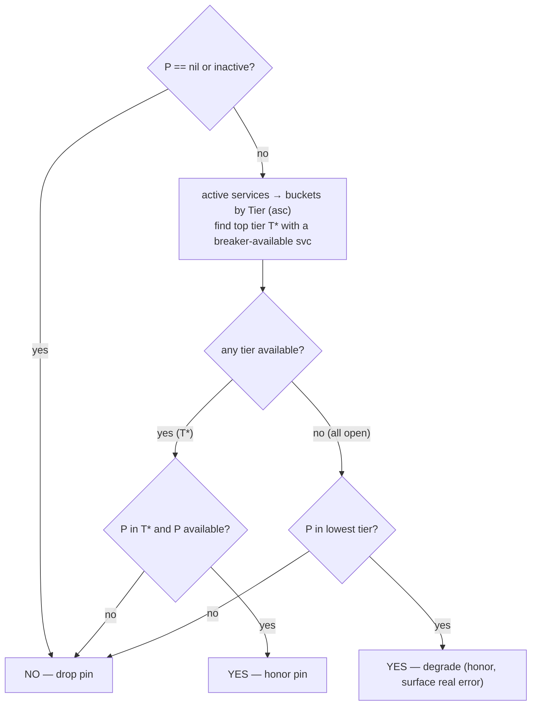

# Tier-Based Service Routing

Status: shipped (v1) on branch `claude/priority-service-routing-dIQfX`. Tracking commits: `a362ca3`, `5221109`. UX redesign on PR #1096 (`claude/dreamy-hawking-DQaYY`).

## Why

Existing routing in tingly-box treats every service in a rule as an equal peer. `random`, `token_based`, `latency_based`, `speed_based`, `adaptive`, `capacity_based` — all of them spread load across services. That is the right default for "I have several equivalent providers, share the load".

It is the wrong default for the other very common shape:

> "Use account A. If A is broken, use account B. Once A is healthy again, go back to A."

People with two Anthropic accounts (one primary, one as backup), or a cheap-and-fast model with an expensive fallback, or any home-rolled "direct + fallback" setup, were stuck:

- They could either include the backup in the pool (and have it pick up random traffic), or
- Mark it inactive and manually flip it on when the primary failed.

Neither is acceptable. We need first-class **direct + fallback**.

A second, related gap: when an upstream service starts failing, nothing in the box notices. Every request keeps trying the same broken service until the user disables it. We need a lightweight **circuit breaker** so the next request automatically uses the backup, and the next-after-next returns to the primary once it recovers.

## What this is not

- **Not** a cross-request load balancer rebalance — existing tactics stay intact and remain the default.
- **Not** a request-level retry loop. When a request fails mid-flight, the client still sees the error. Failover happens on the **next** request after the breaker trips. (Mid-request retry is parked as v2 — see "Future work".)
- **Not** a global health system. The breaker is process-local and rule- scoped through the service-id key; we deliberately avoided Redis-level shared state to keep the deployment story simple.

## How

### Two new concepts

1. **`Service.Tier int`** — a per-service number inside a rule. Lower = tried first. `0` is the **highest** priority tier (tried on every request); `1` is the first fallback, `2` the second, and so on.
2. **`TacticTier`** — a new `Tactic` value. When selected, the rule ranks services by `Tier` ascending and picks the lowest-numbered tier whose circuit breaker is closed.

### Selection algorithm

```
SelectService(rule):
  active = rule.GetActiveServices()
  buckets = group services by Tier, sorted ascending (0 first — highest priority)
  for each bucket (lowest tier number = highest priority first):
    candidates = services in bucket whose breaker allows a request
    if candidates is non-empty:
      return WithinTierTactic.pick(candidates)   # default: random
  // every tier is tripped — fall back to the top bucket (tier 0) regardless
  // so the upstream-error path can surface a real upstream error.
  return WithinTierTactic.pick(top bucket)
```

Three properties fall out:

- **Distinct tiers ⇒ pure failover.** Service at tier 0 is used until it fails; service at tier 1 takes over; once tier 0's breaker closes, the next request snaps back to it.
- **Tied tiers ⇒ load sharing within a tier.** Two services at tier 0 share traffic via the sub-tactic (random by default).
- **All tiers tripped ⇒ degrade, don't disappear.** Picking nothing would let the caller bypass the real upstream error message; picking the top tier (T0) guarantees the client sees the actual provider's 5xx / rate-limit text.

### Recovery

The breaker is a three-state machine (`Closed → Open → HalfOpen`):

- **Closed** — normal. `Allow()` returns true, failures are counted.
- **Open** — too many consecutive failures (`FailureThreshold`, default 3). `Allow()` returns false. After `OpenDuration` (default 30 s) the next `Allow()` call lazily flips to HalfOpen.
- **HalfOpen** — exactly one probe is permitted. Success → Closed, failure → Open with a fresh timer.

Recovery requires **no separate scheduler**. Selection re-evaluates the tier list every request, and the breaker's lazy state transition admits one probe naturally. Active probing was considered and rejected for v1 — for hot rules it's redundant, and for cold rules there is no one to serve anyway.

### Breaker threshold — why 3

`FailureThreshold = 3` = **3 consecutive failures**; any success resets the count. A request hits each
service at most once (the `tried` map), so for a tier primary "3 strikes" = 3 consecutive requests to it
failed.

Why 3? Failover hides the failure from the client (they still get a 200 from the next tier), so an early
trip is never a correctness problem — at worst a wasted hop until it trips, or 30 s of lost tier preference
if it trips too eagerly. So we can lean sensitive:

- **1** — trips on a single 500; one blip evicts the service for 30 s. Too twitchy.
- **8** — drags a dead service through many wasted attempts before evicting it.
- **3** — tolerates a blip or two, trips within 3 requests on sustained failure. A good middle.

The bigger limitation is the **consecutive-reset**, not the number. A service that fails *intermittently*
(say 30 % of the time) keeps getting reset by the successes in between, so it may never trip. The original
"sustained 500s" bug is the consecutive case (3 handles it); flapping is the gap — catching it needs a
rolling-window / error-rate trigger, at which point the exact number barely matters.

Tuning: move `FailureThreshold` and `OpenDuration` together (aggressive threshold + long open = frequent
mis-evictions). The right value depends on the upstream, so it's a natural per-rule config (Future work #4).

### Session affinity must respect tier priority

Session affinity (`Flags.SessionAffinity`) pins a session to the service it first landed on (prompt-cache continuity, etc.).

For tier rules this was buggy: `AffinityStage` ran **before** the tier strategy and honored the pin **without consulting the breaker**. So a session pinned to a fallback tier during a brief primary outage stuck there forever — the primary could recover and the session never came back ("configured t1 but auto-jumps to t2"; or a pinned-but-failing t2 that keeps 500ing instead of failing over).

Fix: the pin is honored only while the pinned service is one the strategy would pick *right now* — `typ.IsAffinityEligible`. It keys off **config shape, not tactic label** ("tier" is just the emergent shape of a multi-layer rule), so one check covers every shape:

- **one service** — always eligible (nothing else to pick).
- **one layer, many services** — eligible iff the pinned service's own breaker is available; a pin to a *dead peer* is dropped while healthy peers exist.
- **many layers** — eligible iff the pinned service is breaker-available *and* in the highest-priority tier that currently has any available service; a pin to a fallback tier is dropped once the primary recovers.

Decision flow (pinned service = `P`):



Notes:

- `available` = breaker closed or half-open, read via the non-consuming `IsAvailable` (never steals the half-open probe).
- On a drop, the strategy re-selects and `postProcess` re-pins — the failover layer is untouched.
- The pipeline runs **health → affinity → strategy**. `HealthFilter` only sees 429/auth, so the 500 signal comes straight from the breaker.
- The two "drop" cases (both are `P in T* and P available? → no`): **cross-tier demote** (a higher tier recovered, so P's tier is no longer T\*) and **within-tier dead peer** (P is in T\* but its own breaker is open while a peer is up).

### End-to-end flow: how the tactic switch actually takes effect

The "user moves a service card to a different tier" event has to cross five layers before it changes how the next API request is routed. Each layer is wired explicitly:

```
┌─ Frontend ───────────────────────────────────────────────────────────┐
│  TierNode up/down arrows → handleProviderTierChange                   │
│       ↓                                                               │
│  updateField('providers', updated)  ← service gets tier: 0 (T0)      │
│       ↓                                                               │
│  autoSave → pickLbTactic(record)                                      │
│             returns { type: 'tier',                                   │
│                       params: { within_tier_tactic: 'random' } }      │
│             whenever any service has a tier assigned                  │
│       ↓                                                               │
│  POST /api/v1/rule/:uuid  with body containing lb_tactic              │
└──────────────────────────────────────────────────────────────────────┘
                                  ↓
┌─ Backend deserialize ────────────────────────────────────────────────┐
│  rule/handler.go: ShouldBindJSON(&rule)                               │
│       ↓                                                               │
│  typ.Tactic.UnmarshalJSON (tactics.go):                               │
│    – TacticType.UnmarshalJSON parses "tier" → TacticTier              │
│    – switch on tc.Type allocates tc.Params = &TierParams{}            │
│    – aux.Params (raw bytes) unmarshalled into the TierParams          │
│       ↓                                                               │
│  config.UpdateRule(uid, rule)  → persisted to SQLite                  │
└──────────────────────────────────────────────────────────────────────┘
                                  ↓
┌─ Backend runtime: every LLM request ─────────────────────────────────┐
│  anthropic.go / openai.go / openai_responses.go / ... :               │
│       routingSelector.SelectService(c, scenario, rule, req)           │
│       ↓                                                               │
│  routing.SimpleSelector → ServiceSelector pipeline →                  │
│       LoadBalancerStage.Evaluate  (or SmartRoutingStage when matched) │
│       ↓                                                               │
│  Both stages call:                                                    │
│       lb.SelectService(&tempRule)        (load_balancer.go:55)        │
│       ↓                                                               │
│  load_balancer.go:92                                                  │
│       actualTactic := rule.LBTactic.Instantiate()                     │
│       ↓                                                               │
│  typ.Tactic.Instantiate → CreateTacticWithTypedParams(type, params)   │
│       case TacticTier → NewTierTactic(pp.WithinTierTactic)            │
│       ↓                                                               │
│  load_balancer.go:111                                                 │
│       actualTactic.SelectService(tempRule)                            │
│       ↓                                                               │
│  TierTactic.SelectService:                                            │
│    – groupServicesByTier(active) — ascending, tier 0 first            │
│    – for each bucket: collect svc where DefaultBreakerStore.Allow()   │
│    – first non-empty bucket → pickWithinTier(sub-tactic)              │
└──────────────────────────────────────────────────────────────────────┘
                                  ↓
┌─ Per-request feedback into the breaker ──────────────────────────────┐
│  Dispatch finishes → ProtocolRecorder:                                │
│       RecordResponse → loadbalance.RecordServiceSuccess(serviceID)    │
│       RecordError    → loadbalance.RecordServiceFailure(serviceID)    │
│  Same DefaultBreakerStore the selection logic consulted, so the next  │
│  request's TierTactic sees the updated state.                         │
└──────────────────────────────────────────────────────────────────────┘
```

The single transformation point that turns the JSON payload into live runtime behaviour is `Tactic.Instantiate()` at `internal/server/load_balancer.go:92`. Every dispatch path — Anthropic v1/Beta, OpenAI Chat/Responses/Embeddings/Images, Google, smart routing matches — funnels through `LoadBalancer.SelectService`, so the tactic switch is enforced uniformly with no per-protocol changes required.

This is pinned down by `TestTierRouting_EndToEnd` in `internal/server/priority_routing_e2e_test.go`, which:

1. Unmarshals a Rule JSON with `lb_tactic.type = "tier"`,
2. Asserts `LBTactic.Params` is a `*TierParams` after decode,
3. Calls `LoadBalancer.SelectService` and asserts the T0 service is picked,
4. Trips the breaker via `DefaultBreakerStore.RecordFailure` exactly as the recorder does,
5. Asserts the next pick falls back to T1,
6. Records a success and asserts the pick returns to T0.

### Wiring failures to the breaker

`ProtocolRecorder` already sees every success and failure of every upstream call. We added two lines:

- `RecordResponse(provider, model)` → `RecordServiceSuccess(serviceID)`
- `RecordError(err)` → `RecordServiceFailure(serviceID)`

The `serviceID` is computed from `provider.UUID + ":" + model`, matching the format `Service.ServiceID()` produces, so the breaker registry's keys line up exactly with the selection pool. **Zero changes** to the dispatch hot path were required.

### Frontend UX

The routing graph always renders tier rows, even when only one tier exists (T0 is always shown as a visual guide). Each row has a `TierNode` label on the left (`T0`, `T1`, …) and service cards on the right:

- `TierNode` shows a neutral badge (52 px wide, paper background, `text.secondary` label). Hovering it reveals a tooltip explaining what the tier means and how to move services.
- Each service card has **↑ / ↓ arrow buttons** that move it one tier up or down. The ↑ arrow is hidden on T0 services (can't go higher). ↓ always works and creates a new tier if none exists below.
- Services in the same tier share load via the sub-tactic (random by default).

The design choice here is **implicit mode activation**: assigning any service a tier flips the rule's `lb_tactic` to `tier` on save. No separate tactic-selector UI is exposed. Moving all services back to a single tier leaves the tactic as `tier` (consistent; the round-trip is safe).

Why implicit: tactic concepts are jargon for most users. "Move this service to a fallback tier" is concrete and matches a real intent ("I want this one only when the first fails"). The tactic switch is plumbing — it shouldn't be a separate question.

## Rule config shapes (taxonomy)

There is **no independent "tier mode"** in tingly-box — every routing behavior is emergent from the rule's config *shape*. A user assembles a rule out of services; the shape that assembly takes determines the strategy, the failover, and how affinity behaves. The frontend flips `lb_tactic=tier` purely as a consequence of shape (any `Service.Tier > 0`, see `frontend/src/components/rule-card/utils.ts` `pickLbTactic`/`hasTierAssigned`); routing code should reason about the shape and runtime state, not the tactic label.

### Primary structural grid — tiers × services-per-tier

`Service.Tier` (default `0`) groups services into layers; lower number = higher priority.

| Shape | Config | Strategy | Failover | Affinity (when enabled) |
|---|---|---|---|---|
| **A. Single** | 1 tier, 1 svc | none (direct) | none — single-svc bypass in `dispatchWithPriorityFailover` | trivial: always the one service |
| **B. Flat** | 1 tier, N svc | horizontal (`random`/`token_based`/`latency`/…) | among peers in the tier | honor pin iff the pinned peer's breaker is available; drop to a healthy peer if it is open |
| **C. Cascade** | M tiers, 1 svc each | `tier` (direct + fallback) | next tier down | follow the top available tier; return to the primary on recovery |
| **D. Grid** | M tiers, N svc each | `tier` + within-tier sub-tactic | within the tier, then the next tier down | top available tier; within it, per-peer stickiness |

### Orthogonal modifiers (multiply onto A–D)

- **Within-tier sub-tactic** (`TierParams.WithinTierTactic`) — only matters when a tier holds > 1 service.
- **Multi-model across services** (`Service.Model` is per-service) — valid; a cross-tier failover changes the model (the already-transformed body is reused, see **G2**).
- **Multi-API-style** (`Provider.APIStyle`) — failover is **same-API-style only** (`selectFallbackService` filters on `requireAPIStyle`).
- **Smart routing** (`SmartEnabled` / `SmartRouting[].Services`) — selects a service *subset* by request content; each subset is itself one of shapes A–D (with its own tiers).
- **Affinity** (`Flags.SessionAffinity`, seconds) — session stickiness, governed by `typ.IsAffinityEligible`.

### Runtime state that determines the actual pick

Config shape sets the *space* of choices; runtime state picks within it:

- **Breaker** per service (closed / open / half-open, process-wide `DefaultBreakerStore`) — drives tier demotion, the half-open recovery probe, and affinity eligibility. It is the authoritative signal for 5xx failures.
- **Active** flag — inactive services are excluded everywhere (`GetActiveServices`); `IsAffinityEligible` mirrors this (an inactive service must not make its tier look "available").
- **Health** (429 / auth) via `HealthFilter`/`HealthMonitor` — a *separate* signal from the breaker (5xx feed only the breaker), applied by the `HealthStage` filter.

### Affinity-eligibility truth table

What `typ.IsAffinityEligible(activeServices, P)` encodes for a pinned service `P` (it mirrors `TierTactic`'s bucket walk using the non-consuming `BreakerStore.IsAvailable`, so it never steals the half-open probe):

| Situation | Honor pin to P? |
|---|---|
| Single service | yes (always) |
| Flat, P breaker available | yes |
| Flat, P breaker open, a peer available | no → re-pin to a healthy peer |
| Cascade/Grid, P available **and** P.tier == top available tier | yes |
| Cascade/Grid, a higher tier has recovered (P sits below it) | no → re-pin up to the recovered tier |
| Every breaker open | yes iff P is in the lowest tier (degrade-don't-disappear) |
| P inactive | no (declined) |

On a decline the pipeline falls through to the strategy, which re-selects a currently-valid service, and `ServiceSelector.postProcess` re-pins the session there automatically.

### Known gaps (explicit)

- **G1 — horizontal tactics are breaker-blind.** Only `TierTactic` consults `DefaultBreakerStore`. `random`/`token_based`/`latency`/… select across the health-filtered set *ignoring the breaker*, so in the **Flat** shape a dead peer can still be re-selected at the selection layer (per-request failover still masks it from the client; affinity already drops the *pin* to a dead peer). *Deferred.* Surfaced as a `t.Skip` in `internal/server/lb_scenario_test.go` (`TestLBScenario_B_Flat_DeadPeerSelection_KnownGap`).
- **G2 — heterogeneous failover.** A fallback reuses the already-transformed request body and is restricted to the same `Provider.APIStyle`; mixing API styles (and, in practice, models) across tiers within one failover is constrained.
- **G3 — affinity is global-scope.** Affinity runs before smart routing on the union of all the rule's services (`selector.go` TODO); per-smart-rule affinity scoping is not implemented.

### Verifying shapes end-to-end

`internal/server/lb_scenario_test.go` is the scenario harness that drives the **full** path (selection → failover dispatch) against programmable fake upstreams over a request sequence, with a deterministic breaker clock (`loadbalance.SetClockForTest`). It covers each shape above plus the original sticky-affinity regression (trip → open → drop pin → recover → re-pin). Prefer extending it (rather than stage-level units alone) when changing routing/affinity/breaker behavior.

## Value

| Audience | Value delivered |
|---|---|
| Users with multiple equivalent accounts | First-class failover. Put the main account at T0, the backup at T1, walk away. |
| Users running cost-tiered providers | Same model with a cheap-then-expensive cascade. |
| Operators of any production rule | Free circuit breaking. Even users on the existing tactics get failure isolation as soon as they assign a single tier. |
| Anyone debugging | The recorder now reports per-service success/failure into the breaker, and the breaker state is exposed via `BreakerStore.Snapshot()` for future surfacing. |

The feature is **additive**: rules without explicit tiers behave exactly as before; the new tactic is opt-in via the UI.

## Comparison to claude-code-hub

A separate project (`ding113/claude-code-hub`) ships similar capability; we deliberately did **not** clone its design.

| Their design | Ours | Why we differ |
|---|---|---|
| Priority is global across the provider pool. | Tier is scoped to a rule's services. | Our rules already segment requests by model/scenario, so the rule is the natural tier boundary. Global tiers would conflict with our rule isolation. |
| Numeric priority + cost multiplier + weighted random inside a tier. | Numeric tier + sub-tactic (default random). | Rules typically hold ≤ 5 services. A user-tunable sub-tactic gives flexibility without forcing a second config field on everybody. |
| Per-user-group priority overrides. | Not implemented. | Users already express user-group-specific routing by having separate rules. Adding overrides would duplicate that mechanism. |
| Redis-shared breaker state. | In-memory, process-local. | Single-instance is the dominant deployment shape. Redis can be added later with no model changes — `BreakerStore` is an interface boundary. |
| Active probing scheduler for half-open. | Lazy half-open on next request. | Strictly simpler. Hot rules don't need it; cold rules don't matter. |
| Mid-stream retry across providers using deferred finalization. | Not implemented. | Pre-stream retry landed in v2 via the buffering wrapper (see "Mid-request failover" below). Mid-stream stays parked as v3. |
| 32 KiB "fake 200" body sniffing. | Not implemented. | Niche; revisit if we see real cases. |
| Dispatch simulator UI. | Not implemented. | Excellent idea, separable feature, v2. |

## Mid-request failover (v2 — landed)

Status: shipped in the follow-up branch `claude/priority-routing-retry-followup`.

v1 only handled cross-request failover: a request that failed returned the error to the client, and the *next* request used the fallback. v2 fixes that for the common pre-stream-failure case so the same request falls over silently.

**Where the wiring lives:** `internal/server/failover_dispatch.go`.

**How it works** — a layered hand-off, not a smart shim. Each layer owns one concern so a bug in one can't corrupt the whole pipeline:

1. **Producer** (the dispatch handler) writes its response — body or error — normally, exactly as it does without failover. The hot path still writes errors directly to `gin.ResponseWriter` (`SendErrorResponse`, `stream.SendForwardingError`, …) across 20+ call sites; none of them are aware of failover.
2. **`firstChunkGate`** is a passive, protocol-agnostic byte buffer wrapping `c.Writer`. It makes no decisions in its write path: writes land in memory until an explicit signal commits them. Crucially, **single-service requests skip the gate entirely** (`len(GetActiveServices()) <= 1`), so the common case never touches the buffer — zero blast radius.
3. **Orchestrator** (`dispatchWithPriorityFailover`) owns the retry decision. After each attempt it reads the gate's state:
   - `gate.Committed()` → the stream's first real chunk already reached the wire; retry is impossible, return.
   - else `gate.Status()` retryable (429, 500, 502, 503, 504) → `gate.Discard()`, pick the next tier via `selectFallbackService`, try again.
   - else (200, other 4xx, status 0) → terminal; the deferred `gate.CommitIfBuffered()` flushes the captured error to the client.
4. **Commit seam.** Streaming producers raise `CommitFirstChunk` on their first real chunk (centralised in `ProcessStream`/`StreamLoop`, plus the explicit `message_start` senders), which flushes captured headers + body and switches the gate to pass-through — preserving incremental delivery.
5. Budget caps at the number of active services so we never loop unbounded. The same service is never tried twice in one request (in-request `tried` map, complementary to the cross-request breaker). The recorder's bound provider is re-set before each attempt (`SetActiveService`), so a second-attempt failure trips the *second* service's breaker — not the first's.

### Streaming: priming the first event

A vanilla retry can't catch streaming pre-content failures because the OpenAI and Anthropic SDKs construct streams lazily — `wrapper.ResponsesNewStreaming(...)` returns a `*Stream` without issuing the HTTP request, so a 503 from the upstream only surfaces inside the first `stream.Next()` call. By that time the handler has already written SSE headers (`Content-Type: text/event-stream`, status 200) to the response.

Two pieces work together to make streaming retryable without losing incremental delivery once the stream is actually flowing:

1. **`ResponsesStreamIter` + `PrimeResponsesStream`** (`internal/protocol/stream/prime.go`). Right after the forwarder returns, dispatch calls `PrimeResponsesStream` which performs one `Next()` to force the lazy HTTP request and surface the upstream's real verdict. On failure the caller writes a regular 500 response (which the `firstChunkGate` captures and the orchestrator retries). On success the read event is wrapped in a `firstEventReplayStream` that replays it on the first iteration and then delegates to the SDK stream, so handlers keep their existing per-event loop unchanged. (This is unrelated to the circuit-breaker probe and to `client.ProbeResponsesStream`, which issues a separate synthetic health-check request — priming sends nothing extra, it just pulls the real stream's first event.)
2. **The commit seam.** `firstChunkGate` buffers everything until the producer signals its first real chunk via `CommitFirstChunk`, at which point captured headers + buffered body flush to the wire and subsequent writes pass straight through. For a prime-success streaming request the handler's `message_start` (or first `ProcessStream`/`StreamLoop` event) raises that signal, so the client sees output immediately. Once committed, retry is no longer possible — but by then we know the upstream has committed to delivering content.

**Scope constraints:**

- **First-chunk only.** Priming catches errors before any byte leaves the process. Once the first content event has been forwarded to the client, mid-stream failures still surface as SSE error events and cannot trigger failover — that would require buffering full responses or a more invasive stream reassembly pattern.
- **Pre-content failures are retryable on every streaming path.** Two mechanisms, applied uniformly: (1) the OpenAI Responses path uses `PrimeResponsesStream`, which forces the first `Next()` out-of-band and returns the error before the handler runs; (2) every other converter detects it in-line. Two pieces make the in-line route work: the stream loops (`StreamLoop` and `ProcessStream`) no longer flush when a step produced nothing — gin's `Flush()` calls `WriteHeaderNow()` and would otherwise lock in a 200 — and each converter emits a retryable 5xx via `SendStreamingError` when the stream errors with nothing written yet (`!c.Writer.Written()`, or `!messageStarted`). The `ProcessStream`-based passthroughs additionally had a `nextFunc` that checked `stream.Err()` *before* `Next()`, reporting a first-`Next()` error as a clean end; they now propagate the error after `Next()`. Either route lands a retryable status in the `firstChunkGate` without committing a 200 first. Once content is flowing, mid-stream failures still surface as SSE error events (no retry — see "First-chunk only").
- **Same API style only.** `selectFallbackService` filters out candidates whose `Provider.APIStyle` differs from the original. The transformed request body in `reqCtx` was built for the original provider's protocol; switching styles mid-request would feed a mismatched payload to the next upstream. Heterogeneous fallback (e.g. OpenAI → Anthropic within one rule) would need re-running the transform chain and is deferred.
- **Wired into:** `AnthropicMessagesV1Beta`, `AnthropicMessagesV1`, the OpenAI Chat handler, and the OpenAI Responses handler. Google and embeddings/images use a different code shape and can be added incrementally if real demand surfaces.

**What the user sees:** if the primary service hits a 429 or 5xx on this exact request, the request quietly switches to the next tier and the client gets the successful response — no error returned, no client-side retry needed. If every tier fails, the last upstream's error reaches the client untouched so the message is honest.

## Future work

1. **Mid-stream failover (v3)** — pre-content retry is in place on every streaming path; the remaining gap is reconnecting to the next tier after content has already started flowing. Needs response reassembly or protocol-aware "rewind" semantics; out of scope until users actually hit it.
2. **Heterogeneous fallback** — re-run the transform chain when the fallback provider has a different API style. Lifts the "same-style only" v2 constraint. (Related: the current fallback swaps provider only and reuses the original transformed body + model, so mixing different models across tiers in one rule isn't supported yet.)
3. **Active half-open probing** — opt-in goroutine that probes Open breakers on a cadence, useful for cold rules.
4. **Per-rule breaker thresholds** — currently process-wide defaults. Could be surfaced as a Rule-level config block.
5. **Failover decision log + UI** — the recorder already sees every success/failure attribution; surface "request X went to service A → fell back to B" in the system log page.
6. **Dispatch simulator** — read-only "explain plan" that shows which service a hypothetical request would land on. Particularly useful in combination with smart routing.

## File map

Backend
- `internal/loadbalance/load_balancing.go` — `Service.Tier`, `TacticTier` enum.
- `internal/loadbalance/breaker.go` — three-state breaker + store.
- `internal/loadbalance/breaker_test.go`
- `internal/typ/tactics.go` — `TierParams`, `TierTactic`, `groupServicesByTier`.
- `internal/typ/priority_tactic_test.go`
- `internal/server/protocol_recording.go` — recorder → breaker bridge.

Frontend
- `frontend/src/components/RoutingGraphTypes.ts` — `ConfigProvider.tier`, `ConfigRecord.lbTactic`.
- `frontend/src/components/rule-card/utils.ts` — `pickLbTactic`, `hasTierAssigned`.
- `frontend/src/components/rule-card/useRuleCardHooks.ts` — autosave round-trips `lb_tactic` and `tier`.
- `frontend/src/components/RuleCard.tsx` — `handleProviderTierChange`.
- `frontend/src/components/UnifiedRoutingGraph.tsx` — always renders tier layout; `TierNode` per row; up/down arrows on service cards.
- `frontend/src/components/nodes/TierNode.tsx` — `T0`/`T1`/… label node; hover tooltip explains tier semantics.
- `frontend/src/components/nodes/ServiceNode.tsx` — service card with ↑ / ↓ move buttons in tier layout.
