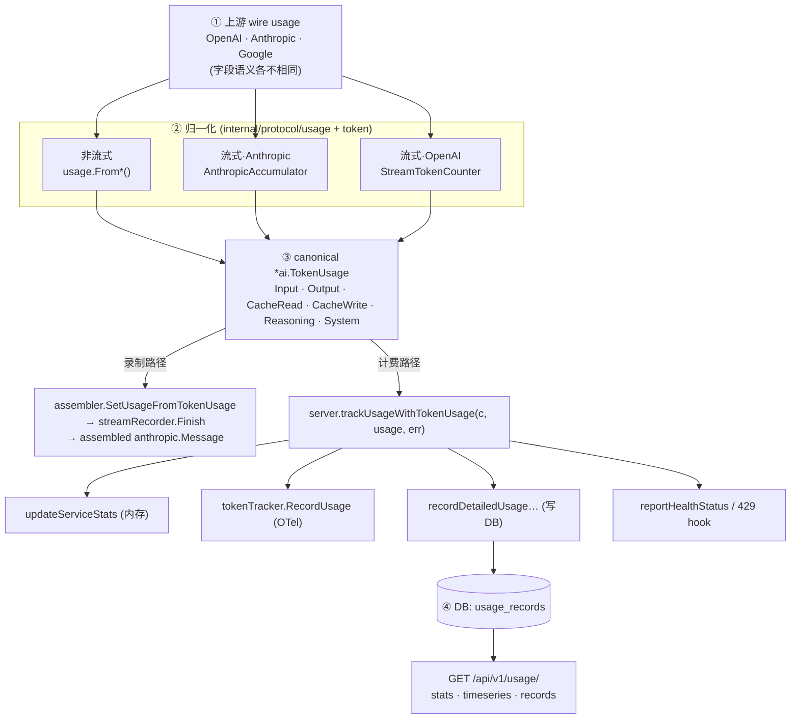

# Usage & Token Tracking

> 适用对象：tingly-box 后端贡献者，特别是改 `ai/protocol.go`（canonical type）、`internal/protocol/usage/`（normalization）、`internal/protocol/token/`（streaming counter）、`internal/protocol/stream/` + `internal/protocol/nonstream/`（converter）、`internal/protocol/assembler/`、`internal/server/usage_tracking.go` + `recording_hooks.go`、`internal/data/db/usage_record.go`、`internal/server/module/usage/`（API），或在 `vmodel/` 内增 mock 的人。
>
> 这份文档覆盖**整条 usage 通路**，不只 stream。原始 PR #1063（stream drain 修复）的 rationale 保留在 §8 历史。

---

## 0. 全局数据流（先看这个）

一句话：**上游各家 usage 先归一化成一个统一结构 `*ai.TokenUsage`，再一分为二——一条去「录制回放」，一条去「计费落库」。**

分四步：

1. **拿到上游 usage**（OpenAI / Anthropic / Google 的 wire 格式，字段语义各不相同）
2. **归一化**成 canonical `*ai.TokenUsage`——按「非流式 vs 流式」「哪家 provider」选不同提取器（详见 §2）
3. **分发**：同一个 `*ai.TokenUsage` 同时喂给两条下游路径
   - 录制路径 → 拼回一个完整的 `anthropic.Message`（用于回放 / 调试）
   - 计费路径 → `trackUsageWithTokenUsage` → 内存 stats / OTel / DB / 健康监控
4. **落库 + 对外**：DB `usage_records` → `GET /api/v1/usage/*`


```mermaid
flowchart TD
    A["① 上游 wire usage<br/>OpenAI · Anthropic · Google<br/>(字段语义各不相同)"]

    subgraph N ["② 归一化 (internal/protocol/usage + token)"]
        direction LR
        B1["非流式<br/>usage.From*()"]
        B2["流式·Anthropic<br/>AnthropicAccumulator"]
        B3["流式·OpenAI<br/>StreamTokenCounter"]
    end

    A --> B1
    A --> B2
    A --> B3
    B1 --> C
    B2 --> C
    B3 --> C

    C["③ canonical &nbsp;*ai.TokenUsage&nbsp;<br/>Input · Output · CacheRead · CacheWrite · Reasoning · System"]

    C -->|录制路径| D["assembler.SetUsageFromTokenUsage<br/>→ streamRecorder.Finish<br/>→ assembled anthropic.Message"]
    C -->|计费路径| E["server.trackUsageWithTokenUsage(c, usage, err)"]

    E --> E1["updateServiceStats (内存)"]
    E --> E2["tokenTracker.RecordUsage (OTel)"]
    E --> E3["recordDetailedUsage… (写 DB)"]
    E --> E4["reportHealthStatus / 429 hook"]

    E3 --> F[("④ DB: usage_records")]
    F --> G["GET /api/v1/usage/<br/>stats · timeseries · records"]
```

> 核心原则：**所有 provider 的 usage 先归一化成 `*ai.TokenUsage`，再往下游分发。** 归一化这一步只要哪个字段没拿全，后面录制和计费就一起缺字段——所以 §2 的字段语义是整条链路的地基。

---

## 1. Canonical type：`ai.TokenUsage`

定义见 `ai/protocol.go`。这是全链路唯一的流通货币——converter / recorder / tracker / DB 之间都传它，避免「每加一个字段就改一圈 `(int, int)` 签名」。

```go
type TokenUsage struct {
    InputTokens      int `json:"input_tokens"`                 // 输入/prompt，已扣除 cache read（仍含 cache write）
    OutputTokens     int `json:"output_tokens"`                // 输出/completion
    CacheReadTokens  int `json:"cache_read_tokens,omitempty"`  // cache read 命中（折扣的那半）
    CacheWriteTokens int `json:"cache_write_tokens,omitempty"` // cache write，⊂ InputTokens（溢价的那半）
    ReasoningTokens  int `json:"reasoning_tokens,omitempty"`   // o1/o3 reasoning，是 OutputTokens 的子集
    SystemTokens     int `json:"system_tokens,omitempty"`      // 模板/系统指令/框架开销
}
```

方法 / 工厂：

| 名称 | 作用 |
|---|---|
| `TotalTokens()` | `Input + Output`（**不含 cache**；cache 单独算成本） |
| `HasUsage()` | 任一 Input/Output/Cache/System > 0 |
| `HasCacheUsage()` | `CacheReadTokens > 0` |
| `NewTokenUsage(in, out)` | 基础 |
| `NewTokenUsageWithCache(in, out, cache)` | + cache |
| `NewTokenUsageWithCacheDetails(in, out, read, write)` | + cache 读写明细 |
| `NewTokenUsageFull(in, out, cacheRead, cacheWrite, reasoning)` | 全字段 |
| `ZeroTokenUsage()` | 零值，用于「无 usage」回退 |
| `ToAnthropicUsageMap()` / `ToAnthropicMessageDeltaUsageMap()` | 从 canonical usage 生成 Anthropic wire usage map |
| `ToOpenAIChatUsageMap()` / `ToOpenAIResponsesUsageMap()` | 从 canonical usage 还原 OpenAI wire usage map（input/prompt 含 cache） |
| `UncachedInputTokens()` | `InputTokens` 去掉写入部分 = Anthropic wire 的 `input_tokens` |
| `PromptTotalTokens()` | `Input + Cache` = OpenAI wire 的 `prompt_tokens` |

> **wire usage map 只能由这些方法产出。** 之前每个 converter 各自手搓 `prompt_tokens_details`，加一个字段要改 9 处，漏一处就是静默少算一个计费维度。converter 若需微调（如 `total_tokens` 用上游原值），在返回的 map 上覆盖那一个键，不要 fork 整个构造。

> ⚠️ `CacheReadTokens` 仅代表 **cache read 命中**。Write 成本（Anthropic `cache_creation_input_tokens` / OpenAI `cache_write_tokens`）**已并入 `InputTokens`**，两家归一化后语义一致。所以 `CacheWriteTokens ⊂ InputTokens`——**不要**把它再加进任何总量，否则重复计数。
>
> 📛 **命名**：这个字段以前叫 `CacheInputTokens`，且和一个同义的 `CacheReadTokens` 并存。缓存只有一笔账时"input"尚可含混，有了 write 就成了命名碰撞。现已收敛为单一的 `CacheReadTokens`（对外 JSON `cache_read_tokens`）。DB 物理列名仍是 `cache_input_tokens`——改名要 ALTER 三张表却换不来任何行为收益，因此只在 GORM tag 上钉住，原始 SQL 用 `as cache_read_tokens` 别名对齐。

---

## 2. 归一化层：`internal/protocol/usage/`

各 provider 上报 token 的语义互不兼容，必须先归一化，否则前端 cache-hit 公式算不对：

```
cache_hit_ratio = CacheReadTokens / (InputTokens + CacheReadTokens)
```

| Provider | wire 语义 | 归一化后 InputTokens | 归一化后 CacheReadTokens | 归一化后 CacheWriteTokens |
|---|---|---|---|---|
| **OpenAI Chat / Responses** | `prompt_tokens` = 总数（含 cached **和** cache_write） | `prompt_tokens − cached_tokens` | `cached_tokens` | `cache_write_tokens` |
| **Anthropic** | `input_tokens` = 仅未命中；`cache_creation_input_tokens` = 写入成本 | `input_tokens + cache_creation_input_tokens` | `cache_read_input_tokens` | `cache_creation_input_tokens` |

> **为什么写入成本要留在 input 里？** 写入按（更贵的）写入价计费，属于「本次 prompt 总花费」，要进分母；read 命中是省下来的，单独放 cache。两家 wire 形态不同（OpenAI 是减法、Anthropic 是加法），但归一化后 `InputTokens` 都是「未命中 + 写入」，`CacheWriteTokens` 都是它的子集明细。

### 2.1 每个值：含义 · 包含关系 · 计算 ⭐

> **最容易踩坑的点**：子字段到底**有没有被父字段包含**？
> - **OpenAI 是减法**：`cached` / `reasoning` 都是父字段（`prompt_tokens` / `completion_tokens`）的**子集**，归一化要**减出来**，否则重复计数。
> - **Anthropic 是加法**：`cache_creation` / `cache_read` 与 `input_tokens` **并列、互不重叠**，归一化要把 creation **加进去**。
>
> 搞反方向 → 要么重复计数，要么漏算。下面每个字段的「包含关系」列就是关键。

#### OpenAI（Chat & Responses 同构，仅字段名不同）

| wire 字段（Chat / Responses） | 含义 | 包含关系 |
|---|---|---|
| `prompt_tokens` / `input_tokens` | 本次 prompt 的**全部** input | 父字段，**已含** cached **与** cache_write |
| `prompt_tokens_details.cached_tokens` / `input_tokens_details.cached_tokens` | 其中命中 prompt cache 的部分（读，折扣价） | ⊂ `prompt_tokens` 的**子集** |
| `prompt_tokens_details.cache_write_tokens` / `input_tokens_details.cache_write_tokens` | 其中写入 prompt cache 的部分（gpt-5.6+，1.25× input 价） | ⊂ `prompt_tokens` 的**子集**，与 `cached_tokens` **不重叠** |
| `completion_tokens` / `output_tokens` | 本次**全部** output | 父字段，**已含** reasoning |
| `completion_tokens_details.reasoning_tokens` / `output_tokens_details.reasoning_tokens` | 其中思考（o1/o3）消耗 | ⊂ `completion_tokens` 的**子集** |

归一化计算（`FromOpenAIChatCompletion` / `FromOpenAIResponses`）：

```
InputTokens      = prompt_tokens − cached_tokens   // 只减 read；write 留在 input 里（它要按写入价计费）
CacheReadTokens = cached_tokens                    // 命中缓存（读）
CacheWriteTokens = cache_write_tokens               // 写入缓存，⊂ InputTokens，仅作计费明细
OutputTokens     = completion_tokens                // 原样保留（reasoning 仍含在内，不减）
ReasoningTokens  = reasoning_tokens                 // 仅作展示，是 Output 的子集，下游不再相加
```

> ⚠️ **不要**从 `InputTokens` 里再减掉 `cache_write_tokens`。减掉会让 `Input + Cache ≠ prompt_tokens`，破坏 §2.1 末尾的不变量，也会把「写入」这笔真实开销从分母里抹掉。
>
> 单测佐证（`usage_test.go`）：`prompt=200, cached=50, write=40, completion=80, reasoning=30` → `Input=150, Output=80, Cache=50, CacheWrite=40, Reasoning=30`。注意 reasoning **没有**从 output 里减掉，cache_write 也**没有**从 input 里减掉。

#### Anthropic（v1 & beta 同构）

| wire 字段 | 含义 | 包含关系 |
|---|---|---|
| `input_tokens` | **仅未命中缓存**的 input | 不含任何 cache |
| `cache_creation_input_tokens` | 本次**写入**缓存的 token（按写入价计费） | 与 input **并列**，独立不重叠 |
| `cache_read_input_tokens` | 本次**命中读取**缓存的 token（便宜） | 与 input **并列**，独立不重叠 |
| `output_tokens` | 本次**全部** output | **已含** thinking，无独立 reasoning 字段 |

归一化计算（`FromAnthropicMessage` / `FromAnthropicBetaMessage`）：

```
InputTokens      = input_tokens + cache_creation_input_tokens  // 写入成本并进 input（进分母）
CacheReadTokens = cache_read_input_tokens                      // 命中缓存（读）
CacheWriteTokens = cache_creation_input_tokens                  // 写入明细，⊂ InputTokens
OutputTokens     = output_tokens                                // thinking 已含在内
ReasoningTokens  = 0                                            // Anthropic 不单列 reasoning
```

> 单测佐证：`input=100, creation=900, read=800, output=50` → `Input=1000, Cache=800, Output=50`。

#### 归一化后的不变量（两侧统一）

不管哪个 provider，归一化完都满足：

```
本次 prompt 总量 = InputTokens + CacheReadTokens
cache_hit_ratio = CacheReadTokens / (InputTokens + CacheReadTokens)
TotalTokens()   = InputTokens + OutputTokens          // ⚠️ 不含 cache —— cache 单独计费，不进 total
CacheWriteTokens ≤ InputTokens                        // 明细字段，已被 InputTokens 覆盖，不再单独相加
```

`CacheReadTokens` 在两侧统一只表示**缓存读命中**那部分；两家的写入成本（Anthropic `cache_creation`、OpenAI `cache_write_tokens`）都被并进 `InputTokens`，并同时记在 `CacheWriteTokens` 供计费拆分。

#### 一个对照例子

同一个请求语义（200 未命中 input + 50 缓存写入 + 800 缓存读命中 + 500 output），两家 wire 形态不同，**归一化后结果一致**：

| 维度 | OpenAI wire | Anthropic wire | → 归一化 |
|---|---|---|---|
| input 父字段 | `prompt_tokens = 1050`（含 cached + write） | `input_tokens = 200`（不含任何 cache） | — |
| cache 写入 | `cache_write_tokens = 50`（子集） | `cache_creation = 50`（独立） | `CacheWriteTokens = 50` |
| cache 读命中 | `cached_tokens = 800`（子集） | `cache_read = 800`（独立） | `CacheReadTokens = 800` |
| output | `completion_tokens = 500` | `output_tokens = 500` | `OutputTokens = 500` |
| **InputTokens** | `1050 − 800 = 250` | `200 + 50 = 250` | **250** |

> OpenAI 减法、Anthropic 加法，落点相同：`InputTokens` 都等于「未命中 200 + 写入 50」。gpt-5.6 之前的 OpenAI 模型不上报 `cache_write_tokens`（写入免费），此时 `CacheWriteTokens = 0`，退化成旧行为。

### 2.2 非流式：纯函数（`extract.go`）

```go
usage.FromOpenAIChatCompletion(resp.Usage) // openai.CompletionUsage
usage.FromOpenAIResponses(resp.Usage)      // responses.ResponseUsage
usage.FromAnthropicMessage(resp.Usage)     // anthropic.Usage  (v1)
usage.FromAnthropicBetaMessage(resp.Usage) // anthropic.BetaUsage
```

OpenAI 侧：`InputTokens = prompt − cached`，cache read / cache write / reasoning 直接读 details。
Anthropic 侧：`InputTokens = input + cache_creation`，`CacheReadTokens = cache_read`，`CacheWriteTokens = cache_creation`，无 reasoning。

反向（`*TokenUsage` → wire）：

```go
usage.ChatUsage(u) // → openai.CompletionUsage：PromptTokens = Input + Cache（还原成总数），
                   //   CachedTokens / CacheWriteTokens / ReasoningTokens 填回 details
```

### 2.3 流式 Anthropic：`AnthropicAccumulator`（`accumulator.go`）

Anthropic 把 usage 拆在两个事件里：

- `message_start` → `input_tokens` / `cache_creation_input_tokens` / `cache_read_input_tokens`
- `message_delta` → `output_tokens`（个别非标准 provider 也在这里塞 `input_tokens`）
- **协议转换特例**：OpenAI → Anthropic 这类转换在流开始时拿不到权威 input usage，只能在上游终态事件拿到完整 usage；因此终态 `message_delta.usage` 可以携带完整 normalized usage（`input_tokens` / `output_tokens` / `cache_read_input_tokens`），这是为了保持对外 SSE、录制与计费同源一致。

```go
acc := usage.NewAnthropicAccumulator()
// 事件循环里，每个事件都喂（只有 usage-carrying 事件有效）：
acc.Consume(&evt)     // MessageStreamEventUnion（非 beta）
acc.ConsumeBeta(&evt) // BetaRawMessageStreamEventUnion（beta）
// 收尾：
if acc.HasUsage() { return acc.Result(), nil }
return protocol.ZeroTokenUsage(), nil
```

优先级（`consumeRaw`）：

- **Input**：`message_start` 优先，回退 `message_delta`；每个来源还有 SDK 字段 + gjson raw 两条路（非标准 provider 兜底，仅非 beta 需要 gjson，beta 的 SDK 字段可靠）
- **Output**：只看 delta
- **Cache read**：`message_start` 优先，回退 delta，单独存 `cacheTokens`
- **Cache creation**：直接 `+=` 进 `inputTokens`（归一化，见上）

### 2.4 流式 OpenAI：`StreamTokenCounter`（`internal/protocol/token/`）

OpenAI 流不像 Anthropic 那样在 `message_start` 给 input，所以用**增量 tiktoken 估算 + 尾 usage chunk 校正**双轨：

```go
type StreamTokenCounter struct {
    inputTokens, outputTokens int   // 本地 tiktoken 估算
    upstreamInputTokens       int64 // 尾 usage chunk: prompt_tokens
    upstreamOutputTokens      int64 // 尾 usage chunk: completion_tokens
    upstreamCacheTokens       int64 // prompt_tokens_details.cached_tokens
    upstreamCacheWriteTokens  int64 // prompt_tokens_details.cache_write_tokens (gpt-5.6+)
    upstreamReasoning         int64 // completion_tokens_details.reasoning_tokens
}
```

`ConsumeOpenAIChunk(chunk)`：
- chunk 带 usage（通常是 `stream_options.include_usage=true` 的**尾 usage-only chunk**，`choices` 为空）→ 抓权威 input/output/cache read/cache write/reasoning，**覆盖**本地估算
  - SDK 的 `JSON.Usage.Valid()` 会漏掉部分合法情况，所以同时接受 `PromptTokens>0 || CompletionTokens>0` 作为「usage 存在」的证据
- 否则 → 对每个 delta（content / refusal / tool_call name+args / 旧式 function_call）增量 tiktoken 累加 output

取数：
- `GetCounts() → (input, output)`：有上游就用上游，`input = upstreamInput − upstreamCache`（只减 read，写入留在 input 里）
- `GetUpstreamDetails() → (cacheRead, cacheWrite, reasoning)`：上游 usage chunk 里抓到的三个明细（没有则 0）

tiktoken：默认 `O200kBase`；流前用 `EstimateInputTokensSimple(req)`（`len/4` 近似）预置 input——**不要**在流式热路径用精确 BPE 的 `EstimateInputTokens`：agentic 客户端每轮携带全量上下文（MB 级），tiktoken 的 regexp2 切分会产生远超输入体积的瞬时分配，是 OOM 峰值来源之一（#1255）；该预置值只用于 message_start 占位与上游无 usage 时的回退。`countTokens` 失败回退 `len(text)/4`。Anthropic 侧另有 `EstimateAnthropicTokens`。

---

## 3. Converter 覆盖矩阵

> 新增 converter 时，对照这张表确认 usage 通路接上了，并按 §10 的「提前 return / 字段映射不全」两条标准自查。

### 3.1 `internal/protocol/nonstream/`

| Handler | 提取器 |
|---|---|
| `HandleOpenAIChatNonStream` | `usage.FromOpenAIChatCompletion` |
| `HandleOpenAIResponsesNonStream` | `usage.FromOpenAIResponses` |
| `HandleAnthropicV1NonStream` | `usage.FromAnthropicMessage` |
| `HandleAnthropicV1BetaNonStream` | `usage.FromAnthropicBetaMessage` |
| `nonstream/anthropic_to_openai.go` | inline（返回 wire `map[string]interface{}`，不是 `*TokenUsage`） |
| `nonstream/openai_to_anthropic.go` | inline（同上）；reasoning 在 Anthropic 无对等字段 |

### 3.2 `internal/protocol/stream/`

| Handler / converter | 机制 |
|---|---|
| `HandleAnthropic` | `AnthropicAccumulator.Consume` |
| `HandleAnthropicBeta` | `AnthropicAccumulator.ConsumeBeta` |
| `AnthropicToOpenAIStreamWithMCPHooks`（`anthropic_to_openai*.go`） | `AnthropicAccumulator.ConsumeBeta`；`Usage()` 返回 `acc.Result()` |
| `HandleAnthropicBetaToOpenAIResponsesStream` | `AnthropicAccumulator.ConsumeBeta` |
| `openAIToAnthropicConverter`（`openai_to_anthropic_converter.go` + `_beta`） | `StreamTokenCounter`；`Usage()` 返回 `NewTokenUsageFull(in, out, cacheRead, cacheWrite, reasoning)` |
| `openai_passthrough.go` | `chunkHasUsage` + `FromOpenAIChatCompletion`；Responses 侧走 gjson；估算 fallback 注入 |
| `openai_chat_to_responses_converter.go` | `chunkHasUsage` + `FromOpenAIChatCompletion`；`state` 字段双用（同时拼 wire body） |
| `openai_responses_to_chat_converter.go` | `FromOpenAIResponses`；终态复用 `chatStreamUsageWire`，只覆盖 `total_tokens` |
| `google_to_any.go` | inline：Google SDK 无结构化 cache 子字段 |

OpenAI→Anthropic converter 的终态收口在 `emitTerminalEvents()`：从 counter 同步 `GetCounts()` + `GetUpstreamDetails()` 写进 `state`，再发 `message_delta` / `message_stop`，并打一条 **Debug** 总览日志（见 §10）。

### 3.3 `internal/server/`（dispatch 层）

| 代码点 | 提取器 |
|---|---|
| `protocol_dispatch` — Anthropic Beta 非流式（×2） | `FromAnthropicBetaMessage` |
| `protocol_dispatch` — Responses → Anthropic Beta | `FromAnthropicBetaMessage` |
| `protocol_dispatch` — OpenAI Chat 非流式（×2） | `FromOpenAIChatCompletion` |
| `protocol_dispatch` — OpenAI Responses 非流式（×2） | `FromOpenAIResponses` |
| `anthropic_message_v1` — Responses → Anthropic v1 | `FromOpenAIResponses` |
| `anthropic_message_beta` — Responses → Anthropic Beta | `FromOpenAIResponses` |
| `protocol_dispatch` — Google 非流式 | inline（Google schema 无 cached） |

---

## 4. 录制链：Assembler + Recorder

录制路径（PR 回放 / 日志）和计费路径并行，同样以 `*ai.TokenUsage` 为货币。

### 4.1 `AnthropicStreamAssembler`（`internal/protocol/assembler/anthropic_assembler.go`）

把流式事件攒成一个完整的 `anthropic.Message`。

- `RecordV1Event` / `RecordV1BetaEvent`：处理 `message_start`（msgID/role）、`content_block_*`（攒 text/thinking/tool input）、`message_delta`（stop_reason + 若带 usage 则存 `usageData`，**含 `CacheReadInputTokens`**）
- `SetUsage(in, out)`：原始计数（简单入口，优先用下面那个）
- `SetUsageFromTokenUsage(u *ai.TokenUsage)`：canonical 入口
  - `UncachedInputTokens() → anthropic.Usage.InputTokens`（**注意不是 `InputTokens` 直传**：canonical 把写入成本折进了 `InputTokens`，而 Anthropic wire 的 `input_tokens` 不含它，直传会和下一行一起把写入计两次）
  - `OutputTokens → anthropic.Usage.OutputTokens`
  - `CacheReadTokens → anthropic.Usage.CacheReadInputTokens`
  - `CacheWriteTokens → anthropic.Usage.CacheCreationInputTokens`
  - `ReasoningTokens` 丢弃（Anthropic 无对应字段，已计入 output）
- `Finish(model, in, out) → *anthropic.Message`：有 `SetUsage*` 数据就用它，否则回退入参

### 4.2 `streamRecorder`（`internal/server/recording_hooks.go`）

```go
type streamRecorder struct {
    recorder        *ProtocolRecorder
    assembler       *assembler.AnthropicStreamAssembler
    inputTokens, outputTokens, cacheReadTokens int  // RecordRawMapEvent 兜底用
    hasUsage        bool
}

func (sr *streamRecorder) Finish(model string, usage *protocol.TokenUsage)
```

- `Finish(model, usage)`：usage 非空就 `assembler.SetUsageFromTokenUsage(usage)` + `assembler.Finish(model, usage.Input, usage.Output)`；usage 为 nil/zero 但 `RecordRawMapEvent` 攒到过 → 用内部兜底计数
- `RecordRawMapEvent(type, event)`：把 SSE 事件喂给 assembler + recorder chunk log；遇 `message_delta` 抽 input/output/cache_read 更新内部计数，置 `hasUsage`
- `AttachRecorderHooks(...)`：把 `ProtocolRecorder` 接进原生 Anthropic 流，装 `WithOnStreamEvent`（镜像到 recorder + assembler）/ `WithOnStreamComplete`（`asm.Finish` + `recorder.RecordResponse`）/ `WithOnStreamError`

---

## 5. 计费 / observability 层：`internal/server/usage_tracking.go`

两个入口：

### 5.1 `trackUsageWithTokenUsage(c, usage *TokenUsage, err)` —— 首选

完整字段（cache / reasoning / system）都走这条。流程：

1. `GetTrackingContext(c)` 取 rule / provider / model / requestModel / scenario / streamed / startTime（任一缺失或 `usage==nil` 直接 return）
2. 算 latency、status（success / error / canceled）、errorCode
3. 打一条 **Debug** `"trackUsage: token usage recorded"`，带 `input/output/cache/cache_write/reasoning/system/total_tokens` + status/streamed/latency
4. `detectCacheHit(usage)` → `SetCacheHit(c, …)`；算 `TTFT` / `TPS`
5. 分发：
   - `updateServiceStats(rule, provider, model, MetricsData{...})`（内存 stats）
   - `tokenTracker.RecordUsage(ctx, UsageOptions{... CacheReadTokens, CacheWriteTokens, SystemTokens ...})`（OTel；`cache_write` 是新增的 token_type，`recordTokens` 对 0 值早退，所以不上报写入的通道不会产生空 timeseries）
   - `recordDetailedUsageWithTokenUsage(...)`（写 DB，见 §6）
   - `reportHealthStatus(...)`；429 时 enterprise 限流告警 hook

`MetricsData`：`InputTokens / OutputTokens / LatencyMs / TTFTMs / CacheHit / TPS`。

### 5.2 `trackUsageFromContext(c, inputTokens, outputTokens, err)` —— 旧式 2-int 入口

只有 input/output 的简化路径（cache/reasoning/system 会丢）。新代码尽量用 §5.1。

> 日志层级：入口诊断 = **Trace**；usage 总览 = **Debug**；health / 429 = **Warn**。（早期文档把 stream 总览写成 Info —— 已统一降到 Debug，见 §8.4 / §10。）

---

## 6. 持久化：`internal/data/db/usage_record.go`

### 6.1 模型

`UsageRecord`（表 `usage_records`，逐条记录）：

| 列 | 说明 |
|---|---|
| `provider_uuid` / `provider_name` / `model` / `request_model` | 路由维度 |
| `scenario` / `rule_uuid` | 场景 / 规则 |
| `user_id` | 多租户（`not null; default ''`，迁移见下） |
| `timestamp` | 索引（含 `idx_timestamp_scenario`） |
| `input_tokens` / `output_tokens` / `total_tokens` | `total = input + output` |
| `cache_input_tokens` | cache **read** 命中（`default 0`；列名是历史称呼，Go 侧字段叫 `CacheReadTokens`，靠 GORM tag 钉住） |
| `cache_write_tokens` | cache **write**（`default 0`；⊂ `input_tokens`，不另计入 total） |
| `system_tokens` | 框架开销（`default 0`） |
| `status` / `error_code` | success / error / partial / canceled |
| `latency_ms` / `ttft_ms` / `streamed` | 性能 |

聚合表：`UsageDailyRecord`（`usage_daily`）、`UsageMonthlyRecord`（`usage_monthly`）——`RequestCount / TotalTokens / Input / Output / CacheReadTokens / CacheWriteTokens / SystemTokens / ErrorCount`，按 `date(timestamp)` 或 `year/month` SUM。`usage_monthly` 目前只建表、无写入方。

### 6.2 Schema 迁移（`ensureUsageRecordSchema`）

dev-stage 破坏式清理，按存在性条件执行：

1. **删 `department_id`**：废弃维度
2. **合并 cache 列**：`cache_input_tokens = COALESCE(cache_creation_input_tokens,0) + COALESCE(cache_read_input_tokens,0)`，然后 DROP 掉那两列 —— 这就是 §1 里「合并单字段」的来历
3. **回填 `user_id`**：空 / NULL → `DefaultAdminUserID`（`"admin"`），兼容多租户之前的旧记录

### 6.3 查询

- `GetAggregatedStats(UsageStatsQuery)`：`groupBy ∈ {model, provider, scenario, rule, user, daily, hourly}`
- `GetTimeSeries(interval ∈ {minute, hour, day, week}, start, end, filters)`
- `GetRecords(start, end, filters, limit, offset)`：分页逐条

---

## 7. 对外 API：`internal/server/module/usage/`

| 路由 | 用途 |
|---|---|
| `GET /api/v1/usage/stats` | 聚合统计；`groupBy` + `filterBy`（provider/model/scenario/rule_uuid/user_id/status）+ `sortBy`（total_tokens/request_count/avg_latency） |
| `GET /api/v1/usage/timeseries` | 时间序列；`interval` + 同款 filter |
| `GET /api/v1/usage/records` | 逐条记录（分页） |
| `DELETE /api/v1/usage/records` | 删 `older_than_days` 之前的记录 |

响应模型（`types.go`）：`UsageStatsResponse{Meta, []AggregatedStat}` / `TimeSeriesResponse{Meta, []TimeSeriesData}` / `UsageRecordsResponse{Meta, []UsageRecordResponse}` / `DeleteOldRecordsResponse{deleted_count, cutoff_date}`。

`AggregatedStat`：`Key / Provider* / Model / Scenario / UserID / RequestCount / TotalTokens / Input / Output / CacheReadTokens / AvgInput / AvgOutput / AvgLatencyMs / ErrorCount / ErrorRate / StreamedCount / StreamedRate`。

---

## 8. 历史：PR #1063 的 stream drain 修复

> **Status: shipped** in PR #1063 on `claude/keen-ramanujan-qUaXP`。下面是当时修的几个 bug 与设计取舍——大部分代码后来被重构进 §2/§3 的 converter 抽象，但 rationale 仍有参考价值。

### 8.1 改动前的 bug

- **OpenAI 尾 usage chunk 被丢**：旧 `handleOpenAIToAnthropicStreamResponse` 收到 `finish_reason` 立刻 `return false`，而 OpenAI 的 usage-only chunk（`choices:[]`）**晚于** finish chunk 到达，于是权威 input/output/cache/reasoning 全丢，只剩本地 tiktoken。
- **反向只搬基础字段**：`anthropic_to_openai` 抽 `message_delta.usage` 只读 input/output，`cache_read` 静默丢。
- **streamRecorder 截胡 cache**：`Finish(model, in, out)` 只接 input/output，assembled message 的 `CacheReadInputTokens=0`。
- **缺 Info 级总览**：当时想加一条每请求一次的 usage 总览。

### 8.2 设计：drain 到底再发终态

`finish_reason` chunk 不再立刻 `return false`，只记 `pendingFinishReason`；`choices` 为空的尾 usage chunk 喂进 token counter；流自然结束后在 post-loop 读最终 counter，发 stop / message_delta / message_stop。

> 这套逻辑现在落在 `openAIToAnthropicConverter.processChunk` + `emitTerminalEvents`（§3.2），不再是单个大函数。

### 8.3 当时引入、现已成为基础设施的部分

- `StreamTokenCounter.GetUpstreamDetails()`（cache + reasoning）→ §2.4
- `anthropic_to_openai` 映射 `cache_read → prompt_tokens_details.cached_tokens` → §3.2
- `streamRecorder.Finish(model, *TokenUsage)` + `assembler.SetUsageFromTokenUsage` → §4

### 8.4 ⚠️ 与当前实现的差异

原 PR 设计的「**Info 级** `OpenAI->Anthropic stream usage` 总览」——当前代码是 **Debug 级**（`openai_to_anthropic_converter.go:301`，`emitTerminalEvents` 里 `logrus.Debugf`）。`trackUsage` 总览同为 Debug。线上看 token 分布需开 Debug，不是 Info。

实际日志：

```
level=debug msg="OpenAI->Anthropic stream usage: model=... in=42 out=17 cache=11 reasoning=9 stop=stop"
```

---

## 9. vmodel 测试基建

PR #1063 顺手补的端到端 usage 开关，沿用至今。

### 9.1 `MockUsage`（`vmodel/defaults_shared.go`）

```go
type MockUsage struct {
    PromptTokens      int64
    CompletionTokens  int64
    CachedInputTokens int64 // OpenAI cached_tokens / Anthropic cache_read
    CacheWriteTokens  int64 // Anthropic cache_creation / OpenAI cache_write_tokens
    ReasoningTokens   int64 // OpenAI only
}
```

> `CacheWriteTokens` 两侧共用：Anthropic 渲染成 `cache_creation_input_tokens`，OpenAI 渲染成 `prompt_tokens_details.cache_write_tokens`（Chat）/ `input_tokens_details.cache_write_tokens`（Responses）——同一笔溢价写入成本的两个 wire 名字。字段名取协议中立的措辞，与同结构的 `CachedInputTokens` 一致。

两个协议的 `MockModelConfig` 都加 `Usage *vmodel.MockUsage`。

### 9.2 `UsageEvent` + virtualserver 渲染

`vmodel/openai/stream.go` / `vmodel/anthropic/stream.go` 各加 `UsageEvent{Usage MockUsage}`，在 `DoneEvent` 前 emit。virtualserver 渲染：

- **OpenAI**：`finish_reason` chunk 后、`[DONE]` 前发尾 usage-only chunk，填 `PromptTokensDetails.CachedTokens` / `CompletionTokensDetails.ReasoningTokens`
- **Anthropic**：`message_stop` 前发 `message_delta`，带 `input/output/cache_read/cache_creation/reasoning`

### 9.3 opt-in 注册（故意不进 `RegisterDefaults`）

```go
openaivm.RegisterStreamTestMocks(svc.GetOpenAIRegistry())
anthropicvm.RegisterStreamTestMocks(svc.GetAnthropicRegistry())
```

生产 registry / 用户面 demo 列表保持干净（见 `defaults_shared.go` doc-comment：「Test-only fixtures must NOT be added to SharedDefaultMocks.」）。

| ID | 类型 | 用途 |
|---|---|---|
| `virtual-stream-test` | static text | 完整 usage shape on text 路径 |
| `virtual-stream-test-tool` | tool_call | 完整 usage shape on tool 路径 + `stop_reason=tool_use` |

固定数值（Prompt=42, Completion=17, Cached=11, CacheCreation=5, Reasoning=9），断言端硬编码。

### 9.4 测试落点

| 测试 | 覆盖 |
|---|---|
| `vmodel/virtualserver/stream_test_mocks_test.go` | 两协议 wire 格式（OpenAI 尾 usage chunk、Anthropic message_delta.usage），static + tool |
| `stream/openai_to_anthropic_vmodel_e2e_test.go::TestOpenAIToAnthropicStream_VModelFullUsage` | OpenAI→Anthropic 完整链路：vmodel 上游 + converter + 终端 `ai.TokenUsage` 四字段 + `stop_reason=tool_use` |
| `stream/anthropic_to_openai_vmodel_e2e_test.go::TestAnthropicToOpenAIStream_VModelFullUsage` | 反向：上游 cache_read 落到下游 `prompt_tokens_details.cached_tokens` |
| `assembler/anthropic_assembler_test.go::TestAnthropicStreamAssembler_SetUsageFromTokenUsage_CarriesCacheRead` | 单测：cache_read 经 assembler 进 assembled response |
| `internal/protocol/usage/usage_test.go` | `From*` / `AnthropicAccumulator` / `ChatUsage` 归一化单测 |

回滚验证：把 converter 那侧 fix `git stash`，E2E 会失败（OutputTokens=0 / cached_tokens=0），证明测试真在抓 bug。

---

## 10. 日志策略

每 chunk 一条 Debug 是当年追 finish_reason→usage drop bug 的产物。落地标准：

**保留**：
- 每请求 ≤1 次的 Start / Finish 边界
- 每请求 1 次的终态 Debug `OpenAI->Anthropic stream usage` 总览
- 每 block 1 次的 `Initializing thinking block` / `Thinking block done`
- 异常路径（panic / client disconnect / stream error）
- 状态事件（in_progress / completed / generating / searching，每请求顶多几条）

**删**：
- 任何「每 chunk / 每 delta」的 Debug（content / thinking / annotation / audio / code-interpreter / output_item.added）
- 任何 dump 完整 RawJSON / marshalled message 的 Debug（大 payload 本身就是 HTTP body，重复存档无意义）
- 只服务于这些日志的本地变量（`chunkCount` / `eventCount` / `hasValidUsage` / `hasNonZeroUsage` / `preview`）

清理范围限引入或受影响的文件，不动 stream package 其他历史日志。

---

## 11. 新增 converter 自查清单

按「**提前 return**」与「**字段映射不全**」两条标准核对（PR #1063 用 Explore agent 扫过 `stream/` + `nonstream/`）：

| 文件 | 状态 | 备注 |
|---|---|---|
| `stream/openai_to_anthropic_converter.go` + `_beta` | ✅ | drain 到底；走 `StreamTokenCounter`；cache_write → `cache_creation_input_tokens` |
| `stream/anthropic_to_openai*.go` | ✅ | `AnthropicAccumulator`；cache_read → `cached_tokens`，cache_creation → `cache_write_tokens` |
| `stream/anthropic_beta_to_openai_responses*.go` | ✅ | 同上，落在 `input_tokens_details` |
| `stream/openai_chat_to_responses*.go` | ✅ | usage 持续抽取，无早退；cache_write 透传 |
| `stream/openai_responses_to_chat*.go` | ✅ | 完整抽 input/output/cache read+write/reasoning |
| `nonstream/openai_to_anthropic.go` | ✅ | cache_write → `cache_creation_input_tokens`；reasoning 在 Anthropic 无对等 |
| `nonstream/anthropic_to_openai.go` | ✅ | cache_read/cache_creation 双向已映射；Anthropic 不发 reasoning |
| `nonstream/openai_responses_to_chat.go` | ✅ | 完整 |
| `stream/google_to_any.go` + `nonstream/google_to.go` | skip | Google SDK 无结构化 cache 子字段 |

新增 stream / nonstream converter 时：① 确认 `Usage()`（或等价提取）接到 §2 的归一化函数；② cache_write / cache_read / reasoning 三个易丢字段逐一核对；③ 流式注意「上游终态 chunk 是否晚于 finish」别提前 return；④ 判断「这个 chunk 带 usage 吗」一律调 `stream.chunkHasUsage()`，**不要**再手写谓词——漏掉 `cache_write_tokens != 0` 会让一次纯写入、零命中、零 reasoning 的 usage chunk 被判成空 usage 丢掉，这正是它被收进单一函数的原因。

---

## 12. OpenAI gpt-5.6+ 缓存计费变更（背景与外部协议）

> 这一节记录**上游协议为什么变**，§1–§3 记录**我们怎么接**。改 OpenAI usage 相关代码前先看这里。

### 12.1 计费模型

| | gpt-5.6 之前 | gpt-5.6 及之后 |
|---|---|---|
| cache read | 折扣价（≈0.1× input） | 折扣价（≈0.1× input） |
| **cache write** | **免费** | **1.25× 未命中 input 价** |

于是「缓存」从一个纯省钱的优化，变成一个有独立成本的操作——这正是我们必须把 `CacheWriteTokens` 一路搬到计费侧的原因。

成本公式（`cache_write_tokens` 是**未经 1.25 放大**的原始 token 数，放大由计费侧施加，不要重复乘）：

```
cost_input = (prompt_tokens − cached_tokens − cache_write_tokens) × input_rate
           + cached_tokens      × input_rate × 0.1
           + cache_write_tokens × input_rate × 1.25
```

`cached_tokens` 与 `cache_write_tokens` 都是 `prompt_tokens` 的子集且**互不重叠**。OpenAI 文档没有一句话明说这点，但 `prompt_tokens_details` 的定义就是「prompt 的拆分」；社区曾上报 `cached + write > prompt_tokens` 的账单，OpenAI 确认是 bug 并退款。**如果上游真的发来 `cached + write > prompt`，那是上游 bug，不要跟着算。**

### 12.2 请求侧参数（当前为透传，无本地语义）

| 参数 | 状态 | 说明 |
|---|---|---|
| `prompt_cache_key` | 现行 | 5.6+ 上是显式缓存可靠匹配的必需项；单 key 流量需 ≲15 RPM，超了掉缓存 |
| `prompt_cache_retention` | **已废弃** | `in_memory` / `24h`；未开 ZDR 的组织默认已从 `in_memory` 改成 `24h` |
| `prompt_cache_options` | 5.6+ 新增 | `{"mode": "implicit"｜"explicit", "ttl": "30m"}`，`ttl` 目前**只支持 30m** |
| `prompt_cache_breakpoint` | 5.6+ 新增 | 挂在 content block 上的 `{"mode":"explicit"}`，即 OpenAI 版 `cache_control` |

`prompt_cache_breakpoint` 的可挂载位置：Chat 是 `text` / `image_url` / `input_audio` / `file` 四种 content part（**不含 tools 定义**）；Responses 是 `input_text` / `input_image` / `input_file`。`implicit` 模式下 1 个隐式 + 最新 3 个显式断点，`explicit` 模式下无隐式 + 最新 4 个显式（无显式断点 = 完全不走缓存）。前缀仍需 ≥1024 token 才可缓存。

> ⚠️ 5.6+ 的 `ttl` 只有 `30m`，比老模型的 `24h` 短——长会话代理的缓存命中率会下降，路由策略若依赖长缓存需要重新评估。

### 12.3 通道差异

Azure OpenAI 上 gpt-5.6 的 usage **完全不上报 `cache_write_tokens`**，也不支持 `prompt_cache_options` / `prompt_cache_breakpoint`。因此「`cache_write_tokens` 为 0」有两种含义——本次确实没写入，或该通道不上报。canonical `TokenUsage` 是值类型，区分不了这两者；下游若要做成本归因，需要额外按 provider/model 判断，不能把 0 直接当成「没写入」。

### 12.4 SDK 侧

`libs/openai-go` 已带全 `cache_write_tokens` / `prompt_cache_options` / `prompt_cache_breakpoint`（随上游 `feat(api): gpt-5.6-sol updates` 落地），**无需升级 SDK**。缺口全在我们手写的 `internal/protocol/wire/*` 与归一化/转换层——也就是 §1–§3 覆盖的部分。

### 12.5 落库与 Dashboard

`usage_records` / `usage_daily` / `usage_monthly` 都有独立的 `cache_write_tokens` 列，rollup / stats / timeseries 三类查询与 OTel（新增 `cache_write` token_type）全部带上。列语义与 canonical 一致：`cache_read_tokens` 仅表示 read，`cache_write_tokens` 是 `input_tokens` 的**子集**。

> ✅ **`usage_daily` 不需要 DROP 重建。** 它和 `usage_records` 在同一次迁移里加列，所以「这里是新列」意味着「那边也是新列」——所有历史记录的写入量都是 0，AutoMigrate 的零填充**恰好就是正确的聚合值**。丢表重建只会扔掉 14 列正确数据，再花一轮全量重聚合算回同样的 0。只有当**源列已有历史非零数据**（拆分/回填一个既存度量）时才需要重建。回归测试见 `usage_daily_test.go::TestUpgradeAddingSummedColumnKeepsAggregates`。

API 侧 `AggregatedStat` / `TimeSeriesData` / `UsageRecordResponse` 三个模型都暴露 `cache_write_tokens`。

> ⏳ **`openapi.json` 与前端 SDK 尚未重新生成。** committed 的 schema 早已和代码漂移（bot-interaction 端点加了没跑 codegen），此刻跑 `task codegen` 会把约 490 行无关改动一起带进来。等那批漂移单独处理掉再跑。当前不阻塞任何东西——Dashboard 组件用的是本地 interface，不消费生成类型。

Dashboard 侧的关键约束同样是「write ⊂ input」：

- **不能**把 cache write 做成第四条堆叠序列、第四个饼图扇区，或加进任何 total —— 会重复计数并抬高整页所有总量
- 它以**注解**形式挂在 Input 上：图表 tooltip 的 `Input Tokens: 12,570 (incl. 1,508 written)`、环形图 Input 图例下方的 `incl. 107K written`
- 表格里各占一列（`Cache Read` / `Cache Write`），Cache Hit Rate 卡片副标题为 `40M read · 4.8M written`
- 词汇统一：原先所有 "Cache" 一律改称 **Cache Read**（一个词一个义）
- Cache Write 列与 "written" 注解**仅在存在非零写入时出现**——5.6 之前的模型和 Azure 永不上报，常驻一列 0 是噪声
