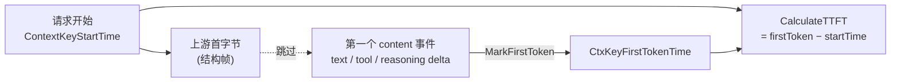

# TTFT（Time To First Token）记录

> 适用对象：改 `internal/protocol/loop.go`（`MarkFirstToken` / `CommitFirstChunk`）、`internal/protocol/stream/`（各协议的 content gate）、`internal/server/module/mcp/generic_stream_interceptor.go`（MCP 流式拦截器）、或 `internal/server/usage_tracking.go`（TTFT 消费侧）的人。
>
> 这份文档只讲一件事：**TTFT 必须在「第一个内容 token」被记录，而不是「第一个字节」。**

---

## 0. 模型

`TTFT = 第一个 content token 的时间 − 请求开始时间`。

每条流式响应都先发一堆**结构帧**（`message_start` / role delta / `response.created` …），模型真正开始「说话」是在第一个 **content delta**（文本 / tool 参数 / reasoning / refusal）。结构帧那刻记 TTFT 会把「网络 + 排队 + 模型预热」整段延迟砍掉，dashboard 的 TTFT 系统性偏低、失去诊断意义。所以 content gate 只放过内容帧去触发 `MarkFirstToken`，结构帧一律跳过。

---

## 1. 核心 API

| 名称 | 位置 | 作用 |
|---|---|---|
| `MarkFirstToken(c)` | `protocol/loop.go` | **唯一**记录 TTFT 的入口。幂等：已存在则直接 return（最早信号胜）。非流式 handler 从不调用它。 |
| `CommitFirstChunk(c)` | `protocol/loop.go` | 只提交 failover gate（首字节 = upstream 健康），**故意不记 TTFT**。 |
| `CtxKeyFirstTokenTime` | `constant/tracking_ctx.go` | gin context key，存 `time.Time`。 |
| `CalculateTTFT(c)` | `server/tracking_context.go` | `firstToken − startTime`，毫秒；无 token 时间则返回 0（**不回退成总 latency**）。 |

> 关键区分：`CommitFirstChunk` 处理「上游已连上、可以提交 failover」；`MarkFirstToken` 处理「模型吐出了第一个字」。两者曾经合一，现已拆开——首字节 ≠ 首 token。

---

## 2. content gate：识别内容帧

content gate 是「这一帧带不带模型内容」的判断，每条输出路径在写出口处调用它，命中才 `MarkFirstToken`。判断依据按协议：

| 协议 | 结构帧（不算） | 内容帧（算） |
|---|---|---|
| Anthropic | `message_start` / `content_block_start` / `content_block_stop` / `ping` / `message_delta` / `message_stop` | `content_block_delta`（`text_delta` / `thinking_delta` / `input_json_delta` / `signature_delta`） |
| OpenAI Chat | 领头 `{delta:{role:"assistant"}}`、纯 `finish_reason` 块 | `delta` 有非空 `content` / `tool_calls` / `reasoning_content` / `refusal` / `function_call` |
| OpenAI Responses | `response.created` / `response.in_progress` / `response.output_item.added` / `response.completed` | 后缀为 `*.delta` 的事件（`output_text` / `function_call_arguments` / `reasoning` / `refusal` 等 delta） |
| Google | 无独立 message_start 帧 | `candidates[].content.parts` 任一 part 有 `Text` 或 `FunctionCall` |

每个 gate 都是一个小函数，集中放可测：

- `isAnthropicContentDeltaEvent` — `== "content_block_delta"`（`anthropic_constant.go`）
- `isOpenAIChatContentChunk` / `isOpenAIChatChunkMapContent` — Chat 的 typed / raw-map 两版（`openai_helper.go`）
- `isOpenAIResponsesContentEvent` — `strings.HasSuffix(event, ".delta")`（`openai_helper.go`）
- `isGoogleContentChunk` — 遍历 parts（`any_to_google.go`）

---

## 3. 覆盖矩阵：每条输出路径在哪 mark

`MarkFirstToken` 幂等，所以每条路径只需在「内容帧即将写出」处调一次，重复内容帧是 no-op，不需要 bool 去重。

### 3.1 共用 send funnel 的路径（gate 装在 funnel 里，一处覆盖所有上游来源）

| 出口 | gate | 谁用它（覆盖哪些 handler） |
|---|---|---|
| `sendAnthropicStreamEvent`（`anthropic_helper.go`） | `isAnthropicContentDeltaEvent` | 所有 Anthropic converter（`google_to_any` 的 v1/beta、`openai_responses_to_anthropic*` 的 v1/beta、`sendAnthropicV1*` helpers），以及 guardrails rewrite 分支 |
| `OpenAIResponsesEvent`（`openai_helper.go`） | `isOpenAIResponsesContentEvent` | Responses passthrough（`HandleOpenAIResponsesStream`）+ 所有 Responses converter |
| `openaiChatSSEWriter`（`openai_responses_to_chat.go`） | `isOpenAIChatContentChunk` | Responses→Chat converter |
| `sendOpenAIStreamChunkForce`（`anthropic_to_openai.go`） | `isOpenAIChatChunkMapContent` | Google→OpenAI converter |
| `sendGoogleStreamChunk`（`any_to_google.go`） | `isGoogleContentChunk` | 任意→Google converter |

### 3.2 直接写 SSE、不经任何 funnel 的路径（必须自己 mark）

这些 handler 把上游原始字节直接 `c.SSEvent` / `OpenAISSE` / `c.Writer.Write` 转发，或自己拼 chunk 写出，funnel 不经过它们，所以 content gate 要落在事件循环里：

| 路径 | 写法 | mark 点 |
|---|---|---|
| `HandleAnthropic` / `HandleAnthropicBeta`（`anthropic_passthrough.go`） | `c.SSEvent(evt.Type, evt.RawJSON())` | 事件回调顶部，`isAnthropicContentDeltaEvent(evt.Type)` 命中时 mark |
| `HandleOpenAIChatStream`（`openai_passthrough.go`） | `OpenAISSE(c, chunkMap)` | `OpenAISSE` 前，`delta` 有内容字段时 mark |
| `handleOpenAIStreamResponse`（`server/openai_chat.go`） | 内联拼 map → `WriteString` | 内联 content 判断（SDK `openai.ChatCompletionChunk` 类型） |
| `GenericStreamInterceptor`（`server/module/mcp/`） | `adapter.SendEvent` 直接写 | `recordTTFT()`（= `MarkFirstToken(i.c)`），仅在 `handleTextEvent` / `handleToolDeltaEvent` 调用 |

> Chat 的内容判断有三处实现（typed / raw-map / SDK inline），操作不同类型，合一需要适配器、得不偿失，保持并列。

**判据**：一条流式路径在循环里直接写原始字节（不经任何 `send*` funnel）→ 必须自己 mark；走某个 `send*` funnel → funnel 已覆盖。

---

## 4. 不变式

- `CtxKeyFirstTokenTime` 一旦设置不再被覆盖（最早信号胜）。
- 非流式请求从不设置它 → `CalculateTTFT` 返回 0，**不回退成总 latency**（否则 TTFT 与 latency 不可区分）。
- TTFT 仅由 `MarkFirstToken` 写、由 `CalculateTTFT` 读；dashboard / `MetricsData.TTFTMs` / DB `usage_records.ttft_ms` 全部源自 `CalculateTTFT`。

---

## 5. 新增 / 修改流式输出路径时

1. **走 funnel 还是直接写？** 走 §3.1 的某个 `send*` funnel → gate 已装好，无需动。直接写原始字节 → 在事件循环里自己 mark（§3.2）。
2. **判断内容帧**——按 §2 的协议信号区分结构帧 vs 内容帧。
3. **直接调 `MarkFirstToken(c)`**，不要自己加 bool 去重——它幂等。
4. **不要在 `CommitFirstChunk` / `RunLoop` 里记 TTFT**——那是首字节，不是首 token。

测试模板：
- converter gate：`stream/responses_to_anthropic_ttft_test.go`（表驱动，结构帧不 mark / 内容帧 mark）。
- raw passthrough：`stream/passthrough_test.go`（`TestHandle*_Passthrough_*`，在真实 handler 上验证内容帧才 mark、结构帧不 mark）。
