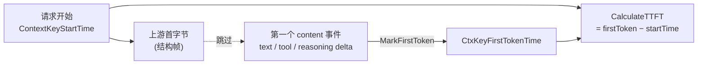

# TTFT（Time To First Token）记录

> 适用对象：改 `internal/protocol/loop.go`（`MarkFirstToken` / `CommitFirstChunk`）、`internal/protocol/stream/`（各协议的 content gate）、`internal/server/module/mcp/generic_stream_interceptor.go`（MCP 流式拦截器）、或 `internal/server/usage_tracking.go`（TTFT 消费侧）的人。
>
> 这份文档只讲一件事：**TTFT 必须在「第一个内容 token」被记录，而不是「第一个字节」。**

---

## 0. 一句话

`TTFT = 第一个 content token 的时间 − 请求开始时间`。第一个**字节**只是结构帧（`message_start` / role delta / `response.created`），不是 token——在那一瞬记 TTFT 会让 dashboard 显示的 TTFT 偏低到失真。

所以每条流式输出路径都装一个 **content gate**：只放过「真正带模型生成内容」的事件去触发 `MarkFirstToken`，结构帧一律跳过。



---

## 1. 核心 API

| 名称 | 位置 | 作用 |
|---|---|---|
| `MarkFirstToken(c)` | `protocol/loop.go` | **唯一**记录 TTFT 的入口。幂等：已存在则直接 return（最早信号胜）。非流式 handler 从不调用它。 |
| `CommitFirstChunk(c)` | `protocol/loop.go` | 只提交 failover gate（首个字节 = upstream 健康），**故意不记 TTFT**。 |
| `CtxKeyFirstTokenTime` | `constant/tracking_ctx.go` | gin context key，存 `time.Time`。 |
| `CalculateTTFT(c)` | `server/tracking_context.go` | `firstToken − startTime`，毫秒；无 token 时间则返回 0（**不回退成总 latency**）。 |

> ⚠️ 关键区分：`CommitFirstChunk` 处理「上游已连上、可以开始 failover 提交」这件事；`MarkFirstToken` 处理「模型吐出了第一个字」。两者曾经合一，现已拆开——首字节 ≠ 首 token。

---

## 2. 为什么不能在首字节记

各协议流式响应的第一个事件都是**结构帧**，不含模型内容：

| 协议 | 首个事件 | 性质 |
|---|---|---|
| Anthropic | `message_start` → `content_block_start` | 结构帧 |
| OpenAI Chat | `{delta:{role:"assistant"}}`（role-only） | 结构帧 |
| OpenAI Responses | `response.created` → `response.in_progress` | 结构帧 |
| Google | 无独立 message_start（首块即可能带内容） | — |

模型真正开始「说话」是在第一个 **content delta**：文本、tool call 参数、reasoning、refusal。在结构帧那刻记 TTFT，等于把「网络 + 排队 + 模型预热」整段延迟砍掉，dashboard 的 TTFT 会系统性偏低、失去诊断意义。

---

## 3. 每条输出路径的 content gate

每条流式输出路径在它的 **send funnel**（所有 chunk 必经的写出口）里判断「这一帧带不带内容」，带才 `MarkFirstToken`。因为 `MarkFirstToken` 幂等，重复内容帧是 no-op，无需额外去重标志位。

### 3.1 Anthropic 出口（`stream/anthropic_helper.go`）

`sendAnthropicStreamEvent` 是所有 Anthropic SSE 的唯一出口：

```go
func sendAnthropicStreamEvent(c, eventType, eventData, flusher) {
    if isAnthropicContentDeltaEvent(eventType) {   // == "content_block_delta"
        protocol.MarkFirstToken(c)
    }
    // ... marshal + write
}
```

`isAnthropicContentDeltaEvent`（`anthropic_constant.go`）：只认 `content_block_delta`。`message_start` / `content_block_start` / `ping` / `*_stop` 都是结构帧，不算。

### 3.2 OpenAI Responses 出口（`stream/openai_helper.go`）

`OpenAIResponsesEvent` 是 Responses 输出（passthrough + 所有 converter）的唯一出口：

```go
func OpenAIResponsesEvent(c, event, v) {
    if isOpenAIResponsesContentEvent(event) {       // strings.HasSuffix(event, ".delta")
        protocol.MarkFirstToken(c)
    }
    // ... write
}
```

Responses 的内容一律走 `*.delta` 事件（`response.output_text.delta`、`response.function_call_arguments.delta`、`response.reasoning.delta` …）。`response.created` / `response.in_progress` / `response.output_item.added` 是结构帧。

### 3.3 OpenAI Chat 出口

有两条 Chat 出口，对应两种 chunk 构造方式：

| 出口 | chunk 类型 | gate |
|---|---|---|
| `openaiChatSSEWriter`（`openai_responses_to_chat.go`） | `wire.ChatStreamChunk`（typed） | `isOpenAIChatContentChunk` |
| `sendOpenAIStreamChunkForce`（`anthropic_to_openai.go`） | `map[string]interface{}`（raw） | `isOpenAIChatChunkMapContent` |
| `handleOpenAIStreamResponse`（`server/openai_chat.go`） | SDK `openai.ChatCompletionChunk`（inline） | 内联判断 |

三个 gate 检查同一组字段：`content` / `tool_calls` / `reasoning_content`（/ `refusal` / `function_call`），任一非空即为内容帧。Chat 流的领头块是 `{role:"assistant"}` 的 role-only delta——不含上述任何字段，自然被跳过。

> 三个 gate 为什么不合一？它们操作**不同类型**（`wire.ChatStreamChunk` / raw map / SDK 类型），合一需要类型适配器，得不偿失。`server` 侧用 SDK 类型，也无法复用 `stream` 包里 typed/raw 的实现。

### 3.4 Google 出口（`stream/any_to_google.go`）

`sendGoogleStreamChunk` + `isGoogleContentChunk`：遍历 `candidates[].content.parts`，任一 part 有 `Text` 或 `FunctionCall` 即为内容。Google wire 没有 `message_start` 帧，首块带内容就是首 token。

### 3.5 MCP 流式拦截器（`server/module/mcp/generic_stream_interceptor.go`）

MCP 拦截器**直接写 SSE**，不经 `sendAnthropicStreamEvent`，所以必须自己 mark。它在两个内容事件处调 `recordTTFT()`（内部即 `MarkFirstToken(i.c)`）：

- `handleTextEvent`：文本 delta
- `handleToolDeltaEvent`：tool input delta（纯 tool-call 响应的首 token）

结构事件（`message_start` / `content_block_start`）走别的 handler，不触发 `recordTTFT`。幂等，故无需旧的 `ttftRecorded` bool（已删）。

---

## 4. 新增 / 修改流式输出路径时

对照清单：

1. **找到 send funnel**——所有 chunk 写向客户端必经的那个函数。content gate 装在这里，一处覆盖所有上游来源。
2. **判断内容**——区分结构帧 vs 内容帧。常见信号：Anthropic 的 `content_block_delta`、Responses 的 `*.delta` 后缀、Chat 的非空 `content`/`tool_calls`/`reasoning`。
3. **直接调 `MarkFirstToken(c)`**，不要自己加 bool 去重——它幂等。
4. **不要在 `CommitFirstChunk` / `RunLoop` 里记 TTFT**——那是首字节，不是首 token。

测试模板见 `stream/responses_to_anthropic_ttft_test.go`：对每个 gate 写一组「结构帧不 mark、内容帧 mark」的表驱动用例，并在真实 converter 路径上断言「TTFT 在 content delta 时才被设置、结构帧已先发出」。

---

## 5. 不变式

- `CtxKeyFirstTokenTime` 一旦设置不再被覆盖（最早信号胜）。
- 非流式请求从不设置它 → `CalculateTTFT` 返回 0，**不回退成总 latency**（否则 TTFT 与 latency 不可区分）。
- TTFT 仅由 `MarkFirstToken` 写、由 `CalculateTTFT` 读，dashboard / `MetricsData.TTFTMs` / DB `usage_records.ttft_ms` 全部源自 `CalculateTTFT`。
