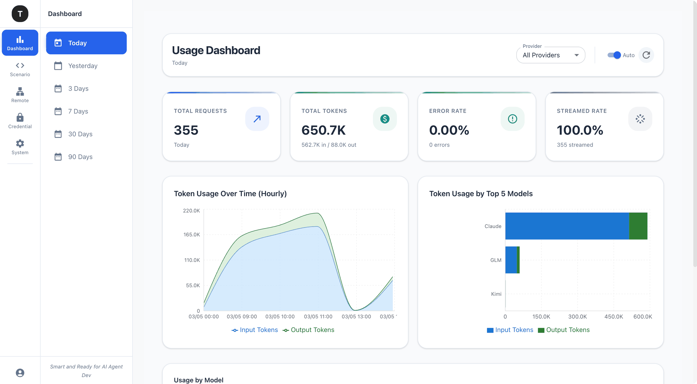

# Tingly Box

**Tingly Box** is a high‑performance desktop LLM proxy for personal or local use. It unifies access to hundreds of models from diverse providers through a single, unified API without locking you into any one vendor.

- **Credential Management**: Store and manage API keys, OAuth tokens, and other credentials in one place.  
- **Flexible Routing & Model Switching**: Define custom routes, alias model names, and switch target models on the fly—no code changes needed.  
- **Provider‑Agnostic Compatibility**: Seamlessly supports OpenAI, Anthropic, Google, and other API styles through a consistent interface.

> Think of Tingly Box as your personal *LLM gateway*—simplifying integration, boosting flexibility, and keeping your workflows future‑proof.




## ✨ Key Features

- **Unified API** – Single OpenAI‑compatible endpoint for many providers
- **Load Balancing** – Distribute traffic across multiple API tokens using routing tactics
- **Auto API Translation** – Seamlessly translate between OpenAI‑ and Anthropic‑style APIs
- **OAuth Support** – Connect providers like Claude Code without API keys, use your existing quota anywhere
- **High Performance** – Additional latency typically **< 1ms**
- **JWT Authentication** – Separate user tokens and model tokens
- **Web Management UI** – Visual provider, routing, and model management


## 🚀 Quick Start

### Install

**From npm (recommended)**

```bash
# Install and run
npx tingly-box@latest start
```

> if any trouble, please check tingly-box process and port 12580 and confirm to kill them.

**From source code**

*Requires: Go 1.21+, Node.js 18+, pnpm, task, openapi-generator-cli*

```bash
# Install dependencies
# - Go: https://go.dev/doc/install
# - Node.js: https://nodejs.org/
# - pnpm: `npm install -g pnpm`
# - task: https://taskfile.dev/installation/, or `go install github.com/go-task/task/v3/cmd/task@latest`
# - openapi-generator-cli: `npm install @openapitools/openapi-generator-cli -g`

git submodule update --init --recursive

# Build CLI binary
task go:build

# Build with frontend
task cli:build

# Build GUI binary via wails3
task wails:build
```

**From Docker (Github)**

```bash
mkdir tingly-data
docker run -d \
  --name tingly-box \
  -p 12580:12580 \
  -v `pwd`/tingly-data:/home/tingly/.tingly-box \
  ghcr.io/tingly-dev/tingly-box
```

**From Docker (Build from sketch)**

```bash
# Pull and run the NPX-based image (recommended - smaller size, auto-updates)
mkdir -p tingly-data
docker run -d \
  --name tingly-box \
  -p 12580:12580 \
  -v `pwd`/tingly-data:/app/.tingly-box \
  ghcr.io/tingly-dev/tingly-box:latest

# Or build the full image locally from source
docker build -t tingly-box:latest .

# Run container
docker run -d \
  --name tingly-box \
  -p 12580:12580 \
  -v $(pwd)/data/.tingly-box:/app/.tingly-box \
  -v $(pwd)/data/logs:/app/logs \
  -v $(pwd)/data/memory:/app/memory \
  tingly-box:latest
```


## **🔌 Use with OpenAI SDK or Claude Code**

**Python OpenAI SDK**

```python
from openai import OpenAI

client = OpenAI(
    api_key="your-tingly-model-token",
    base_url="http://localhost:12580/tingly/openai/v1"
)

response = client.chat.completions.create(
# To pass litellm model name validation, use "gpt-3.5-turbo"
    model="tingly",
    messages=[{"role": "user", "content": "Hello!"}]
)
print(response)
```

**Claude Code**

```bash
# Settings file (~/.claude/settings.json)
{
  "env": {
    "DISABLE_TELEMETRY": "1",
    "DISABLE_ERROR_REPORTING": "1",
    "CLAUDE_CODE_DISABLE_NONESSENTIAL_TRAFFIC": "1",
    "API_TIMEOUT_MS": "3000000",
    "ANTHROPIC_AUTH_TOKEN": "{content after tingly token cmd 'Current API Key from Global Config'}",
    "ANTHROPIC_BASE_URL": "http://localhost:12580/tingly/claude_code",
    "ANTHROPIC_DEFAULT_HAIKU_MODEL": "tingly/cc",
    "ANTHROPIC_DEFAULT_OPUS_MODEL": "tingly/cc",
    "ANTHROPIC_DEFAULT_SONNET_MODEL": "tingly/cc",
    "ANTHROPIC_MODEL": "tingly/cc",
    "hasCompletedOnboarding": true
  }
}
```

> Tingly Box proxies requests transparently for SDKs and CLI tools.

**Using OAuth Providers**

You can also add OAuth providers (like Claude Code) and use your existing quota in any OpenAI-compatible tool:

```bash
# 1. Add Claude Code via OAuth in Web UI (http://localhost:12580)
# 2. Configure your tool with Tingly Box endpoint
```


Requests route through your OAuth-authorized provider, using your existing Claude Code quota instead of requiring a separate API key.

This works with any tool that supports OpenAI-compatible endpoints: Cherry Studio, VS Code extensions, or custom AI agents.


## 🖥 Web Management UI

```bash
npx tingly-box start
```


## 📚 Documentation

**[User Manual](./docs/user-manual.md)** – Installation, configuration, and operational guide


## **🧩 Philosophy**

- **One endpoint, many providers** – Consolidates multiple providers behind a single API with minimal configuration.
- **Seamless integration** – Works with SDKs and CLI tools with minimal setup.


## **🤝 How to Contribute**

We welcome contributions! Follow these steps, inspired by popular open-source repositories:

1. **Fork the repository** – Click the “Fork” button on GitHub.

2. **Clone your fork**

   ```bash
   git clone https://github.com/your-username/tingly-box.git
   cd tingly-box
   ```

3. **Create a new branch**

   ```bash
   git checkout -b feature/my-new-feature
   ```

4. **Make your changes** – Follow existing code style and add tests if applicable.

5. **Run tests**

   ```bash
   task test
   ```

6. **Commit your changes**

   ```bash
   git commit -m "Add concise description of your change"
   ```

7. **Push your branch**

   ```bash
   git push origin feature/my-new-feature
   ```

8. **Open a Pull Request** – Go to the GitHub repository and open a PR against `main`.


## 📞 Support

| Telegram    | Wechat |
| :--------: | :-------: |
|  |  |
| https://t.me/+V1sqeajw1pYwMzU1 | http://chv.ckcoa5.cn/t/OSFb |


## 🤲 Contributors

<a href="https://github.com/tingly-dev/tingly-box/graphs/contributors">
  
</a>

<br />
<br />
Special badges are given to following contributors:

<br />


---

Mozilla Public License Version 2.0 · © Tingly Dev
