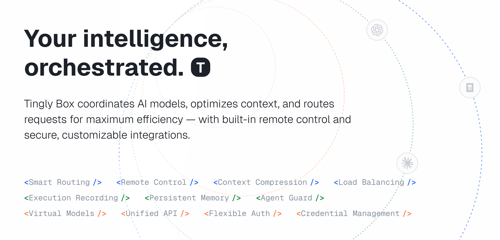
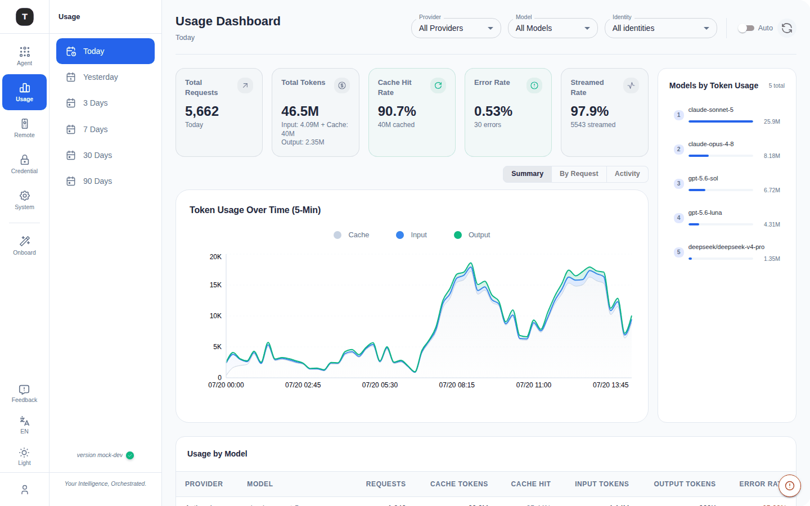
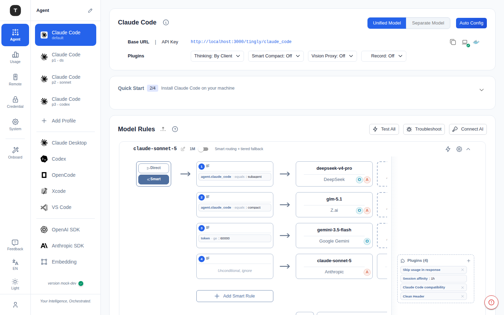
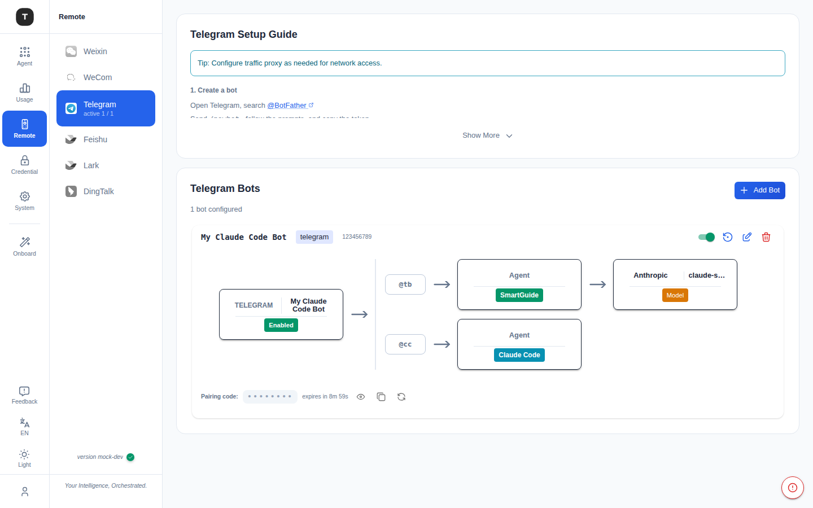
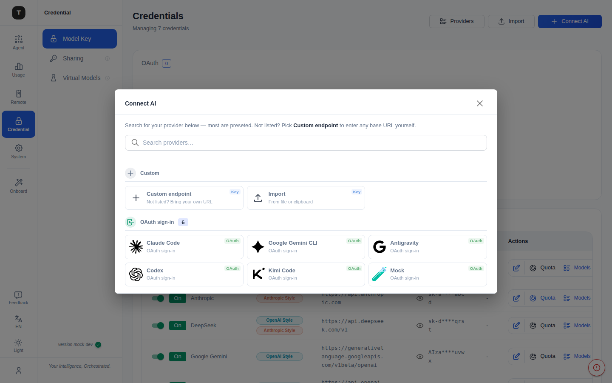
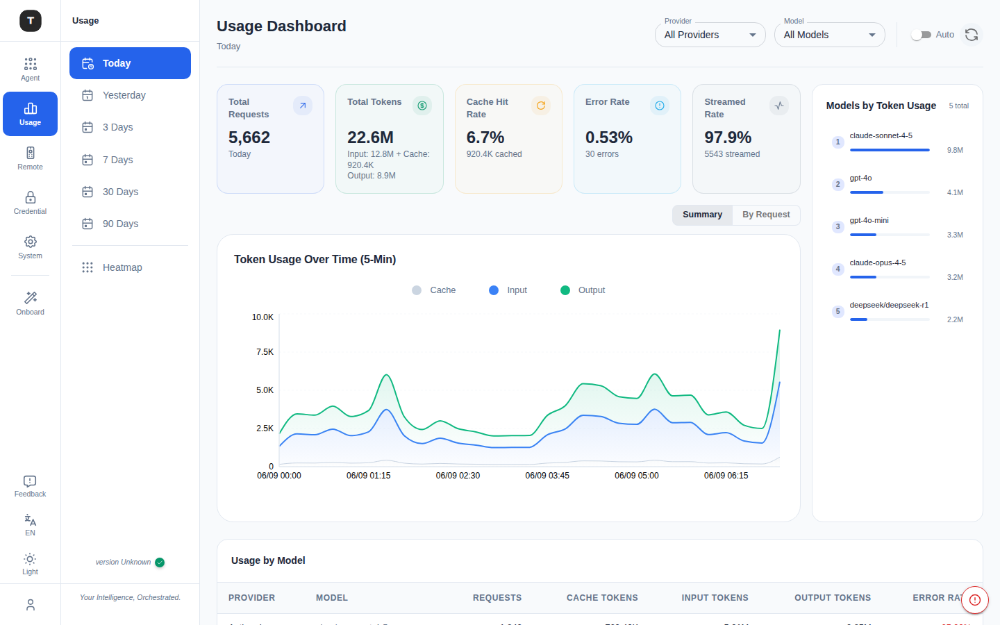

> **Announcement:** Here is [fault record](https://github.com/tingly-dev/tingly-box/discussions/626). Please update to the latest version to resolve known issues. Thank you for your continued support.


<h1 align="center">Tingly Box</h1>

<p align="center">
  <a href="#quick-start">Quick Start</a> •
  <a href="#key-features">Features</a> •
  <a href="#integration-guide">Integration</a> •
  <a href="#documentation">Documentation</a> •
  <a href="https://github.com/tingly-dev/tingly-box/issues">Issues</a>
</p>

<p align="center">
  
  
  
</p>

Tingly Box **serves agents, coordinates AI models, optimizes context, and routes requests** for maximum efficiency — with built-in **remote control and secure, customizable integrations**.




## Key Features

- **Agent-First Model Gateway** – Unified endpoint for agents — seamlessly bridge OpenAI, Anthropic, Google Gemini, and more with automatic protocol translation and native agent compatibility
- **Agent Integration** – One-click config for Claude Code, OpenCode, Codex, Xcode, and more — transparent proxying for SDKs and CLI tools
- **Agent Profiles** - Run agent like Claude Code with individual profiles, each profile can work with different model and agent config
- **Remote Control via IM Bots** – Control AI agents remotely through Telegram, DingTalk, Feishu, Lark, Weixin, WeCom, Slack, and Discord
- **Multi-Tenant API Tokens** – Isolate data per user with dedicated API tokens — each user gets their own usage tracking, provider access, and configuration
- **Smart Routing Engine** – Intelligently route requests across models and tokens based on cost, speed, or custom policies — far beyond simple load balancing
- **Flexible Authentication** – Support for both API keys and OAuth providers (Claude.ai, Codex, etc.) — use your existing quotas anywhere
- **Visual Control Plane** – Intuitive web UI to manage providers, routes, aliases, models, and remote bots at a glance — no config files needed
- **Client-Side Usage Analytics** – Track token consumption, latency, cost estimates, and model selection per request — directly from your client
- **Blazing Fast Performance** – Adds typically **< 1ms** of overhead — get flexibility without latency tax

## Quick Start

[English](https://github.com/tingly-dev/tingly-box/issues/678#issuecomment-4273812882) | [中文](https://github.com/tingly-dev/tingly-box/issues/678#issue-4244345496)

### Install

**From npm (recommended)**

```bash
# Install and run (auto restart, migrate and open webui while run without any args)
# A golang binary release but npx to wrap cli for convenience
npx tingly-box@latest

# or -y for convenience
npx -y tingly-box@latest

# if any network trouble, try bundle with binary built-in
npx -y tingly-box-bundle@latest

# npm mirror is supported for CN (one of below)
npx --registry=https://registry.npmmirror.com -y tingly-box-bundle@latest
npx --registry=https://mirrors.huaweicloud.com/repository/npm/ -y tingly-box-bundle@latest
npx --registry=http://mirrors.tencent.com/npm/ -y tingly-box-bundle@latest
```

> if any trouble, please check tingly-box output, or call for an issue to help. 

**From Docker (GitHub Host)**

```bash
mkdir tingly-data
docker run -d \
  --name tingly-box \
  -p 12580:12580 \
  -v `pwd`/tingly-data:/home/tingly/.tingly-box \
  ghcr.io/tingly-dev/tingly-box
```

**From Docker Compose (Recommend for isolated env)**

```bash
# Build and start in detached mode
docker-compose up -d

# View logs
docker-compose logs -f tingly-box

# Stop services
docker-compose down

# Access Web UI at http://localhost:12581
# (Note: Port 12581 is used to avoid conflict with host tingly on 12580)
```

### Integration Guide

<details>
<summary><strong>Agent Integration - Claude Code / Claude Desktop / OpenCode / Codex / Xcode / VSCode / OpenClaw</strong></summary>

- Claude Code (support 1-click config)
- OpenCode (support 1-click config)
- Xcode (require manual config)
- ……

Any application is ready to use.

> We've provided detailed config guide in application



</details>

<details>
<summary><strong>DeepSeek Best Compatibility</strong></summary>

DeepSeek is optimized for mainstream agent workflows, offering broad compatibility across protocol adapters, agent clients, extended context, vision, web search, and cache optimization.

| Module                           |      Status | What It Solves                                                        |
| -------------------------------- | ----------: | --------------------------------------------------------------------- |
| Model List                       | ✅ Supported | Keeps the official model list up to date in real time                 |
| Protocol Adaptation              | ✅ Supported | Supports official Anthropic/OpenAI APIs with bidirectional conversion |
| Reasoning Capability             | ✅ Supported | Provides compatibility with Thinking workflows                        |
| Cache Hit Optimization           | ✅ Supported | Improves cache hit rates for DeepSeek requests                        |
| Vision Proxy                     | ✅ Supported | Enables DeepSeek to understand and process images                     |
| Web Search                       | ✅ Supported | Calls official Web tools through the Anthropic endpoint               |
| 1M Context Window                | ✅ Supported | Enables one-click setup for 1M context                                |
| Codex Adaptation                 | ✅ Supported | Ensures compatibility with mainstream agent workflows                 |
| Claude Code / Desktop Adaptation | ✅ Supported | Ensures compatibility with mainstream agent workflows                 |

Supports one-click configuration where available. For applications that require manual setup, detailed in-app configuration guides are provided.

Any compatible application is ready to use.

> Detailed configuration guides are available inside each application.

</details>

<details>
<summary><strong>Remote Control Agent via IM Bots - TG / DingTalk / Feishu / Lark / Weixin / WecCom</strong></summary>

Tingly Box now supports remote control through popular IM platforms. Interact with your AI agents remotely without direct server access.

**Supported Platforms**

- ✅ Telegram
- ✅ DingTalk
- ✅ Feishu
- ✅ Lark
- ✅ Weixin
- ✅ WeCom

**Quick Setup**

1. Open Web UI like `http://localhost:12580`
2. Navigate to **Remote** section
3. Configure your preferred IM platform bot
4. Start interacting with your agents remotely

**Use Cases**

- Execute tasks and queries from your phone or any device
- Team collaboration with shared agent access
- Monitor and control agents while away from your workstation



</details>

<details>
<summary><strong>OpenAI SDK</strong></summary>

```python
from openai import OpenAI

client = OpenAI(
    api_key="your-tingly-model-token",
    base_url="http://localhost:12580/tingly/openai/v1"
)

response = client.chat.completions.create(
    model="tingly-gpt",
    messages=[{"role": "user", "content": "Hello!"}]
)
print(response)
```

</details>

<details>
<summary><strong>Anthropic SDK</strong></summary>

```python
from anthropic import Anthropic

client = Anthropic(
    api_key="your-tingly-model-token",
    base_url="http://localhost:12580/tingly/anthropic"
)

response = client.messages.create(
    model="tingly",
    max_tokens=1024,
    messages=[
        {"role": "user", "content": "Hello!"}
    ]
)
print(response)
```

> Tingly Box proxies requests transparently for SDKs and CLI tools.

</details>

<details>
<summary><strong>Using OAuth Providers</strong></summary>

You can also add OAuth providers (like Claude Code) and use your existing quota in any OpenAI-compatible tool:

```bash
# 1. Add Claude Code via OAuth in Web UI (http://localhost:12580)
# 2. Configure your tool with Tingly Box endpoint
```

Requests route through your OAuth-authorized provider, using your existing Claude Code quota instead of requiring a separate API key.

This works with any tool that supports OpenAI-compatible endpoints: Cherry Studio, VS Code extensions, or custom AI agents.



</details>

<details>
<summary><strong>Web Management UI</strong></summary>

Launch the web management interface:

```bash
npx tingly-box@latest
```

Then open `http://localhost:12580` in your browser.



</details>

## Documentation

**[User Manual](./docs/user-manual.md)** – Installation, configuration, and operational guide

**[Guardrails](./docs/guardrails.md)** – Policy-based safety checks, built-in protections, and protected credential masking

**[MCP Web Tools](./docs/mcp-web-tools.md)** – Local stdio MCP server for `web_search` / `web_fetch`

## Contributing

By contributing to this repository, you agree that your contributions may be
included in this project under the MPL-2.0 and may also be used by Tingly Inc.
under separate commercial licensing terms.

See CONTRIBUTING.md and NOTICE for details.

---

We welcome contributions! Check the steps below to build from source code.

<details>
<summary><strong>Contributing Guide — Build &amp; Dev</strong></summary>

### Prerequisites

| Tool | Version | Install |
|------|---------|---------|
| Go | 1.26+ | https://go.dev/doc/install |
| Node.js | 20+ | https://nodejs.org/ |
| pnpm | latest | `npm install -g pnpm` |
| task | latest | `go install github.com/go-task/task/v3/cmd/task@latest` or https://taskfile.dev/installation/ |

> Tip: you can also copy individual shell commands out of `Taskfile.yml` and run them directly if you prefer not to install `task`.

### 1. Clone and init submodules

```bash
git clone https://github.com/tingly-dev/tingly-box.git
cd tingly-box
git submodule update --init --recursive
```

### 2. Frontend development

The frontend is a React + Vite app located in `frontend/`. You can work on it independently of the Go backend.

> **Login token:** the frontend requires an auth token to log in. When the backend starts it prints the full login URL (e.g. `Web UI: http://localhost:12580/login/<token>`). If you need to retrieve it later, run:
> ```bash
> tingly-box token view auth --reveal
> ```

**Mock mode** – no running backend required, uses built-in fixture data:

```bash
task web:mock
# or directly:
cd frontend && pnpm install && pnpm dev:mock
```

Open http://localhost:9245 in your browser. Use the token obtained above to log in.

**Dev mode** – proxies API calls to a local backend (start the backend first, see step 3):

```bash
task web
# or directly:
cd frontend && pnpm install && pnpm dev
```

### 3. Backend development

Run the Go server (hot-reload via `go run`):

```bash
task start
# or directly:
go run ./cli/tingly-box --verbose start --debug --port 12580 --browser=false
```

Open http://localhost:12580 in your browser (serves the last built frontend bundle).

### 4. Full build (frontend + backend binary)

Builds the frontend, embeds it into the binary, then compiles Go:

```bash
task build
```

The output binary is written to `./build/tingly-box`.

### 5. GUI binary (Wails) *(optional)*

> The GUI build is not yet publicly released. Skip this step unless you are specifically working on the desktop app.

```bash
task wails:build
```

### Other useful commands

```bash
task swagger        # Regenerate openapi.json from Go source
task codegen        # Regenerate frontend API client from openapi.json
task go:test        # Run Go unit tests
```

</details>

## Support

| Telegram    | Wechat |
| :--------: | :-------: |
|  |  |
| https://t.me/+V1sqeajw1pYwMzU1 | tingly-box |

## Early Contributors

Special badges are minted to recognize the contributions from following contributors:

<br />

<table border="0" cellpadding="0" cellspacing="0" style="border:none; border-collapse:collapse; ">
  <tr style="border:none;">
    <td style="border:none; padding:4px;">
      
    </td>
    <td style="border:none; padding:4px;">
      
    </td>
    <td style="border:none; padding:4px;">
      
    </td>
    <td style="border:none; padding:4px;">
      
    </td>
    <td style="border:none; padding:4px;">
      
    </td>
  </tr>
</table>

## Contributors

[](https://github.com/tingly-dev/tingly-box/graphs/contributors)

## License

This project is available under:
- **MPL-2.0 · © Tingly Dev** – See [LICENSE.txt](./LICENSE.txt)
- **Commercial License · © Tingly Dev** – See [LICENSE-COMMERCIAL.txt](./LICENSE-COMMERCIAL.txt)

For commercial licensing inquiries, contact [biz@tingly.dev](mailto:biz@tingly.dev).
