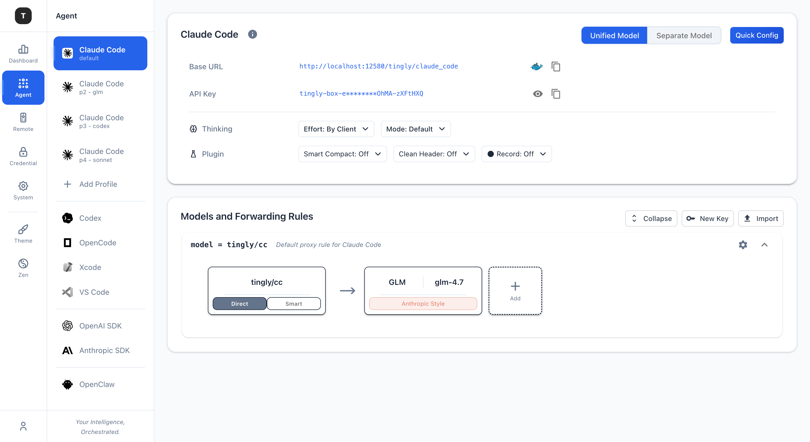
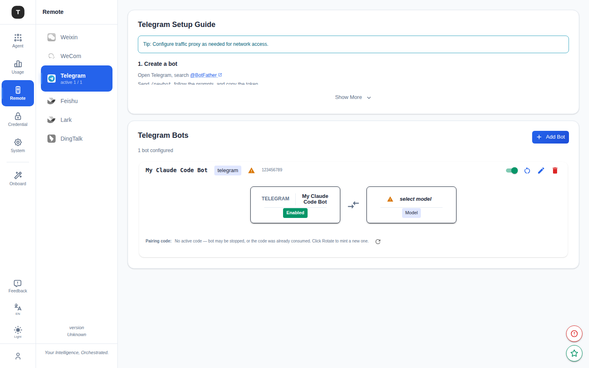
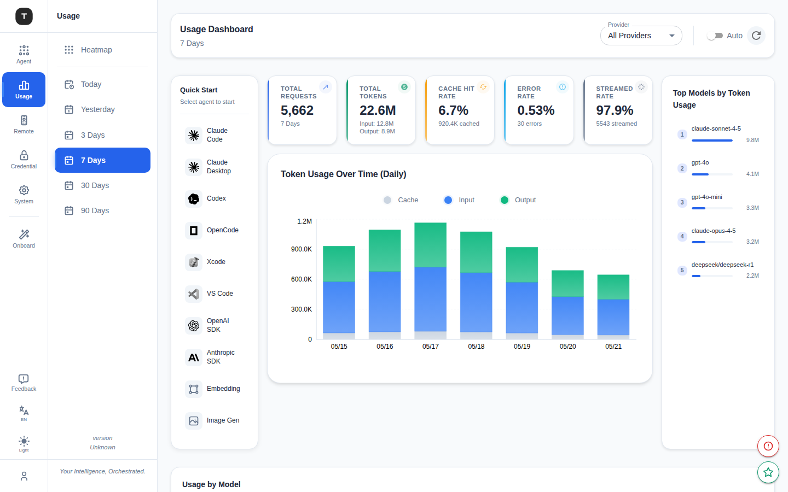

> **Announcement:** Here is [fault record](https://github.com/tingly-dev/tingly-box/discussions/626). Please update to the latest version to resolve known issues. Thank you for your continued support.


<h1 align="center">Tingly Box</h1>

<p align="center">
  <a href="#quick-start">Quick Start</a> •
  <a href="#key-features">Features</a> •
  <a href="#integration-guide">Integration</a> •
  <a href="#documentation">Documentation</a> •
  <a href="https://github.com/tingly-dev/tingly-box/issues">Issues</a>
</p>

<p align="center">
  
  
  
</p>

Tingly Box **serves agents, coordinates AI models, optimizes context, and routes requests** for maximum efficiency — with built-in **remote control and secure, customizable integrations**.


## Key Features

- **Unified API Gateway** – One mixin endpoint to rule them all — seamlessly bridge OpenAI, Anthropic, Google Gemini, and more with automatic protocol translation
- **Agent Integration** – One-click config for Claude Code, OpenCode, Codex, Xcode, and more — transparent proxying for SDKs and CLI tools
- **Remote Control via IM Bots** – Control AI agents remotely through Telegram, DingTalk, Feishu, Lark, Weixin, WeCom, Slack, and Discord
- **Multi-Tenant API Tokens** – Isolate data per user with dedicated API tokens — each user gets their own usage tracking, provider access, and configuration
- **Smart Routing Engine** – Intelligently route requests across models and tokens based on cost, speed, or custom policies — far beyond simple load balancing
- **Flexible Authentication** – Support for both API keys and OAuth providers (Claude.ai, Codex, etc.) — use your existing quotas anywhere
- **Visual Control Plane** – Intuitive web UI to manage providers, routes, aliases, models, and remote bots at a glance — no config files needed
- **Client-Side Usage Analytics** – Track token consumption, latency, cost estimates, and model selection per request — directly from your client
- **Blazing Fast Performance** – Adds typically **< 1ms** of overhead — get flexibility without latency tax

## Quick Start

### Install

**From npm (recommended)**

```bash
# Install and run (auto restart, migrate and open webui while run without any args)
# A golang binary release but npx to wrap cli for convenience
npx tingly-box@latest

# or -y for convenience
npx -y tingly-box@latest
```

> if any trouble, please check tingly-box output, or call for an issue to help. 

**From Docker (Github Host)**

```bash
mkdir tingly-data
docker run -d \
  --name tingly-box \
  -p 12580:12580 \
  -v `pwd`/tingly-data:/home/tingly/.tingly-box \
  ghcr.io/tingly-dev/tingly-box
```

### Integration Guide

<details>
<summary><strong>Agent Integration - Claude Code / OpenCode / Codex / Xcode / VSCode / OpenClaw</strong></summary>

- Claude Code (support 1-click config)
- OpenCode (support 1-click config)
- Xcode (require manual config)
- ……

Any application is ready to use.

> We've provided detailed config guide in application



</details>


<details>
<summary><strong>Remote Control Agent via IM Bots - TG / DingTalk / Feishu / Lark / Weixin / WecCom</strong></summary>

Tingly Box now supports remote control through popular IM platforms. Interact with your AI agents remotely without direct server access.

**Supported Platforms**

- ✅ Telegram
- ✅ DingTalk
- ✅ Feishu
- ✅ Lark
- ✅ Weixin
- ✅ WeCom
- Slack
- Discord

**Quick Setup**

1. Open Web UI like `http://localhost:12580`
2. Navigate to **Remote** section
3. Configure your preferred IM platform bot
4. Start interacting with your agents remotely

**Use Cases**

- Execute tasks and queries from your phone or any device
- Team collaboration with shared agent access
- Monitor and control agents while away from your workstation



</details>

<details>
<summary><strong>OpenAI SDK</strong></summary>

```python
from openai import OpenAI

client = OpenAI(
    api_key="your-tingly-model-token",
    base_url="http://localhost:12580/tingly/openai/v1"
)

response = client.chat.completions.create(
    model="tingly-gpt",
    messages=[{"role": "user", "content": "Hello!"}]
)
print(response)
```

</details>

<details>
<summary><strong>Anthropic SDK</strong></summary>

```python
from anthropic import Anthropic

client = Anthropic(
    api_key="your-tingly-model-token",
    base_url="http://localhost:12580/tingly/anthropic"
)

response = client.messages.create(
    model="tingly",
    max_tokens=1024,
    messages=[
        {"role": "user", "content": "Hello!"}
    ]
)
print(response)
```

> Tingly Box proxies requests transparently for SDKs and CLI tools.

</details>

<details>
<summary><strong>Using OAuth Providers</strong></summary>

You can also add OAuth providers (like Claude Code) and use your existing quota in any OpenAI-compatible tool:

```bash
# 1. Add Claude Code via OAuth in Web UI (http://localhost:12580)
# 2. Configure your tool with Tingly Box endpoint
```

Requests route through your OAuth-authorized provider, using your existing Claude Code quota instead of requiring a separate API key.

This works with any tool that supports OpenAI-compatible endpoints: Cherry Studio, VS Code extensions, or custom AI agents.


</details>

<details>
<summary><strong>Web Management UI</strong></summary>

Launch the web management interface:

```bash
npx tingly-box@latest
```

Then open `http://localhost:12580` in your browser.



</details>

## Documentation

**[User Manual](./docs/user-manual.md)** – Installation, configuration, and operational guide

**[Guardrails](./docs/guardrails.md)** – Policy-based safety checks, built-in protections, and protected credential masking

**[MCP Web Tools](./docs/mcp-web-tools.md)** – Local stdio MCP server for `web_search` / `web_fetch`

## Contributing

By contributing to this repository, you agree that your contributions may be
included in this project under the MPL-2.0 and may also be used by Tingly Inc.
under separate commercial licensing terms.

See CONTRIBUTING.md and NOTICE for details.

---

We welcome contributions!   
Please check steps below to build from source code.

*Requires: Go 1.25+, Node.js 20+, pnpm, task*

```bash
# Install dependencies
# - Go: https://go.dev/doc/install
# - Node.js: https://nodejs.org/
# - pnpm: `npm install -g pnpm`
# - task: https://taskfile.dev/installation/, or `go install github.com/go-task/task/v3/cmd/task@latest`
# - shell: copy and run shell command in taskfile directly

git submodule update --init --recursive

# Build with frontend
task build

# Build GUI binary via wails3
task wails:build
```

## Support

| Telegram    | Wechat |
| :--------: | :-------: |
|  |  |
| https://t.me/+V1sqeajw1pYwMzU1 | tingly-box |

## Early Contributors

Special badges are minted to recognize the contributions from following contributors:

<br />


## License

This project is available under:
- **MPL-2.0 · © Tingly Dev** – See [LICENSE.txt](./LICENSE.txt)
- **Commercial License · © Tingly Dev** – See [LICENSE-COMMERCIAL.txt](./LICENSE-COMMERCIAL.txt)

For commercial licensing inquiries, contact [biz@tingly.dev](mailto:biz@tingly.dev).
