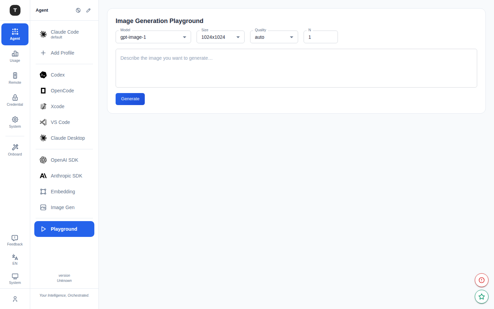

# Playground

Path: `/agent/playground`

The Playground is an interactive image generation test interface that lets you test the image generation API without writing any code.

---

## Page Structure

### Parameter Panel

Located on the left or top, containing the following controls:

| Parameter | Description |
|-----------|-------------|
| **Model** | Dropdown — automatically populated from configured ImageGen forwarding rules |
| **Size** | Image dimensions: 256×256 / 512×512 / 1024×1024 / 1024×1792 / 1792×1024 |
| **Quality** | Image quality: auto / low / medium / high / standard |
| **N** | Generation count, range 1–10 |
| **Prompt** | Multi-line text box for the image description |

### Generate & Results Area

- **Generate button**: Submits the generation request (disabled if no model or prompt is selected)
- A loading spinner shows while generating
- Generated images are displayed in a grid after completion
- Each image can be viewed directly in the browser or right-click saved

---

## Prerequisites

The Playground requires at least one forwarding rule to be configured in the [ImageGen scenario](./06-scenario-special.md) before the Model dropdown shows any options.

---

## Usage Flow

1. Go to `/agent/imagegen` and confirm at least one image generation forwarding rule is configured
2. Click the **Open Playground** button, or navigate directly to `/agent/playground`
3. Select a model and parameters
4. Enter a description in the Prompt box, e.g.: `a watercolor painting of a mountain lake at sunset`
5. Click **Generate** and wait for the images
6. Review the results, adjust parameters, and continue testing

---

## Related Pages

- [ImageGen Scenario](./06-scenario-special.md)
- [Scenario Overview](./02-scenario-overview.md)
