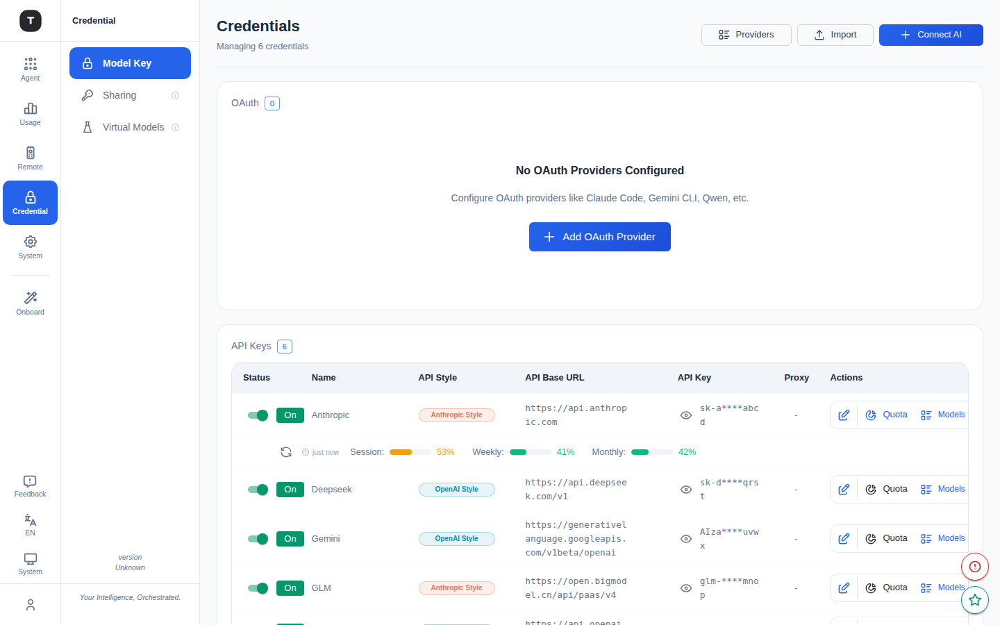

# Credentials

Path: `/credentials`



The Credentials page is the core of Tingly-Box's configuration chain. All provider API keys and OAuth credentials are centrally managed here.

---

## Page Overview

The page header shows the total credential count (e.g. `Managing 5 credentials`). The top action bar includes:

| Button | Function |
|--------|----------|
| **Connect AI** | Opens the unified provider picker to add new credentials (same flow as Onboarding) |
| **Import** | Bulk-import provider configurations (JSON/YAML format) |
| **Providers** | Navigates to the Onboarding page (browse all providers) |

---

## Credential Types

### API Keys Table

Lists all providers connected via API Key:

| Column | Description |
|--------|-------------|
| Provider | Provider name and icon |
| Base URL | API endpoint address |
| Token | API Key (masked by default) |
| Status | Enabled/disabled |
| Quota | Known quota info (click to refresh) |
| Actions | Edit, delete, enable/disable |

### OAuth Table

Lists all providers connected via OAuth (e.g. Claude.ai):

| Column | Description |
|--------|-------------|
| Provider | Provider name |
| Status | Authorization status |
| Expiry | Token expiration time |
| Actions | Refresh token, edit, delete, enable/disable |

---

## Adding a Provider

Click **Connect AI** to open the provider selection dialog:

1. Search or browse the provider list
2. Select the target provider (e.g. Anthropic, OpenAI, DeepSeek, local Ollama)
3. Fill in the configuration form:
   - **Name**: Display name (customizable)
   - **API Base**: API endpoint (pre-filled, editable)
   - **API Style**: `openai` or `anthropic`
   - **Token**: API Key
   - **Proxy URL** (optional): HTTP proxy for this provider only
   - **User Agent** (optional): Custom request header
4. Confirm to save

For OAuth providers, step 3 automatically initiates the authorization flow; the token is auto-saved on completion.

---

## Bulk Import

Click the **Import** button:

1. Select a file (JSON or YAML) or paste configuration content directly
2. Supported format example:
   ```yaml
   providers:
     - name: "My OpenAI"
       api_base: "https://api.openai.com/v1"
       api_style: "openai"
       token: "sk-..."
   ```
3. Click **Import** to confirm
4. If a provider already exists, the system prompts whether to force-overwrite (Force Add)

---

## Editing a Provider

Click the edit icon on the right of a provider row to open the edit form. You can modify:
- Name
- API Base URL
- API Key/Token
- Proxy settings
- Enabled/disabled status

---

## Enable / Disable a Provider

Each provider row has a toggle for quick enable/disable. Disabled providers will not receive new routing requests, but their configuration is retained.

---

## Related Pages

- [Virtual Models](./09-virtual-models.md)
- [API Tokens](./10-api-tokens.md)
- [Getting Started](./01-getting-started.md)
