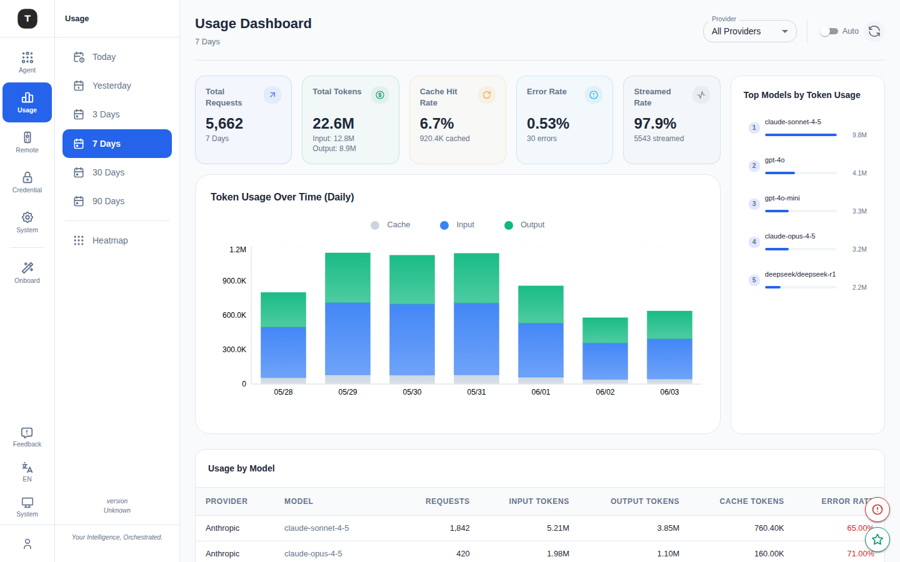

# Usage Dashboard

Path: `/dashboard/:timeRange` (default: `/dashboard/7d`)

The Usage Dashboard provides statistics and visualizations of AI request activity, helping you understand call volume, token consumption, cache hit rate, and other metrics across providers and models.

---

## Time Range Selection

Quick-switch buttons at the top of the page:

| Option | Path | Description |
|--------|------|-------------|
| Today | `/dashboard/today` | Current day (hourly view) |
| Yesterday | `/dashboard/yesterday` | Previous day (hourly view) |
| 3D | `/dashboard/3d` | Last 3 days (daily view) |
| 7D | `/dashboard/7d` | Last 7 days (daily view, default) |
| 30D | `/dashboard/30d` | Last 30 days (daily view) |
| 90D | `/dashboard/90d` | Last 90 days (daily view) |

---

## Summary Cards

Five stat cards at the top summarize key metrics for the selected time range:

| Metric | Description |
|--------|-------------|
| **Total Requests** | Total number of requests |
| **Total Tokens** | Total token count (broken down into Input / Output) |
| **Cache Hit Rate** | Cache hit rate (percentage) |
| **Error Rate** | Request failure rate |
| **Streamed Rate** | Proportion of streaming responses |

---

## Provider Filter

A dropdown in the top bar groups all available providers by auth type:

- OAuth
- API Key
- Bearer Token
- Basic Auth
- Virtual Model

Selecting a specific provider filters all charts and tables to show only that provider's data.

---

## Auto-Refresh

An **Auto-refresh** toggle and a manual **Refresh** button are provided. When enabled, data updates automatically every minute.

---

## Chart Area

### Token History Chart

- **Today/Yesterday**: Hourly token usage (Input / Output stacked bars)
- **3D / 7D / 30D / 90D**: Daily token usage

### By Request View

For `today` / `yesterday` ranges, a **By Request** view on the right of the chart shows individual request details (time, model, token count, response time, etc.).

---

## Right Panel: Top Models

Displays the top 6 models by token consumption for the current time range:
- Model name + provider
- Token consumption with progress bar
- Click to filter by that provider

---

## Bottom: Service Stats Table

Detailed breakdown by model/provider:

| Column | Description |
|--------|-------------|
| Model | Model name + provider |
| Requests | Request count |
| Input Tokens | Input token count |
| Output Tokens | Output token count |
| Cache Tokens | Cache-hit token count |
| Errors | Error count |
| Cache Hit % | Cache hit rate |
| Streamed % | Streaming response proportion |

---

## Token Heatmap

Path: `/overview/:timeRange` (default: `/overview/90d`)

Under the Usage activity group in the sidebar, there's also a **Heatmap** view — a calendar-style heatmap showing daily token usage intensity over the past 90 days.

---

## Related Pages

- [System Settings](./17-system-settings.md)
- [Credentials](./08-credentials.md)
