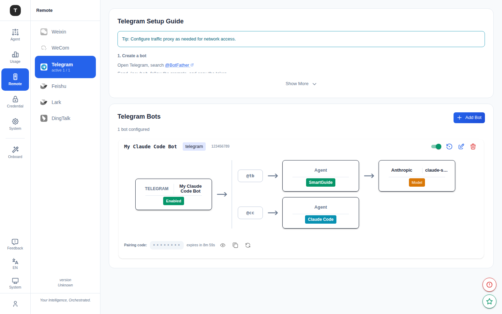

# Remote Control

Path: `/remote-control/:platform` (Full Edition)



The Remote Control feature enables controlling Claude Code remotely through mainstream IM platforms (instant messaging tools), allowing you to send commands and receive results anywhere, anytime.

> **Note**: Remote Control is available in **Full Edition** only.

---

## Supported Platforms

All supported platforms appear under the **Remote** group in the left sidebar:

| Platform | Path |
|----------|------|
| WeChat (Weixin) | `/remote-control/weixin` |
| WeCom (Enterprise WeChat) | `/remote-control/wecom` |
| Telegram | `/remote-control/telegram` |
| Feishu | `/remote-control/feishu` |
| Lark | `/remote-control/lark` |
| DingTalk | `/remote-control/dingtalk` |
| QQ | `/remote-control/qq` |
| Discord | `/remote-control/discord` |
| Slack | `/remote-control/slack` |

---

## Page Structure

Each platform page has a consistent structure:

### Platform Setup Guide (collapsible)

When expanded, shows bot configuration instructions for that platform:
- How to create a bot on the platform
- Which credentials to obtain (Token, Secret, etc.)
- How to set a webhook URL (if applicable)

### Bot List

Shows all configured bots for the current platform:
- Bot name/alias
- Status indicator (running / stopped / error)
- Summary count (`active N / total N`)

### Actions

Each bot card provides:
- **Enable/Disable** toggle
- **Restart** button
- **Delete** button
- **Edit** configuration

---

## Adding a Bot

Click **Add Bot** and fill in the configuration form:

| Field | Description |
|-------|-------------|
| **Name** | Bot alias (optional, for identification) |
| **Platform** | Platform selection (pre-selected on current page) |
| **Token** | Platform API Token / Bot Token |
| **Proxy URL** | HTTP/HTTPS proxy (optional, for restricted platform access) |
| **Chat ID Lock** | Restrict the bot to only respond to a specific chat ID (optional) |
| **Bash Allowlist** | Allowed shell commands (multi-line, optional) |
| **Model** | Specify the AI model this bot uses |
| **Working Directory** | Default working directory |

### WeChat Special Configuration

WeChat bots use **QR code scanning** instead of a token. After configuration, the system displays a QR code to scan for login.

---

## Bot Security Settings

### Chat ID Lock

Enter a chat ID (group ID or user ID) to restrict the bot to only respond to messages from that specific conversation, preventing unauthorized users from controlling the bot.

### Bash Allowlist

One command pattern per line — limits which shell commands the bot can execute. Commands not in the allowlist will be rejected. Example:

```
ls
cat *.md
git status
git diff
```

---

## Usage

Once configured, find the bot in the corresponding IM platform and send messages:

- Send a code request → Bot calls Claude Code to execute it
- Query status → Bot returns current run status
- Send a file → Bot processes the file in the working directory

---

## Related Pages

- [Remote Coder](./13-remote-coder.md)
- [System Settings](./17-system-settings.md)
