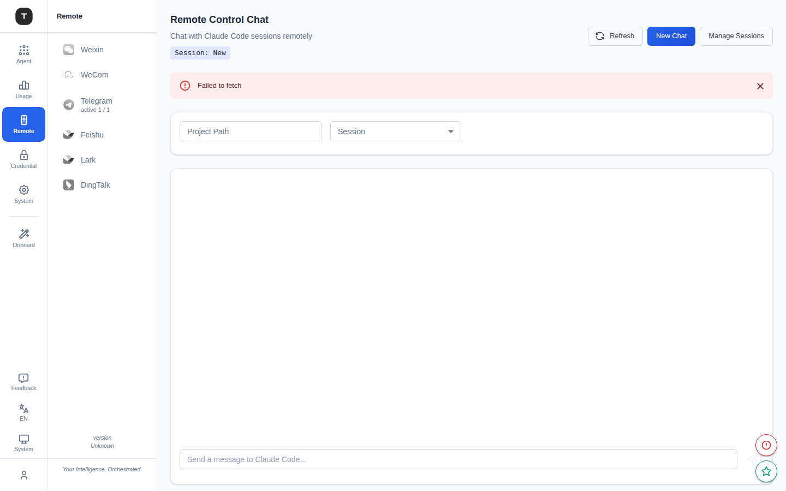

# Remote Coder

Paths: `/remote-coder/chat`, `/remote-coder/sessions`

Remote Coder provides a browser-based chat interface to interact with Claude Code sessions directly, along with session management and monitoring capabilities.

---

## Chat Page (`/remote-coder/chat`)

### Page Structure

**Top bar:**
- Current session ID display
- **New Chat** button: Create a new session
- **Manage Sessions** button: Navigate to session management

**Configuration area:**
- **Session selector**: Dropdown to choose an existing session
- **Project Path field**: Specify the Claude Code working directory (required before the first message)

**Conversation area:**
- Chat history with auto-scrolling to the latest message
- Message summaries with expand/collapse toggles for full content
- `Claude Code is thinking...` loading indicator
- Error alert area

**Input area:**
- Multi-line text input (`Shift+Enter` for newline, `Enter` to send)

---

## Usage Flow

1. Go to `/remote-coder/chat`
2. Enter the project path in **Project Path** (e.g. `/home/user/my-project`)
3. Select an existing session or send the first message to automatically create a new one
4. Type your request in the input box, e.g.: `Analyze the structure of this project` or `Fix the bug on line 42`
5. Wait for Claude Code to execute and return results

---

## Sessions Page (`/remote-coder/sessions`)

### Page Structure

**Summary Cards (top):**

| Metric | Description |
|--------|-------------|
| Total | Total session count |
| Active | Running sessions |
| Completed | Successfully completed sessions |
| Failed | Failed sessions |
| Closed | Manually closed sessions |
| Uptime | Service uptime |

**Left Panel (40% width): Session List**

- Status filter: All / Running / Completed / Failed / Closed
- Search box: Filter by session ID or content
- Each session shows: ID, status badge, timestamp

**Right Panel (60% width): Session Details**

Click a session on the left to see on the right:
- Full request content
- Response summary
- Error message (if any)
- Session metadata

### Actions

- **Refresh** button: Manually refresh the session list
- **Clear All Sessions** button: Clear all session records (requires confirmation)

---

## Comparison with Remote Control

| | Remote Coder | Remote Control |
|-|-------------|----------------|
| Interface | Web browser chat | IM platform messages |
| Latency | Real-time (Web Push) | Depends on platform push delay |
| Session management | Built-in session view | No independent management |
| Best for | Developers working directly | Remote triggering on the go |

---

## Related Pages

- [Remote Control](./12-remote-control.md)
- [Scenario Overview](./02-scenario-overview.md)
