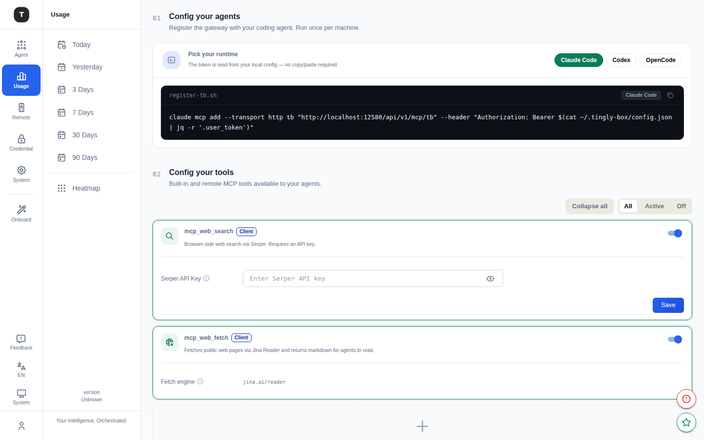

# MCP & Tools

Paths: `/mcp/sources`, `/mcp/local-mode`, `/tools/servertool`



MCP (Model Context Protocol) tool support allows registering external tool servers for Claude Code and other scenarios, including built-in web tools and custom MCP servers.

> **Note**: The MCP feature must be enabled on the [Experimental Features](./19-experimental.md) page before the sidebar entry appears.

---

## MCP Registered Servers (`/mcp/sources`)

### Two-Step Setup

**Step 1: Install Agent**

The top of the page shows agent installation instructions for configuring Tingly-Box as an MCP proxy, including a one-click-copy CLI install command.

**Step 2: Configure Tools**

Two sections:

#### Built-in Web Tools

| Tool | Description |
|------|-------------|
| **mcp_web_search** | Web search tool — requires Serper API Key configuration |
| **mcp_web_fetch** | Web content fetching (Jina Reader integration) |

Each tool has an independent toggle (enable/disable) and required configuration fields (e.g. API Key input).

#### Custom MCP Servers

**Toolbar:**
- **Add Server**: Add a new custom MCP server
- Status filter: All / Active / Disabled

**Server list:**

| Column | Description |
|--------|-------------|
| Server ID | Unique server identifier |
| Connection | Connection info (command/URL) |
| Transport | Transport type badge: STDIO / HTTP / SSE |
| Visibility | Client-side or Server-side |
| Status | Enable/disable toggle |
| Actions | Edit, delete |

**Custom server configuration:**
- Server ID
- Transport type (STDIO / HTTP / SSE)
- Connection parameters (command or URL)
- Visibility setting

---

## MCP Local Mode (`/mcp/local-mode`)

Configure Claude Code CLI to use Tingly-Box as an MCP server.

### Configuration Methods

**Method 1: CLI Command**

A one-click-copy Claude CLI command is provided — run it directly in the terminal:

```bash
claude mcp add tingly-box --transport sse <your-tingly-box-mcp-url>
```

**Method 2: Manual Configuration File**

The page also shows the corresponding JSON snippet to manually add to Claude Desktop's configuration file:

```json
{
  "mcpServers": {
    "tingly-box": {
      "url": "<your-tingly-box-mcp-url>",
      "type": "sse"
    }
  }
}
```

The page notes the default Claude Desktop config file path for each OS (macOS / Linux / Windows).

---

## Server Tool (`/tools/servertool`)

Path: `/tools/servertool`

View and test the MCP tools currently available on the Tingly-Box server side.

---

## Related Pages

- [Experimental Features](./19-experimental.md)
- [Guardrails](./15-guardrails.md)
- [Claude Code Scenario](./03-scenario-claude-code.md)
