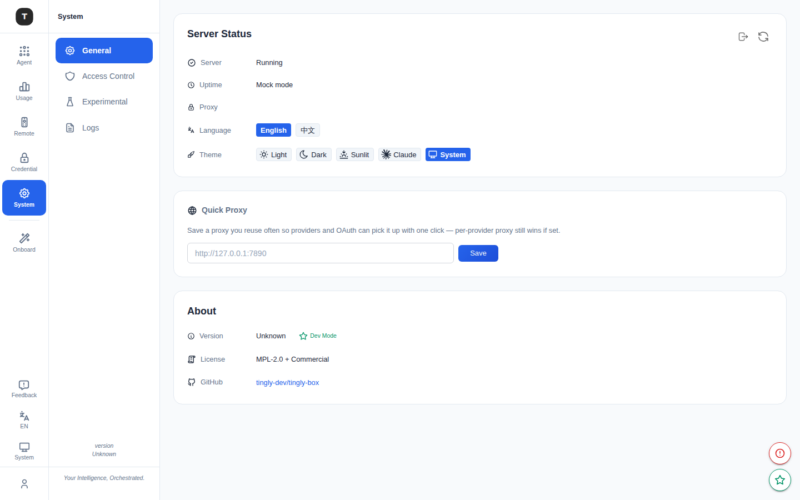

# System Settings

Paths: `/system`, `/system/logs`

The System Settings page provides global preference configuration, server status monitoring, proxy settings, language/theme switching, and log viewing.

---

## System Settings Main Page (`/system`)

### Server Status Card

Real-time display of Tingly-Box server status:

| Field | Description |
|-------|-------------|
| Status | Running / Stopped / Unavailable |
| Uptime | How long the server has been running |

**Proxy Settings:**
- **Respect env proxy**: Toggle — when enabled, uses the system environment proxy variables (`HTTP_PROXY`, `HTTPS_PROXY`)
- When disabled, uses Direct mode (no proxy)

**Other actions:**
- **Refresh Status**: Manually refresh server status
- **Force Logout**: Force-exit the current web session (clears token, returns to login page)

**Language toggle:**
- **EN**: Switch to English interface
- **ZH**: Switch to Chinese interface

**Theme toggle:**
- **Light**: Light mode
- **Dark**: Dark mode
- **Auto**: Follow system setting

---

### Global Proxy URL Card

Configure a unified HTTP/HTTPS proxy for all outbound API requests:

1. Enter the proxy address in the text field (e.g. `http://proxy.example.com:8080`)
2. Click **Save**
3. A green checkmark icon appears when saved successfully

> The global proxy here applies to all provider requests. To configure a proxy for a specific provider only, use the Proxy URL field in the provider edit form in [Credentials](./08-credentials.md).

---

### About Card

- **Current version**: Version number display
  - Shows an update notice when a new version is available
  - Development builds show a `dev` badge
- **License**: MPL-2.0 + Commercial
- **GitHub**: Project repository link

---

## Logs Page (`/system/logs`)

Path: `/system/logs`

View real-time Tingly-Box server logs.

### Features

**Debug Mode toggle** (top-right):
- On: Log level switches to `debug` — more detailed output
- Off: Log level is `info` (default)

**LogExplorer area:**
- Real-time streaming server logs
- Scrollable history
- Each log entry includes: timestamp, level, source module, message

---

## Related Pages

- [Access Control](./18-access-control.md)
- [Experimental Features](./19-experimental.md)
- [Credentials](./08-credentials.md)
