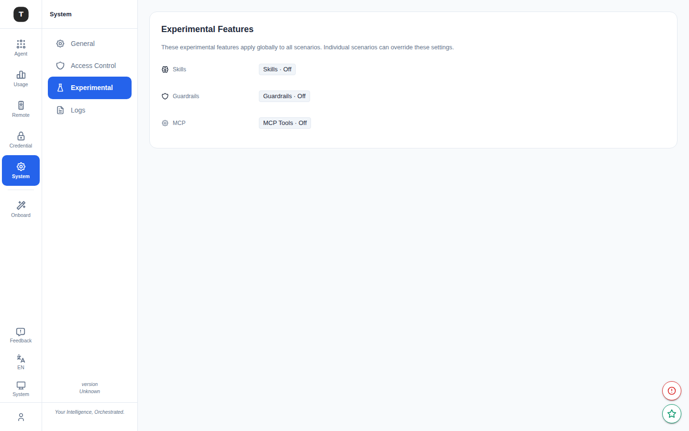

# Experimental Features

Path: `/system/experimental`

The Experimental Features page centrally manages feature toggles for capabilities that are still in early iteration. Enabling a feature makes the corresponding sidebar entry appear.

---

## Page Overview

Page title: **Experimental Features**

The page subtitle notes that these features are experimental and may change in future versions.

---

## Available Experimental Features

### Skills (IDE Skills)

**Toggle key**: `skill_ide`

When enabled, activates the **Skills** navigation item (`/prompt/skill`) under the **Prompt** group in the left sidebar, allowing syncing and managing reusable prompt snippets from IDE configuration directories.

- Only visible in **Full Edition**
- See [Prompt Management](./14-prompt-management.md) for details

---

### Guardrails

**Toggle key**: `guardrails`

When enabled, shows the **Guardrails** group in the left sidebar, containing:
- Guardrails Overview (`/guardrails`)
- Policy Groups (`/guardrails/groups`)
- Policy Rules (`/guardrails/rules`)
- Audit History (`/guardrails/history`)

An informational alert guides users on how to configure Guardrails.

See [Guardrails](./15-guardrails.md) for details.

---

### MCP Tools

**Toggle key**: `mcp`

When enabled, shows the **Tools** group in the left sidebar, containing:
- MCP Registered Servers (`/mcp/sources`)
- MCP Local Mode (`/mcp/local-mode`)
- Server Tool (`/tools/servertool`)

An informational alert guides users on how to configure MCP.

See [MCP & Tools](./16-mcp-tools.md) for details.

---

## How to Enable

1. Go to **System Settings** → **Experimental** (`/system/experimental`)
2. Find the Chip toggle for the target feature
3. Click to switch to **On**
4. The sidebar refreshes immediately to show the new feature entry

---

## Disabling Experimental Features

Switch the Chip toggle to **Off** — the corresponding sidebar entry is hidden, but existing configuration data is preserved.

---

## Related Pages

- [Guardrails](./15-guardrails.md)
- [MCP & Tools](./16-mcp-tools.md)
- [Prompt Management](./14-prompt-management.md)
- [System Settings](./17-system-settings.md)
