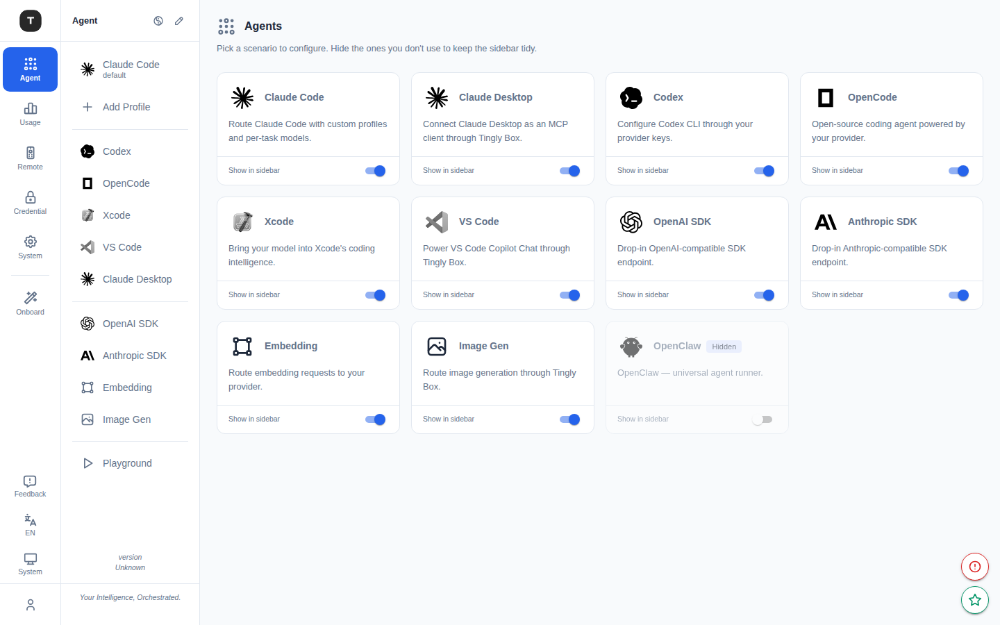

# 场景总览

路径：`/agent`

---

## 页面功能

**场景总览（Scenarios）** 是 Tingly-Box 的 Agent 场景导航中心，以卡片网格形式展示所有可用场景。

### 场景卡片

每张卡片包含：
- **图标**：场景对应工具/平台的 Logo
- **名称**：场景名称（如 Claude Code、Codex、OpenCode 等）
- **描述**：两行截断的场景简介
- **Hidden 标记**：已隐藏的场景显示灰色 `Hidden` 徽章

### 可见性管理

每张卡片底部提供一个 **开关**，用于控制该场景是否出现在左侧活动栏（Sidebar）中。

- 切换为关闭 → 场景从侧边栏隐藏，但仍可通过总览页直接访问
- 切换为开启 → 场景重新显示在侧边栏

> 仅部分场景支持隐藏，Claude Code 始终显示在侧边栏。

---

## 全部场景列表

| 场景 | 路径 | 说明 |
|------|------|------|
| Claude Code | `/agent/claude_code` | 主力 CLI 编程助手，支持 Profile 多环境 |
| Claude Desktop | `/agent/claude_desktop` | Claude 桌面客户端代理 |
| Codex | `/agent/codex` | OpenAI Codex CLI 代理 |
| OpenCode | `/agent/opencode` | OpenCode CLI 代理 |
| Xcode | `/agent/xcode` | Apple Xcode AI 功能代理 |
| VS Code | `/agent/vscode` | VS Code AI 扩展代理 |
| OpenAI | `/agent/openai` | OpenAI SDK 兼容接口 |
| Anthropic | `/agent/anthropic` | Anthropic SDK 原生接口 |
| Claw（Agent） | `/agent/agent` | OpenClaw 通用 Agent 接口 |
| Embed | `/agent/embed` | Embedding API 代理 |
| ImageGen | `/agent/imagegen` | 图像生成 API 代理 |
| Playground | `/agent/playground` | 图像生成交互测试台 |

---

## 导航结构

左侧活动栏（Activity Bar）图标对应 **Scenarios** 分组，点击后在次级侧边栏展示所有可见场景的导航项。

- 每个场景导航项支持直接点击跳转到对应配置页
- Claude Code 支持多 Profile，每个 Profile 作为独立导航子项展示

---

## 相关页面

- [Claude Code 场景](./03-scenario-claude-code.md)
- [其他编程 Agent](./04-scenario-coding-agents.md)
- [OpenAI / Anthropic SDK 代理](./05-scenario-sdk-proxy.md)
- [Claw / Embed / ImageGen](./06-scenario-special.md)
- [Playground](./07-scenario-playground.md)
