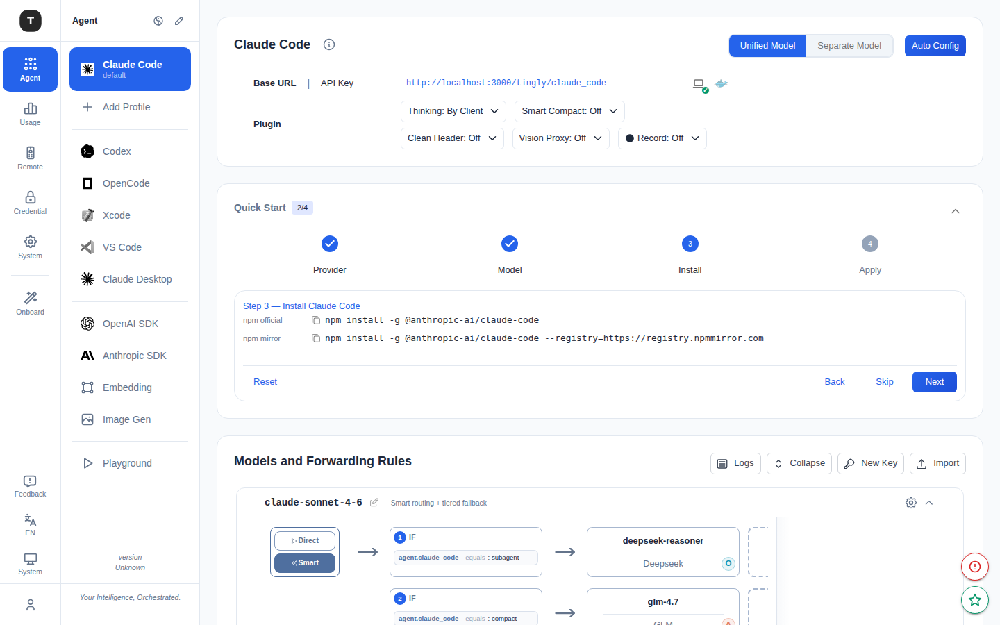

# Claude Code 场景

路径：`/agent/claude_code`

Claude Code 是 Tingly-Box 的主力场景，将 Claude Code CLI 的 API 请求代理到你配置的 Provider，支持多 Profile 管理、统一/分离模型配置和细粒度转发规则。

---

## 页面结构

页面由以下几个区域构成：

### 1. Provider 配置卡（Claude Code Configuration）

展示当前 Claude Code 场景关联的 Provider 信息：
- **Base URL**：Claude Code CLI 应配置的代理地址（含复制按钮）
- **API Key**：供 CLI 使用的令牌（含复制/显示按钮）

右上角提供 **Config** 按钮，点击后打开配置模态框，包含完整的连接配置和安装说明。

### 2. 模型配置模式切换

支持两种模式，可通过页面顶部的切换开关在两者之间切换：

| 模式 | 说明 |
|------|------|
| **Unified Model（统一模型）** | 所有请求使用同一个模型路由规则，配置简单 |
| **Separate Model（分离模型）** | 为不同类型请求（如 sonnet、haiku）分别配置路由规则 |

> 切换模式时系统会弹出确认对话框，确认后生效。

### 3. Agent 设置卡（Agent Setup）

提供 Claude Code CLI 的安装与配置引导：
- 安装命令（一键复制）
- **Apply** 按钮：将当前配置自动写入 Claude Code 的配置文件
- **Apply with Status Line** 按钮：写入配置时同时配置状态栏显示

### 4. 模型与转发规则（Models and Forwarding Rules）

可折叠区域，展示当前 Claude Code 场景的路由规则图：
- 查看所有已配置的转发规则
- 规则以图形方式展示（节点图）：入口 → 路由规则 → Provider

---

## Profile 管理

Claude Code 支持多 **Profile**（配置档案），适用于不同项目或团队使用不同 Provider/规则的场景。

### 访问 Profile

- 在左侧次级侧边栏中，Claude Code 下方会列出所有已创建的 Profile
- 每个 Profile 独立路径：`/agent/claude_code/profile/:profileId`

### Profile 配置页（`/agent/claude_code/profile/:profileId`）

与主 Claude Code 页面结构相同，但配置仅对该 Profile 生效：
- 独立的 Base URL 和 API Key（与主 Profile 不同）
- 独立的模型/转发规则配置
- Profile 名称显示在页面标题区域

### 创建 Profile

在 Claude Code 主页配置模态框中可管理 Profile 列表（创建、重命名、删除）。

---

## Zen 模式

访问 `/zen/claude_code` 或 `/zen/claude_code/profile/:profileId` 进入全屏沉浸式配置视图，隐藏侧边栏，适合专注配置单一场景。

---

## 常见配置流程

1. 确保已在 [凭证管理](./08-credentials.md) 页面添加至少一个 Provider
2. 进入 Claude Code 页面，点击 **Config** 查看代理地址和 API Key
3. 在终端中运行 `claude config set baseURL <your-base-url>`，或点击 **Apply** 自动配置
4. （可选）调整转发规则，将不同模型请求路由到不同 Provider
5. 开始使用 Claude Code CLI

---

## 相关页面

- [场景总览](./02-scenario-overview.md)
- [凭证管理](./08-credentials.md)
- [其他编程 Agent](./04-scenario-coding-agents.md)
