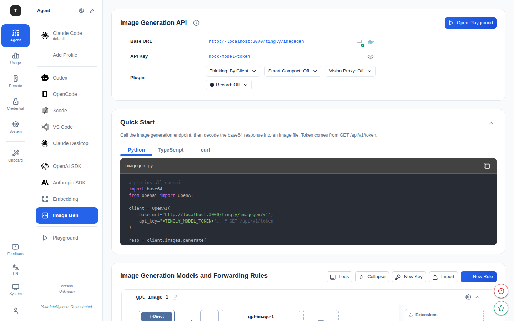

# Claw Agent / Embed / ImageGen

本章介绍三个专用场景：OpenClaw 通用 Agent、Embedding API 代理和图像生成 API 代理。

---

## Claw Agent（OpenClaw）

路径：`/agent/agent`

OpenClaw 是一个通用 Agent 接口，提供标准化的 API 端点供自定义 Agent 框架接入。

### 页面结构

1. **Provider 配置卡**：
   - **Base URL**：Agent 接口地址（含复制按钮）
   - **API Key**：访问凭证（含复制按钮）
2. **模型与转发规则**（可折叠）：配置 Agent 请求的路由规则

### 使用场景

- 自定义 Agent 框架需要统一的 API 端点
- 多个 Agent 需要共享同一组 Provider 凭证
- 需要为 Agent 访问配置独立的路由规则

---

## Embed（Embedding API）

路径：`/agent/embed`

代理 Embedding API 请求，适用于文本向量化应用。

### 页面结构

1. **Embed API 配置卡**：展示代理地址和 Key
2. **Embedding 模型与转发规则**（可折叠）：专门针对 Embedding 模型配置路由

### 使用场景

- RAG（检索增强生成）应用的文本向量化
- 语义搜索系统
- 文本相似度计算

### 接入方式

```python
from openai import OpenAI
client = OpenAI(
    base_url="<tingly-box-embed-url>",
    api_key="<tingly-box-api-key>",
)
response = client.embeddings.create(
    model="text-embedding-3-small",
    input="your text here",
)
```

---

## ImageGen（图像生成）



路径：`/agent/imagegen`

代理图像生成 API 请求（如 DALL-E 兼容接口）。

### 页面结构

1. **ImageGen API 配置卡**：展示代理地址和 Key
2. **快速入门示例**：提供 curl 示例请求，一键复制
3. **图像生成模型与转发规则**（可折叠）
4. **Open Playground** 按钮：跳转到 [Playground](./07-scenario-playground.md) 页面进行交互测试

### 接入方式

```bash
curl <tingly-box-imagegen-url>/images/generations \
  -H "Authorization: Bearer <api-key>" \
  -H "Content-Type: application/json" \
  -d '{"model": "dall-e-3", "prompt": "a cute cat", "n": 1, "size": "1024x1024"}'
```

---

## 相关页面

- [Playground（图像生成测试台）](./07-scenario-playground.md)
- [场景总览](./02-scenario-overview.md)
- [凭证管理](./08-credentials.md)
