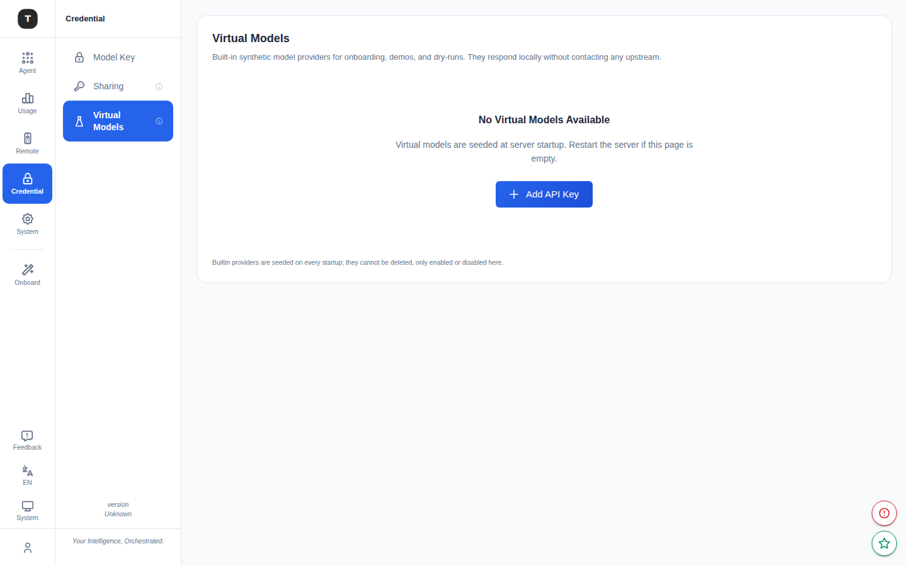

# 虚拟模型

路径：`/credentials/virtual-models`

虚拟模型（Virtual Models）是 Tingly-Box 内置的合成模型 Provider，无需真实 API Key 即可使用，适用于演示、开发调试和干运行（dry-run）场景。

---

## 页面概览

页面副标题：`Built-in synthetic model providers for onboarding, demos, and dry-runs.`

### 虚拟模型表格

展示所有内置的虚拟模型 Provider：

| 列 | 说明 |
|----|------|
| Provider | 虚拟 Provider 名称 |
| Status | 启用/禁用状态开关 |

---

## 使用场景

| 场景 | 说明 |
|------|------|
| **初始化演示** | 在未配置真实 Provider 时，通过虚拟模型走通完整 UI 流程 |
| **开发调试** | 测试转发规则配置是否正确，无需消耗真实 API 配额 |
| **功能演示** | 向团队演示 Tingly-Box 功能，无需暴露真实 API Key |

---

## 与真实 Provider 的区别

- 虚拟模型 Provider **内置**，无法通过 UI 新增或删除
- 返回的响应为**模拟内容**，不调用真实 AI 模型
- 可通过开关**启用/禁用**单个虚拟 Provider
- 适用于 Tingly-Box 的**所有场景**（Claude Code、OpenAI、Anthropic 等）

---

## 启用方式

1. 访问 `/credentials/virtual-models`
2. 找到目标虚拟 Provider
3. 将对应开关切换为**启用**

启用后，虚拟 Provider 将出现在各场景的模型路由选项中，可像真实 Provider 一样配置转发规则。

---

## 相关页面

- [凭证管理](./08-credentials.md)
- [API Tokens](./10-api-tokens.md)
