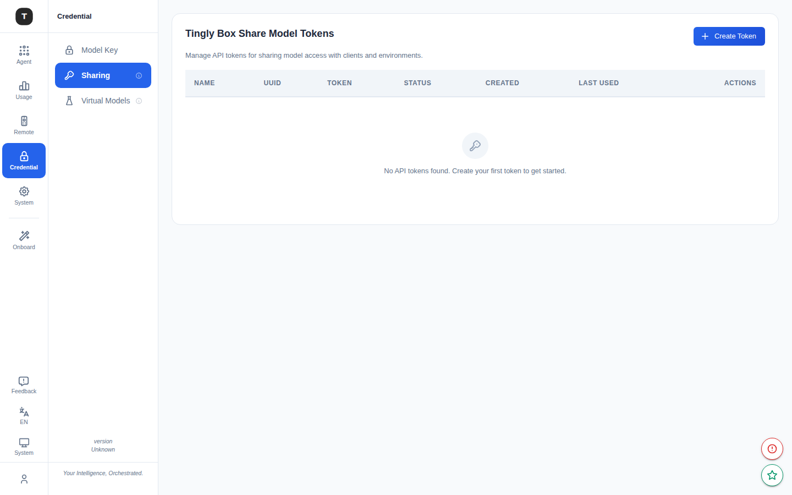

# API Tokens

路径：`/tingly-box-token`

API Tokens 页面用于管理外部客户端访问 Tingly-Box 所使用的 Bearer Token，支持创建多个具名令牌，适用于脚本、CI/CD 或第三方集成。

---



## 页面结构

### Token 列表表格

| 列 | 说明 |
|----|------|
| Name | Token 名称（创建时指定） |
| UUID | Token 唯一标识（截断显示） |
| Token | Token 值（默认脱敏，可点击显示/隐藏） |
| Status | Active / Disabled |
| Created | 创建日期 |
| Last Used | 最近使用日期 |
| Actions | 复制、显示/隐藏、删除 |

无 Token 时显示空状态图标和提示。

---

## 创建 Token

1. 点击右上角 **Create Token** 按钮
2. 在对话框中输入 **Display Name**（如 `ci-pipeline`、`my-script`）
3. 点击确认，Token 值即时生成并显示

> **注意**：Token 值仅在创建后首次显示，请立即复制保存。

---

## 使用 Token

创建的 Token 可作为 Bearer Token 用于访问 Tingly-Box 的代理接口：

```bash
curl https://<your-tingly-box>/api/... \
  -H "Authorization: Bearer <your-token>"
```

也可在 SDK 配置中作为 `api_key` 使用：

```python
client = OpenAI(
    base_url="https://<your-tingly-box>/agent/openai/v1",
    api_key="<your-token>",
)
```

---

## 管理 Token

### 查看 Token 值

点击 Token 行的眼睛图标，切换明文/脱敏显示。

### 复制 Token

点击复制图标，Token 值写入剪贴板。

### 删除 Token

点击删除图标，弹出确认对话框（显示 Token 名称），确认后永久删除。删除后该 Token 立即失效，持有该 Token 的客户端将无法再访问。

---

## 与用户令牌的区别

| | API Token | 用户令牌（User Token） |
|-|-----------|----------------------|
| 管理位置 | `/tingly-box-token` | `/access-control` |
| 用途 | 外部客户端/脚本 | Web UI 登录认证 |
| 数量 | 多个 | 单一 |
| 可命名 | 是 | 否 |

---

## 相关页面

- [访问控制](./18-access-control.md)
- [凭证管理](./08-credentials.md)
