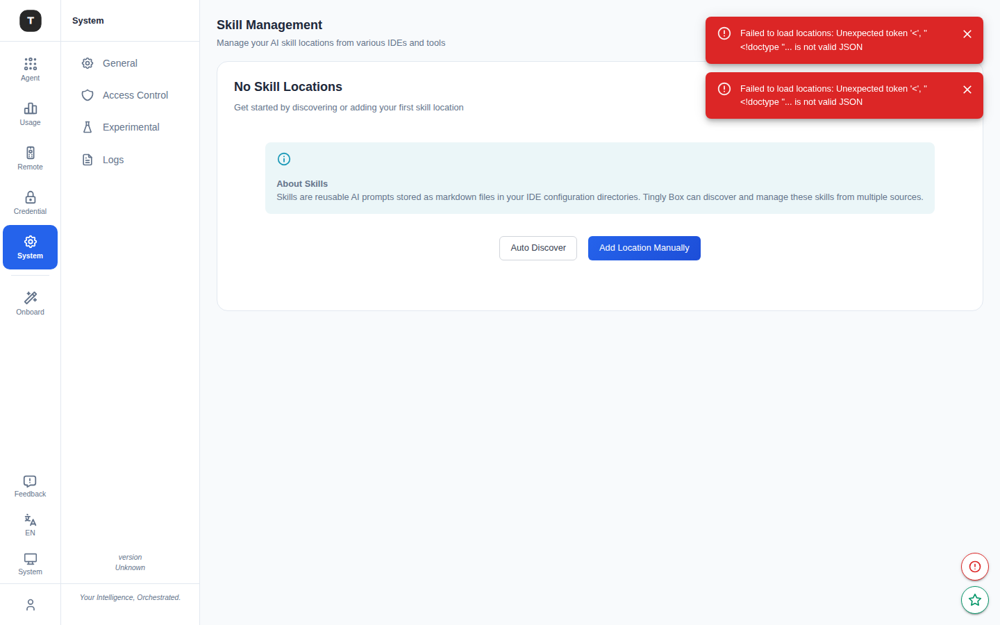

# Prompt 管理

路径：`/prompt/user`、`/prompt/skill`、`/prompt/command`（Full Edition）

Prompt 管理提供 IDE 录制浏览、Skills 管理等功能，帮助团队积累和复用 AI 编程知识。

> **注意**：Prompt 管理功能仅在 **Full Edition** 中可用，且需要在 [实验性功能](./19-experimental.md) 中开启对应开关。

---

## 用户录制（User Requests）

路径：`/prompt/user`

### 功能说明

User Requests 页面浏览和管理从 Claude Code IDE 会话中录制的交互记录，适合：
- 回顾历史 AI 辅助决策过程
- 提取成功的提示词模板
- 团队经验分享

### 三列布局

**左列：日历**
- 日历视图，日期上显示录制条数
- 范围筛选按钮（今日/本周/本月/全部）

**中列：录制列表**
- 搜索框：按内容搜索
- User 筛选：按录制用户过滤
- Project 筛选：按项目过滤
- Type 筛选：code-review / debug / refactor / test
- 每条录制显示标题、类型徽章、时间

**右列：录制详情**
- 摘要（Summary）
- 元数据：用户、项目、类型、时长、模型、时间戳
- 完整对话内容

---

## Skills 管理

路径：`/prompt/skill`

### 功能说明

Skills 页面管理从 IDE 配置（如 `.claude/skills/` 目录）同步的可复用 Prompt 片段，支持：
- 从多个 IDE 来源自动发现 Skills
- 分组浏览和搜索
- 查看 Skill 的 Markdown/原始内容

### 三列布局

**左列：Skill 位置（Locations）**

每个 Skill 位置（Location）对应一个目录来源：
- 位置名称
- 路径
- IDE 来源徽章（如 claude_code）
- Skill 数量
- 操作：刷新、编辑、删除

顶部按钮：
- **Add Location**：手动添加 Skill 目录
- **Auto Discovery**：自动扫描所有已配置 IDE 中的 Skill 目录

**中列：Skills 列表**

选中位置后展示该位置下的所有 Skills：
- **分组/平铺** 视图切换
- 分组策略：Auto / Pattern / Flat
- 搜索过滤

**右列：Skill 内容**

选中 Skill 后展示：
- 文件元数据（路径、大小、修改时间）
- **Markdown 渲染**视图（默认）
- **Raw** 原始文本视图
- 复制按钮

---

## Commands（命令管理）

路径：`/prompt/command`

当前状态：**Coming Soon**（功能开发中）

---

## 相关页面

- [实验性功能](./19-experimental.md)
- [Claude Code 场景](./03-scenario-claude-code.md)
