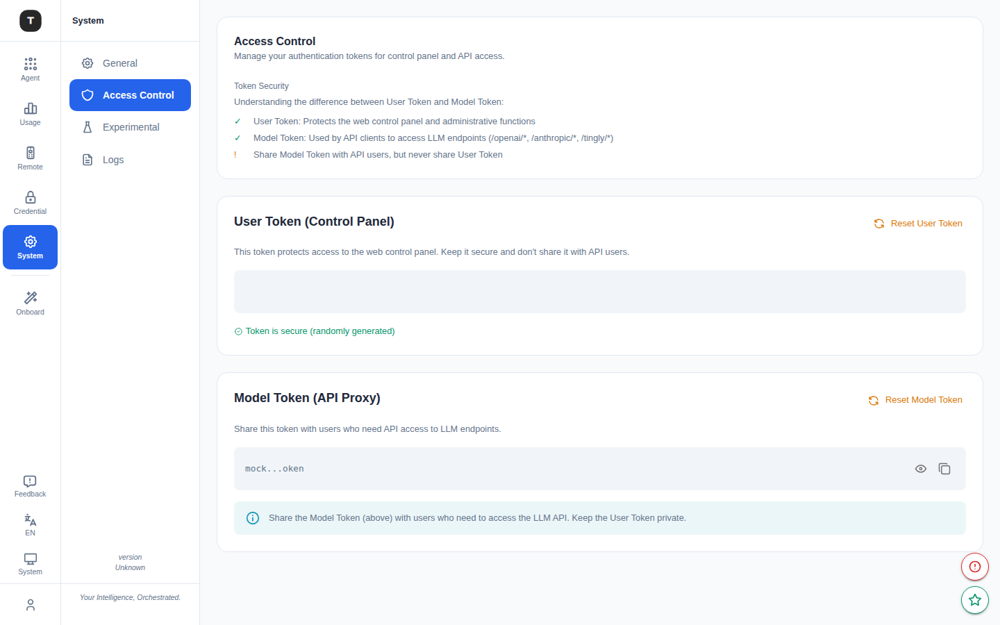

# 访问控制

路径：`/access-control`

访问控制页面管理 Tingly-Box 的核心认证令牌，包括用户令牌（Web UI 登录凭证）和模型令牌（各场景 API Key）。

---

## 用户令牌（User Token）

用于 Web UI 的登录认证。

### 查看当前令牌

- 默认脱敏显示（`••••••••`）
- 点击眼睛图标切换明文显示
- 点击复制图标将令牌复制到剪贴板

### 安全提示

页面底部显示三条安全提示：
- 不要在不受信任的网络中分享令牌
- 定期轮换令牌
- 旧令牌在重置后立即失效

若当前使用**默认令牌**（初始安装时设置），页面会显示安全警告，建议尽快重置为随机令牌。

### 重置令牌

点击 **Reset** 按钮，弹出确认对话框，说明重置后果：
- 生成新的随机令牌
- 所有使用旧令牌的会话（浏览器 Tab、脚本、CLI）将立即失效
- 需要用新令牌重新登录

确认后，新令牌显示在成功对话框中（含复制按钮），请立即保存。

---

## 模型令牌（Model Token）

模型令牌是各 Agent 场景代理接口的通用 API Key。

### 特点

- 所有场景（Claude Code、OpenAI 代理等）共享同一模型令牌
- 可与其他开发人员或环境共享，用于访问代理接口
- **不等同于**用户令牌，不能用于登录 Web UI

### 查看与复制

操作方式与用户令牌相同：眼睛图标切换显示，复制图标写入剪贴板。

### 重置模型令牌

点击 **Reset** 弹出确认对话框，确认后生成新令牌。

> **注意**：重置模型令牌后，所有配置了旧令牌的工具（Claude Code CLI、OpenAI SDK 客户端等）都需要更新令牌配置。

---

## 与 API Tokens 的关系

| | 用户令牌 | 模型令牌 | API Tokens |
|-|---------|---------|-----------|
| 页面 | `/access-control` | `/access-control` | `/tingly-box-token` |
| 数量 | 1 个 | 1 个 | 多个 |
| 用途 | Web UI 登录 | Agent 场景 API Key | 外部客户端访问 |
| 命名 | 无 | 无 | 可自定义名称 |

---

## 相关页面

- [API Tokens](./10-api-tokens.md)
- [系统设置](./17-system-settings.md)
