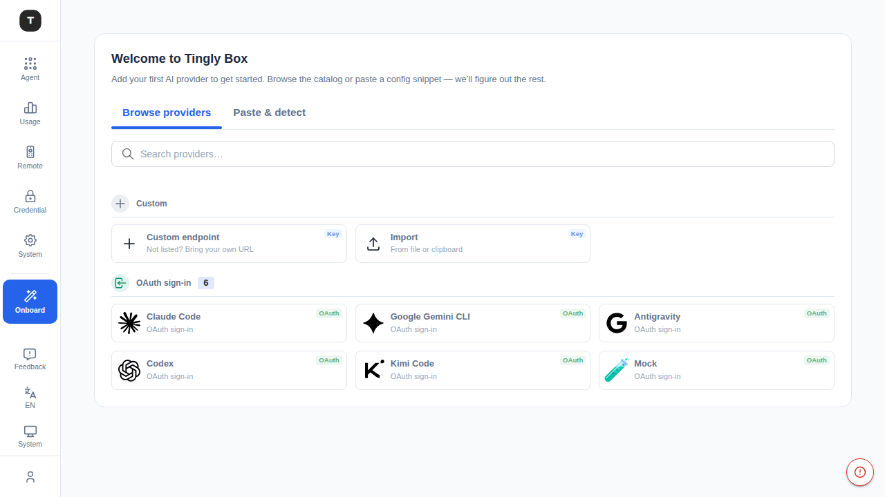
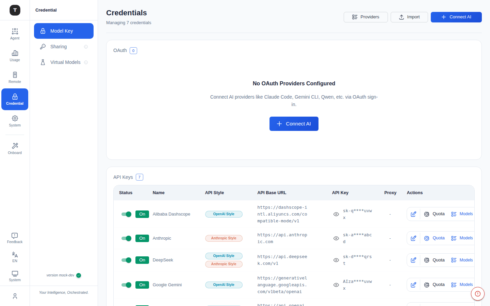

# Getting Started

This chapter guides you through the first-time startup and provider setup so that all agent scenarios are ready to use.

---

## First Launch

When you access the Tingly-Box Web UI for the first time, the system detects that no providers are configured and automatically redirects to the **Onboarding** page at `/onboarding`.

---

## Onboarding Page

Page title: **Welcome to Tingly Box**

Two methods are available to add your first AI provider:

### Method 1: Browse and Select a Provider

Switch to the **Browse providers** tab. Providers are grouped into two categories:

**Custom**
- **Custom endpoint**: Manually specify any OpenAI/Anthropic-compatible API endpoint

**OAuth sign-in**
- Lists providers that support OAuth authorization (e.g. Claude Code, Google Gemini CLI, Codex)
- Clicking one launches the OAuth flow directly — no API Key required

Scroll down to see more providers that use API Keys (Anthropic, OpenAI, DeepSeek, etc.), grouped by protocol (OpenAI / Anthropic).

After clicking a provider:
- **OAuth provider**: An OAuth authorization dialog opens automatically — complete the auth to save
- **API Key provider**: A configuration form appears — fill in:
  - **Name**: Display name (customizable)
  - **API Base**: API endpoint (pre-filled, editable)
  - **API Style**: `openai` or `anthropic`
  - **Token**: API Key
  - **Proxy URL** (optional): HTTP/HTTPS proxy address

For OAuth-enabled providers (e.g. Claude.ai), the system automatically initiates the OAuth authorization flow.

### Method 2: Paste Config for Auto-Detection

Switch to the **Paste & detect** tab:

1. Paste a provider configuration snippet (JSON or YAML) into the input area
2. The system automatically parses and identifies the provider type and credentials
3. Confirm to save

### Completing Onboarding

After successfully adding a provider, a success dialog appears with two options:
- **Go to Agents** — Navigate to the scenario overview and start using agents
- **Stay Here** — Continue adding more providers

---

## Existing Installations: Adding Providers via Credentials

If you have already completed onboarding and need to add a new provider, go to the [Credentials](./08-credentials.md) page (`/credentials`) and click **Connect AI**. It uses the same picker as Onboarding; the full two-step "pick a type, then fill in the config" flow is documented in [Credentials · Adding a Provider](./08-credentials.md#adding-a-provider-the-connect-ai-flow).

---

## Next Steps

- Go to [Scenario Overview](./02-scenario-overview.md) to see all available agents
- See [Claude Code Configuration](./03-scenario-claude-code.md) to start with the primary scenario
