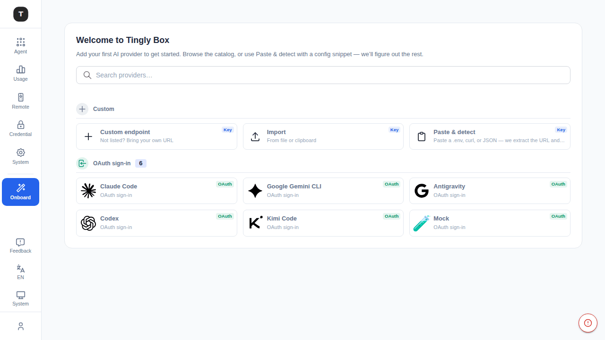
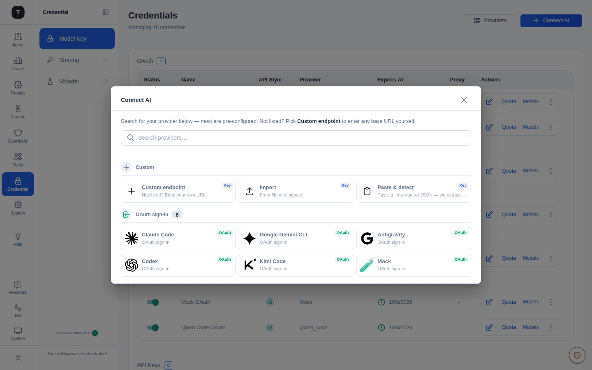

# Getting Started

This chapter guides you through the first-time startup and provider setup so that all agent scenarios are ready to use.

---

## First Launch

When you access the Tingly-Box Web UI for the first time, the system detects that no providers are configured and automatically redirects to the **Onboarding** page at `/onboarding`.

---

## Onboarding Page

Page title: **Welcome to Tingly Box**. Subtitle: *"Add your first AI provider to get started. Browse the catalog, or use Paste & detect with a config snippet — we'll figure out the rest."*

Onboarding now uses the exact same unified picker as the **Connect AI** button elsewhere in the app (Credentials, scenario pages, etc.) — there's no separate onboarding-only flow to learn. A search box sits at the top, followed by:

**Custom** section — three cards:
- **Custom endpoint**: manually specify any OpenAI/Anthropic-compatible API endpoint
- **Import**: import a provider config from a file or the clipboard
- **Paste & detect**: paste a `.env` file, curl command, or JSON snippet — Tingly-Box extracts the URL and credentials automatically

**OAuth sign-in** section — providers that support OAuth authorization (Claude Code, Google Gemini CLI, Antigravity, Codex, Kimi Code, etc.). Clicking one launches the OAuth flow directly — no API Key required, and the token is saved automatically once you authorize.

Scroll down for more providers that use API Keys, grouped by region and protocol (OpenAI / Anthropic).

Choosing any non-OAuth provider opens a config form — see [Credentials · Adding a Provider](./08-credentials.md#adding-a-provider-the-connect-ai-flow) for the full field-by-field breakdown (Base URL, API Key, API Style, Proxy URL, etc.).

### Completing Onboarding

After successfully adding a provider, a success dialog appears with two options:
- **Go to Agents** — Navigate to the scenario overview and start using agents
- **Stay Here** — Continue adding more providers

---

## Existing Installations: Adding Providers via Credentials

If you have already completed onboarding and need to add a new provider, go to the [Credentials](./08-credentials.md) page (`/credentials`) and click **Connect AI**. It uses the same picker as Onboarding; the full two-step "pick a type, then fill in the config" flow is documented in [Credentials · Adding a Provider](./08-credentials.md#adding-a-provider-the-connect-ai-flow).

---

## Next Steps

- Go to [Scenario Overview](./02-scenario-overview.md) to see all available agents
- See [Claude Code Configuration](./03-scenario-claude-code.md) to start with the primary scenario
