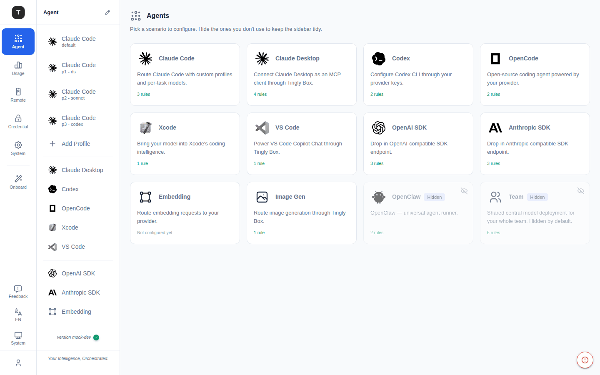

# Scenario Overview

Path: `/agent`

---

## Page Function

The **Agents** page is Tingly-Box's agent navigation hub, displaying all available scenarios as a card grid. Page subtitle: *"Pick a scenario to configure. Hide the ones you don't use to keep the sidebar tidy."*

### Scenario Cards

Each card contains:
- **Icon**: The logo of the tool/platform the scenario represents
- **Name**: Scenario name (e.g. Claude Code, Codex, OpenCode)
- **Description**: A two-line truncated summary
- **Status line**: The card's live configuration state — a rule count (e.g. `3 rules`) if any routing rules exist, or `Not configured yet` if none do — so the page answers "what have I already set up?" at a glance
- **Hidden badge**: Gray `Hidden` badge shown on hidden scenarios

### Visibility Management

A small **eye icon** in the card's top-right corner controls whether the scenario appears in the left sidebar (Activity Bar). It's hidden by default and only appears on hover (or always-on for already-hidden cards), so it doesn't compete with the scenario name/description for attention.

- Click to hide → scenario is hidden from the sidebar but still directly accessible via the overview page (shown with a `Hidden` badge and a crossed-out eye icon)
- Click to unhide → scenario reappears in the sidebar

> Only certain scenarios support hiding; Claude Code always appears in the sidebar.

---

## Full Scenario List

| Scenario | Path | Description |
|----------|------|-------------|
| Claude Code | `/agent/claude_code` | Route Claude Code with custom profiles and per-task models |
| Claude Desktop | `/agent/claude_desktop` | Connect Claude Desktop as an MCP client through Tingly Box |
| Codex | `/agent/codex` | Configure Codex CLI through your provider keys |
| OpenCode | `/agent/opencode` | Open-source coding agent powered by your provider |
| Xcode | `/agent/xcode` | Bring your model into Xcode's coding intelligence |
| VS Code | `/agent/vscode` | Power VS Code Copilot Chat through Tingly Box |
| OpenAI SDK | `/agent/openai` | Drop-in OpenAI-compatible SDK endpoint |
| Anthropic SDK | `/agent/anthropic` | Drop-in Anthropic-compatible SDK endpoint |
| Embedding | `/agent/embed` | Route embedding requests to your provider |
| Image Gen | `/agent/imagegen` | Route image generation through Tingly Box |
| OpenClaw | `/agent/agent` | Universal agent runner (hidden by default) |
| Team | `/agent/team` | Shared central model deployment for your whole team (hidden by default) |
| Playground | `/agent/playground` | Interactive image generation test bench (not part of the card grid; reached via sidebar) |

---

## Navigation Structure

The left Activity Bar icon corresponds to the **Scenarios** group. Clicking it displays all visible scenario navigation items in the secondary sidebar.

- Each scenario nav item supports direct-click navigation to the configuration page
- Claude Code supports multiple Profiles; each Profile appears as a separate sub-item

---

## Related Pages

- [Claude Code Scenario](./03-scenario-claude-code.md)
- [Other Coding Agents](./04-scenario-coding-agents.md)
- [OpenAI / Anthropic SDK Proxy](./05-scenario-sdk-proxy.md)
- [Claw / Embed / ImageGen](./06-scenario-special.md)
- [Playground](./07-scenario-playground.md)
