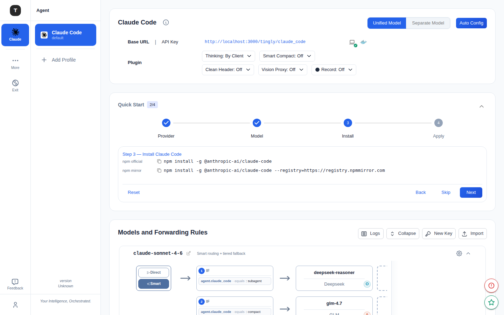

# Claude Code Scenario

Path: `/agent/claude_code`

Claude Code is Tingly-Box's primary scenario. It proxies Claude Code CLI API requests to your configured providers, with support for multiple profiles, unified/separate model modes, and fine-grained forwarding rules.

---


## Page Structure

The page is organized top to bottom as follows:

### 1. Provider Configuration Card (Claude Code Configuration)

Shows the connection information for the current Claude Code scenario:
- **Base URL**: The proxy address Claude Code CLI should use (with copy button)
- **API Key**: Token for CLI use (with copy/reveal button)

Three buttons in the top-right:
- **Unified Model / Separate Model**: Switch model configuration mode (see below)
- **Auto Config**: Quick-config button — opens the configuration wizard modal

#### Plugin Toggles

The **Plugin** row in the config card provides several scenario-level plugin dropdowns:

| Plugin | Description |
|--------|-------------|
| **Thinking** | Controls extended thinking strategy: `By Client` (Claude Code decides) / `Force On` / `Force Off` |
| **Smart Compact** | Compresses conversation history to save tokens: `Off` / `On` |
| **Clean Header** | Removes unnecessary headers to avoid provider compatibility issues: `Off` / `On` |
| **Vision Proxy** | Proxies image URLs so providers that can't reach external images still work: `Off` / `On` |
| **Record** | Records Claude Code sessions to Prompt Management (requires Skills experimental feature): `Off` / `On` |

---

### 2. Quick Start Stepper

A **4-step onboarding card** shown on first use (collapsible, progress persisted in browser local storage):

| Step | Description |
|------|-------------|
| 1. Provider | A provider has been added (auto-marked complete) |
| 2. Model | A model is selected in the forwarding rules |
| 3. Install | Install Claude Code CLI (npm official and npm mirror commands provided) |
| 4. Apply | Run Auto Config to write the configuration locally |

Navigate freely with **Back / Skip / Next**. Click **Reset** to clear all step progress.

---

### 3. Model Configuration Mode

Toggle **Unified Model** or **Separate Model** in the top-right:

| Mode | Description |
|------|-------------|
| **Unified Model** | All requests share one forwarding rule (`built-in-cc`) — simple, ideal for a single provider |
| **Separate Model** | Separate routing rules for default / haiku / sonnet / opus / subagent request types |

> **Important**: After switching modes, you must click **Auto Config** again to write the new configuration to Claude Code — the CLI won't pick it up automatically.

---

### 4. Auto Config Wizard


Click **Auto Config** to open the **Claude Code Configuration Guide** modal with two tabs:

**Auto Config Tab (recommended)**

- **Model routing**: 5 model slots matching Claude Code's internal use cases:
  - `ANTHROPIC_MODEL` (Default model)
  - `ANTHROPIC_DEFAULT_HAIKU_MODEL` (Haiku slot — lightweight tasks)
  - `ANTHROPIC_DEFAULT_SONNET_MODEL` (Sonnet slot — primary tasks)
  - `ANTHROPIC_DEFAULT_OPUS_MODEL` (Opus slot — complex reasoning)
  - `CLAUDE_CODE_SUBAGENT_MODEL` (Sub-agent model — sub-task delegation)

  Each slot auto-populates from current forwarding rules and can be overridden manually.

- **Performance & limits**:
  - `API_TIMEOUT_MS`: API request timeout (ms)
  - `CLAUDE_CODE_MAX_OUTPUT_TOKENS`: Max output token count
  - `MAX_THINKING_TOKENS`: Thinking token budget (blank = model default)
  - `BASH_DEFAULT_TIMEOUT_MS`: Bash command default timeout
  - `BASH_MAX_TIMEOUT_MS`: Bash command max timeout

- **Preview generated env**: Preview the env variable block that will be written to `~/.claude/settings.json`

Bottom buttons:
- **Auto Config**: Writes configuration to Claude Code's config file; shows a result list of created/updated/backed-up files
- **Auto Config & Status Line**: Same as above, plus configures the Claude Code status bar integration

**Manual Tab**

Shows and allows direct editing of the raw configuration scripts (JSON / PowerShell / Bash), for advanced users or manual deployments.

---

### 5. Models and Forwarding Rules

A collapsible node graph at the bottom showing the full routing chain for the current scenario:

```
Entry node (Direct/Smart) → IF condition (e.g. agent.claude_code = subagent) → Provider
```

- Each rule can be expanded to see condition details
- Top-right: **Logs** (view routing logs), **New Key** (add a forwarding rule), **Import**
- Provider cards in the graph show model name and provider source

---

## Zen Mode



Paths: `/zen/claude_code`, `/zen/claude_code/profile/:profileId`

Zen Mode strips the Activity Bar down to a minimal state (only the current scenario icon plus More / Exit), while the main content area is identical to normal mode. Ideal for operating in a dedicated window or on smaller screens with focus on a single scenario.

To enter Zen Mode:
- Click **More** at the bottom of the sidebar → select the Zen entry
- Navigate directly to `/zen/claude_code`

To exit: click **Exit** in the bottom-left.

---

## Profile Management

Claude Code supports multiple **Profiles** for projects or teams that need different providers or routing rules.

- All profiles are listed below Claude Code in the sidebar — click to switch
- Each profile has an independent path: `/agent/claude_code/profile/:profileId`
- Each profile has its own Base URL, API Key, and forwarding rules
- Profile pages additionally offer **npx** / **global** install mode:
  - `npx -y tingly-box@{version} cc --profile {profileId}`
  - `tingly-box cc --profile {profileId}`

---

## Common Configuration Flow

1. Add at least one provider in [Credentials](./08-credentials.md)
2. Open the Claude Code page and confirm the Base URL and API Key
3. (Optional) Assign specific models to different request types in the forwarding rules
4. Click **Auto Config** → review settings → **Auto Config** or **Auto Config & Status Line**
5. Start using Claude Code CLI

---

## Related Pages

- [Scenario Overview](./02-scenario-overview.md)
- [Credentials](./08-credentials.md)
- [Other Coding Agents](./04-scenario-coding-agents.md)
