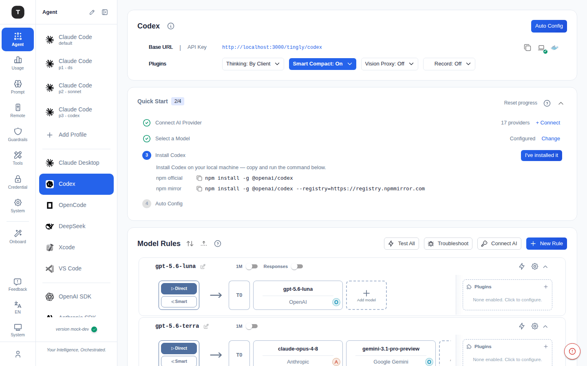

# Codex Scenario

Path: `/agent/codex`

The Codex scenario proxies OpenAI Codex CLI API requests to your configured providers, with support for automatic configuration and flexible forwarding rules.

---

## Page Structure

The page is organized top to bottom as follows:

### 1. Codex Configuration Card

Shows connection information for the current scenario:
- **Base URL**: The proxy address Codex CLI should use (with copy button)
- **API Key**: Token for CLI use (with copy/reveal button)
- **Plugins** row: the same scenario-level plugin dropdowns as Claude Code (Thinking / Smart Compact / Vision Proxy / Record) — see [Claude Code § Plugin Toggles](./03-scenario-claude-code.md#plugin-toggles)

### 2. Quick Start Stepper

Same 4-step pattern as Claude Code (Connect AI Provider → Select a Model → Install Codex → Auto Config), with **Reset progress** and a **?** (How routing works) link — see [Claude Code § Quick Start Stepper](./03-scenario-claude-code.md#2-quick-start-stepper) for details shared across all coding-agent scenarios.

### 3. Model Rules (collapsible)

Same routing-graph UI as Claude Code — **Test All** / **Troubleshoot** / **Connect AI** / **New Rule** toolbar; see [Claude Code § Model Rules](./03-scenario-claude-code.md#5-model-rules) for the full breakdown.

---

## Configuration Flow

1. Add at least one provider in [Credentials](./08-credentials.md)
2. Open the Codex scenario page and confirm the Base URL and API Key
3. Install Codex CLI (see the install command)
4. Click **Auto Config** to write the proxy configuration automatically, or set manually:
   - `OPENAI_BASE_URL`: Set to the Base URL value
   - `OPENAI_API_KEY`: Set to the API Key value
5. Use Codex CLI in your terminal

---

## Related Pages

- [Claude Code Scenario](./03-scenario-claude-code.md)
- [Other Coding Agents](./05-scenario-coding-agents.md)
- [Credentials](./08-credentials.md)
