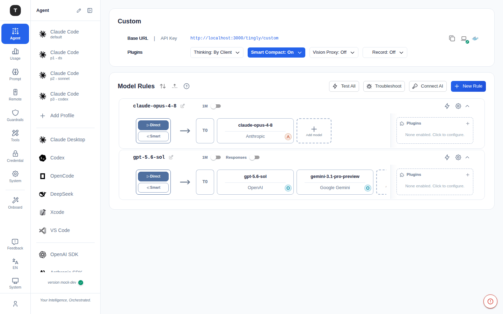

# Custom / Embed

This chapter covers two catch-all scenarios: the Custom catch-all scenario (formerly "OpenClaw") and the Embedding API proxy.

> Team and Image used to be covered here too. Both are now top-level Activity Bar entries with their own pages — see [Team](./07-team.md) and [Image](./07-image.md).

---

## Custom

Path: `/agent/custom`



The Custom scenario (previously labeled "OpenClaw" / "Claw Agent" in the sidebar) is a generic catch-all: bring your own request model name and get a standardized API endpoint for any custom agent framework to connect to. Hidden from the sidebar by default (unhide it from [Scenario Overview](./02-scenario-overview.md) if you need it).

### Page Structure

1. **Provider Configuration Card**:
   - **Base URL**: Agent interface address (with copy button)
   - **API Key**: Access credentials (with copy button)
2. **Model Rules** (collapsible): Configure routing rules for agent requests

### Use Cases

- Custom agent frameworks needing a unified API endpoint
- Multiple agents sharing the same set of provider credentials
- Independent routing rules for agent access

---

## Embed (Embedding API)

Path: `/agent/embed`

Proxies Embedding API requests, for text vectorization applications.

### Page Structure

1. **Embed API Configuration Card**: Shows proxy address and key
2. **Embedding Models and Forwarding Rules** (collapsible): Routing rules specifically for embedding models

### Use Cases

- Text vectorization for RAG (Retrieval-Augmented Generation) applications
- Semantic search systems
- Text similarity computation

### Integration

```python
from openai import OpenAI
client = OpenAI(
    base_url="<tingly-box-embed-url>",
    api_key="<tingly-box-api-key>",
)
response = client.embeddings.create(
    model="text-embedding-3-small",
    input="your text here",
)
```

---

## Related Pages

- [Scenario Overview](./02-scenario-overview.md)
- [Team](./07-team.md)
- [Image](./07-image.md)
- [Credentials](./08-credentials.md)
