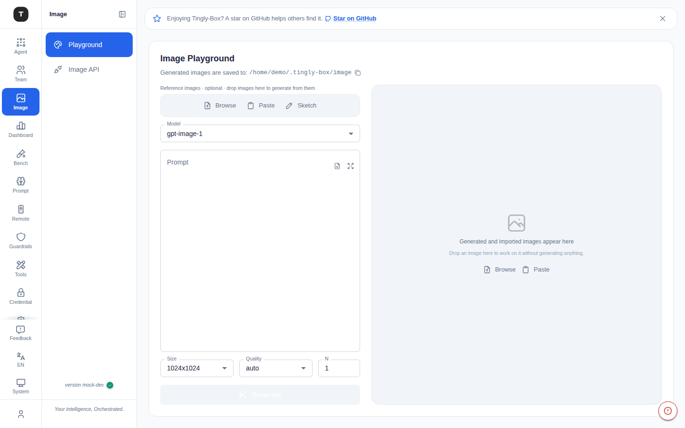
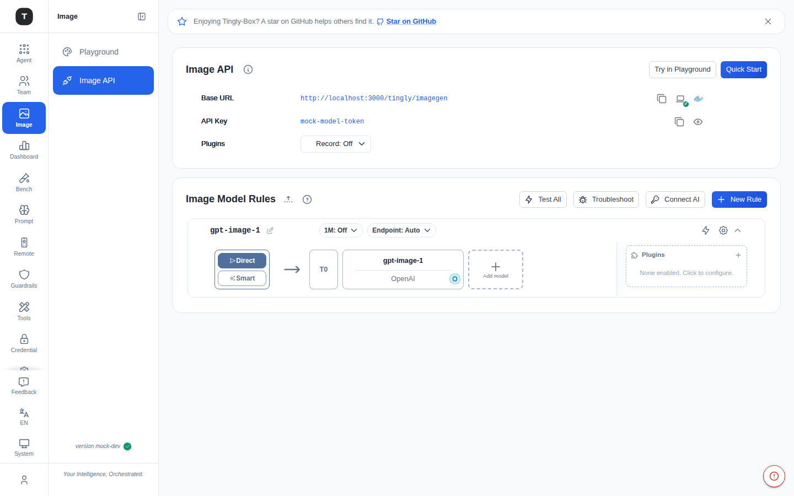
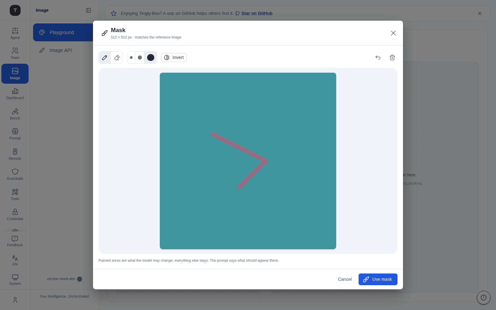
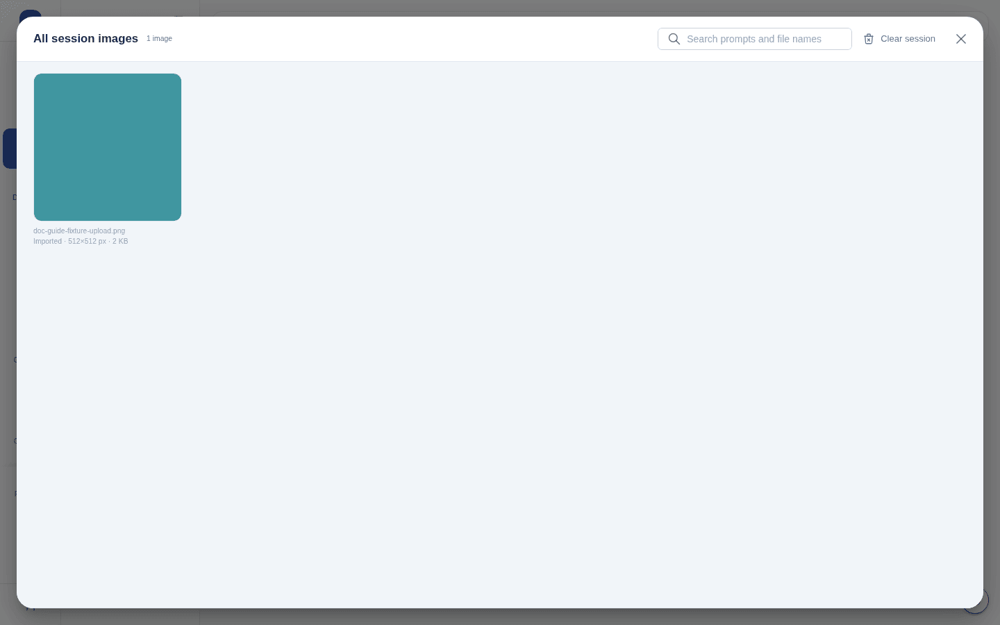

# Image

Paths: `/image/playground` (default landing, also `/image`) · `/image/api` (config; old `/agent/image` and `/agent/imagegen` redirect here)



**Image** is its own top-level entry in the left Activity Bar, with two pages: **Playground** (the day-to-day work surface) and **Image API** (base URL, Quick Start, and model rules — configured once). It used to be a single card bolted onto an Agent scenario page; it graduated to a dedicated rail item because it is used far more often than a one-time setup page, and mixing "how do I connect a client" with "I want to make a picture right now" made both questions harder to answer. Image is shown in the sidebar by default (the eye-icon toggle on [Scenario Overview](./02-scenario-overview.md) still hides/shows it, since visibility is driven by the underlying `imagegen` scenario id).

---

## Image API



The configure-once page — same shape as any scenario page:

1. **Image API Configuration Card**: Base URL (`/tingly/imagegen`) and API Key, with copy buttons; a **Quick Start** button (curl example, one-click copy); a **Try in Playground** button
2. **Image Model Rules** (collapsible): routing rules for image generation/editing models

---

## Image Playground

The interactive work surface. It has no rules of its own — it reads the same `imagegen` scenario rules configured on Image API, and every run goes through the real `/tingly/imagegen` path a client would use.

On large screens it is a full-height **workbench**, not a scrolling page: a fixed-width control column on the left (360–420px) and the results panel filling the remaining width on the right, both taking the full content-area height (minimum 600px, below which the page scrolls instead of squashing the prompt).

### Controls (left)

- **Reference images** — optional; drag & drop onto the dashed row, **Browse**, **Paste** from clipboard, or open the **Sketch** canvas, up to **5** images (PNG/JPEG/WebP). Thumbnails are draggable to reorder (or move with arrow keys), and each can carry:
  - a **mask** (brush icon) — see [Mask tool](#mask-tool) below; only the **first** image's mask is actually sent, and the row calls this out if a masked image is no longer first
  - a **sketch** (if it originated from the Sketch tool) — reopenable for further editing, since "done" isn't a lock
- **Model** dropdown, populated from Image Model Rules
- **Prompt** — a multi-row field that grows to fill remaining column height; a copy button, a button to open a text/prompt file as the prompt, and a button to expand into a larger dialog editor. Placeholder text adapts to context (masking, sketching, editing from references, or a plain new generation)
- **Size** / **Quality** (auto/low/medium/high/standard) / **N** (count, 1–10)
- **Generate** button — label adapts: "Generate", "Generate from N images" when references are attached, or "Generate another · N running" while a batch is in flight. `⌘/Ctrl + Enter` from the prompt field submits.

### Mask tool



Paint the area of the **first** reference image the model may change; everything else stays as-is, and the prompt describes what should appear in the painted region.

- **Tools**: Paint / Erase, plus **Invert** (flip which area is protected) and **Clear**
- Canvas matches the reference image's exact pixel size
- A mask can be edited or removed later, and stays attached to its image even when the row is reordered — it is dropped only if that image itself is removed

### Sketch tool

A freehand canvas at the request's configured Size — Pen/Eraser, brush size, colour, undo — for a rough sketch the prompt then describes turning into a finished image. It includes a **pose figure** add-on: drag a mannequin's joints to pose it (with presets like Standing, Walking, Sitting, Kneeling, Waving, and six camera angles from front to below), useful for describing a character's pose without drawing it by hand.

### Results panel (right)

- A **timeline** of everything in the session — generation runs and imported images together, oldest to newest — capped to the most recent entries; older items collapse into a single "view all" tile at the end rather than staying scrollable inline
- Every image (result, reference, or import) opens in one shared **lightbox viewer**: prompt, model, size/quality, copy-prompt, download, **Edit this image** (feeds it back in as a new reference, chaining edits without leaving the page), and **Split into tiles**
- A running generation can be **cancelled**; a failed one can be **retried**; any entry can be **removed** from the session (a confirm dialog notes that files already written to disk are unaffected)
- Images can be **imported** directly (drag/drop/paste/browse) as first-class working images with the same viewer and tools as a generated result — not just request parameters

### Overview (paginated gallery)



The strip above answers "what's happening right now"; **All session images** (opened from the strip) answers "where's the one I made twenty images ago" — every image in the session on one page, newest first, with:

- **Search** across prompts and file names
- **Pagination**, 24 tiles per page
- Each tile: a thumbnail, up to 3 **source-image badges** in the corner for edited results (click to open the source), hover actions (preview, use as reference, retry a failure, remove), and two caption lines (prompt or file name; model/size/quality or import dimensions/size)
- **Clear session** empties everything at once (confirmed) — the one place that shows how much there is to clear

### Split into tiles

Cuts a result into an evenly divided grid (rows × columns) via a draggable, resizable frame with an adjustable gap — for sticker sheets, contact sheets, or spritesheets. Click a tile to exclude it, then download that one tile or every remaining tile as a ZIP of PNGs.

### Multi-image and masked edits

Up to 5 reference images can be attached to a single edit request — the common cap across the providers this scenario routes to. Each image can independently carry a mask, but only the **first** image's mask is sent (the underlying API applies a mask to the first image only); the reference row is explicit about this whenever a masked image has been dragged out of the first slot.

---

## Integration

```bash
curl <tingly-box-imagegen-url>/images/generations \
  -H "Authorization: Bearer <api-key>" \
  -H "Content-Type: application/json" \
  -d '{"model": "dall-e-3", "prompt": "a cute cat", "n": 1, "size": "1024x1024"}'
```

---

## Related Pages

- [Scenario Overview](./02-scenario-overview.md)
- [Custom / Embed](./06-scenario-special.md)
- [Usage Dashboard](./11-dashboard.md)
