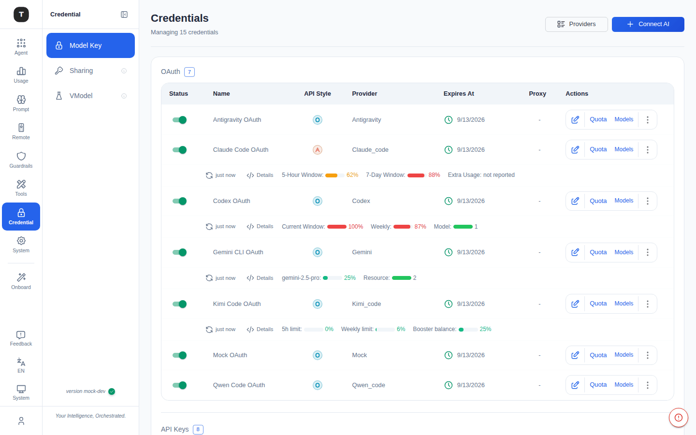
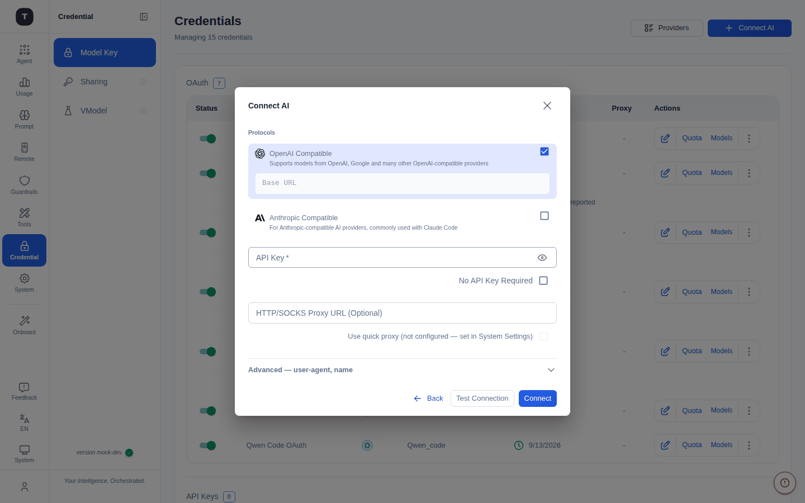

# Credentials

Path: `/credentials`

The Credentials page is the core of Tingly-Box's configuration chain. All provider API keys and OAuth credentials are centrally managed here.

---

## Page Overview

In the sidebar, this page's group is labeled **Credential** and contains three sub-pages: **Model Key** (this page), **Sharing** (see [API Tokens](./10-api-tokens.md)), and **VModel** (abbreviated from Virtual Models — see [Virtual Models](./09-virtual-models.md)).

The page header shows the total credential count (e.g. `Managing 15 credentials`). The top action bar includes:

| Button | Function |
|--------|----------|
| **Providers** | Navigates to the Onboarding page (browse all providers) |
| **Connect AI** | Opens the unified provider picker to add new credentials (same flow as Onboarding) |

> There is no bulk Import/Export for credential configs anymore — connect providers individually through Connect AI. (Guardrails' separate Protected Credentials page still offers an "Import from Credentials" shortcut — see [Guardrails](./15-guardrails.md).)

---

## Credential Types

### OAuth Table

Lists all providers connected via OAuth (e.g. Claude Code, Codex, Gemini CLI):

| Column | Description |
|--------|-------------|
| Status | Enabled/disabled toggle |
| Name | Provider display name |
| API Style | Protocol badge (OpenAI / Anthropic) |
| Provider | Underlying provider key |
| Expires At | Token expiration date |
| Proxy | Per-credential proxy, if set |
| Actions | Edit, Quota, Models, more (⋮) |

Providers with usage/plan data show a live **quota strip** beneath their row — e.g. Claude Code OAuth shows *5-Hour Window* and *7-Day Window* usage bars plus extra-usage status; Codex shows *Current Window* and *Weekly* bars; Gemini/Kimi/Qwen show their own plan-specific meters. A **Details** link and a relative refresh timestamp (`just now`) sit alongside each strip.

### API Keys Table

Lists all providers connected via API Key:

| Column | Description |
|--------|-------------|
| Status | Enabled/disabled toggle |
| Name | Provider display name |
| API Style | Protocol badge (OpenAI / Anthropic — dual badge for fusion providers) |
| API Base URL | The endpoint address |
| API Key | Masked value, with a reveal (eye) icon |
| Proxy | Per-credential proxy, if set |
| Actions | Edit, Quota, Models, more (⋮) |

Providers with a quota API show the same live usage strip under their row as OAuth credentials do; providers without one show a note instead (e.g. `quota API not available — see the OpenAI dashboard`).

---

## Adding a Provider (the Connect AI flow)

Click **Connect AI** to open the provider picker. This is the single entry point for connecting any AI service, and it works in two steps: **pick a type, then fill in the config**.

### Step 1: Pick a provider

A search box (filters by name) sits at the top; below it providers are grouped by connection type, and each card carries a coloured badge marking its kind:

| Section | What's in it | What happens on click |
|---------|--------------|------------------------|
| **Custom** | `Custom endpoint` (bring your own Base URL), `Import` (from file or clipboard), `Paste & detect` (paste a `.env`, curl command, or JSON snippet — Tingly extracts the provider config for you) | Opens a blank config form / the import dialog / the paste-and-detect flow |
| **OAuth sign-in** | Providers that support OAuth (Claude Code, Google Gemini CLI, Codex, …) | **Launches the OAuth flow directly** — no API key needed |
| **Self-hosted** | Locally hosted services (e.g. Ollama); the card shows `localhost:port` | Opens the config form with the Base URL pre-filled but **editable** (adjust to your host/port) |
| **API key providers** | Cloud providers accessed via API key, grouped by region (CN / Global); each card shows its protocol (OpenAI · Anthropic) | Opens the config form with name and Base URL pre-filled |

> Most providers are pre-configured, so you'll only be asked for what they need. Not listed? Pick **Custom endpoint** to enter any base URL yourself.

### Step 2: Fill in the config form

Choosing any non-OAuth provider opens the config form:

- **Base URL** (required): the API endpoint. Pre-filled for known providers; freely editable for Custom / Self-hosted
- **API Key** (required): the access token. For a local service with no auth, flip the **No API Key Required** toggle to skip it
- **API Style (protocol)**:
  - **OpenAI Compatible** (recommended): most endpoints speak the OpenAI API — start here unless you know otherwise
  - **Anthropic**: native Anthropic protocol
  - Both can be enabled at once (a fusion provider), letting one credential serve both OpenAI and Anthropic inbound protocols
- **Proxy URL** (optional, under advanced): route this provider through a dedicated HTTP proxy
- **User Agent** (optional, under advanced): custom request header

Click **Test** to verify connectivity, then **Save**.

> **OAuth providers are the exception**: selecting an OAuth card in step 1 jumps straight to the authorization page — there's no step-2 form, and the token is saved automatically once you authorize.

---

## Editing a Provider

Click the edit icon on the right of a provider row to open the edit form. You can modify:
- Name
- API Base URL
- API Key/Token
- Proxy settings
- Enabled/disabled status

---

## Enable / Disable a Provider

Each provider row has a toggle for quick enable/disable. Disabled providers will not receive new routing requests, but their configuration is retained.

---

## Related Pages

- [Virtual Models](./09-virtual-models.md)
- [API Tokens](./10-api-tokens.md)
- [Getting Started](./01-getting-started.md)
