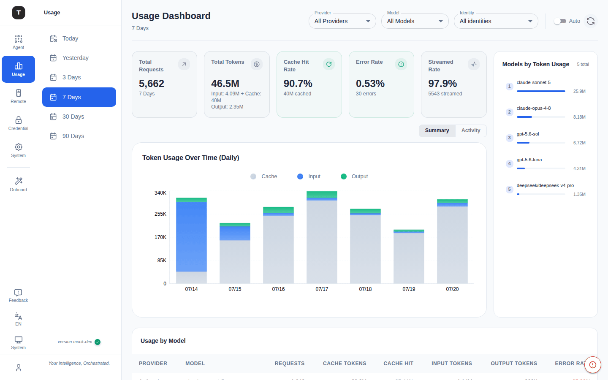
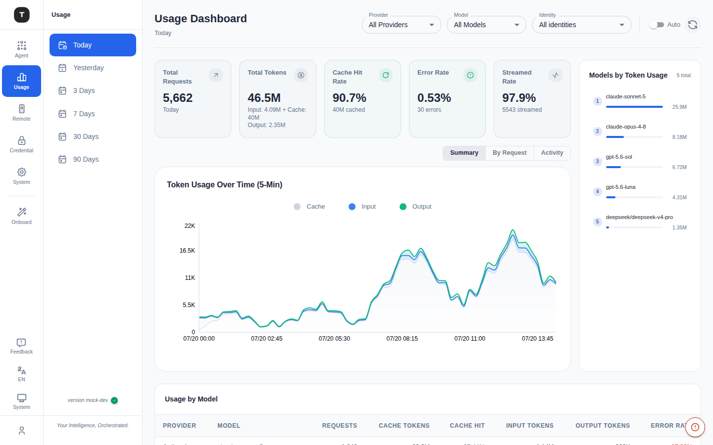
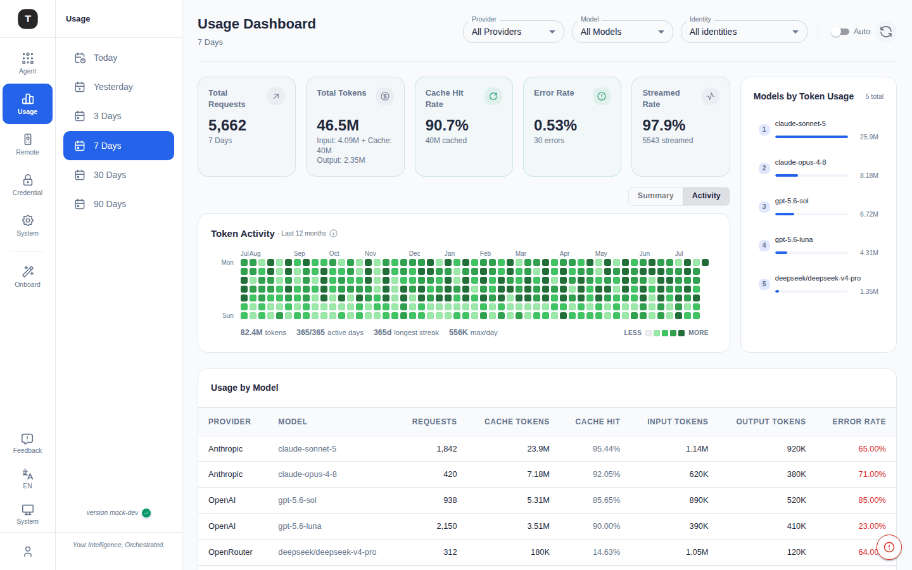

# Usage Dashboard

Path: `/dashboard/:timeRange` (default: `/dashboard/7d`)

The Usage Dashboard provides statistics and visualizations of AI request activity, helping you understand call volume, token consumption, cache hit rate, and other metrics across providers and models.

---

## Time Range Selection

Quick-switch buttons at the top of the page:

| Option | Path | Description |
|--------|------|-------------|
| Today | `/dashboard/today` | Current day (minute-level granularity, auto-refreshes every minute) |
| Yesterday | `/dashboard/yesterday` | Previous day (minute-level granularity) |
| 3D | `/dashboard/3d` | Last 3 days (daily view) |
| 7D | `/dashboard/7d` | Last 7 days (daily view, default) |
| 30D | `/dashboard/30d` | Last 30 days (daily view) |
| 90D | `/dashboard/90d` | Last 90 days (daily view) |

---

## Summary Cards

Five stat cards at the top summarize key metrics for the selected time range:

| Metric | Description |
|--------|-------------|
| **Total Requests** | Total number of requests |
| **Total Tokens** | Total token count (broken down into Input / Cache / Output) |
| **Cache Hit Rate** | Cache hit rate (percentage); green ≥50%, yellow ≥20%, orange <20% |
| **Error Rate** | Request failure rate |
| **Streamed Rate** | Proportion of streaming responses |

---

## Filters

Three dropdowns sit side by side in the top bar:

**Provider**: Groups all available providers by auth type (OAuth / API Key / Bearer Token / Basic Auth / Virtual Model). Selecting a provider filters all charts and tables to that provider's data.

**Model**: Lists all models that have data in the current time range, sorted by token usage. Selecting a model filters to that model's data.

**Identity**: Filters by the requesting user/identity (`user_id`), when available.

All three dropdowns can be combined; a **Clear filters** button appears when any is active.

---

## Auto-Refresh

An **Auto-refresh** toggle and a manual **Refresh** button are provided. When enabled, data updates automatically every minute.

---

## Chart Area

### Token History Chart

- **Today/Yesterday**: **Minute-level** token usage (Input / Cache / Output stacked bars, auto-refreshes every minute)
- **3D / 7D / 30D / 90D**: Daily token usage

### View Toggle: Summary / By Request / Activity

A toggle button group above the chart switches its display mode:
- **Summary**: The token history chart above (minute-level sparkline for Today/Yesterday, daily bars otherwise)
- **By Request**: Only shown for `today` / `yesterday` — an individual request list with time, model, token count, response time, etc.
- **Activity**: A GitHub-style contribution heatmap — see [Activity Heatmap](#activity-heatmap) below

---

## Right Panel: Models by Token Usage

Displays all models by token consumption for the current time range, with pagination:
- Model name + provider
- Token consumption with progress bar
- Click to **filter by that model** (not by provider)

---

## Bottom: Service Stats Table

Detailed breakdown by model/provider:

| Column | Description |
|--------|-------------|
| Model | Model name + provider |
| Requests | Request count |
| Input Tokens | Input token count |
| Output Tokens | Output token count |
| Cache Tokens | Cache-hit token count |
| Errors | Error count |
| Cache Hit % | Cache hit rate |
| Streamed % | Streaming response proportion |

---

## Today / Yesterday View

When **Today** or **Yesterday** is selected, the chart switches to **minute-level** granularity showing a live token curve that refreshes every minute, and the **By Request** option becomes available in the Summary/By Request/Activity toggle, showing a per-request detail list.

---

## Activity Heatmap

Click the **Activity** button in the chart-area view toggle to switch to a GitHub-style contribution heatmap, right inside the Dashboard — this used to be a standalone `/overview` page; it is now a view of the same chart pane, sharing the Provider / Model / Identity filters with the rest of the dashboard.

- **Fixed window**: Always shows the **last 365 days**, regardless of the page's selected time range (7D/30D/etc. only affects the Summary/By Request views)
- **Grid**: Horizontal axis = months, vertical axis = day of week (Mon–Sun); cell darkness = that day's token usage (darker = more)
- **Bottom stats**: Total tokens for the window, active days / total days, longest streak, and max single-day usage
- A first-load skeleton is shown instead of flashing an empty state before data arrives

---

## Related Pages

- [System Settings](./17-system-settings.md)
- [Credentials](./08-credentials.md)
