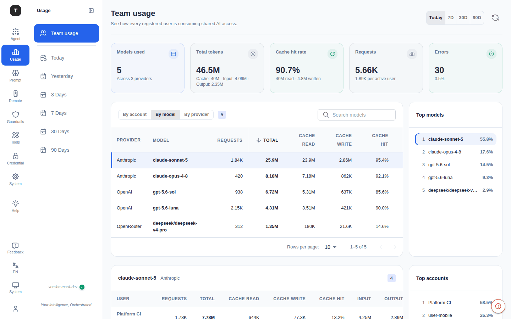

# Usage Dashboard

Path: `/dashboard/:timeRange` (default: `/dashboard/7d`); sibling page `/dashboard/users` (**Team usage**)

The Usage Dashboard provides statistics and visualizations of AI request activity, helping you understand call volume, token consumption, cache hit rate, response performance, and other metrics across providers and models.

---

## Time Range Selection

Quick-switch buttons at the top of the page. The sidebar under **Usage** lists them all, with **Team usage** (`/dashboard/users`) as a separate top-level item above the time ranges:

| Option | Path | Description |
|--------|------|-------------|
| Today | `/dashboard/today` | Current day (minute-level granularity, auto-refreshes every minute) |
| Yesterday | `/dashboard/yesterday` | Previous day (minute-level granularity) |
| 3D | `/dashboard/3d` | Last 3 days (daily view) |
| 7D | `/dashboard/7d` | Last 7 days (daily view, default) |
| 30D | `/dashboard/30d` | Last 30 days (daily view) |
| 90D | `/dashboard/90d` | Last 90 days (daily view) |

---

## Summary Cards

Five stat cards at the top summarize key metrics for the selected time range:

| Metric | Description |
|--------|-------------|
| **Total Requests** | Total number of requests |
| **Total Tokens** | Total token count (subtitle: `Input: X + Cache: Y` / `Output: Z`) |
| **Cache Hit Rate** | Cache hit rate (percentage; green ≥50%, yellow ≥20%, orange <20%); subtitle breaks the cache total into **read** vs **written** (e.g. `40M read · 4.8M written`) |
| **Error Rate** | Request failure rate |
| **Streamed Rate** | Proportion of streaming responses |

---

## Filters

Three dropdowns sit side by side in the top bar:

**Provider**: Groups all available providers by auth type (OAuth / API Key / Bearer Token / Basic Auth / Virtual Model). Selecting a provider filters all charts and tables to that provider's data.

**Model**: Lists all models that have data in the current time range, sorted by token usage. Selecting a model filters to that model's data.

**Identity**: Filters by the requesting user/identity (`user_id`), when available.

All three dropdowns can be combined; a **Clear filters** button appears when any is active.

---

## Auto-Refresh

An **Auto-refresh** toggle and a manual **Refresh** button are provided. When enabled, data updates automatically every minute.

---

## Chart Area

### Token History Chart

- **Today/Yesterday**: **Minute-level** token usage (Input / Cache / Output stacked bars, auto-refreshes every minute)
- **3D / 7D / 30D / 90D**: Daily token usage

### View Toggle: Summary / By Request / Activity

A toggle button group above the chart switches its display mode:
- **Summary**: The token history chart above (minute-level sparkline for Today/Yesterday, daily bars otherwise)
- **By Request**: Only shown for `today` / `yesterday` — an individual request list with time, model, token count, response time, etc.
- **Activity**: A GitHub-style contribution heatmap — see [Activity Heatmap](#activity-heatmap) below

---

## Left Panel: Response Performance

Replaces the older "Models by Token Usage" panel. A latency/throughput percentile table for the current time range and filters:

| Column | Description |
|--------|-------------|
| TTFT | Time to first token |
| TPS | Tokens per second |
| Latency | Total request latency |

Rows are percentiles — **P99, P95, P90, P50, P10** — each showing its sample count (`n=…`). A dash (`—`) means that percentile has no data for the metric (e.g. TPS is undefined for a request that errored before streaming any tokens).

---

## Bottom: Usage by Model Table

Detailed breakdown by model/provider (paginated):

| Column | Description |
|--------|-------------|
| Provider | Provider name |
| Model | Model name (linked) |
| Requests | Request count |
| Cache Read | Cache-read token count |
| Cache Write | Cache-write token count |
| Cache Hit | Cache hit rate (%) |
| Input Tokens | Input token count |
| Output Tokens | Output token count |
| Reasoning Tokens | Reasoning/thinking token count (0 or blank for models that don't report reasoning tokens) |
| Error Rate | Request failure rate (%) |

---

## Today / Yesterday View

When **Today** or **Yesterday** is selected, the chart switches to **minute-level** granularity showing a live token curve that refreshes every minute, and the **By Request** option becomes available in the Summary/By Request/Activity toggle, showing a per-request detail list.

---

## Activity Heatmap

Click the **Activity** button in the chart-area view toggle to switch to a GitHub-style contribution heatmap, right inside the Dashboard — this used to be a standalone `/overview` page; it is now a view of the same chart pane, sharing the Provider / Model / Identity filters with the rest of the dashboard.

- **Fixed window**: Always shows the **last 365 days**, regardless of the page's selected time range (7D/30D/etc. only affects the Summary/By Request views)
- **Grid**: Horizontal axis = months, vertical axis = day of week (Mon–Sun); cell darkness = that day's token usage (darker = more)
- **Bottom stats**: Total tokens for the window, active days / total days, longest streak, and max single-day usage
- A first-load skeleton is shown instead of flashing an empty state before data arrives

---

## Team Usage (`/dashboard/users`)

Subtitle: *"See how every registered user is consuming shared AI access."* Breaks dashboard usage down **per registered user** instead of per model/provider — useful when multiple people share one Tingly-Box instance via the shared Model Token.

### Time Range

Independent quick-switch: **Today / 7D / 30D / 90D**, plus a manual refresh button.

### Summary Cards

| Metric | Description |
|--------|-------------|
| Registered users | Total user count, with active-in-period count in the subtitle |
| Total tokens | Sum across all users; subtitle breaks down Cache / Input / Output |
| Cache hit rate | Percentage; subtitle shows cache write volume |
| Requests | Total requests; subtitle shows average per active user |
| Errors | Error count and rate |

### View: By Account / By Model / By Provider

A three-way toggle above the breakdown table switches its grouping — the summary cards above stay the same regardless of view:

**By account** (default) — one row per user, searchable by name:

| Column | Description |
|--------|-------------|
| User | Name, with a **Primary** badge for the account tied to the global Model Token, or a **Disabled** badge; subtitle shows last-used time (or `Never used`) |
| Requests | Request count |
| Total | Total tokens (sortable, default sort) |
| Cache Read / Cache Write / Cache Hit | Same cache breakdown as the main dashboard, per user |
| Input / Output / Reasoning | Token counts, including reasoning/thinking tokens |
| Error Rate | Per-user failure rate |

**By model** / **By provider** — the table pivots to one row per model (or provider) instead of per user, with the same token/cache/error columns, searchable by model/provider name. Selecting a row opens a detail panel below listing the accounts using that model/provider, subtitled with the model/provider count each account touches (e.g. *"Across 3 providers"*).

Beside the breakdown table, a **Top list** (ranked share bars) surfaces the leaders for the active view — **Top accounts**, **Top models**, or **Top providers** — each entry showing its name and percentage share of the period's total, with the remainder grouped into an **Others** row.

---

## Related Pages

- [System Settings](./17-system-settings.md)
- [Credentials](./08-credentials.md)
