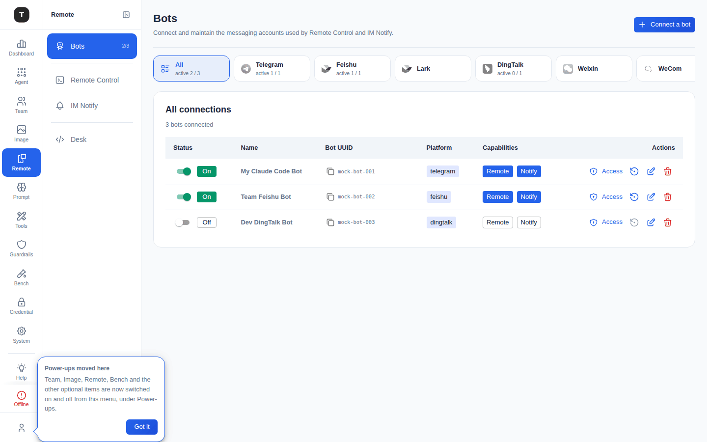
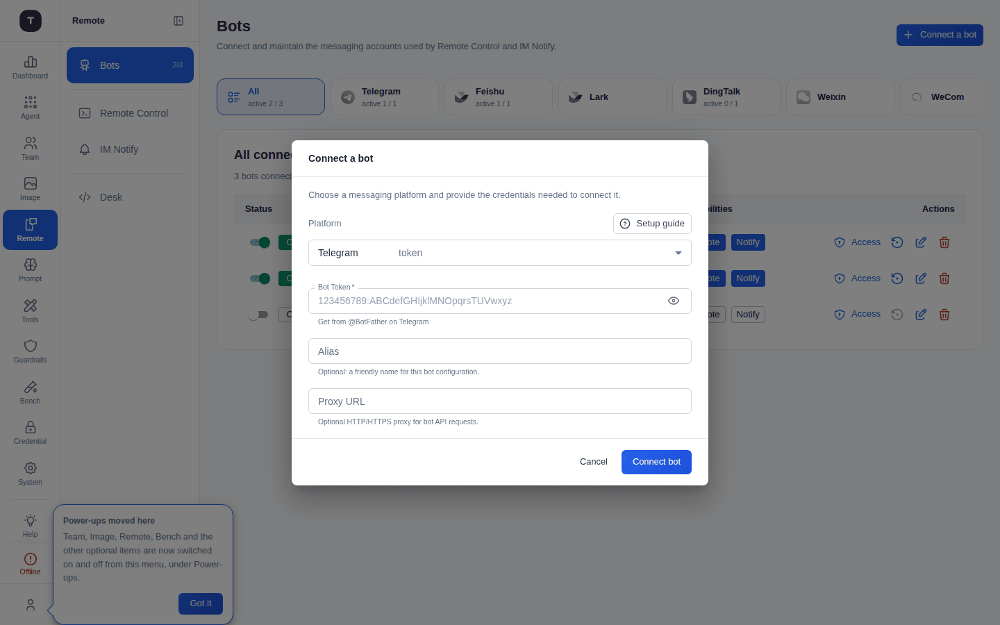
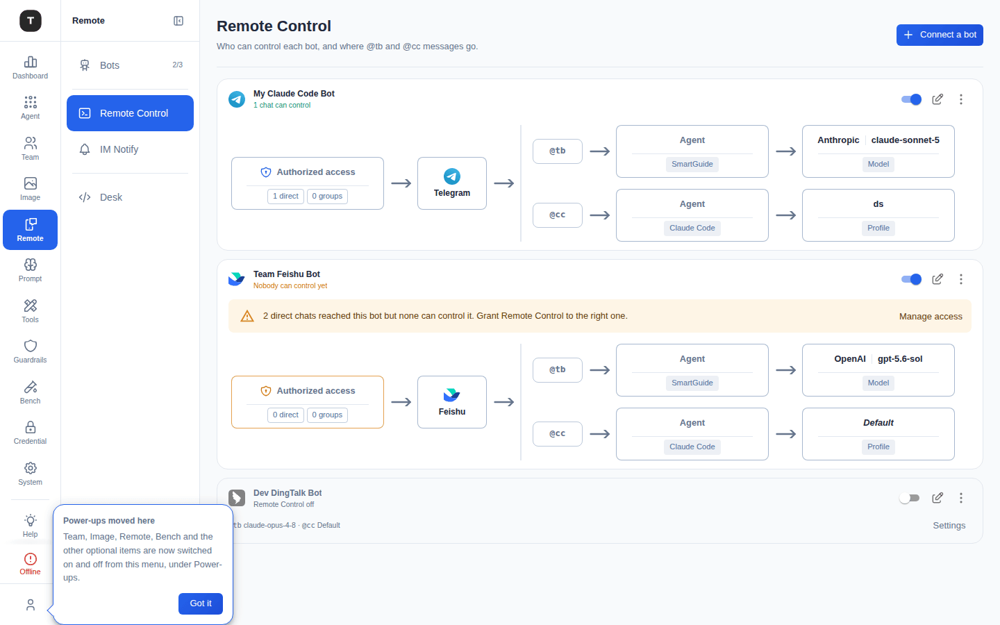
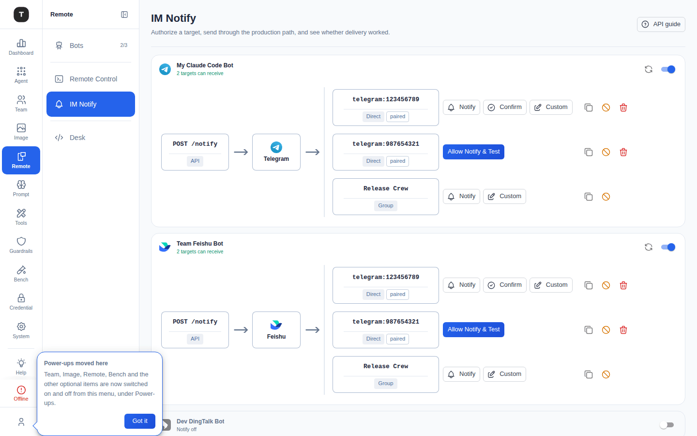

# Remote

Paths: `/bots/*`, `/remote-agent`, `/notify`

The **Remote** group lets you control Claude Code (and other agents) from mainstream IM platforms. It's split into three pages by concern: **Bots** (connect the messaging accounts), **Remote Control** (route incoming chat commands to an agent), and **IM Notify** (push outbound notifications back to chats).

---

## Bots (`/bots/overview`, `/bots/:platform`)



The resource layer: connect and maintain the messaging accounts shared by Remote Control and IM Notify. Page subtitle: *"Connect and maintain the messaging accounts used by Remote Control and IM Notify."*

Supported platforms: Telegram, Feishu, Lark, DingTalk, Weixin (WeChat), WeCom, QQ, Discord, Slack — filterable via the platform tab row (**All** plus one tab per platform, each showing an `active N / total N` count).

### Connections Table

| Column | Description |
|--------|-------------|
| Status | Enable/disable toggle + On/Off badge |
| Name | Bot alias |
| Bot UUID | Unique bot identifier (copy button) |
| Platform | Platform key (e.g. `telegram`) |
| Capabilities | **Remote** / **Notify** badges — which of the other two pages this bot participates in |
| Actions | **Access** (chat-ID / group authorization), restore, edit, delete |

### Connecting a Bot

Click **Connect a bot** (top-right):



1. Choose the **Platform** from the dropdown
2. Fill in the platform-specific credential (e.g. **Bot Token** for Telegram, obtained from `@BotFather`)
3. Optional: **Alias** (friendly name) and **Proxy URL** (HTTP/HTTPS proxy for the bot's API requests)
4. Click **Connect bot**

Each platform tab also shows a collapsible **Setup Guide** with connection steps, credentials, and examples specific to that platform.

> WeChat (Weixin) bots use **QR code scanning** instead of a token — the dialog shows a QR code to scan after starting the connection.

---

## Remote Control (`/remote-agent`)



One page, **one card per bot** — not a page you first pick a platform to filter into, and not a single combined route diagram either. Page subtitle: *"Choose who can control each bot and where chat commands route."* Platform used to be a tab you picked before seeing anything; it's now just the icon on each card (most setups only have one or two bots, and the old platform tiles mostly advertised empty platforms).

### Per-Bot Card

Each card is one bot's Remote Control purpose:

- **Header**: platform icon + bot name, a one-line live status, and the **Remote Control switch** (turning it off only unmounts this purpose — the bot resource itself, and any other capability like IM Notify, keeps running), plus **Edit**/**Restart**/**Delete** actions
- **Status line** answers "is this usable right now?" in one sentence, color-coded: `Remote Control off` (grey) · `Checking access…` · `Couldn't check who can control` / `Nobody can control yet` / `@tb has no model yet` (warning) · `N can control` (success)
- An **off** card is quiet rather than struck through — no paper background, a greyed identity, and its route graph folds into a one-line summary instead of the full diagram; nothing about it is broken, it just isn't running, and every setting underneath stays one click away
- A **live but unusable** bot (nobody authorized yet, or no model picked for `@tb`) shows an inline hint with the concrete next step right in the card — e.g. the pairing code to message the bot with, or a reminder that N direct chats have reached the bot but none can control it yet
- Below the header, an **expanded** card shows the route graph: who can send commands in → this bot → the `@tb` / `@cc` forks. Each node in the graph opens its own editor; the entry node opens the **Access** work surface (direct chat IDs and/or groups allowed to issue commands), which reads the same access data the card's status line summarizes, so there is one source of truth for "who can control this bot"

### Claude Code Profile / Model

The `@cc` fork of a bot's graph can be pointed at a specific Claude Code Profile (when any are configured); the `@tb` (SmartGuide) fork needs a provider + model pair, set from the model picker opened off that node.

> Old per-platform `/remote-agent/:platform` bookmarks and the pre-split `/remote-control/*` redirect here automatically.

---

## IM Notify (`/notify`)



Same page shape as Remote Control: **one group per bot**, not a platform-filtered list. Page subtitle: *"Authorize a target, send through the production path, and see whether delivery worked."* Lets scenarios and automations push messages back into chats/groups the bot has seen, without touching Remote Control's inbound routing.

### Per-Bot Group

Each bot's group carries its own **Notify switch** (same unmount-this-purpose-only behavior as Remote Control's), and lists every chat/group that bot can reach as an always-expanded graph of **Chat nodes** — each node pairs the concrete platform id (e.g. `telegram:123456789`, labeled **Direct** or **Group**) with the stable internal target UUID `/notify` needs, with test actions inline (no extra click to reach them):

- **Notify** — send a test/manual message
- **Confirm**, shown as **Allow Notify & Test**, for a target that hasn't been authorized yet
- **Custom** — send a custom payload
- Copy (the target UUID), revoke, delete

New targets require explicit authorization (**Allow Notify & Test**) before they can receive automated notifications — this prevents any chat the bot happens to observe from silently becoming a notification target. This page answers "what can I send to, right now?" rather than the old read-only "which scenario routes point at this bot" framing.

An **API guide** button (top-right) documents the notification API for scripted/automation use.

---

## Bot Security Settings

### Access Authorization

From the Bots page, click **Access** on a bot row to restrict which chat IDs or groups may issue commands to it — the same authorization the Remote Control route diagram's **Access** node edits.

### Bash Allowlist

Configured per bot-to-agent route: one command pattern per line, limiting which shell commands the bot can trigger. Commands not in the allowlist are rejected. Example:

```
ls
cat *.md
git status
git diff
```

---

## Usage

Once a bot is connected (Bots) and routed to an agent (Remote Control), send messages to it on the IM platform:

- Send a code request → the bot calls the routed agent (e.g. Claude Code) to execute it
- Query status → the bot returns the current run status
- Send a file → the bot processes the file in the working directory

Outbound updates (long-running task completion, alerts, etc.) are delivered via IM Notify to any authorized target.

---

## Related Pages

- [Scenario Overview](./02-scenario-overview.md)
- [System Settings](./17-system-settings.md)
