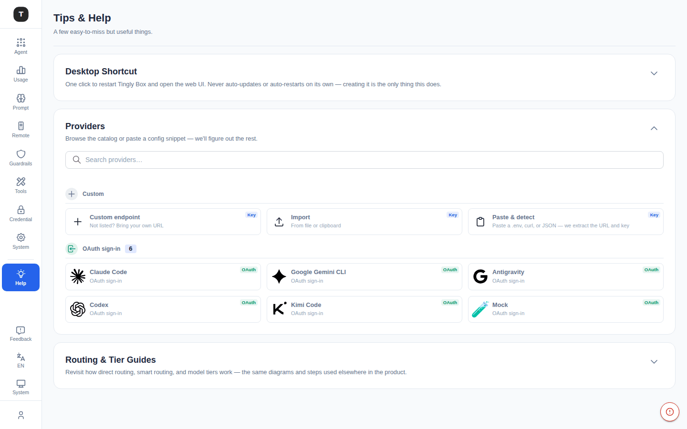

# Tips & Help

Path: `/help`

The lightbulb entry in the Activity Bar (bottom of the icon column) — this is also where the onboarding wizard now sends brand-new, provider-less installs (`/onboarding` redirects here). Subtitle: *"A few easy-to-miss but useful things."*

Three collapsible accordion cards, each a standalone action rather than a step in a linear tour — opening one doesn't close the others:

## Desktop Shortcut

Only shown when the platform supports it. One click creates a desktop shortcut that restarts Tingly-Box and opens the web UI — it never auto-updates or auto-restarts the server on its own; creating the shortcut is the only thing this does. **Create Shortcut** / **Recreate** button inside.

## Providers

Expanded by default. Embeds the same provider catalog as the **Connect AI** picker (search box + grouped cards by connection type — Custom, OAuth sign-in, Self-hosted, API key providers) — see [Credentials § Adding a Provider](./08-credentials.md#adding-a-provider-the-connect-ai-flow) for the full picker walkthrough. The card scrolls internally past a fixed height so it can't push the other two cards off screen.

## Routing & Tier Guides

Three buttons that reopen the same diagrammed guides embedded elsewhere in the product, so there's one diagram to keep in sync, not several:
- **Direct routing guide**: the same [first-run Direct Routing Guide](./20-routing-rules.md#first-run-guide) that auto-opens once per user on any scenario page
- **Smart routing guide**: the Smart-mode counterpart
- **Tier guide**: explains tier-based failover (T0/T1/T2 priority and circuit breaking)

---

## Related Pages

- [Credentials](./08-credentials.md)
- [Routing Rules & Plugins](./20-routing-rules.md)
