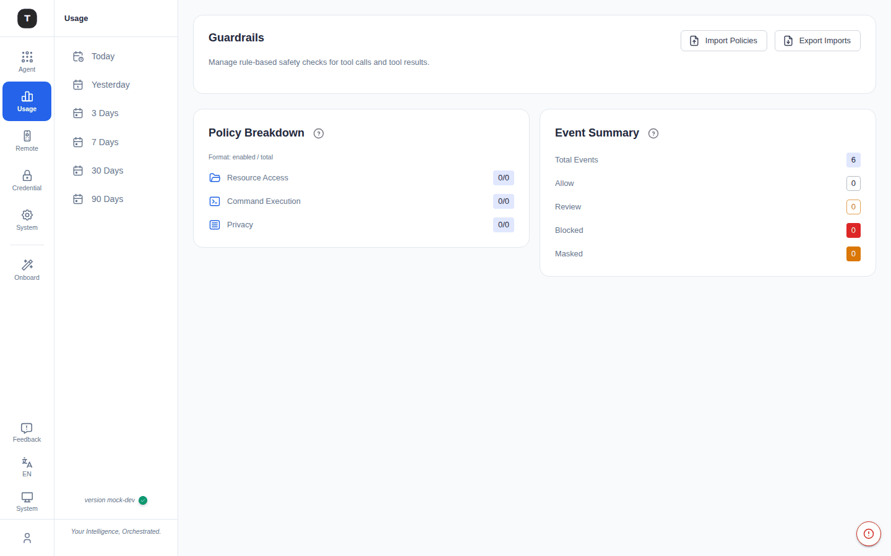
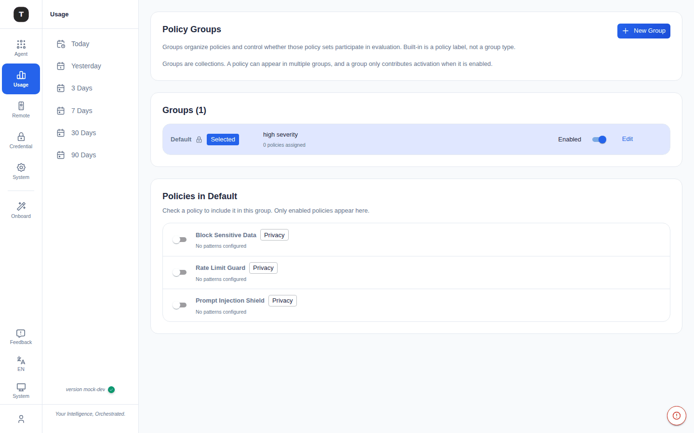
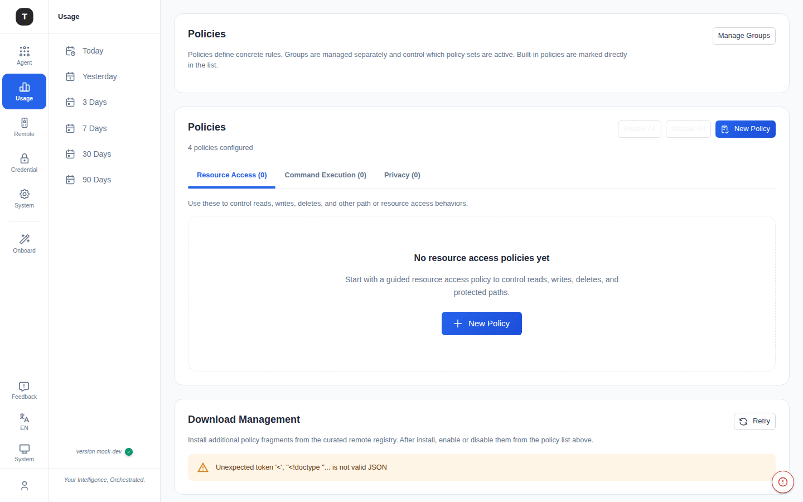
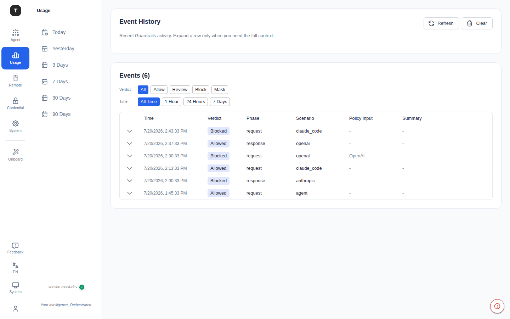

# Guardrails

Paths: `/guardrails`, `/guardrails/groups`, `/guardrails/rules`, `/guardrails/history`

Guardrails enforce rule-based safety checks on AI agent tool calls and tool results, preventing dangerous operations, protecting private data, and controlling resource access.

> **Note**: The Guardrails feature must be enabled on the [Experimental Features](./19-experimental.md) page before the sidebar entry appears.

---

## Guardrails Overview (`/guardrails`)

### Statistics Dashboard

**Policy Breakdown (left card)** — summarized by policy type:

| Type | Description |
|------|-------------|
| Resource Access | File read/write/delete and network access policy count (enabled/total) |
| Command Execution | Shell command execution control policy count |
| Privacy (Content) | Content privacy filter policy count |

**Event Summary (right card)** — guardrail event statistics:

| Metric | Color |
|--------|-------|
| Total Events | — |
| Allow | Green |
| Review | Yellow |
| Blocked | Red |
| Masked | Purple |

### Policy Import/Export

**Import Policies** button → opens import dialog:
- Select a file (YAML/JSON policy fragment)
- Or paste policy content directly (multiple formats supported)
- Confirm **Import**

**Export Imports** button → opens export dialog:
- Checkbox list to select which policy fragment files to export
- **Select All** / **Clear** bulk operations
- Click **Export** to download selected policies as YAML files

---

## Policy Groups (`/guardrails/groups`)

Policy groups organize multiple policies for collective management, with group-level enable/disable support.

> Page note: `Groups organize policies and control whether those policy sets participate in evaluation. Built-in is a policy label, not a group type.`

### Group List

Each policy group shows:
- Group name
- Severity level (Low / Medium / High)
- Enabled/disabled status
- Policy count
- Actions: edit, delete

> The `Default` group is built-in and cannot be deleted (lock icon shown).

### Create/Edit a Group

Click **New Group** or the edit icon:
- **Name**: Group name
- **Severity**: Low / Medium / High
- **Enabled**: Toggle

### Assign Policies

The lower half of the page shows the **assignable policy list**. Each policy entry has:
- Policy name and type badge (e.g. `Privacy`)
- Description (e.g. `No patterns configured`)
- An individual toggle

Toggle a policy on to include it in the current group; toggle off to remove it. A single policy can belong to multiple groups.

---

## Policy Rules (`/guardrails/rules`)

### Three Tabs

| Tab | Description |
|-----|-------------|
| **Resource Access** | File read/write/delete and network access rules |
| **Command Execution** | Shell command execution pattern-matching rules |
| **Privacy** | Content regex/keyword filtering rules |

### Bulk Actions

Each tab provides:
- **Enable All**: Enable all policies in the current tab
- **Disable All**: Disable all policies in the current tab

### Policy List

Each policy shows:
- Policy ID (auto-generated)
- Policy name
- Status (Enabled / Disabled / No active group)
- Assigned group
- Actions: edit (all policies), delete (custom policies only)

### Creating a Policy

Click **Add Policy** or the edit icon to open the policy editor:

**Basic fields:**
- ID (auto-generated, customizable)
- Name
- Assigned policy group

**Resource Access specific:**
- Actions: read / write / delete / network (multi-select)
- Resources: resource path list (glob patterns)
- Tools: applicable tool name list

**Command Execution specific:**
- Terms/Patterns: command keyword or regex list
- Actions: execute / install (multi-select)

**Privacy specific:**
- Patterns: keyword or regex list
- Pattern Mode: substring / regex
- Case Sensitive: toggle

**Common fields:**
- Scenario Scope: applicable scenario (Anthropic / Claude Code / OpenAI, etc.)
- Verdict: block / allow / mask / review
- Reason: explanation shown to the agent when blocked

### Policy Registry

The **Registry** section at the bottom allows downloading and installing pre-built policy sets from a curated remote repository, for quickly establishing baseline guardrails.

---

## Audit History (`/guardrails/history`)

Path: `/guardrails/history`

View all guardrail trigger records.

### Filters

- **Verdict**: All / Allow / Review / Block / Mask
- **Time**: All / 1h / 24h / 7d

### Event List

Expandable table rows — shows a summary by default; expand to view:
- Provider and model
- Request direction (request/response)
- Triggered policy list
- Block/review message

### Actions

- **Refresh**: Manually refresh the event list
- **Clear History**: Clear all history (requires confirmation)

---

## Related Pages

- [Experimental Features](./19-experimental.md)
- [MCP & Tools](./16-mcp-tools.md)
