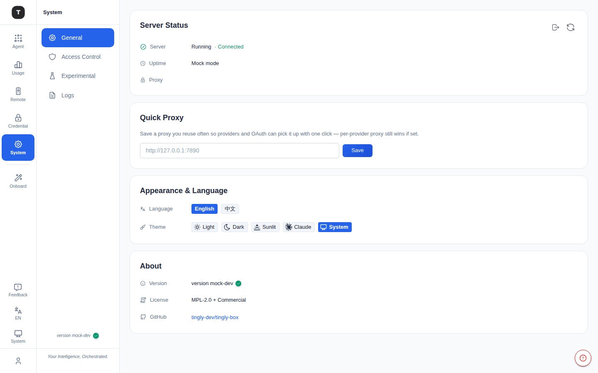
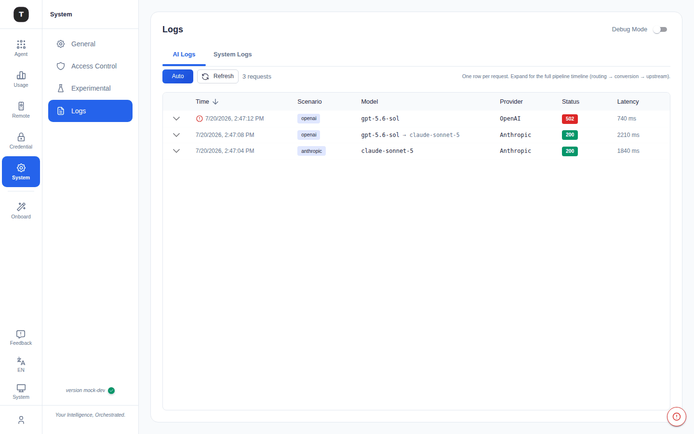

# System Settings

Paths: `/system`, `/system/logs`

The System Settings page provides global preference configuration, server status monitoring, proxy settings, language/theme switching, and log viewing.

---

## System Settings Main Page (`/system`)

The General tab is organized into four cards, each answering one question:

### Server Status Card

Answers "is the gateway healthy?" — nothing else:

| Field | Description |
|-------|-------------|
| Server | Running / Stopped / Unavailable, plus a Connected/Disconnected indicator |
| Uptime | How long the server has been running |
| Proxy | Whether a proxy is currently in effect |

**Actions** (top-right icons): **Force Logout** (force-exit the current web session — clears token, returns to login page) and **Refresh Status**.

---

### Quick Proxy Card

Configure a unified HTTP/HTTPS proxy for all outbound API requests — a reusable preset that providers and OAuth can pick up with one click (a per-provider proxy still wins if set):

1. Enter the proxy address in the text field (e.g. `http://127.0.0.1:7890`)
2. Click **Save**
3. A green checkmark icon appears when saved successfully

> To configure a proxy for a specific provider only, use the Proxy URL field in the provider edit form in [Credentials](./08-credentials.md).

---

### Appearance & Language Card

User preferences, kept separate from Server Status so that card only answers "is the gateway healthy?" instead of mixing in personal settings:

- **Language**: `English` / `中文`
- **Theme**: `Light` / `Dark` / `Sunlit` / `Claude` / `System` (follows OS setting)

---

### About Card

- **Current version**: Version number display
  - Shows an update notice when a new version is available
  - Development builds show a `dev` badge
- **License**: MPL-2.0 + Commercial
- **GitHub**: Project repository link

---

## Logs Page (`/system/logs`)

Path: `/system/logs`

View real-time Tingly-Box server logs.

### Features

**Debug Mode toggle** (top-right):
- On: Log level switches to `debug` — more detailed output
- Off: Log level is `info` (default)

**LogExplorer area:**
- Real-time streaming server logs
- Scrollable history
- Each log entry includes: timestamp, level, source module, message

---

## Related Pages

- [Access Control](./18-access-control.md)
- [Experimental Features](./19-experimental.md)
- [Credentials](./08-credentials.md)
