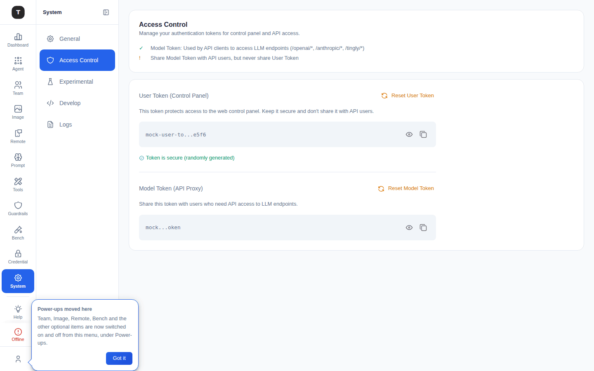

# Access Control

Path: `/access-control`

The Access Control page manages Tingly-Box's core authentication tokens: the User Token (Web UI login credential) and the Model Token (API key for all agent scenarios).

---

## User Token

Used for Web UI authentication.

### Viewing the Current Token

- Masked by default (`••••••••`)
- Click the eye icon to toggle plaintext display
- Click the copy icon to copy the token to the clipboard

### Security Notes

A **Token Security** summary near the top of the page explains the difference between the User Token and Model Token, and warns never to share the User Token with API users.

If the **default token** is in use (set at initial installation), the page shows a security warning recommending a prompt reset to a random token.

### Resetting the Token

Click the **Reset** button — a confirmation dialog explains the consequences:
- A new random token is generated
- All sessions using the old token (browser tabs, scripts, CLI) are immediately invalidated
- You must re-login with the new token

After confirmation, the new token is shown in a success dialog (with copy button). Save it immediately.

---

## Model Token

The Model Token is the universal API Key for all agent scenario proxy interfaces.

### Characteristics

- All scenarios (Claude Code, OpenAI proxy, etc.) share the same Model Token
- Can be shared with other developers or environments for proxy interface access
- **Not** the same as the User Token; cannot be used to log into the Web UI

### View and Copy

Same operation as User Token: eye icon to toggle display, copy icon to write to clipboard.

### Resetting the Model Token

Click **Reset** to open a confirmation dialog. After confirmation, a new token is generated.

> **Note**: After resetting the Model Token, all tools configured with the old token (Claude Code CLI, OpenAI SDK clients, etc.) must update their token configuration.

---

## Relationship to Sharing Keys (Team)

The standalone "API Tokens" / "Sharing" page under Credential (previously at `/tingly-box-token`) is **retired** — that URL now redirects straight to [Team Keys](./07-team.md#sharing-keys) (`/agent/team/keys`). Named, multi-token external-client access is now a Team concept: each Team's **Sharing Keys** are the equivalent of what used to be a global list of API Tokens, scoped to that Team's routing rules instead of reaching every scenario.

| | User Token | Model Token | Sharing Key (Team) |
|-|-----------|-------------|-----------|
| Location | `/access-control` | `/access-control` | `/agent/team/keys`, or a Team's own workspace page |
| Quantity | 1 | 1 | Multiple, per Team |
| Purpose | Web UI login | Agent scenario API Key (instance-wide, unscoped) | External client access, scoped to one Team's `/tingly/team[/v1]` endpoint |
| Named | No | No | Yes |

---

## Related Pages

- [Team](./07-team.md)
- [System Settings](./17-system-settings.md)
