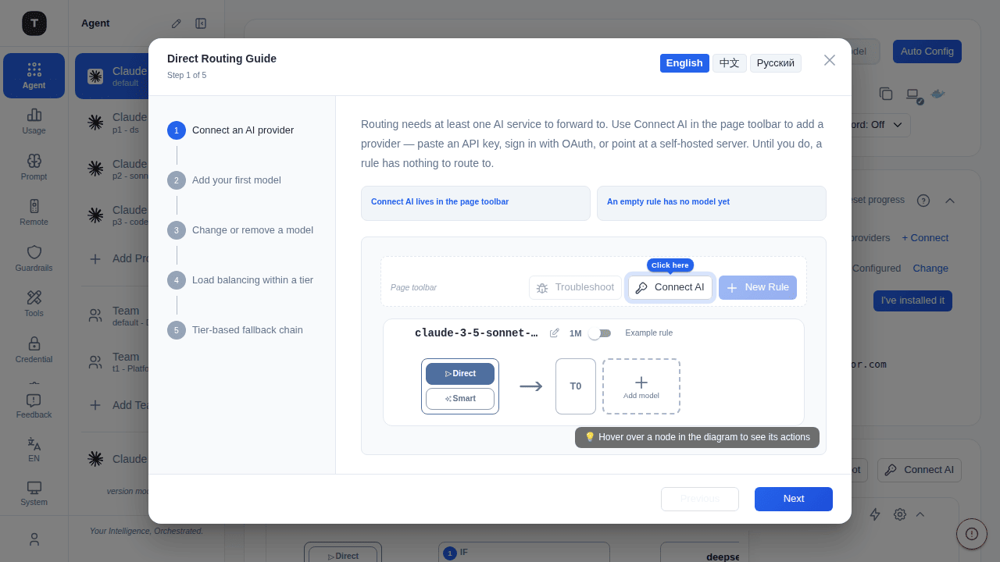
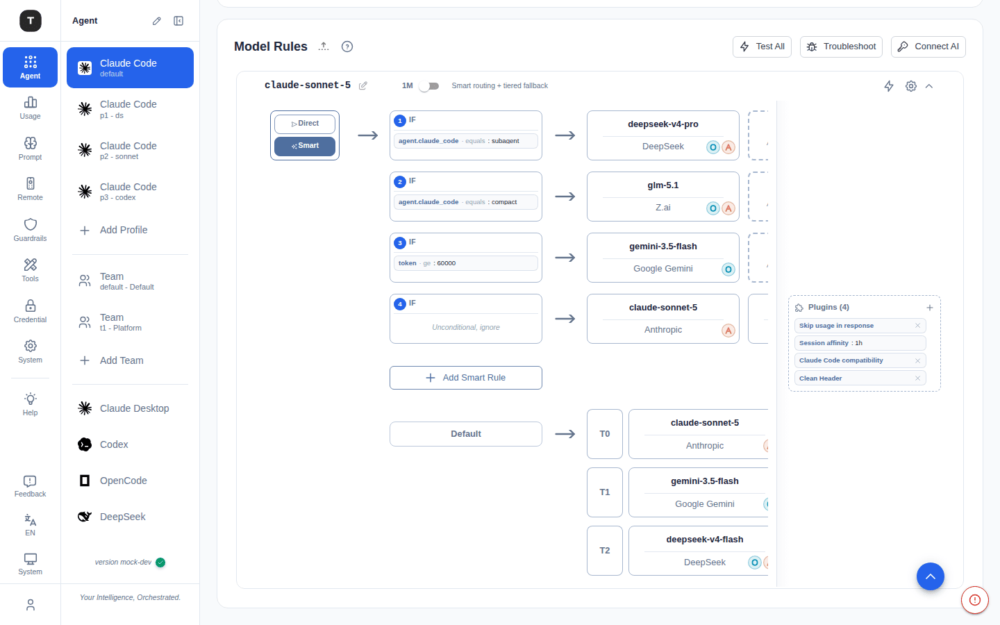
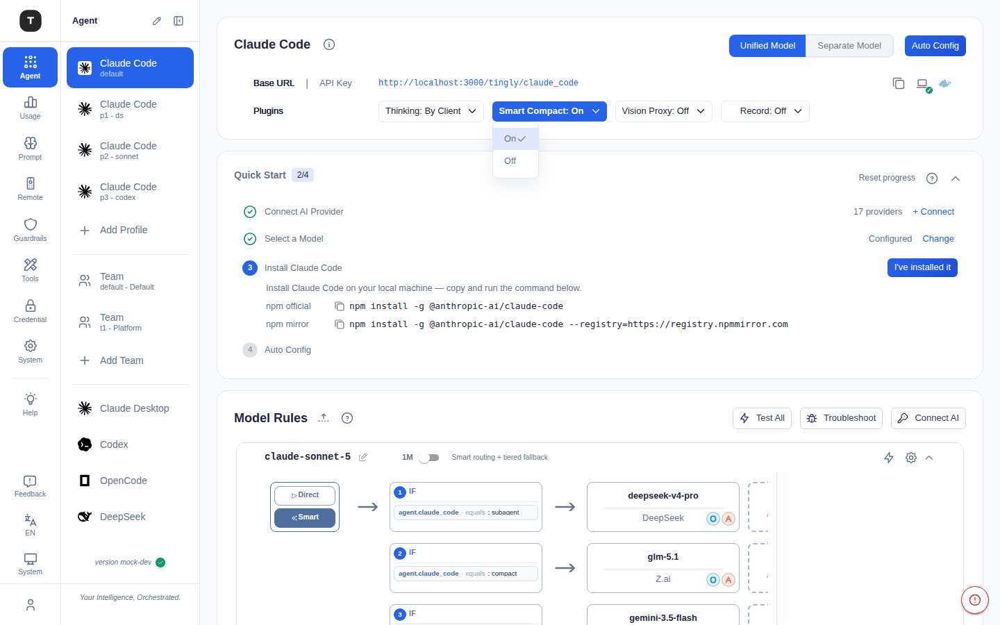
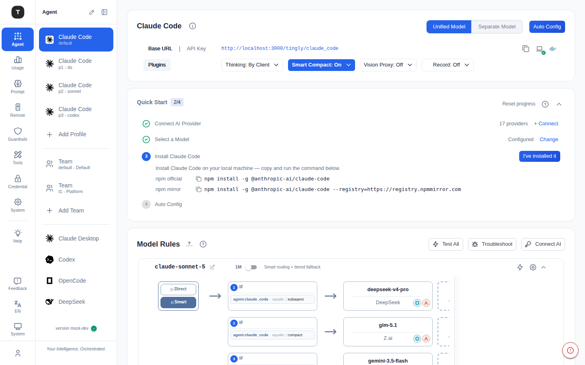
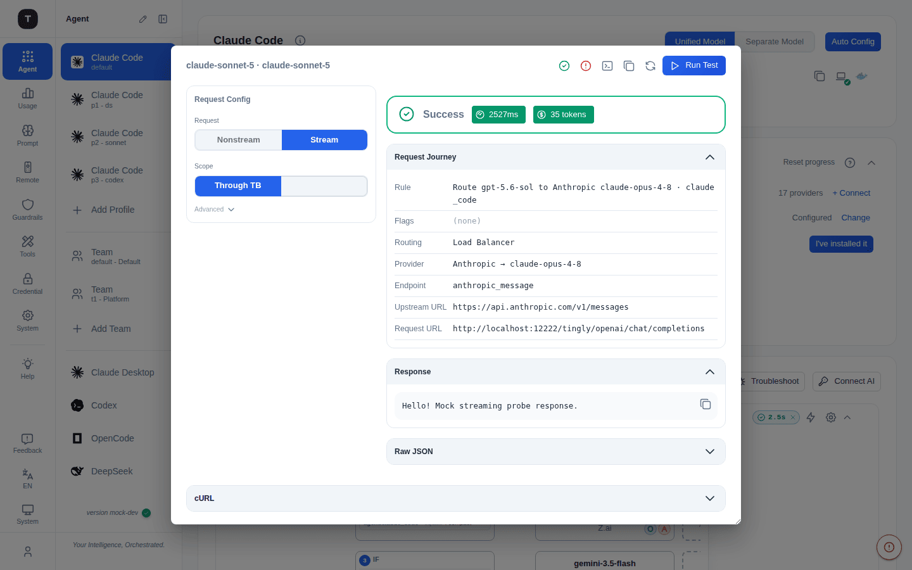

# Routing Rules & Plugins

Path: `/scenario/*` (Rule cards within each scenario page)

Routing rules are the core mechanism by which Tingly-Box dispatches requests. Each rule is bound to a request model (`request_model`) and determines how requests are distributed across one or more upstream services (Credential/Provider).

---

## First-Run Guide



The first time you open any scenario page, a **Direct Routing Guide** opens **automatically, once**, walking you through how routing is built up from scratch: **Connect AI to add a provider → ＋ Add model for your first model → change/remove a model → load balancing within a tier → tier-based failover**.

- It auto-opens **only once per user**, then never nags again
- The left side is the step navigator; the right side shows the matching routing diagram plus an explanation. Steps that reference a toolbar button display a **mock toolbar** with the target button highlighted so you know exactly where to click
- To see it again, click the **?** (How routing works) button on the right of the toolbar at any time
- Use **Previous / Next** at the bottom to page through; the last step's button is **Got it!** to close

> Smart routing has its own Smart Routing Guide — switch to Smart mode and open it via the same **?** button.

---

## Routing Graph Overview



Each rule card embeds a routing graph that visualizes the request flow path. The graph supports two modes, switchable via the toggle button inside the rule card: **Direct** and **Smart**.

---

## Direct Routing (Tier Mode)

Direct routing is the default mode (`lbTactic: "tier"`). Service nodes are arranged in priority tiers:

```
Request Entry
  │
  ├── T0 (highest priority): multiple services share load
  ├── T1: fallback when T0 circuit is fully open
  └── T2: final fallback when T1 is also open
```

### Tier Behavior

| Concept | Description |
|---------|-------------|
| Same-tier services | Round-robin or weighted load sharing |
| Cross-tier fallback | When all services in the current tier have open circuits, requests automatically route to the next tier |
| Tier number (T0/T1…) | Lower number = higher priority; drag service nodes to adjust tier |

### Circuit Breaker

Each service node has an independent circuit breaker with the following states:

```
Closed (normal) ──── 3 consecutive failures ──→ Open (tripped)
                                                    │
                                               30s cooldown
                                                    │
                                               HalfOpen (probe)
                                                    │
                              ┌─── success ───→ Closed (recovered)
                              └─── failure ───→ Open (re-tripped)
```

| State | Meaning |
|-------|---------|
| **Closed** | Normal — accepts requests |
| **Open** | Tripped — rejects requests, waiting for cooldown (default 30s) |
| **HalfOpen** | Sends a probe request; success → Closed, failure → Open again |

### Mid-request Failover

Via the `firstChunkGate` buffer mechanism (v2), if an upstream fails before the first response chunk is received, the request silently switches to another service in the same tier or the next tier — transparent to the client.

---

## Smart Routing



When smart routing is enabled (`smartEnabled: true`), each sub-rule (SmartOp) in the rule chain can carry conditions. Requests are matched in order; the **first sub-rule where all conditions pass** wins.

```
Request Entry
  │
  ├── SmartOp 1 (condition A AND condition B) ── matches ──→ route to service group A
  ├── SmartOp 2 (condition C)                ── matches ──→ route to service group B
  └── SmartOp N (no conditions — catch-all)   ──────────────→ route to default service group
```

### SmartOp Condition Catalog

Grouped by category, as shown in the condition picker:

| Condition | Category | Operators | Description |
|-----------|----------|-----------|-------------|
| Agent: Claude Code (`agent.claude_code`) | Agent | Equals: `main` / `subagent` / `compact` | Claude Code request kind |
| System Prompt (`context_system`) | Context | Contains: `<text>` | Whether the request's system prompt contains the given text |
| Latest User Message (`latest_user`) | Context | Contains: `<text>` | Whether the most recent user message contains the given text |
| Time range (`time`) | Time | A daily start–end window in a chosen timezone | Match requests inside or outside a recurring daily time range |
| Thinking (`thinking`) | Request | `Enabled` / `Disabled` | Whether the client has enabled extended thinking |
| Token Count (`token`) | Request | `≥ N` / `≤ N` | Input token count |
| Service TTFT (`service_ttft`) | Service | `Avg ≤/≥ N ms`, `P99 ≤/≥ N ms` | Time-to-first-token across the rule's services (best-service average or P99) |
| Service Capacity (`service_capacity`) | Service | `Util ≤/≥/</> N%` | Seat/concurrency utilization across the rule's services |
| Service Quota (`service_quota`) | Service | `Quota ≤/≥/</> N%` | Tightest (max) upstream quota usage across the rule's services' providers — the hottest one, not the average. Absent quota data lets the op **pass** rather than block, so quota-blind rules and cold data never break routing |

### Design Tips

- Multiple conditions in one SmartOp use **AND logic** (all must pass)
- The last sub-rule should be **unconditional** (ops=[]) as the default catch-all fallback
- Use `agent.claude_code` = `compact` to route compact-mode requests to cheaper models
- Use `token ≥ 100000` to route very long contexts to services with large context windows
- Use `service_quota` `Quota ≥ 90%` to fail a rule over to a backup service group before a provider's quota is actually exhausted

---

## Rule Plugins (Flags)

The **Plugins** card on the right of each rule card provides pre-built flags that tune request/response behavior at the rule level — without touching service configuration.

Click the Plugins card to open the **Flag Catalog** (category sidebar + detail panel).



### App

| Flag | Key | Description |
|------|-----|-------------|
| Cursor compatibility | `cursor_compat` | Normalize rich content, gate tools, and strip stream usage for Cursor clients |
| Auto-detect Cursor | `cursor_compat_auto` | Automatically detect Cursor via request headers and apply compatibility processing |
| Claude Code compatibility | `claude_code_compat` | Rewrite `system` role entries in the messages array to `user` before forwarding, for third-party Anthropic-compatible providers that reject the non-standard role |

### Request (protocol-agnostic)

| Flag | Key | Type | Description |
|------|-----|------|-------------|
| Custom Headers | `extra_headers` | Header list | Append custom HTTP headers to the outbound upstream request for requests matched by this rule. Applies to API-key providers only — OAuth/vendor providers (Claude Code, Codex, Kimi, Gemini, Antigravity) keep their handshake headers and ignore this. Headers are sent as configured, including ones the gateway also sets (`Authorization`, `User-Agent`, …) — overriding those is your call and your responsibility |

### Request (OpenAI)

| Flag | Key | Type | Description |
|------|-----|------|-------------|
| Custom User-Agent | `custom_user_agent` | String | Override the outbound User-Agent header (applies to generic OpenAI/Anthropic clients; vendor-specific clients like Claude Code OAuth keep their own UA) |
| OpenAI endpoint override | `openai_endpoint_override` | Enum | Force Chat Completions or Responses API, overriding the provider default (OpenAI providers only) |
| Use max_completion_tokens | `use_max_completion_tokens` | Toggle | Rewrite `max_tokens` → `max_completion_tokens`; required by o1/o3/gpt-5 model families |
| Use max_tokens (legacy) | `use_max_tokens` | Toggle | Rewrite `max_completion_tokens` → `max_tokens`; for older OpenAI-compatible providers |
| Block tools | `block_tools` | String | Comma-separated tool names to strip from requests before forwarding (works across OpenAI Chat/Responses, Anthropic, and Google) |

### Response

| Flag | Key | Type | Description |
|------|-----|------|-------------|
| Skip usage in response | `skip_usage` | Toggle | Strip the `usage` block from responses (both SSE deltas and final body) |

### Reasoning

| Flag | Key | Type | Description |
|------|-----|------|-------------|
| Thinking | `thinking_effort` | Enum | Unified extended-thinking control: `By Client` (pass-through) / `Off` (force disabled) / `Low` (~1K tokens) / `Medium` (~5K) / `High` (~20K) / `Max` (~32K). Mapped to `budget_tokens` for Anthropic targets and `reasoning_effort` for OpenAI targets |

### Vision

| Flag | Key | Type | Description |
|------|-----|------|-------------|
| Vision Proxy | `vision_proxy_service` | Service ref | Describe images via a vision-capable model so text-only downstream models can process image-bearing requests. Takes precedence over the scenario-level Vision Proxy when both are configured |

### Routing

| Flag | Key | Type | Description |
|------|-----|------|-------------|
| Session affinity | `session_affinity` | Integer (seconds) | **Rule-level** TTL for session-to-service pinning: follow-up requests in the same session keep hitting the same service until TTL expires. 0 disables. Built-in Claude Code, Claude Desktop, and Codex rules default to 1800 s. Session identity resolved from `metadata.user_id`, `X-Tingly-Session-ID` header, or client IP |

---

## Troubleshoot (Probe Panel)

A redesigned diagnostic panel for firing a real test request through a rule (or directly at a provider) and inspecting exactly what happened, without leaving the routing graph.

### Two entry points

- **Quick test** — a bolt icon in each rule card's header runs a one-click streaming test against just that rule; the result renders as a compact colored pill (latency or `Success`/`Failed`) next to the icon. Click the pill to open the full panel pre-loaded with that result.
- **Test All** (toolbar, top-right of Model Rules) fires the same quick test against every *active* rule at once — inactive rules are skipped since they can't match real traffic anyway.
- **Troubleshoot** (toolbar) opens the full panel directly, without running anything first.

### Panel layout



A left **control rail** (what will be sent) next to a right **results column** (what came back), so the two never have to be reconciled by memory:

**Request Config (left rail)** — orthogonal axes that compose freely with each other:

| Axis | Options | Notes |
|------|---------|-------|
| Request | `Nonstream` / `Stream` | Stream is the default — closest to production traffic |
| Tool | `Off` / `On` | Attaches a tool definition so the probe exercises tool calling; composes with both stream and nonstream |
| Scope | `Through TB` / `Direct` | Direct skips Tingly-Box's routing & middleware entirely, to tell whether a failure is upstream or inside TB. Locked to "Through TB" for rule targets — that's what a rule test is for |
| Protocol | Varies by target | The client-side wire protocol the loopback speaks. Locked to the rule's own scenario protocol for rule targets; reduced to what the provider can actually speak for provider targets; unavailable for Google providers (their own SDK, no protocol selection) |
| Vision | `Off` / `User` / `Tool` | Attaches a red test image — in the user message, or returned from a synthetic tool round (the shape agent tools use for screenshots). A vision-capable route answers "red"; anything else means the image was dropped or corrupted along the path |
| Thinking | `None` / `Low` / `Medium` / `High` / `Max` | Extended-thinking effort; maps to the provider's native knob (Anthropic `budget_tokens`, OpenAI `reasoning_effort`, Gemini `thinking_budget`) |
| Message | free text | Override the default probe message (defaults differ for tool vs. plain probes) |

**Results (right column)**, appearing after **Run Test**:
- A **Success**/**Failed** status bar with **latency** and **token** chips (or the error message on failure)
- **Request Journey** (collapsible): rule + applied flags, routing source (session affinity / smart routing / load balancer / pinned), resolved provider → model, resolved upstream API style, upstream URL, and the loopback request URL — each field renders as a greyed placeholder until the backend actually reports it
- **Response** (collapsible): the extracted assistant text, with its own copy button
- **Raw JSON** (collapsible): the full raw response body
- **cURL** (bottom, full panel width): a live-regenerated `curl` command matching the current Request Config — nothing is executed, it's pure construction — with a hint to swap in your own key before running it yourself

The dialog is resizable (drag the corner) for when the journey or a long streamed response needs more room, and carries its own **Copy cURL**, **Copy response**, and **Re-run** actions in the title bar.

---

## Related Pages

- [Scenario Overview](./02-scenario-overview.md)
- [Claude Code Scenario](./03-scenario-claude-code.md)
- [Credentials](./08-credentials.md)
- [Experimental Features](./19-experimental.md)
