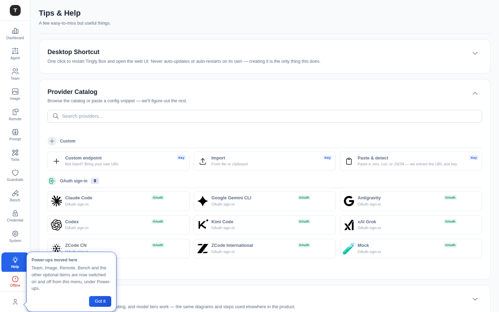
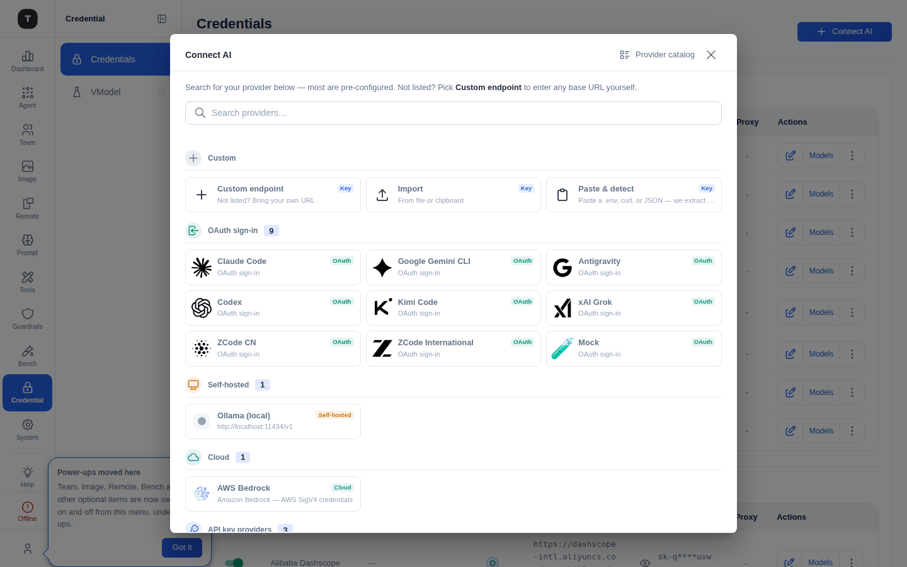

# 快速上手

本章引导你完成 Tingly-Box 的第一次启动与 Provider 接入，使后续所有 Agent 场景可用。

---

## 初次启动

现在已经没有独立的全屏初始化向导了。首次访问 Tingly-Box Web UI 时，系统检测到尚无 Provider 配置，会自动跳转到 **Tips & Help（提示与帮助）** 页面，路径为 `/help`——也就是 [提示与帮助](./13-help.md) 文档中介绍的同一个页面，只是其中的 **Provider Catalog** 卡片会默认展开，作为你看到的第一屏内容。（旧的 `/onboarding` 地址仍然有效，只是现在会重定向到 `/help`。）其他所有用户则直接进入上次所在的 Agent 页面。

---

## Provider Catalog：添加首个 Provider

页面标题：**Tips & Help**。副标题：「A few easy-to-miss but useful things.」**Provider Catalog** 卡片（该页面四张手风琴卡片之一——其余三张见 [提示与帮助](./13-help.md)）在全新安装时默认展开，副标题为「Browse the catalog or paste a config snippet — we'll figure out the rest.」

它内嵌的是与应用其他位置（凭证页、场景页等）的 **Connect AI** 按钮完全相同的可浏览列表——不再有单独的初始化专属流程需要另外学习。顶部是搜索框，下方依次为：

**Custom** 分区——三张卡片：
- **Custom endpoint**：手动填写任意 OpenAI/Anthropic 兼容的 API 端点
- **Import**：从文件或剪贴板导入 Provider 配置
- **Paste & detect**：粘贴 `.env` 文件、curl 命令或 JSON 片段——Tingly-Box 自动提取 URL 和凭证

**OAuth sign-in** 分区——列出支持 OAuth 授权的 Provider（Claude Code、Google Gemini CLI、Antigravity、Codex、Kimi Code 等）。点击后直接发起 OAuth 授权流程，无需手动输入 API Key，授权完成后 Token 自动保存。

向下滚动可看到更多通过 API Key 接入的 Provider，按区域和协议（OpenAI / Anthropic）分组展示。

选中任意非 OAuth 的 Provider 会在同一张卡片内弹出配置表单——各字段的完整说明（Base URL、API Key、API Style、Proxy URL 等）见 [凭证管理 · 添加 Provider](./08-credentials.md#添加-providerconnect-ai-流程)。

### 完成设置

成功添加 Provider 后，弹出成功对话框，可选择：
- **Go to Agents** — 前往你的 Agent 场景，开始使用
- **Stay Here** — 继续添加更多 Provider

---

## 已有环境：从凭证页添加 Provider

如果已经接入过 Provider，需要再添加一个，请访问 [凭证管理](./08-credentials.md) 页面（`/credentials`），点击 **Connect AI** 按钮。它打开的是与上面 Provider Catalog 卡片相同的统一选择器，完整的「先选类型、再填配置」两步流程见 [凭证管理 · 添加 Provider](./08-credentials.md#添加-providerconnect-ai-流程)。

---

## 下一步

- 进入 [场景总览](./02-scenario-overview.md) 查看所有可用 Agent
- 查看 [Claude Code 配置](./03-scenario-claude-code.md) 开始主力场景
