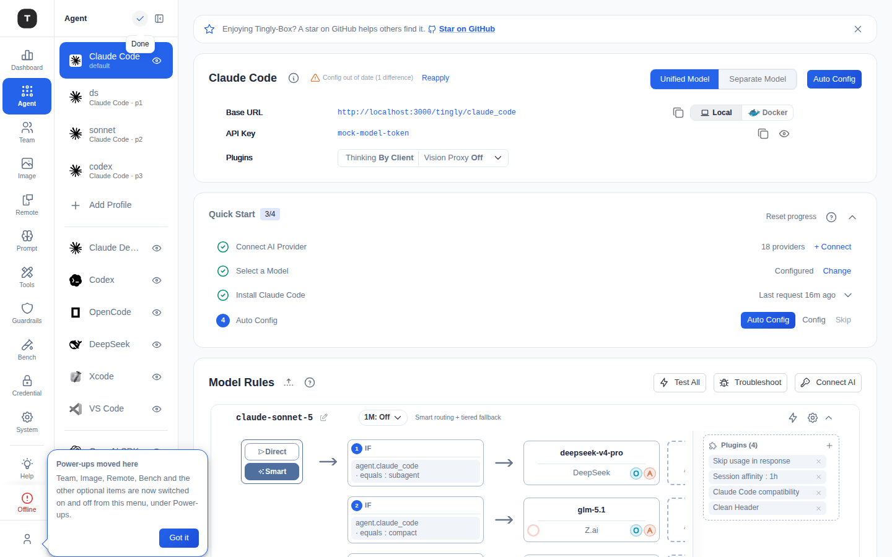
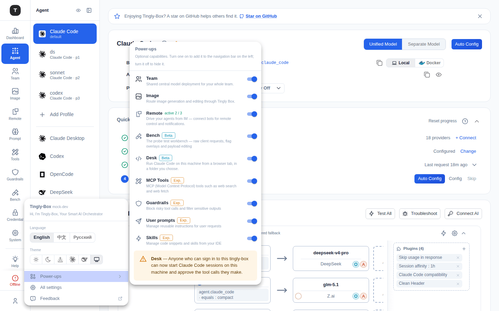

# 场景总览

现在已经没有独立的 `/agent` 总览页面了。`/agent` 会直接重定向到你上一次所在的那个 Agent 场景页（`AgentLanding`）——先打开整张卡片网格再去编辑，比直接跳转多了一次点击。隐藏/显示场景的操作也移到了 **Agent 侧边栏自身**的一个轻量编辑模式中。

---

## 管理可见性：侧边栏编辑模式

点击 Agent 侧边栏顶部的**眼睛图标**（在折叠图标旁边，仅当 **Agent** 活动栏项被选中时可见）进入编辑模式：

- 编辑时该图标变为**对勾**；再次点击它（或点击别处）即可退出
- 每个可隐藏的导航行右侧都会出现一个独立的小眼睛图标，点击即可隐藏/显示该场景
- 已隐藏的场景不会消失或与可见项交叉排列，而是停留在列表中（约 50% 透明度）、位于**一条分隔线下方**、排在仍可见的行之后——这样编辑模式下可见的部分,看起来已经就是点击完成后你会得到的侧边栏
- 退出编辑模式后，隐藏的行完全不显示
- 首次在拥有多个侧边栏行的场景页上，会出现一个一次性教学提示指向眼睛图标，不需要额外的引导流程；关闭它（或使用眼睛图标）之后不会再次出现

> 仅部分场景支持隐藏，Claude Code 始终显示在侧边栏（它承载着自己的 Profile 列表）。

每个场景行还带有一个**悬浮提示**显示其描述，不必打开页面就能回忆起它的用途。

---

## 全部场景列表

侧边栏顺序（同时也是可隐藏项的排列顺序）：

| 场景 | 路径 | 说明 |
|------|------|------|
| Claude Code | `/agent/claude_code` | 通过自定义 Profile 和分任务模型路由 Claude Code |
| Claude Desktop | `/agent/claude_desktop` | 通过 Tingly Box 将 Claude Desktop 接入为 MCP 客户端 |
| Codex | `/agent/codex` | 通过你的 Provider 密钥配置 Codex CLI |
| OpenCode | `/agent/opencode` | 由你的 Provider 驱动的开源编程 Agent |
| Pi | `/agent/pi` | 通过你的 Provider 路由 Pi 编程 Agent |
| DeepSeek | `/agent/dsh` | 通过你的 Provider 路由 DeepSeek Harness（dsh）——自带独立 Web UI |
| Xcode | `/agent/xcode` | 将你的模型接入 Xcode 的编程智能功能 |
| VS Code | `/agent/vscode` | 通过 Tingly Box 驱动 VS Code Copilot Chat |
| Cursor | `/agent/cursor` | 将你的模型接入 Cursor，默认开启 Cursor 兼容处理（默认隐藏） |
| Custom | `/agent/custom` | 自定义请求模型名——通用兜底场景（默认隐藏） |
| OpenAI SDK | `/agent/openai` | OpenAI 兼容 SDK 端点，即插即用 |
| Anthropic SDK | `/agent/anthropic` | Anthropic 兼容 SDK 端点，即插即用 |
| Embedding | `/agent/embed` | 将 Embedding 请求路由到你的 Provider |

> 「Custom」在侧边栏和旧文档中曾用名「OpenClaw」/「Claw Agent」，路径也从 `/agent/agent` 变为 `/agent/custom`。
> Cursor 是从 **Cursor 自己的云端后端**调用你配置的 Base URL，而不是从本机 Cursor 客户端调用，因此 `localhost` 地址无法使用，除非本服务已通过 HTTPS 公网可达——详见 [Cursor 场景](./04-scenario-cursor.md)。

默认情况下只有 **Custom**、**Pi**、**Cursor** 被隐藏；其余场景（包括下方的 Image 和 Team）开箱即默认可见。

---

## Power-ups：Team、Image、Remote 及其他可选导航项

**Team** 和 **Image** 根本不再是挂在 Agent 下面的场景配置页：两者都已升级为 Activity Bar 中独立的一级入口，各自拥有专属页面（详见 [Team](./07-team.md) 与 [Image](./07-image.md)）。它们各自的导航入口是否显示，仍由与上文 Agent 侧边栏相同的隐藏场景机制控制，但现在切换开关（以及 **Remote**、Bench、MCP Tools、Guardrails、Prompt Management 子功能的开关）集中到了一处——**Power-ups** 菜单，不再分散在各个页面上。

从活动栏底部的用户偏好菜单（齿轮/应用图标）打开它 → 悬停或点击 **Power-ups** 展开其子菜单：

- 每个 Power-up 一行：图标、名称（相关时带 **Experimental** 或 **Beta** 标签）、一行描述、以及一个开关
- 点击某一行的名称/描述（当它已开启时）会直接跳转到该功能的页面并关闭菜单
- Team、Image 和 Remote 切换的是与 Agent 侧边栏编辑模式相同的隐藏场景集合——关闭某一项只会隐藏其导航入口；它所管理的内容（路由规则、正在运行的 Bot 等）不会因此停止
- 依赖功能开关的 Power-up（Bench、Desk、MCP Tools、Guardrails，以及仅限 Full Edition 的 Prompt Management 子功能）使用与[实验性功能](./19-experimental.md)相同的 `_global` 功能开关；开启 Desk 还会附带一条提示，说明一旦启用后谁将获得访问权限

---

## 导航结构

左侧活动栏中场景分组的图标标签为 **Agent**（曾用名「Scenarios」）。点击后在次级侧边栏展示所有可见场景的导航项。

- 每个场景导航项支持直接点击跳转到对应配置页
- Claude Code 支持多 Profile，每个 Profile 作为独立导航子项展示，紧跟在 Claude Code 之后
- 次级侧边栏顶部有两个图标：**眼睛**（切换上文所述的编辑模式）和**折叠**图标（将次级侧边栏收起为一条细边，只留一个展开箭头，为主内容区腾出空间——点击箭头可展开恢复，或在折叠状态下悬停即可以浮层方式临时查看侧边栏而无需展开）。此折叠只影响次级侧边栏，最左侧的一级活动栏图标始终可见。
- 在较窄的窗口中，侧边栏会自动以折叠状态启动；此时点击拥有多个页面的活动栏项，会以浮层（flyout）形式打开其侧边栏而不是挤占内容区宽度，确保各页面依旧只需一次点击即可到达。

---

## 相关页面

- [Claude Code 场景](./03-scenario-claude-code.md)
- [Cursor 场景](./04-scenario-cursor.md)
- [其他编程 Agent](./04-scenario-coding-agents.md)
- [OpenAI / Anthropic SDK 代理](./05-scenario-sdk-proxy.md)
- [Custom / Embed](./06-scenario-special.md)
- [Team](./07-team.md)
- [Image](./07-image.md)
