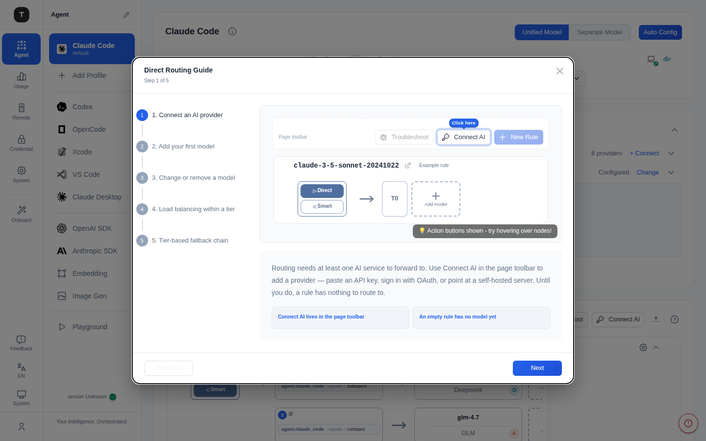
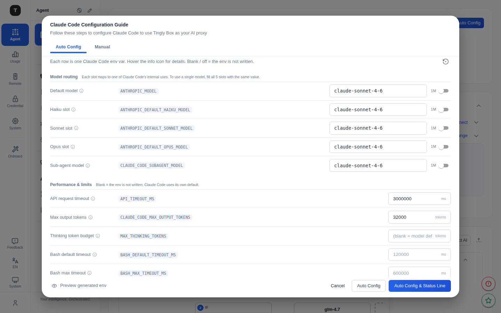
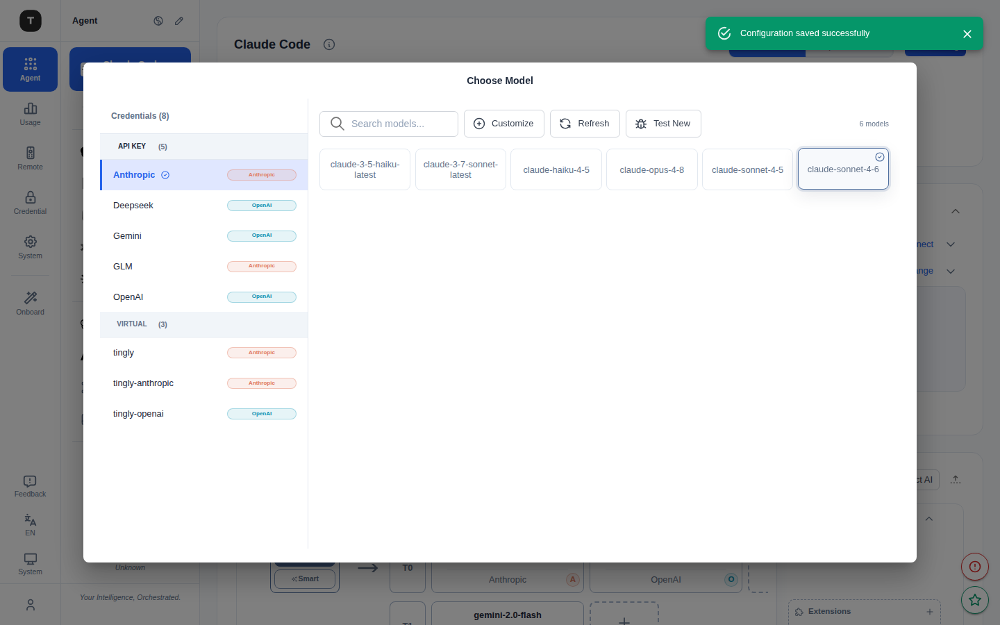

# Claude Code 场景

路径：`/agent/claude_code`

Claude Code 是 Tingly-Box 的主力场景，将 Claude Code CLI 的 API 请求代理到你配置的 Provider，支持多 Profile 管理、统一/分离模型配置和细粒度转发规则。

---



## 页面结构

页面由以下几个区域从上到下依次构成：

### 1. Provider 配置卡（Claude Code Configuration）

展示当前 Claude Code 场景的连接信息：
- **Base URL**：Claude Code CLI 应配置的代理地址（含复制按钮）
- **API Key**：供 CLI 使用的令牌（含复制/显示按钮）

右上角三个按钮：
- **Unified Model / Separate Model**：模型配置模式切换（见下文）
- **Auto Config**：快捷配置按钮，直接打开配置向导模态框

#### Plugin 插件开关

配置卡中部的 **Plugin** 一行提供多个场景级插件开关，均为下拉菜单：

| 插件 | 说明 |
|------|------|
| **Thinking** | Extended thinking 预算等级：`By Client`（透传客户端设置）/ `Off` / `Low`（~1K）/ `Medium`（~5K）/ `High`（~20K）/ `Max`（~32K） |
| **Smart Compact** | 智能压缩对话历史，节省 Token：`Off` / `On` |
| **Vision Proxy** | 代理图片 URL，解决 Provider 无法访问外网图片的问题：`Off` / `On` |
| **Record** | 录制会话到 Prompt 管理：`Off` / `Request Only` / `Request + Response` / `Request + Transform + Response` |

---

### 2. Quick Start 引导步骤

首次使用时显示的 **4 步可展开引导卡**（进度持久化在浏览器本地，完成后自动折叠）：

| 步骤 | 状态指示 | 说明 |
|------|----------|------|
| 1. Connect AI Provider | 已连接 Provider 数量 | 展开后显示 **Connect** 按钮 |
| 2. Select a Model | Configured / 未完成 | 展开后显示 **Choose Model** 按钮 |
| 3. Install Claude Code | Installed / 未完成 | 展开后提供 npm 官方源和镜像源两个安装命令（可一键复制），以及 **I've installed it** 手动标记 |
| 4. Auto Config | Applied / 未完成 | 展开后显示 **Auto Config** 和 **Auto Config + Status Line** 按钮；**Skip** 按钮可跳过此步（无需运行配置时使用） |

- 已完成的步骤显示 ✓ 图标，点击可再次展开查看内容
- 全部完成后引导卡自动折叠
- 点击顶部 **Reset** 可重置全部步骤进度

---

### 3. 模型配置模式

右上角切换 **Unified Model** 或 **Separate Model**：

| 模式 | 说明 |
|------|------|
| **Unified Model（统一模型）** | 全部请求共用同一条转发规则 `built-in-cc`，配置简单，适合单一 Provider |
| **Separate Model（分离模型）** | 为 default / haiku / sonnet / opus / subagent 各请求类型分别配置独立路由规则 |

> **注意**：切换模式后需要重新点击 **Auto Config** 将新配置写入 Claude Code，否则 CLI 侧不会生效。

---

### 4. Auto Config 配置向导



点击 **Auto Config** 打开 **Claude Code Configuration Guide** 模态框，包含两个 Tab：

**Auto Config Tab（推荐）**

- **Model routing**：5 个模型插槽，对应 Claude Code 的不同用途：
  - `ANTHROPIC_MODEL`（Default model）
  - `ANTHROPIC_DEFAULT_HAIKU_MODEL`（Haiku slot — 轻量任务）
  - `ANTHROPIC_DEFAULT_SONNET_MODEL`（Sonnet slot — 主力任务）
  - `ANTHROPIC_DEFAULT_OPUS_MODEL`（Opus slot — 复杂推理）
  - `CLAUDE_CODE_SUBAGENT_MODEL`（Sub-agent model — 子任务代理）

  每个插槽自动从当前转发规则中读取可用模型，也可手动输入。

- **Performance & limits**：
  - `API_TIMEOUT_MS`：API 请求超时（ms）
  - `CLAUDE_CODE_MAX_OUTPUT_TOKENS`：最大输出 Token 数
  - `MAX_THINKING_TOKENS`：Thinking Token 预算（留空 = 模型默认）
  - `BASH_DEFAULT_TIMEOUT_MS`：Bash 命令默认超时
  - `BASH_MAX_TIMEOUT_MS`：Bash 命令最大超时

- **Preview generated env**：预览将要写入的环境变量块（写入 `~/.claude/settings.json`）

底部按钮：
- **Auto Config**：将配置写入 Claude Code 配置文件，执行后显示创建/更新/备份的文件列表
- **Auto Config & Status Line**：同上，同时为 Claude Code 配置状态栏集成

**Manual Tab**

直接展示和编辑将要写入的原始配置脚本（JSON / PowerShell / Bash），适合高级用户或手动部署。

---

### 5. 模型与转发规则（Models and Forwarding Rules）

页面底部的可折叠节点图，展示当前场景的完整路由链路：



点击路由图中的 Provider 节点，或通过转发规则的"添加"操作，即可打开 **[模型选择](./21-model-select.md)** 对话框。对话框按 Provider 分组展示所有可用模型，支持搜索和快速选择。

```
入口节点（Direct/Smart）→ IF 条件（如 agent.claude_code = subagent）→ Provider
```

- 每条规则可展开查看条件详情
- 右上角提供 **Logs**（查看路由日志）、**New Key**（新建转发规则）、**Import** 操作
- 节点图中的 Provider 卡片显示模型名称和 Provider 来源

---

## Profile 管理

Claude Code 支持多 **Profile**，适用于不同项目或团队需要不同 Provider/规则的场景。

- 侧边栏 Claude Code 下方列出所有 Profile，点击直接切换
- 每个 Profile 路径独立：`/agent/claude_code/profile/:profileId`
- 各 Profile 有独立的 Base URL、API Key 和转发规则
- Profile 页面额外提供 **npx** / **global** 安装模式切换：
  - `npx -y tingly-box@{version} cc --profile {profileId}`
  - `tingly-box cc --profile {profileId}`

---

## 常见配置流程

1. 在 [凭证管理](./08-credentials.md) 添加至少一个 Provider
2. 进入 Claude Code 页面，确认 Base URL 和 API Key
3. （可选）在转发规则中为不同请求类型指定模型
4. 点击 **Auto Config** → 确认配置 → **Auto Config** 或 **Auto Config & Status Line**
5. 开始使用 Claude Code CLI

---

## 相关页面

- [场景总览](./02-scenario-overview.md)
- [凭证管理](./08-credentials.md)
- [其他编程 Agent](./04-scenario-coding-agents.md)
